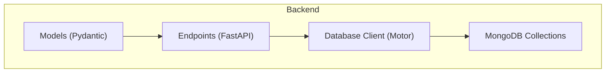
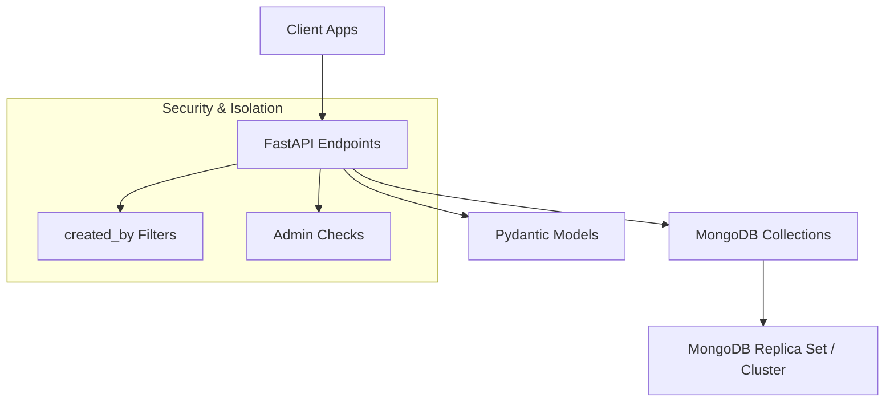
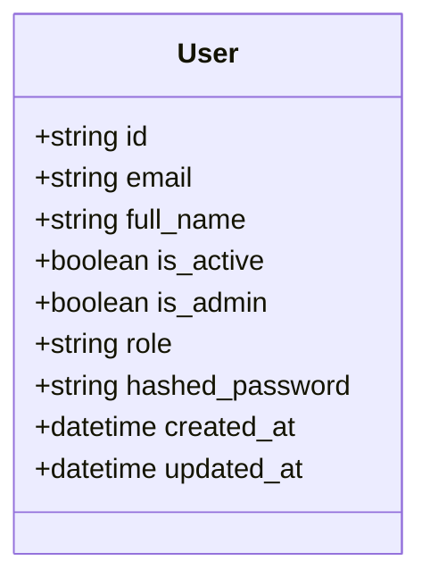
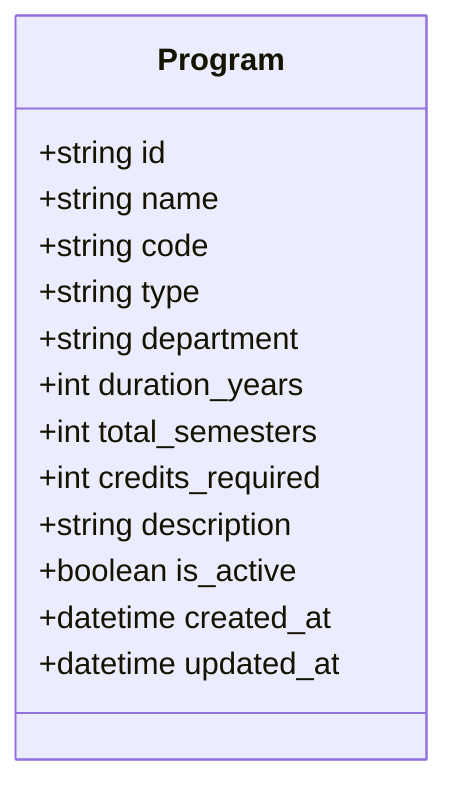
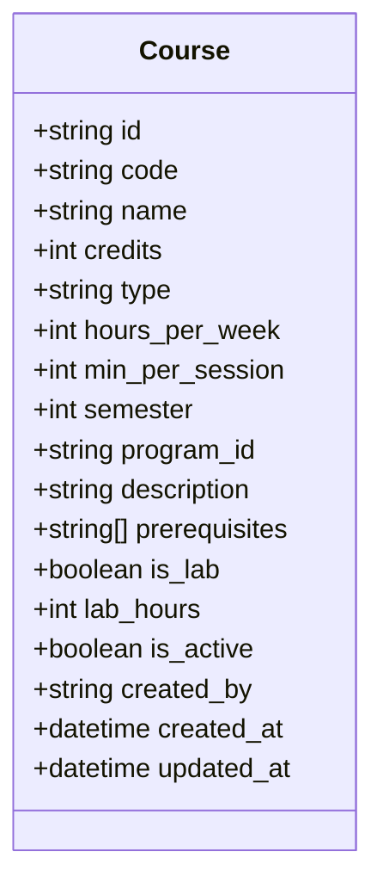
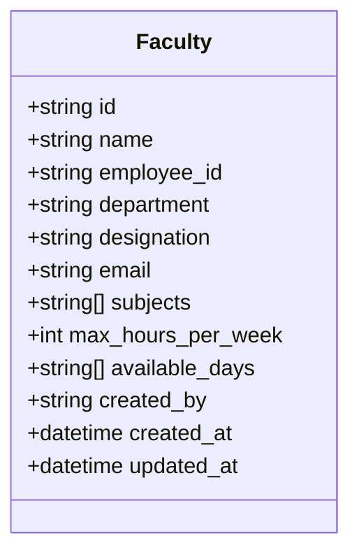
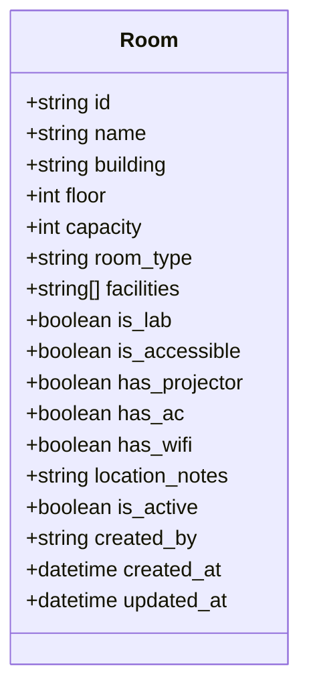
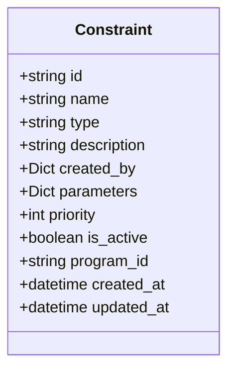
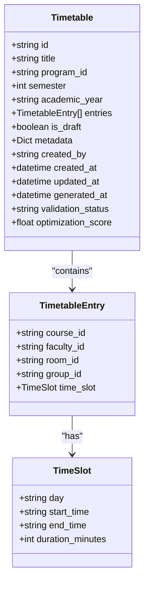
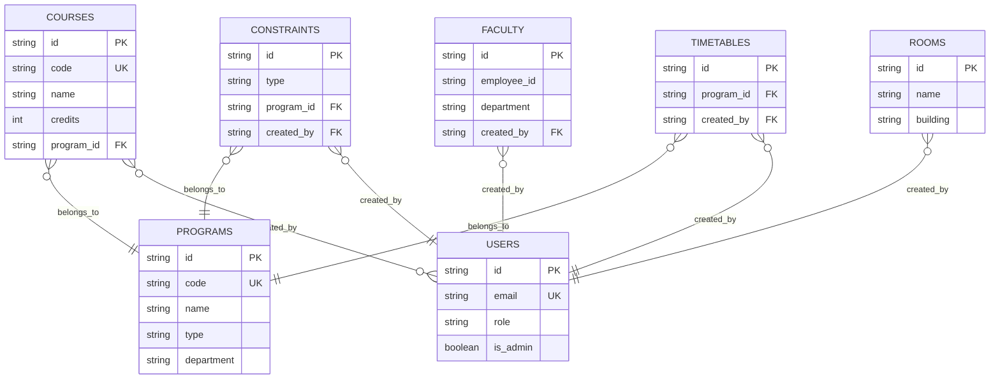

# Database Design

<cite>
**Referenced Files in This Document**
- [mongodb.py](file://backend/app/db/mongodb.py)
- [user.py](file://backend/app/models/user.py)
- [program.py](file://backend/app/models/program.py)
- [course.py](file://backend/app/models/course.py)
- [faculty.py](file://backend/app/models/faculty.py)
- [room.py](file://backend/app/models/room.py)
- [constraint.py](file://backend/app/models/constraint.py)
- [timetable.py](file://backend/app/models/timetable.py)
- [users.py](file://backend/app/api/v1/endpoints/users.py)
- [programs.py](file://backend/app/api/v1/endpoints/programs.py)
- [courses.py](file://backend/app/api/v1/endpoints/courses.py)
- [faculty.py](file://backend/app/api/v1/endpoints/faculty.py)
- [rooms.py](file://backend/app/api/v1/endpoints/rooms.py)
- [constraints.py](file://backend/app/api/v1/endpoints/constraints.py)
- [timetable.py](file://backend/app/api/v1/endpoints/timetable.py)
</cite>

## Table of Contents
1. [Introduction](#introduction)
2. [Project Structure](#project-structure)
3. [Core Components](#core-components)
4. [Architecture Overview](#architecture-overview)
5. [Detailed Component Analysis](#detailed-component-analysis)
6. [Dependency Analysis](#dependency-analysis)
7. [Performance Considerations](#performance-considerations)
8. [Troubleshooting Guide](#troubleshooting-guide)
9. [Conclusion](#conclusion)
10. [Appendices](#appendices)

## Introduction
This document describes the MongoDB schema design for ShedMaster, focusing on the collections and relationships among users, programs, courses, faculty, rooms, constraints, and timetables. It documents field definitions, data types, validation rules, primary and foreign key relationships, indexing strategy, performance considerations, access patterns, query optimization, aggregation pipelines, data integrity constraints, cascading operations, referential consistency, migration strategies, and backup/recovery considerations tailored for academic data management.

## Project Structure
ShedMaster uses Pydantic models for schema definition and FastAPI endpoints for CRUD operations. MongoDB collections are accessed via Motor asynchronous client. Collections include users, programs, courses, faculty, rooms, constraints, timetable_templates, and timetables. The database connection lifecycle is managed centrally.

**Diagram sources**
- [mongodb.py:1-41](file://backend/app/db/mongodb.py#L1-L41)
- [user.py:11-20](file://backend/app/models/user.py#L11-L20)
- [programs.py:12-288](file://backend/app/api/v1/endpoints/programs.py#L12-L288)
- [courses.py:1-279](file://backend/app/api/v1/endpoints/courses.py#L1-L279)
- [faculty.py:1-265](file://backend/app/api/v1/endpoints/faculty.py#L1-L265)
- [rooms.py:1-258](file://backend/app/api/v1/endpoints/rooms.py#L1-L258)
- [constraints.py:1-189](file://backend/app/api/v1/endpoints/constraints.py#L1-L189)
- [timetable.py:1-728](file://backend/app/api/v1/endpoints/timetable.py#L1-L728)

**Section sources**
- [mongodb.py:1-41](file://backend/app/db/mongodb.py#L1-L41)
- [programs.py:12-288](file://backend/app/api/v1/endpoints/programs.py#L12-L288)
- [courses.py:1-279](file://backend/app/api/v1/endpoints/courses.py#L1-L279)
- [faculty.py:1-265](file://backend/app/api/v1/endpoints/faculty.py#L1-L265)
- [rooms.py:1-258](file://backend/app/api/v1/endpoints/rooms.py#L1-L258)
- [constraints.py:1-189](file://backend/app/api/v1/endpoints/constraints.py#L1-L189)
- [timetable.py:1-728](file://backend/app/api/v1/endpoints/timetable.py#L1-L728)

## Core Components
This section defines each collection’s purpose, fields, data types, and validation rules.

- Users
  - Purpose: Authentication and authorization for academic data owners.
  - Fields: id, email, full_name, is_active, is_admin, role, hashed_password, created_at, updated_at.
  - Validation: EmailStr, timestamps, admin flag enforcement in endpoints.
  - Indexes: Unique email recommended; compound index for role/admin queries.
  - Access pattern: Admin-only creation/deletion; self-service updates; isolation by ObjectId.

- Programs
  - Purpose: Academic program catalog (e.g., FYUP, B.Ed, M.Ed, ITEP).
  - Fields: id, name, code, type, department, duration_years, total_semesters, credits_required, description, is_active, created_at, updated_at.
  - Validation: Integers bounded by reasonable ranges; string enums for type; uniqueness on code enforced in endpoints.
  - Indexes: Unique code; indexes on type and department for filtering.
  - Access pattern: Admin-only management; program_id stored in courses; cascade protection in deletion.

- Courses
  - Purpose: Course catalog linked to programs and semesters.
  - Fields: id, code, name, credits, type, hours_per_week, min_per_session, semester, program_id, description, prerequisites, is_lab, lab_hours, is_active, created_by, created_at, updated_at.
  - Validation: Numeric bounds; optional program_id; prerequisites as array of IDs.
  - Indexes: Unique code; index on program_id and semester; compound index on program_id+semester.
  - Access pattern: Admin or creator updates; program-scoped queries; course code uniqueness.

- Faculty
  - Purpose: Academic staff profiles and availability.
  - Fields: id, name, employee_id, department, designation, email, subjects, max_hours_per_week, available_days, created_by, created_at, updated_at.
  - Validation: Bounds on max_hours_per_week; lists for subjects and availability.
  - Indexes: Unique employee_id per creator; indexes on department and designation.
  - Access pattern: Creator isolation; duplicate employee_id prevention per creator.

- Rooms
  - Purpose: Classroom and lab inventory.
  - Fields: id, name, building, floor, capacity, room_type, facilities, is_lab, is_accessible, has_projector, has_ac, has_wifi, location_notes, is_active, created_by, created_at, updated_at.
  - Validation: Capacity and floor bounds; booleans for facilities; soft-delete via is_active.
  - Indexes: Compound unique(name, building); indexes on room_type, capacity, building.
  - Access pattern: Duplicate name+building prevented; soft-delete on delete.

- Constraints
  - Purpose: Scheduling rules (global or per-program).
  - Fields: id, name, type, description, parameters, priority, is_active, program_id, created_by, created_at, updated_at.
  - Validation: Priority range; optional program_id; parameters as JSON object.
  - Indexes: Compound on (program_id, is_active); type filter index.
  - Access pattern: Admin/faculty creation; per-user permission checks; validation endpoint.

- Timetables
  - Purpose: Generated schedules with entries (course, faculty, room, time slot).
  - Fields: id, title, program_id, semester, academic_year, entries (array of TimetableEntry), is_draft, metadata, created_by, created_at, updated_at, generated_at, validation_status, optimization_score.
  - Entries: course_id, faculty_id, room_id, group_id, time_slot (day, start_time, end_time, duration_minutes).
  - Validation: Security: created_by filter on all operations; default title and timestamps handling.
  - Indexes: Compound on (created_by, program_id, semester, academic_year); indexes on program_id.
  - Access pattern: Strict user isolation; draft vs final saves; export and validation endpoints.

**Section sources**
- [user.py:27-76](file://backend/app/models/user.py#L27-L76)
- [program.py:6-33](file://backend/app/models/program.py#L6-L33)
- [course.py:6-43](file://backend/app/models/course.py#L6-L43)
- [faculty.py:5-39](file://backend/app/models/faculty.py#L5-L39)
- [room.py:6-43](file://backend/app/models/room.py#L6-L43)
- [constraint.py:6-30](file://backend/app/models/constraint.py#L6-L30)
- [timetable.py:6-52](file://backend/app/models/timetable.py#L6-L52)

## Architecture Overview
The system follows a layered architecture: models define schemas, endpoints handle requests and enforce business rules, and the database client manages connections.

**Diagram sources**
- [timetable.py:30-44](file://backend/app/api/v1/endpoints/timetable.py#L30-L44)
- [programs.py:189-195](file://backend/app/api/v1/endpoints/programs.py#L189-L195)
- [constraints.py:76-83](file://backend/app/api/v1/endpoints/constraints.py#L76-L83)
- [faculty.py:155-158](file://backend/app/api/v1/endpoints/faculty.py#L155-L158)
- [rooms.py:235-238](file://backend/app/api/v1/endpoints/rooms.py#L235-L238)

## Detailed Component Analysis

### Users Collection
- Purpose: Store user accounts with hashed passwords and roles.
- Key fields: email (unique), is_admin, role, hashed_password.
- Validation: Email validation via EmailStr; admin-only operations enforced in endpoints.
- Indexing: Unique index on email recommended; compound index on role/is_admin for RBAC queries.
- Access pattern: Admins can manage users; non-admins can update themselves; endpoints check permissions.

**Diagram sources**
- [user.py:27-76](file://backend/app/models/user.py#L27-L76)

**Section sources**
- [user.py:27-76](file://backend/app/models/user.py#L27-L76)
- [users.py:11-123](file://backend/app/api/v1/endpoints/users.py#L11-L123)

### Programs Collection
- Purpose: Academic program definitions.
- Key fields: code (unique), name, type, department, duration_years, total_semesters, credits_required, is_active.
- Validation: Numeric bounds; uniqueness enforced by endpoint logic.
- Indexing: Unique code; indexes on type and department for filtering.
- Access pattern: Admin-only create/update/delete; cascade protection: cannot delete program if associated timetables exist.

**Diagram sources**
- [program.py:6-33](file://backend/app/models/program.py#L6-L33)

**Section sources**
- [program.py:6-33](file://backend/app/models/program.py#L6-L33)
- [programs.py:100-200](file://backend/app/api/v1/endpoints/programs.py#L100-L200)

### Courses Collection
- Purpose: Course catalog linked to programs and semesters.
- Key fields: code (unique), name, credits, type, hours_per_week, min_per_session, semester, program_id, prerequisites, is_lab, lab_hours, is_active, created_by.
- Validation: Numeric bounds; prerequisites as array of course IDs; program_id optional.
- Indexing: Unique code; index on program_id and semester; compound index on program_id+semester.
- Access pattern: Endpoint enforces uniqueness and ObjectId conversion; supports filtering by program_id and semester.

**Diagram sources**
- [course.py:6-43](file://backend/app/models/course.py#L6-L43)

**Section sources**
- [course.py:6-43](file://backend/app/models/course.py#L6-L43)
- [courses.py:12-126](file://backend/app/api/v1/endpoints/courses.py#L12-L126)

### Faculty Collection
- Purpose: Academic staff profiles and availability.
- Key fields: employee_id (unique per creator), name, department, designation, email, subjects, max_hours_per_week, available_days, created_by.
- Validation: Bounds on max_hours_per_week; lists for subjects and availability.
- Indexing: Unique employee_id per creator; indexes on department and designation.
- Access pattern: Creator isolation; duplicate employee_id prevention per creator.

**Diagram sources**
- [faculty.py:5-39](file://backend/app/models/faculty.py#L5-L39)

**Section sources**
- [faculty.py:5-39](file://backend/app/models/faculty.py#L5-L39)
- [faculty.py:43-98](file://backend/app/api/v1/endpoints/faculty.py#L43-L98)

### Rooms Collection
- Purpose: Classroom and lab inventory.
- Key fields: name, building (unique combination), floor, capacity, room_type, facilities, is_lab, is_accessible, has_projector, has_ac, has_wifi, location_notes, is_active, created_by.
- Validation: Capacity and floor bounds; booleans for facilities; soft-delete via is_active.
- Indexing: Compound unique(name, building); indexes on room_type, capacity, building.
- Access pattern: Duplicate name+building prevented; delete sets is_active=false.

**Diagram sources**
- [room.py:6-43](file://backend/app/models/room.py#L6-L43)

**Section sources**
- [room.py:6-43](file://backend/app/models/room.py#L6-L43)
- [rooms.py:58-206](file://backend/app/api/v1/endpoints/rooms.py#L58-L206)

### Constraints Collection
- Purpose: Scheduling rules (global or per-program).
- Key fields: name, type, description, parameters, priority, is_active, program_id, created_by.
- Validation: Priority range; optional program_id; parameters as JSON object.
- Indexing: Compound on (program_id, is_active); type filter index.
- Access pattern: Admin/faculty creation; per-user permission checks; validation endpoint aggregates constraints.

**Diagram sources**
- [constraint.py:6-30](file://backend/app/models/constraint.py#L6-L30)

**Section sources**
- [constraint.py:6-30](file://backend/app/models/constraint.py#L6-L30)
- [constraints.py:11-113](file://backend/app/api/v1/endpoints/constraints.py#L11-L113)

### Timetables Collection
- Purpose: Generated schedules with entries (course, faculty, room, time slot).
- Key fields: title, program_id, semester, academic_year, entries (array of TimetableEntry), is_draft, metadata, created_by, created_at, updated_at, generated_at, validation_status, optimization_score.
- Entries: course_id, faculty_id, room_id, group_id, time_slot (day, start_time, end_time, duration_minutes).
- Validation: Security: created_by filter on all operations; default title and timestamps handling.
- Indexing: Compound on (created_by, program_id, semester, academic_year); indexes on program_id.
- Access pattern: Strict user isolation; draft vs final saves; export and validation endpoints.

**Diagram sources**
- [timetable.py:6-52](file://backend/app/models/timetable.py#L6-L52)

**Section sources**
- [timetable.py:6-52](file://backend/app/models/timetable.py#L6-L52)
- [timetable.py:17-145](file://backend/app/api/v1/endpoints/timetable.py#L17-L145)

## Dependency Analysis
Relationships between collections are modeled via string/ObjectId references. The following diagram shows primary and foreign keys and dependencies.

**Diagram sources**
- [user.py:67-76](file://backend/app/models/user.py#L67-L76)
- [program.py:31-33](file://backend/app/models/program.py#L31-L33)
- [course.py:39-43](file://backend/app/models/course.py#L39-L43)
- [faculty.py:28-32](file://backend/app/models/faculty.py#L28-L32)
- [room.py:39-43](file://backend/app/models/room.py#L39-L43)
- [constraint.py:27-30](file://backend/app/models/constraint.py#L27-L30)
- [timetable.py:46-52](file://backend/app/models/timetable.py#L46-L52)

**Section sources**
- [programs.py:189-195](file://backend/app/api/v1/endpoints/programs.py#L189-L195)
- [courses.py:82-91](file://backend/app/api/v1/endpoints/courses.py#L82-L91)
- [faculty.py:64-70](file://backend/app/api/v1/endpoints/faculty.py#L64-L70)
- [rooms.py:80-83](file://backend/app/api/v1/endpoints/rooms.py#L80-L83)
- [constraints.py:59-63](file://backend/app/api/v1/endpoints/constraints.py#L59-L63)
- [timetable.py:124-131](file://backend/app/api/v1/endpoints/timetable.py#L124-L131)

## Performance Considerations
- Indexing strategy
  - Unique indexes: users.email, programs.code, courses.code, rooms.name+building, faculty.employee_id per creator.
  - Compound indexes: programs(type, department), courses(program_id, semester), constraints(program_id, is_active), timetables(created_by, program_id, semester, academic_year).
  - Text/search indexes: building, room_type for flexible filtering.
- Query optimization
  - Prefer exact-match filters (ObjectId) over regex where possible.
  - Use projection to avoid returning unnecessary fields.
  - Paginate with skip/limit; consider cursor-based pagination for large datasets.
- Aggregation pipelines
  - Program statistics: group by semester to count courses.
  - Constraint validation: match by program_id (global or specific) and is_active.
- Data locality
  - Embedding small, static arrays (e.g., facilities) is acceptable; otherwise reference by ObjectId.
- Sharding
  - Consider sharding by created_by for timetables and program_id for courses/rooms/constraints to scale horizontally.

[No sources needed since this section provides general guidance]

## Troubleshooting Guide
- Connection issues
  - Verify MongoDB URL and database name; check server selection timeout and ping command success.
- Permission errors
  - Ensure current user is admin or owns the resource (created_by filter).
- Duplicate key errors
  - Unique constraints on code, name+building, employee_id per creator.
- Cascade violations
  - Cannot delete program if associated timetables exist; remove dependents first.
- ObjectId conversion
  - Convert string IDs to ObjectId for queries; endpoints handle conversions automatically.

**Section sources**
- [mongodb.py:11-32](file://backend/app/db/mongodb.py#L11-L32)
- [programs.py:189-195](file://backend/app/api/v1/endpoints/programs.py#L189-L195)
- [courses.py:67-74](file://backend/app/api/v1/endpoints/courses.py#L67-L74)
- [rooms.py:67-77](file://backend/app/api/v1/endpoints/rooms.py#L67-L77)
- [faculty.py:52-62](file://backend/app/api/v1/endpoints/faculty.py#L52-L62)
- [timetable.py:83-86](file://backend/app/api/v1/endpoints/timetable.py#L83-L86)

## Conclusion
ShedMaster’s MongoDB schema leverages ObjectId references to maintain flexibility while enforcing referential consistency through application-layer checks and strict user isolation. The schema supports academic workflows with strong validation rules, efficient indexing, and robust aggregation for reporting. Migration and backup strategies should focus on preserving referential integrity and enabling safe schema evolution.

[No sources needed since this section summarizes without analyzing specific files]

## Appendices

### Sample Data Examples
- User
  - Fields: email, full_name, is_active, is_admin, role, hashed_password, created_at, updated_at.
- Program
  - Fields: name, code, type, department, duration_years, total_semesters, credits_required, description, is_active, created_at, updated_at.
- Course
  - Fields: code, name, credits, type, hours_per_week, min_per_session, semester, program_id, description, prerequisites, is_lab, lab_hours, is_active, created_by, created_at, updated_at.
- Faculty
  - Fields: name, employee_id, department, designation, email, subjects, max_hours_per_week, available_days, created_by, created_at, updated_at.
- Room
  - Fields: name, building, floor, capacity, room_type, facilities, is_lab, is_accessible, has_projector, has_ac, has_wifi, location_notes, is_active, created_by, created_at, updated_at.
- Constraint
  - Fields: name, type, description, parameters, priority, is_active, program_id, created_by, created_at, updated_at.
- Timetable
  - Fields: title, program_id, semester, academic_year, entries, is_draft, metadata, created_by, created_at, updated_at, generated_at, validation_status, optimization_score.

[No sources needed since this section provides general guidance]

### Schema Evolution Patterns
- Add optional fields with defaults to preserve backward compatibility.
- Introduce new collections (e.g., timetable_templates) alongside existing ones.
- Use migrations to populate computed fields (e.g., derived metadata) and reindex as needed.
- Maintain backward-compatible ObjectId/string conversions during transitions.

[No sources needed since this section provides general guidance]

### Backup and Recovery Considerations
- Use MongoDB native tools for logical and physical backups.
- Schedule regular snapshots of replica set/cluster.
- Validate backups periodically and test restore procedures.
- For compliance, retain audit trails (created_at, updated_at, created_by) to support forensic analysis.

[No sources needed since this section provides general guidance]