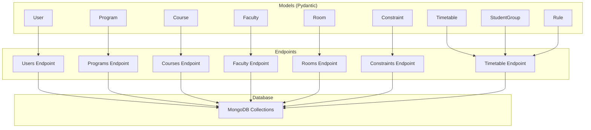
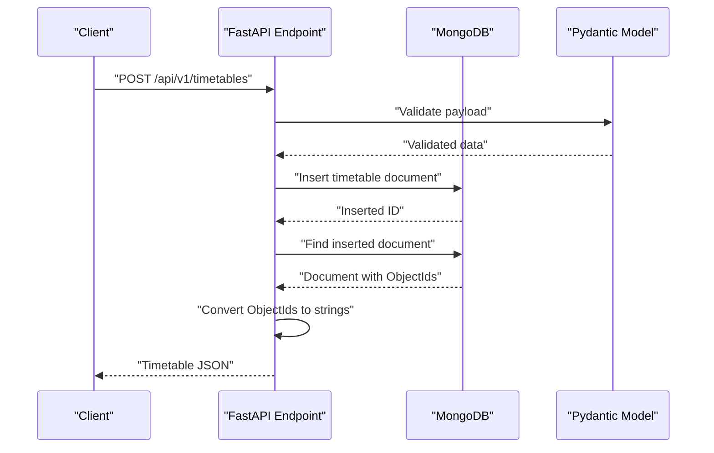
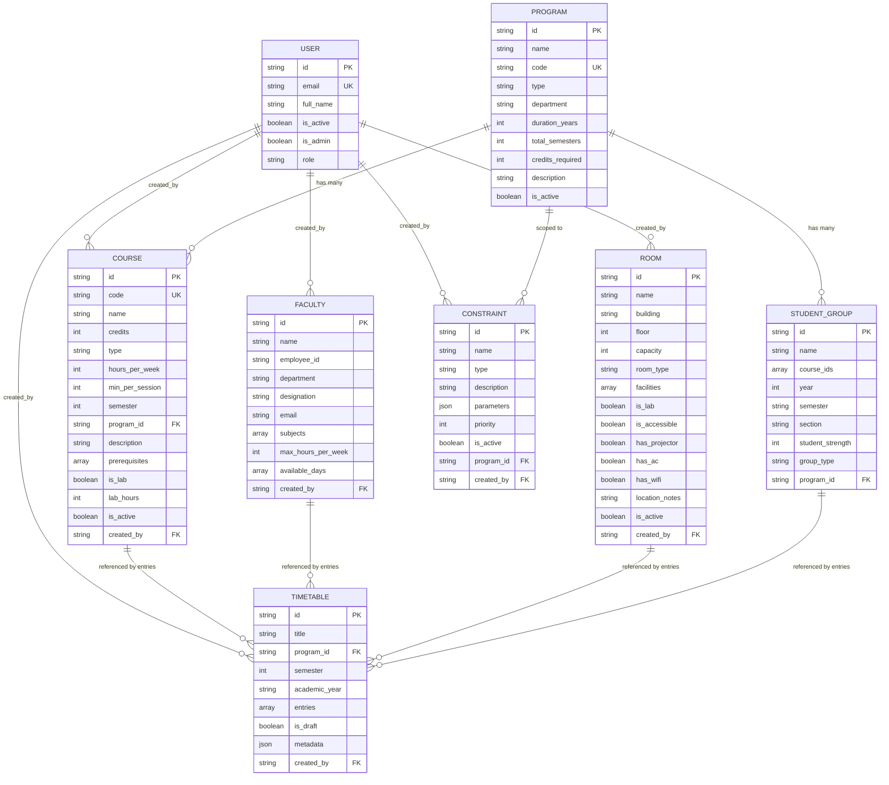
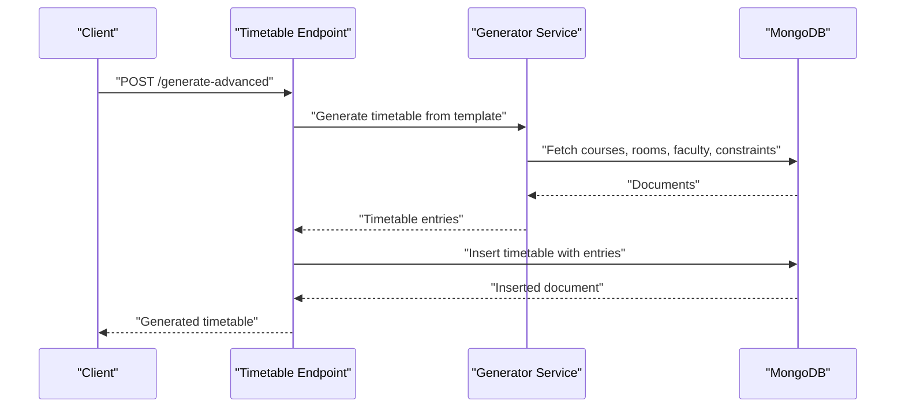
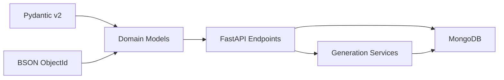

# Schema Design

<cite>
**Referenced Files in This Document**
- [user.py](file://backend/app/models/user.py)
- [program.py](file://backend/app/models/program.py)
- [course.py](file://backend/app/models/course.py)
- [faculty.py](file://backend/app/models/faculty.py)
- [room.py](file://backend/app/models/room.py)
- [constraint.py](file://backend/app/models/constraint.py)
- [timetable.py](file://backend/app/models/timetable.py)
- [student_group.py](file://backend/app/models/student_group.py)
- [rule.py](file://backend/app/models/rule.py)
- [mongodb.py](file://backend/app/db/mongodb.py)
- [users.py](file://backend/app/api/v1/endpoints/users.py)
- [programs.py](file://backend/app/api/v1/endpoints/programs.py)
- [courses.py](file://backend/app/api/v1/endpoints/courses.py)
- [faculty.py](file://backend/app/api/v1/endpoints/faculty.py)
- [rooms.py](file://backend/app/api/v1/endpoints/rooms.py)
- [constraints.py](file://backend/app/api/v1/endpoints/constraints.py)
- [timetable.py](file://backend/app/api/v1/endpoints/timetable.py)
</cite>

## Table of Contents
1. [Introduction](#introduction)
2. [Project Structure](#project-structure)
3. [Core Components](#core-components)
4. [Architecture Overview](#architecture-overview)
5. [Detailed Component Analysis](#detailed-component-analysis)
6. [Dependency Analysis](#dependency-analysis)
7. [Performance Considerations](#performance-considerations)
8. [Troubleshooting Guide](#troubleshooting-guide)
9. [Conclusion](#conclusion)
10. [Appendices](#appendices)

## Introduction
This document describes the MongoDB schema design for ShedMaster, focusing on the data models for users, programs, courses, faculty, rooms, constraints, timetables, student groups, and rules. It explains field definitions, Pydantic configurations, validation rules, and how the application enforces business rules and user isolation. It also outlines indexing strategies, compound indexes for common queries, and TTL considerations for temporary data. Finally, it provides diagrams illustrating relationships and data flow.

## Project Structure
The schema is implemented using Pydantic v2 models under backend/app/models and exposed via FastAPI endpoints under backend/app/api/v1/endpoints. MongoDB collections mirror the domain entities, with ObjectId fields mapped to string identifiers for JSON responses.

**Diagram sources**
- [mongodb.py:1-41](file://backend/app/db/mongodb.py#L1-L41)
- [users.py:1-123](file://backend/app/api/v1/endpoints/users.py#L1-L123)
- [programs.py:1-288](file://backend/app/api/v1/endpoints/programs.py#L1-L288)
- [courses.py:1-279](file://backend/app/api/v1/endpoints/courses.py#L1-L279)
- [faculty.py:1-265](file://backend/app/api/v1/endpoints/faculty.py#L1-L265)
- [rooms.py:1-258](file://backend/app/api/v1/endpoints/rooms.py#L1-L258)
- [constraints.py:1-189](file://backend/app/api/v1/endpoints/constraints.py#L1-L189)
- [timetable.py:1-728](file://backend/app/api/v1/endpoints/timetable.py#L1-L728)

**Section sources**
- [mongodb.py:1-41](file://backend/app/db/mongodb.py#L1-L41)
- [users.py:1-123](file://backend/app/api/v1/endpoints/users.py#L1-L123)
- [programs.py:1-288](file://backend/app/api/v1/endpoints/programs.py#L1-L288)
- [courses.py:1-279](file://backend/app/api/v1/endpoints/courses.py#L1-L279)
- [faculty.py:1-265](file://backend/app/api/v1/endpoints/faculty.py#L1-L265)
- [rooms.py:1-258](file://backend/app/api/v1/endpoints/rooms.py#L1-L258)
- [constraints.py:1-189](file://backend/app/api/v1/endpoints/constraints.py#L1-L189)
- [timetable.py:1-728](file://backend/app/api/v1/endpoints/timetable.py#L1-L728)

## Core Components
This section summarizes each model’s purpose, key fields, validation rules, and defaults.

- User
  - Purpose: Authentication and authorization records.
  - Fields: email, full_name, is_active, is_admin, role, hashed_password, created_at, updated_at.
  - Validation: EmailStr; defaults for booleans and timestamps; full_name derived from name if absent.
  - Indexes: Unique email enforced by application logic; ObjectId mapping handled in models.

- Program
  - Purpose: Academic program definition (e.g., B.Ed, M.Ed).
  - Fields: name, code, type, department, duration_years, total_semesters, credits_required, description, is_active.
  - Validation: Required non-empty strings; numeric bounds; defaults applied.
  - Indexes: Unique program code enforced by application logic.

- Course
  - Purpose: Course catalog with attributes like credits, hours, semester, prerequisites.
  - Fields: code, name, credits, type, hours_per_week, min_per_session, semester, program_id, description, prerequisites, is_lab, lab_hours, is_active, created_by, created_at, updated_at.
  - Validation: Numeric ranges (credits, hours, minutes); optional fields; defaults applied.
  - Indexes: Unique course code enforced by application logic.

- Faculty
  - Purpose: Instructor profiles with availability and subject expertise.
  - Fields: name, employee_id, department, designation, email, subjects, max_hours_per_week, available_days.
  - Validation: Bounds on max weekly hours; lists default to empty.
  - Indexes: Unique employee_id per creator enforced by application logic.

- Room
  - Purpose: Classroom and lab inventory with facilities and accessibility.
  - Fields: name, building, floor, capacity, room_type, facilities, is_lab, is_accessible, has_projector, has_ac, has_wifi, location_notes, is_active, created_by, created_at, updated_at.
  - Validation: Numeric bounds; defaults; boolean toggles.
  - Indexes: Unique name+building enforced by application logic.

- Constraint
  - Purpose: Scheduling constraints (global or program-specific) with parameters and priority.
  - Fields: name, type, description, parameters, priority, is_active, program_id, created_by, created_at, updated_at.
  - Validation: Priority range; optional program_id; defaults applied.

- Timetable
  - Purpose: Scheduled sessions with course, faculty, room, time slots, and metadata.
  - Fields: title, program_id, semester, academic_year, entries (list of TimetableEntry), is_draft, metadata, created_by, created_at, updated_at, generated_at, validation_status, optimization_score.
  - Entries: course_id, faculty_id, room_id, group_id, time_slot (day, start_time, end_time, duration_minutes).
  - Validation: Defaults for booleans and status; ObjectId conversions in endpoints.

- StudentGroup
  - Purpose: Cohorts of students grouped by year, semester, section, and program.
  - Fields: name, course_ids, year, semester, section, student_strength, group_type, program_id, id, created_by, created_at, updated_at.
  - Validation: Ranged integers; required fields; ObjectId mapping in endpoints.

- Rule
  - Purpose: Global or program-specific scheduling rules (e.g., time settings).
  - Fields: name, description, rule_type, params, is_active, id, created_by, created_at, updated_at.
  - Validation: Optional fields; defaults applied.

**Section sources**
- [user.py:1-76](file://backend/app/models/user.py#L1-L76)
- [program.py:1-33](file://backend/app/models/program.py#L1-L33)
- [course.py:1-43](file://backend/app/models/course.py#L1-L43)
- [faculty.py:1-39](file://backend/app/models/faculty.py#L1-L39)
- [room.py:1-43](file://backend/app/models/room.py#L1-L43)
- [constraint.py:1-30](file://backend/app/models/constraint.py#L1-L30)
- [timetable.py:1-52](file://backend/app/models/timetable.py#L1-L52)
- [student_group.py:1-36](file://backend/app/models/student_group.py#L1-L36)
- [rule.py:1-34](file://backend/app/models/rule.py#L1-L34)

## Architecture Overview
ShedMaster uses Pydantic models for validation and FastAPI endpoints for CRUD operations. MongoDB stores documents with ObjectId identifiers. Endpoints enforce user isolation by filtering queries by created_by and validate ObjectId formats. Responses convert ObjectId fields to strings for frontend compatibility.

**Diagram sources**
- [timetable.py:116-145](file://backend/app/api/v1/endpoints/timetable.py#L116-L145)
- [timetable.py:1-52](file://backend/app/models/timetable.py#L1-L52)

**Section sources**
- [timetable.py:1-728](file://backend/app/api/v1/endpoints/timetable.py#L1-L728)
- [timetable.py:1-52](file://backend/app/models/timetable.py#L1-L52)

## Detailed Component Analysis

### Data Model Definitions and Relationships
The following diagram shows the conceptual relationships among entities. Relationships are represented by foreign keys stored as string/ObjectId fields in documents.

**Diagram sources**
- [user.py:1-76](file://backend/app/models/user.py#L1-L76)
- [program.py:1-33](file://backend/app/models/program.py#L1-L33)
- [course.py:1-43](file://backend/app/models/course.py#L1-L43)
- [faculty.py:1-39](file://backend/app/models/faculty.py#L1-L39)
- [room.py:1-43](file://backend/app/models/room.py#L1-L43)
- [constraint.py:1-30](file://backend/app/models/constraint.py#L1-L30)
- [student_group.py:1-36](file://backend/app/models/student_group.py#L1-L36)
- [timetable.py:1-52](file://backend/app/models/timetable.py#L1-L52)

### Relationship Details and Embedding vs Referencing
- Users create resources (courses, rooms, faculty, constraints, timetables). Foreign keys are stored as string/ObjectId in documents; no embedded subdocuments are used for referenced entities.
- Courses reference Programs via program_id.
- Timetables reference Courses, Faculty, Rooms, and StudentGroups via entries containing course_id, faculty_id, room_id, and group_id.
- Constraints can be scoped to a Program or global (program_id null).
- StudentGroups belong to a Program and link to Course IDs.

This design uses referencing for scalability and normalized storage. Embedding would increase duplication and update complexity.

**Section sources**
- [course.py:1-43](file://backend/app/models/course.py#L1-L43)
- [timetable.py:1-52](file://backend/app/models/timetable.py#L1-L52)
- [constraint.py:1-30](file://backend/app/models/constraint.py#L1-L30)
- [student_group.py:1-36](file://backend/app/models/student_group.py#L1-L36)

### Validation Rules and Business Rules
- Pydantic validators enforce field types, ranges, and defaults.
- Application-level checks:
  - Unique constraints: email (User), program code (Program), course code (Course), employee_id per creator (Faculty), room name+building (Room).
  - User isolation: Endpoints filter by created_by to prevent cross-user access.
  - ObjectId validation: Endpoints validate and convert IDs safely.
  - Deletion safeguards: Deleting a Program is blocked if associated Timetables exist.

**Section sources**
- [users.py:52-75](file://backend/app/api/v1/endpoints/users.py#L52-L75)
- [programs.py:116-120](file://backend/app/api/v1/endpoints/programs.py#L116-L120)
- [courses.py:67-74](file://backend/app/api/v1/endpoints/courses.py#L67-L74)
- [faculty.py:52-62](file://backend/app/api/v1/endpoints/faculty.py#L52-L62)
- [rooms.py:67-77](file://backend/app/api/v1/endpoints/rooms.py#L67-L77)
- [programs.py:189-195](file://backend/app/api/v1/endpoints/programs.py#L189-L195)

### Sample Data Examples
Below are representative documents for each collection. These illustrate typical academic data structures.

- User
  - Example: { "email": "prof.smith@example.edu", "full_name": "Smith", "is_active": true, "is_admin": false, "role": "user", "hashed_password": "...", "created_at": "2025-01-01T00:00:00Z" }

- Program
  - Example: { "name": "Bachelor of Education", "code": "B.Ed-2024", "type": "B.Ed", "department": "Education", "duration_years": 2, "total_semesters": 4, "credits_required": 120, "is_active": true }

- Course
  - Example: { "code": "EDU101", "name": "Child Psychology", "credits": 3, "type": "Core", "hours_per_week": 4, "min_per_session": 60, "semester": 1, "program_id": "PROGRAM_ID", "prerequisites": [], "is_lab": false, "is_active": true, "created_by": "USER_ID" }

- Faculty
  - Example: { "name": "Dr. Jane Cooper", "employee_id": "EMP001", "department": "Education", "designation": "Assistant Professor", "email": "jane.cooper@example.edu", "subjects": ["EDU101", "EDU102"], "max_hours_per_week": 16, "available_days": ["Mon", "Wed", "Fri"] }

- Room
  - Example: { "name": "A-101", "building": "Main Building", "floor": 1, "capacity": 60, "room_type": "Classroom", "facilities": ["AC", "Projector"], "is_lab": false, "is_accessible": true, "has_projector": true, "has_ac": true, "has_wifi": true, "is_active": true, "created_by": "USER_ID" }

- Constraint
  - Example: { "name": "Workload Limit", "type": "faculty_workload", "parameters": { "max_hours_per_week": 18 }, "priority": 5, "is_active": true, "program_id": "PROGRAM_ID", "created_by": "USER_ID" }

- Timetable
  - Example: { "title": "Semester 1 - 2024-25", "program_id": "PROGRAM_ID", "semester": 1, "academic_year": "2024-25", "entries": [ { "course_id": "COURSE_ID", "faculty_id": "FACULTY_ID", "room_id": "ROOM_ID", "time_slot": { "day": "Mon", "start_time": "09:00", "end_time": "10:30", "duration_minutes": 90 } } ], "is_draft": false, "metadata": {}, "created_by": "USER_ID" }

- StudentGroup
  - Example: { "name": "B.Ed Sec A Year 1", "course_ids": ["COURSE_ID1", "COURSE_ID2"], "year": 1, "semester": "Odd", "section": "A", "student_strength": 45, "group_type": "Regular Class", "program_id": "PROGRAM_ID" }

- Rule
  - Example: { "name": "Time & Rules Settings", "rule_type": "time_settings", "params": { "default_start_hour": 9, "default_end_hour": 17, "slot_duration": 60 }, "is_active": true }

**Section sources**
- [user.py:1-76](file://backend/app/models/user.py#L1-L76)
- [program.py:1-33](file://backend/app/models/program.py#L1-L33)
- [course.py:1-43](file://backend/app/models/course.py#L1-L43)
- [faculty.py:1-39](file://backend/app/models/faculty.py#L1-L39)
- [room.py:1-43](file://backend/app/models/room.py#L1-L43)
- [constraint.py:1-30](file://backend/app/models/constraint.py#L1-L30)
- [timetable.py:1-52](file://backend/app/models/timetable.py#L1-L52)
- [student_group.py:1-36](file://backend/app/models/student_group.py#L1-L36)
- [rule.py:1-34](file://backend/app/models/rule.py#L1-L34)

### Processing Logic and Data Flow
The following sequence illustrates timetable creation and population of entries.

**Diagram sources**
- [timetable.py:266-375](file://backend/app/api/v1/endpoints/timetable.py#L266-L375)
- [timetable.py:1-52](file://backend/app/models/timetable.py#L1-L52)

**Section sources**
- [timetable.py:266-375](file://backend/app/api/v1/endpoints/timetable.py#L266-L375)

## Dependency Analysis
- Models depend on Pydantic v2 for validation and BSON ObjectId for MongoDB compatibility.
- Endpoints depend on models for request/response validation and on MongoDB for persistence.
- Timetable generation depends on services that query Courses, Rooms, Faculty, Constraints, and Templates.

**Diagram sources**
- [user.py:1-76](file://backend/app/models/user.py#L1-L76)
- [program.py:1-33](file://backend/app/models/program.py#L1-L33)
- [course.py:1-43](file://backend/app/models/course.py#L1-L43)
- [faculty.py:1-39](file://backend/app/models/faculty.py#L1-L39)
- [room.py:1-43](file://backend/app/models/room.py#L1-L43)
- [constraint.py:1-30](file://backend/app/models/constraint.py#L1-L30)
- [timetable.py:1-52](file://backend/app/models/timetable.py#L1-L52)
- [student_group.py:1-36](file://backend/app/models/student_group.py#L1-L36)
- [rule.py:1-34](file://backend/app/models/rule.py#L1-L34)
- [mongodb.py:1-41](file://backend/app/db/mongodb.py#L1-L41)

**Section sources**
- [mongodb.py:1-41](file://backend/app/db/mongodb.py#L1-L41)
- [timetable.py:1-728](file://backend/app/api/v1/endpoints/timetable.py#L1-L728)

## Performance Considerations
- Indexing strategy
  - Unique indexes
    - Users: email (unique) — enforced by application check on create/update.
    - Programs: code (unique) — enforced by application check on create/update.
    - Courses: code (unique) — enforced by application check on create/update.
    - Faculty: employee_id + created_by (unique) — enforced by application check on create/update.
    - Rooms: name + building (unique) — enforced by application check on create/update.
  - Compound indexes for frequent queries
    - Timetables: (created_by, program_id), (created_by, semester), (created_by, academic_year), (created_by, is_draft)
    - Courses: (program_id, semester), (program_id, code)
    - Programs: (department, type), (duration_years, total_semesters)
    - Rooms: (building, room_type, capacity)
    - Constraints: (program_id, type, is_active)
    - StudentGroups: (program_id, year, semester, section)
- TTL collections
  - Consider TTL on temporary collections (e.g., drafts) with expireAfterSeconds to automatically remove stale data.
- Query patterns
  - Prefer filtering by created_by to avoid cross-user scans.
  - Use projection to limit returned fields for read-heavy endpoints.

[No sources needed since this section provides general guidance]

## Troubleshooting Guide
- ObjectId errors
  - Symptom: “Invalid ObjectId” exceptions when querying by ID.
  - Cause: Malformed ID string.
  - Fix: Validate ID format before querying; ensure endpoints receive ObjectId-compatible strings.
- Cross-user access attempts
  - Symptom: 404 Not Found when accessing another user’s resource.
  - Cause: Endpoints filter by created_by; mismatch prevents retrieval.
  - Fix: Ensure requests are authenticated and the created_by matches the current user.
- Duplicate key violations
  - Symptom: 400 Bad Request on create.
  - Cause: Unique constraint violated (email, program code, course code, employee_id, room name+building).
  - Fix: Check existing records before insert; present user-friendly messages.
- Deletion blocked
  - Symptom: 400 Bad Request when deleting a Program with associated Timetables.
  - Cause: Safety check prevents orphaning references.
  - Fix: Delete dependent Timetables first or restructure data.

**Section sources**
- [timetable.py:84-87](file://backend/app/api/v1/endpoints/timetable.py#L84-L87)
- [timetable.py:175-180](file://backend/app/api/v1/endpoints/timetable.py#L175-L180)
- [programs.py:189-195](file://backend/app/api/v1/endpoints/programs.py#L189-L195)
- [users.py:64-67](file://backend/app/api/v1/endpoints/users.py#L64-L67)
- [programs.py:116-120](file://backend/app/api/v1/endpoints/programs.py#L116-L120)
- [courses.py:67-74](file://backend/app/api/v1/endpoints/courses.py#L67-L74)
- [faculty.py:52-62](file://backend/app/api/v1/endpoints/faculty.py#L52-L62)
- [rooms.py:67-77](file://backend/app/api/v1/endpoints/rooms.py#L67-L77)

## Conclusion
ShedMaster’s schema is designed around normalized referencing, strong Pydantic validation, and strict user isolation. Unique constraints and compound indexes support efficient querying. The design balances flexibility for academic structures with operational safety and performance. Extending the schema should preserve these principles and add indexes aligned with new query patterns.

[No sources needed since this section summarizes without analyzing specific files]

## Appendices

### Appendix A: Field-Level Validation Reference
- User
  - email: EmailStr
  - full_name: str; derived from name if absent
  - is_active: bool default True
  - is_admin: bool default False
  - role: str default "user"
- Program
  - name, code, type, department: str; required
  - duration_years, total_semesters, credits_required: int; required
  - description: Optional[str]; default None
  - is_active: bool default True
- Course
  - code, name, type: str; required
  - credits: int; ge=1, le=10
  - hours_per_week: int; ge=1, le=20
  - min_per_session: int; ge=30, le=180; default 50
  - semester: Optional[int]; ge=1, le=8
  - program_id: Optional[str]
  - prerequisites: Optional[List[str]]; default []
  - is_lab: Optional[bool]; default False
  - lab_hours: Optional[int]; default 0
  - is_active: Optional[bool]; default True
- Faculty
  - name, employee_id, department, designation, email: str; required
  - subjects: List[str]; default []
  - max_hours_per_week: int; ge=1, le=40; default 16
  - available_days: List[str]; default []
- Room
  - name, building, room_type: str; required
  - floor: int; ge=0, le=20
  - capacity: int; ge=1, le=500
  - facilities: List[str]; default []
  - is_lab, is_accessible, has_projector, has_ac, has_wifi: bool; defaults False/True as noted
  - location_notes: Optional[str]
  - is_active: bool default True
- Constraint
  - name, type: str; required
  - description: Optional[str]
  - parameters: Dict[str, Any]; default {}
  - priority: int; default 1
  - is_active: bool default True
  - program_id: Optional[str]
- Timetable
  - title, program_id, semester, academic_year: str/int; required
  - entries: List[TimetableEntry]; default []
  - is_draft: bool default True
  - metadata: Optional[Dict[str, Any]]; default {}
  - validation_status: str default "pending"
  - optimization_score: Optional[float]
- StudentGroup
  - name: str; required
  - course_ids: List[str]; required
  - year: int; ge=1, le=4
  - semester: str; required
  - section: str; required
  - student_strength: int; ge=1, le=200
  - group_type: str; required
  - program_id: str; required
- Rule
  - name: str; default "Time & Rules Settings"
  - description: Optional[str]
  - rule_type: Optional[str]; default "custom"
  - params: Optional[Dict[str, Any]]; default {}
  - is_active: Optional[bool]; default True

**Section sources**
- [user.py:1-76](file://backend/app/models/user.py#L1-L76)
- [program.py:1-33](file://backend/app/models/program.py#L1-L33)
- [course.py:1-43](file://backend/app/models/course.py#L1-L43)
- [faculty.py:1-39](file://backend/app/models/faculty.py#L1-L39)
- [room.py:1-43](file://backend/app/models/room.py#L1-L43)
- [constraint.py:1-30](file://backend/app/models/constraint.py#L1-L30)
- [timetable.py:1-52](file://backend/app/models/timetable.py#L1-L52)
- [student_group.py:1-36](file://backend/app/models/student_group.py#L1-L36)
- [rule.py:1-34](file://backend/app/models/rule.py#L1-L34)