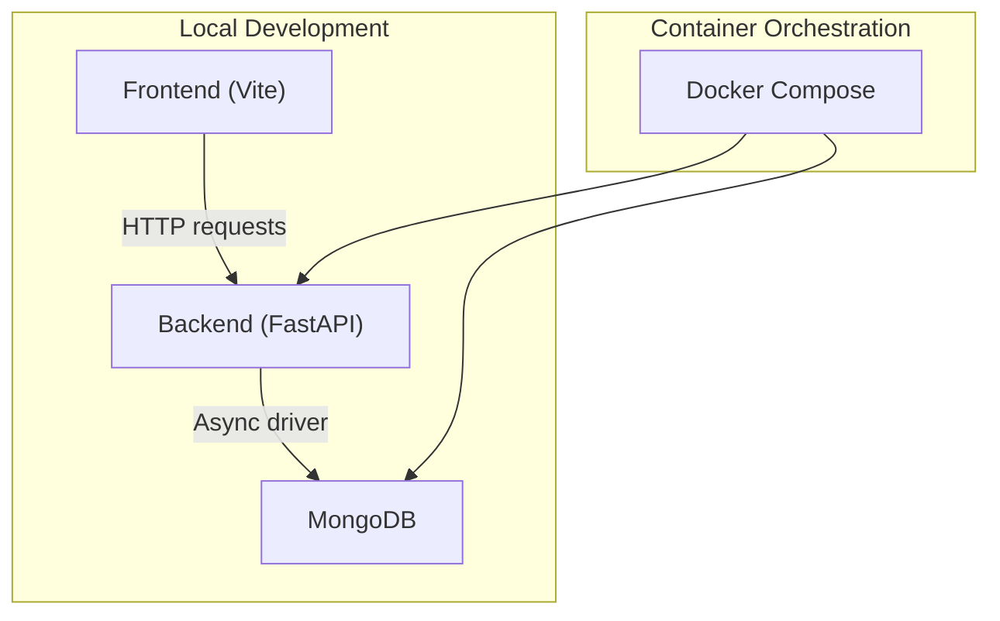
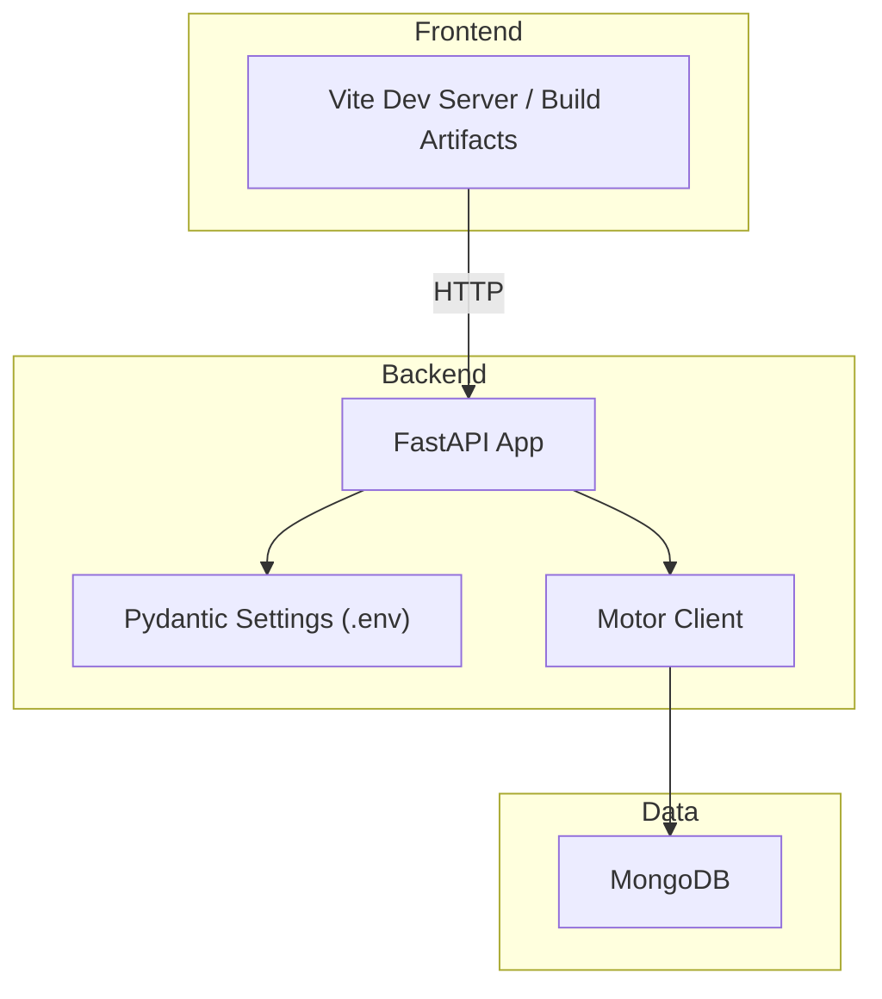
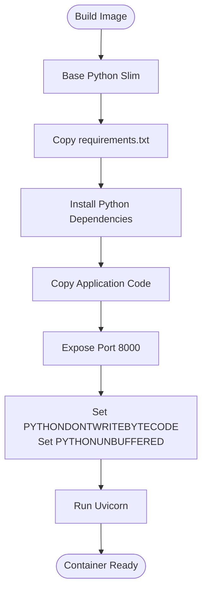
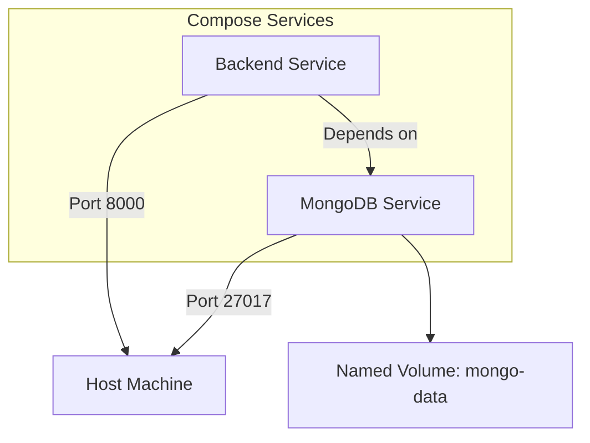
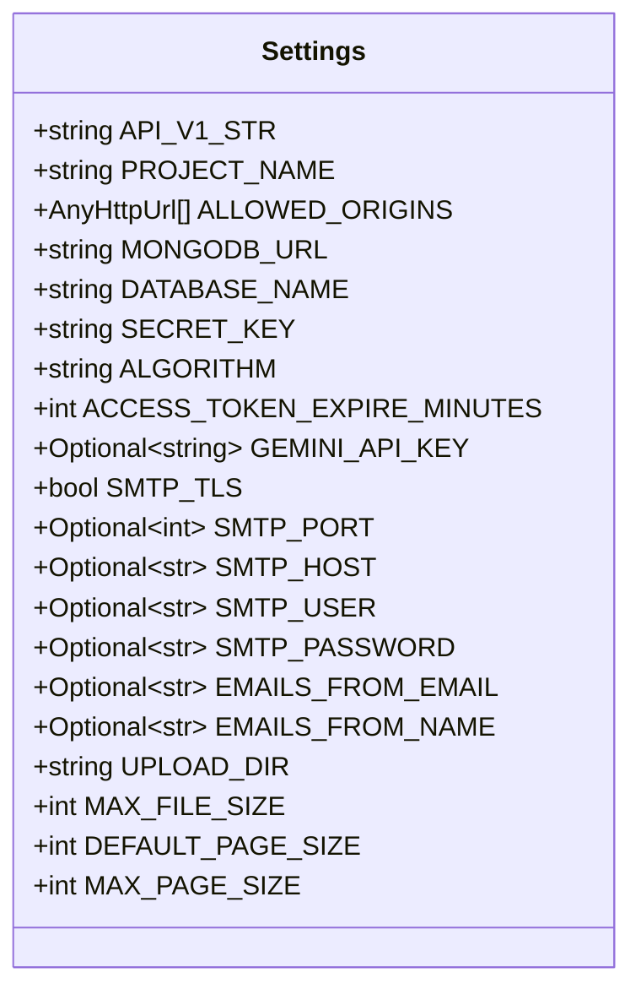
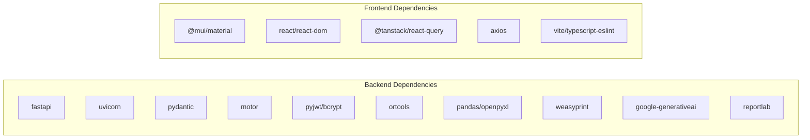

# Deployment and Operations

<cite>
**Referenced Files in This Document**
- [Dockerfile](file://backend/Dockerfile)
- [docker-compose.yml](file://backend/docker-compose.yml)
- [requirements.txt](file://backend/requirements.txt)
- [config.py](file://backend/app/core/config.py)
- [main.py](file://backend/app/main.py)
- [mongodb.py](file://backend/app/db/mongodb.py)
- [start-backend.ps1](file://start-backend.ps1)
- [start-fullstack.ps1](file://start-fullstack.ps1)
- [package.json](file://frontend/package.json)
</cite>

## Table of Contents
1. [Introduction](#introduction)
2. [Project Structure](#project-structure)
3. [Core Components](#core-components)
4. [Architecture Overview](#architecture-overview)
5. [Detailed Component Analysis](#detailed-component-analysis)
6. [Dependency Analysis](#dependency-analysis)
7. [Performance Considerations](#performance-considerations)
8. [Troubleshooting Guide](#troubleshooting-guide)
9. [Conclusion](#conclusion)
10. [Appendices](#appendices)

## Introduction
This document provides comprehensive deployment and operations guidance for ShedMaster, focusing on containerization with Docker, environment-specific configurations, Docker Compose for development and production, secrets handling, monitoring and logging, maintenance procedures, scaling, disaster recovery, and troubleshooting. It is designed for both technical and non-technical operators managing academic institution timetabling systems.

## Project Structure
ShedMaster consists of:
- Backend service built with FastAPI, exposing REST APIs and integrating with MongoDB via Motor.
- Frontend built with React/Vite, communicating with the backend API.
- Containerization using a single Dockerfile for the backend and a docker-compose definition for local development.
- Environment configuration managed via Pydantic settings loaded from a .env file.

**Section sources**
- [main.py:1-102](file://backend/app/main.py#L1-L102)
- [docker-compose.yml:1-30](file://backend/docker-compose.yml#L1-L30)

## Core Components
- Backend container image: Python slim base, installed dependencies from requirements.txt, exposes port 8000, runs Uvicorn with the FastAPI app.
- Database connectivity: Async MongoDB connections using Motor with configurable URLs and database names.
- Configuration management: Pydantic settings class loading from .env, supporting CORS, security keys, AI, email, file storage, pagination, and database settings.
- Health and diagnostics: Root endpoint, health check endpoint, CORS test endpoints, and startup/shutdown lifecycle hooks.

Key operational controls:
- Environment variables for database URL, database name, secret key, and optional AI/email settings.
- CORS configuration supports flexible origin lists.
- MongoDB connection attempts with timeouts and graceful fallback behavior during startup.

**Section sources**
- [Dockerfile:1-24](file://backend/Dockerfile#L1-L24)
- [requirements.txt:1-19](file://backend/requirements.txt#L1-L19)
- [config.py:1-61](file://backend/app/core/config.py#L1-L61)
- [mongodb.py:1-41](file://backend/app/db/mongodb.py#L1-L41)
- [main.py:25-102](file://backend/app/main.py#L25-L102)

## Architecture Overview
The system architecture integrates a React frontend with a FastAPI backend, backed by MongoDB. Docker Compose orchestrates the backend service and a MongoDB service for local development. Production deployments can leverage the same container images and extend the orchestration for scalability and resilience.

**Diagram sources**
- [main.py:1-102](file://backend/app/main.py#L1-L102)
- [config.py:1-61](file://backend/app/core/config.py#L1-L61)
- [mongodb.py:1-41](file://backend/app/db/mongodb.py#L1-L41)

**Section sources**
- [main.py:1-102](file://backend/app/main.py#L1-L102)
- [config.py:1-61](file://backend/app/core/config.py#L1-L61)
- [mongodb.py:1-41](file://backend/app/db/mongodb.py#L1-L41)

## Detailed Component Analysis

### Backend Containerization and Multi-stage Builds
- Current backend Dockerfile uses a Python slim base, installs dependencies, copies application code, exposes port 8000, sets environment flags, and runs Uvicorn.
- Recommendation for production: introduce a multi-stage build to reduce image size and attack surface. Example stages:
  - Build stage: install build dependencies, compile assets if needed, cache dependencies.
  - Runtime stage: minimal base image, copy only necessary runtime artifacts and dependencies.
- This improves security posture and reduces pull times in production environments.

**Diagram sources**
- [Dockerfile:1-24](file://backend/Dockerfile#L1-L24)

**Section sources**
- [Dockerfile:1-24](file://backend/Dockerfile#L1-L24)

### Docker Compose Setup for Development and Production
- Development stack includes:
  - Backend service: builds from Dockerfile, maps port 8000, injects environment variables for MongoDB URL, database name, and secret key, mounts backend app code for live reload, depends on MongoDB, restart policy set.
  - MongoDB service: official mongo:5.0 image, publishes port 27017, persists data via named volume.
- Production considerations:
  - Externalize secrets via secure secret management (e.g., Kubernetes Secrets, HashiCorp Vault, or platform-native secret stores).
  - Use environment overrides or separate compose files per environment.
  - Add healthchecks, resource limits, and restart policies aligned with production SLAs.
  - Introduce reverse proxy/load balancer and TLS termination at the edge.

**Diagram sources**
- [docker-compose.yml:1-30](file://backend/docker-compose.yml#L1-L30)

**Section sources**
- [docker-compose.yml:1-30](file://backend/docker-compose.yml#L1-L30)

### Environment Configuration Management
- Settings class loads from .env using Pydantic settings with UTF-8 encoding and relaxed extra variable handling.
- Key settings:
  - API version path and project name.
  - CORS origins list with validator to accept comma-separated strings or arrays.
  - MongoDB URL and database name.
  - Security: secret key, signing algorithm, token expiry.
  - AI: Gemini API key.
  - Email: SMTP host/port/user/password and sender identity.
  - File upload directory, max file size, pagination defaults.
- Recommended practices:
  - Store .env locally for development; avoid committing secrets.
  - For production, inject secrets via environment variables from secret stores or deployment platforms.
  - Validate environment variables at startup and fail fast on missing required values.

**Diagram sources**
- [config.py:1-61](file://backend/app/core/config.py#L1-L61)

**Section sources**
- [config.py:1-61](file://backend/app/core/config.py#L1-L61)

### Secrets Handling
- Current compose passes SECRET_KEY via environment variable; default value is present but insecure.
- Production hardening:
  - Generate strong random secrets and inject via secret managers.
  - Use platform-native secret mounts or environment injection.
  - Rotate secrets regularly and audit access logs.

**Section sources**
- [docker-compose.yml:10-18](file://backend/docker-compose.yml#L10-L18)

### Monitoring and Logging
- Backend logging:
  - MongoDB connection attempts log informational and warning messages.
  - Startup/shutdown lifecycle hooks establish and tear down connections.
  - Validation error handler prints request details and returns structured JSON responses.
- Recommendations:
  - Centralize logs using structured logging (JSON) and forward to ELK/Fluentd/Loki.
  - Add application metrics (e.g., Prometheus-compatible exporter) for latency and throughput.
  - Implement health checks at /health for load balancers and orchestrators.
  - Frontend: capture browser console logs and performance metrics via telemetry SDKs.

**Section sources**
- [mongodb.py:11-41](file://backend/app/db/mongodb.py#L11-L41)
- [main.py:42-54](file://backend/app/main.py#L42-L54)
- [main.py:85-88](file://backend/app/main.py#L85-L88)

### Maintenance Procedures

#### Database Migrations
- Current backend uses Motor for asynchronous MongoDB operations; no migration framework is integrated.
- Recommended approach:
  - Use a lightweight migration library (e.g., a simple collection with version documents) to track schema changes.
  - Apply migrations on startup or via a dedicated migration job.
  - Backward compatibility: support gradual rollout of schema updates.

#### Backup Strategies
- MongoDB backups:
  - Schedule regular logical backups using mongodump or snapshot-based backups depending on storage backend.
  - Encrypt backups at rest and in transit.
  - Test restoration procedures periodically.
- Configuration backups:
  - Version-control non-sensitive configuration files and store sensitive values externally.

#### Performance Optimization
- Backend:
  - Tune Uvicorn workers and threads for CPU-bound tasks; monitor response times and concurrency.
  - Enable connection pooling for MongoDB and set appropriate timeouts.
  - Optimize AI calls (Gemini) with retries and circuit breakers.
- Frontend:
  - Build-time optimizations (tree-shaking, minification, code splitting).
  - CDN for static assets and caching headers.

**Section sources**
- [mongodb.py:11-26](file://backend/app/db/mongodb.py#L11-L26)
- [requirements.txt:1-19](file://backend/requirements.txt#L1-L19)

### Scaling Considerations
- Horizontal scaling:
  - Stateless backend: run multiple replicas behind a load balancer.
  - Use sticky sessions only if required; otherwise rely on shared stateless design.
- Database scaling:
  - Sharding for large collections; replica sets for high availability.
  - Read replicas for reporting queries.
- Caching:
  - Introduce Redis for session storage and frequently accessed data.
- AI workload:
  - Offload heavy AI computations to batch jobs or separate microservices.

### Disaster Recovery Planning
- Recovery objectives:
  - RTO/RPO targets for backend and database.
- Data protection:
  - Automated backups with offsite replication.
  - Point-in-time recovery procedures for MongoDB.
- Testing:
  - Regular DR drills for restore and failover scenarios.
- Documentation:
  - Maintain runbooks for incident response and recovery steps.

### Local Development Scripts
- PowerShell scripts streamline local startup:
  - start-backend.ps1 validates presence of .env, optionally activates a virtual environment, sets environment variables, and starts the FastAPI server with hot reload.
  - start-fullstack.ps1 launches backend and frontend concurrently in separate windows.
- Notes:
  - These scripts are Windows-centric; cross-platform alternatives can be created using shell scripts or Makefiles.

**Section sources**
- [start-backend.ps1:1-35](file://start-backend.ps1#L1-L35)
- [start-fullstack.ps1:1-39](file://start-fullstack.ps1#L1-L39)

## Dependency Analysis
- Backend runtime dependencies include FastAPI, Uvicorn, Pydantic, Motor/Mongo, bcrypt, ortools, pandas, openpyxl, weasyprint, google-generativeai, reportlab, protobuf, and others.
- Frontend dependencies include Material UI, React, TanStack React Query, Axios, and Vite tooling.

**Diagram sources**
- [requirements.txt:1-19](file://backend/requirements.txt#L1-L19)
- [package.json:13-44](file://frontend/package.json#L13-L44)

**Section sources**
- [requirements.txt:1-19](file://backend/requirements.txt#L1-L19)
- [package.json:13-44](file://frontend/package.json#L13-L44)

## Performance Considerations
- Container sizing: allocate adequate CPU/memory to backend and database; enable autoscaling based on CPU utilization and queue length.
- Network: minimize round-trips; batch API calls where feasible.
- Database: use indexes on frequent query filters; limit projection; leverage aggregation pipelines for analytics.
- AI: implement rate limiting and exponential backoff for external API calls; cache results when safe.
- Frontend: lazy-load routes/components; pre-warm critical resources.

## Troubleshooting Guide

Common deployment issues and resolutions:
- MongoDB connection failures:
  - Verify MONGODB_URL and DATABASE_NAME in environment variables.
  - Check network connectivity between backend and MongoDB containers.
  - Confirm credentials and firewall rules for hosted MongoDB instances.
- CORS errors:
  - Ensure ALLOWED_ORIGINS includes frontend origins used by Vite dev server.
  - Validate that the frontend runs on supported ports and the backend allows those origins.
- Health check failures:
  - Confirm /health endpoint responds and database is reachable.
  - Review backend logs for startup exceptions.
- Missing or invalid .env:
  - Ensure .env exists with required keys; use start-backend.ps1 guidance to generate a template.
- Port conflicts:
  - Change mapped ports in docker-compose or stop conflicting services.
- Slow performance:
  - Monitor backend response times and database query performance; adjust worker counts and database indexes.

Operational checks:
- Use /test-cors endpoints to validate cross-origin behavior.
- Validate environment variables at startup and fail fast on missing values.
- Implement structured logging and centralized log aggregation for faster diagnosis.

**Section sources**
- [docker-compose.yml:10-18](file://backend/docker-compose.yml#L10-L18)
- [config.py:14-23](file://backend/app/core/config.py#L14-L23)
- [main.py:56-64](file://backend/app/main.py#L56-L64)
- [mongodb.py:11-32](file://backend/app/db/mongodb.py#L11-L32)
- [start-backend.ps1:6-16](file://start-backend.ps1#L6-L16)

## Conclusion
ShedMaster’s deployment model leverages a straightforward FastAPI backend, MongoDB, and Docker Compose for local development. Production readiness requires hardened secrets management, robust monitoring/logging, scalable infrastructure, and disciplined maintenance practices. The provided guidance enables reliable, secure, and high-performance operations for academic institutions.

## Appendices

### Environment Variables Reference
- MONGODB_URL: MongoDB connection string.
- DATABASE_NAME: Target database name.
- SECRET_KEY: Secret key for signing tokens.
- ALLOWED_ORIGINS: Comma-separated list of allowed origins for CORS.
- GEMINI_API_KEY: Optional AI provider key.
- SMTP_*: Email delivery settings.
- UPLOAD_DIR: Directory for file uploads.
- MAX_FILE_SIZE: Maximum allowed upload size.
- DEFAULT_PAGE_SIZE / MAX_PAGE_SIZE: Pagination limits.

**Section sources**
- [config.py:10-58](file://backend/app/core/config.py#L10-L58)
- [docker-compose.yml:10-18](file://backend/docker-compose.yml#L10-L18)