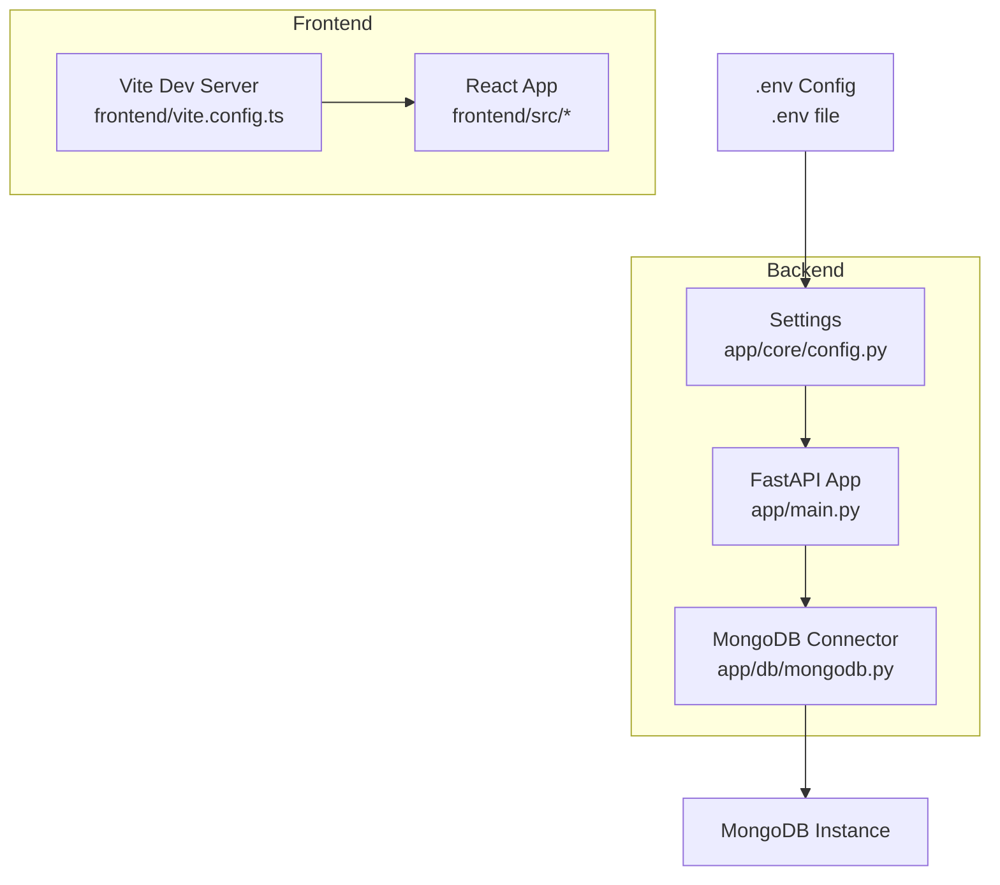

# Development Environment Setup

<cite>
**Referenced Files in This Document**
- [requirements.txt](file://backend/requirements.txt)
- [package.json](file://frontend/package.json)
- [start-backend.ps1](file://start-backend.ps1)
- [start-fullstack.ps1](file://start-fullstack.ps1)
- [config.py](file://backend/app/core/config.py)
- [mongodb.py](file://backend/app/db/mongodb.py)
- [main.py](file://backend/app/main.py)
- [activate.ps1](file://backend/activate.ps1)
- [activate.bat](file://backend/activate.bat)
- [Dockerfile](file://backend/Dockerfile)
- [docker-compose.yml](file://backend/docker-compose.yml)
- [vite.config.ts](file://frontend/vite.config.ts)
- [tsconfig.json](file://frontend/tsconfig.json)
</cite>

## Table of Contents
1. [Introduction](#introduction)
2. [Prerequisites](#prerequisites)
3. [Environment Variables and .env Configuration](#environment-variables-and-env-configuration)
4. [Virtual Environment Setup](#virtual-environment-setup)
5. [Backend Dependencies Installation](#backend-dependencies-installation)
6. [Frontend Dependencies Installation](#frontend-dependencies-installation)
7. [Database Setup](#database-setup)
8. [Starting the Applications](#starting-the-applications)
9. [IDE Setup Recommendations](#ide-setup-recommendations)
10. [Architecture Overview](#architecture-overview)
11. [Platform-Specific Considerations](#platform-specific-considerations)
12. [Troubleshooting Guide](#troubleshooting-guide)
13. [Conclusion](#conclusion)

## Introduction
This document provides a comprehensive guide to set up the development environment for ShedMaster, covering prerequisites, environment configuration, virtual environments, dependency installation, database setup, and application startup. It also includes IDE recommendations, platform-specific considerations, and troubleshooting guidance.

## Prerequisites
- Python 3.9 or higher
- Node.js and npm (for frontend development)
- MongoDB (local or cloud instance)
- PowerShell (Windows) or equivalent shell (macOS/Linux)

These requirements align with the project's configuration and scripts.

**Section sources**
- [requirements.txt:1-19](file://backend/requirements.txt#L1-L19)
- [package.json:1-46](file://frontend/package.json#L1-L46)
- [Dockerfile:1-24](file://backend/Dockerfile#L1-L24)

## Environment Variables and .env Configuration
The backend loads environment variables from a `.env` file using Pydantic settings. Key variables include:
- MONGODB_URL: MongoDB connection string
- SECRET_KEY: Used for JWT signing
- DATABASE_NAME: Target database name
- GEMINI_API_KEY: Optional, for AI features
- Additional settings for CORS, uploads, pagination, and email configuration

The backend configuration defaults to a local MongoDB instance and a development secret key. The startup scripts demonstrate how to set environment variables for local development.

**Section sources**
- [config.py:1-61](file://backend/app/core/config.py#L1-L61)
- [start-backend.ps1:7-16](file://start-backend.ps1#L7-L16)
- [start-backend.ps1:31-32](file://start-backend.ps1#L31-L32)

## Virtual Environment Setup
Create a Python virtual environment in the backend directory and activate it using the provided scripts:
- PowerShell activation script prints guidance for installing dependencies and starting the server.
- Batch activation script automates activation, dependency installation, and server startup.

Recommended steps:
1. Create a virtual environment named `venv` in the backend directory.
2. Use the activation scripts to activate the environment and install dependencies.

**Section sources**
- [activate.ps1:1-8](file://backend/activate.ps1#L1-L8)
- [activate.bat:1-15](file://backend/activate.bat#L1-L15)

## Backend Dependencies Installation
Install Python dependencies using the requirements file. The backend uses FastAPI, Uvicorn, Pydantic, Motor/MongoDB driver, bcrypt, JWT libraries, OR-Tools, pandas, openpyxl, weasyprint, multipart handling, email-validator, google-generativeai, reportlab, protobuf, and python-dotenv.

Installation command:
- pip install -r requirements.txt

**Section sources**
- [requirements.txt:1-19](file://backend/requirements.txt#L1-L19)

## Frontend Dependencies Installation
Install frontend dependencies using npm. The project uses React, TypeScript, Vite, Material-UI, React Router, TanStack React Query, Axios, and related tooling.

Installation commands:
- npm install (installs dependencies and devDependencies)

Build and development commands:
- npm run dev (development server)
- npm run build (TypeScript compilation and Vite build)

**Section sources**
- [package.json:1-46](file://frontend/package.json#L1-L46)
- [vite.config.ts:1-8](file://frontend/vite.config.ts#L1-L8)
- [tsconfig.json:1-8](file://frontend/tsconfig.json#L1-L8)

## Database Setup
The backend connects to MongoDB using Motor (async). The configuration supports:
- Local MongoDB (default)
- Cloud MongoDB Atlas via connection string
- Custom database name

Connection behavior:
- On startup, the application attempts to connect to MongoDB with a timeout.
- If connection fails, the application continues running without database connectivity for testing.

Default settings:
- MONGODB_URL defaults to a local MongoDB instance.
- DATABASE_NAME defaults to a specific database name.

**Section sources**
- [mongodb.py:1-41](file://backend/app/db/mongodb.py#L1-L41)
- [config.py:25-28](file://backend/app/core/config.py#L25-L28)
- [main.py:25-31](file://backend/app/main.py#L25-L31)

## Starting the Applications
Two PowerShell scripts are provided to streamline development:

### Start Backend Only
- Changes to the backend directory
- Checks for `.env` file presence
- Activates the Python virtual environment if available
- Sets environment variables for local MongoDB and Python path
- Starts the FastAPI server with hot reload on port 8000

Expected outputs:
- API documentation available at http://localhost:8000/docs
- Demo login credentials printed during startup

**Section sources**
- [start-backend.ps1:1-35](file://start-backend.ps1#L1-L35)

### Start Full Stack
- Starts backend and frontend concurrently in separate PowerShell windows
- Waits briefly between starting services
- Prints service URLs and instructions

Frontend development server runs on port 5173 (Vite default).

**Section sources**
- [start-fullstack.ps1:1-39](file://start-fullstack.ps1#L1-L39)

## IDE Setup Recommendations
Recommended VS Code extensions for a smooth development experience:
- Prettier (for code formatting)
- ESLint (for JavaScript/TypeScript linting)
- EditorConfig for VS Code (for consistent editor configuration)
- DotENV (for .env file syntax highlighting)
- Python (for Python development)
- ms-python.vscode-pylance (for Python language server)
- ms-python.pylance (for Python type checking)
- ms-python.flake8 (for Python linting)
- ms-toolsai.jupyter (optional, for Jupyter notebooks)

Debugging configurations:
- Backend: Launch Python module uvicorn with arguments pointing to the FastAPI app factory and enable hot reload.
- Frontend: Launch Vite dev server using npm scripts.

Note: Specific launch.json configurations are not included here; use the above extension recommendations and the provided scripts as launch targets.

## Architecture Overview
The development environment consists of:
- Backend: FastAPI application with async MongoDB connectivity
- Frontend: React application built with Vite and TypeScript
- Shared environment configuration via .env and Pydantic settings

**Diagram sources**
- [main.py:1-102](file://backend/app/main.py#L1-L102)
- [config.py:1-61](file://backend/app/core/config.py#L1-L61)
- [mongodb.py:1-41](file://backend/app/db/mongodb.py#L1-L41)
- [vite.config.ts:1-8](file://frontend/vite.config.ts#L1-L8)

## Platform-Specific Considerations
- Windows
  - Use the provided PowerShell scripts for starting services.
  - Ensure PowerShell execution policy allows script execution.
  - The batch activation script automates environment setup and server startup.

- macOS/Linux
  - Use the PowerShell scripts as a reference for commands.
  - Replace PowerShell-specific commands with equivalent shell commands:
    - Use bash/zsh equivalents for script execution.
    - Replace PowerShell variables with shell equivalents.
    - Use the standard Python activation method for virtual environments.

- Cross-platform
  - Verify that Node.js and npm are installed and accessible in PATH.
  - Confirm MongoDB is reachable at the configured URL.

**Section sources**
- [start-backend.ps1:1-35](file://start-backend.ps1#L1-L35)
- [activate.bat:1-15](file://backend/activate.bat#L1-L15)

## Troubleshooting Guide
Common issues and resolutions:
- Missing .env file
  - The backend startup script checks for `.env`. Create the file with required variables before starting the backend.
  - Reference the script output for the minimal required entries.

- MongoDB connection failures
  - Ensure MongoDB is running locally or update MONGODB_URL to point to a valid instance.
  - The backend attempts a ping command; failures are logged but do not prevent startup.

- Port conflicts
  - Backend runs on port 8000; frontend runs on port 5173 by default.
  - Adjust ports in environment variables or configuration if conflicts occur.

- CORS issues
  - The backend allows specific origins for development; ensure frontend requests originate from allowed URLs.

- Python virtual environment activation
  - Use the provided activation scripts to ensure dependencies are installed in the correct environment.

- Node/npm not found
  - Install Node.js and npm; verify installation by running npm commands.

**Section sources**
- [start-backend.ps1:7-16](file://start-backend.ps1#L7-L16)
- [mongodb.py:23-32](file://backend/app/db/mongodb.py#L23-L32)
- [main.py:56-64](file://backend/app/main.py#L56-L64)
- [activate.ps1:6-7](file://backend/activate.ps1#L6-L7)

## Conclusion
By following this guide, you can set up a complete development environment for ShedMaster. Ensure prerequisites are met, configure environment variables, create and activate virtual environments, install dependencies, and start both backend and frontend services using the provided scripts. For platform-specific adjustments, refer to the notes above and adapt commands accordingly.