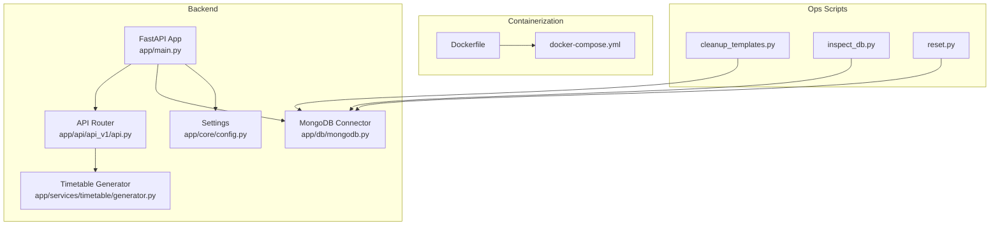
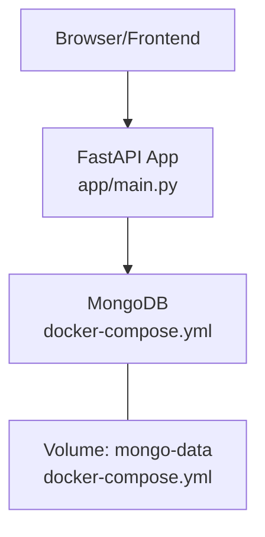
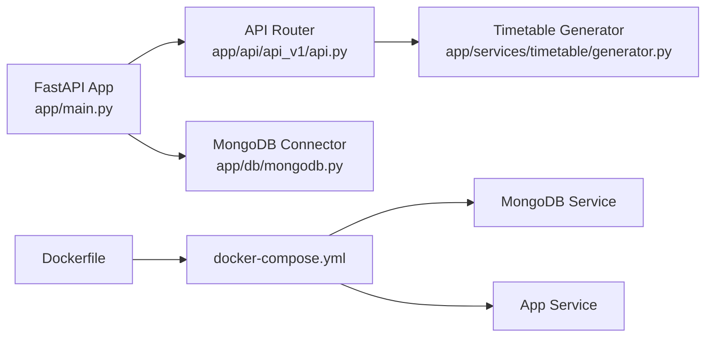

# Maintenance and Operations

<cite>
**Referenced Files in This Document**
- [config.py](file://backend/app/core/config.py)
- [mongodb.py](file://backend/app/db/mongodb.py)
- [main.py](file://backend/app/main.py)
- [docker-compose.yml](file://backend/docker-compose.yml)
- [Dockerfile](file://backend/Dockerfile)
- [requirements.txt](file://backend/requirements.txt)
- [api.py](file://backend/app/api/api_v1/api.py)
- [cleanup_templates.py](file://backend/cleanup_templates.py)
- [inspect_db.py](file://backend/inspect_db.py)
- [reset.py](file://backend/reset.py)
- [generator.py](file://backend/app/services/timetable/generator.py)
</cite>

## Table of Contents
1. [Introduction](#introduction)
2. [Project Structure](#project-structure)
3. [Core Components](#core-components)
4. [Architecture Overview](#architecture-overview)
5. [Detailed Component Analysis](#detailed-component-analysis)
6. [Dependency Analysis](#dependency-analysis)
7. [Performance Considerations](#performance-considerations)
8. [Troubleshooting Guide](#troubleshooting-guide)
9. [Capacity Planning](#capacity-planning)
10. [Disaster Recovery](#disaster-recovery)
11. [Operational Runbooks](#operational-runbooks)
12. [Conclusion](#conclusion)

## Introduction
This document provides comprehensive maintenance and operations guidance for ShedMaster. It covers database maintenance (connection handling, indexing strategies, and monitoring), backup and recovery procedures for MongoDB, system monitoring setup, routine maintenance tasks, troubleshooting for common operational issues, capacity planning, disaster recovery, and operational runbooks for incident response.

## Project Structure
ShedMaster consists of a FastAPI backend with asynchronous MongoDB connectivity via Motor, containerized deployment using Docker Compose, and a frontend built with TypeScript/Vite. The backend exposes REST endpoints under a versioned API path and integrates AI-assisted timetable generation.

**Diagram sources**
- [main.py:1-102](file://backend/app/main.py#L1-L102)
- [config.py:1-61](file://backend/app/core/config.py#L1-L61)
- [mongodb.py:1-41](file://backend/app/db/mongodb.py#L1-L41)
- [api.py:1-34](file://backend/app/api/api_v1/api.py#L1-L34)
- [generator.py:1-200](file://backend/app/services/timetable/generator.py#L1-L200)
- [Dockerfile:1-24](file://backend/Dockerfile#L1-L24)
- [docker-compose.yml:1-30](file://backend/docker-compose.yml#L1-L30)
- [cleanup_templates.py:1-35](file://backend/cleanup_templates.py#L1-L35)
- [inspect_db.py:1-25](file://backend/inspect_db.py#L1-L25)
- [reset.py:1-12](file://backend/reset.py#L1-L12)

**Section sources**
- [main.py:1-102](file://backend/app/main.py#L1-L102)
- [config.py:1-61](file://backend/app/core/config.py#L1-L61)
- [mongodb.py:1-41](file://backend/app/db/mongodb.py#L1-L41)
- [docker-compose.yml:1-30](file://backend/docker-compose.yml#L1-L30)
- [Dockerfile:1-24](file://backend/Dockerfile#L1-L24)
- [requirements.txt:1-19](file://backend/requirements.txt#L1-L19)

## Core Components
- Application lifecycle and startup/shutdown hooks manage MongoDB connections.
- Settings encapsulate environment-driven configuration for API, database, security, and file storage.
- MongoDB connector initializes an AsyncIOMotorClient with a server selection timeout and performs a ping to validate connectivity.
- API router aggregates all endpoint modules under a versioned base path.
- Container orchestration defines two services: the backend app and a MongoDB replica set member, with persistent volume for data.

Key operational implications:
- Graceful startup/shutdown ensures proper resource cleanup.
- Environment variables drive database host, database name, and secrets.
- Health checks and CORS configuration support frontend integration.

**Section sources**
- [main.py:25-39](file://backend/app/main.py#L25-L39)
- [config.py:25-28](file://backend/app/core/config.py#L25-L28)
- [mongodb.py:11-33](file://backend/app/db/mongodb.py#L11-L33)
- [api.py:1-34](file://backend/app/api/api_v1/api.py#L1-L34)
- [docker-compose.yml:4-26](file://backend/docker-compose.yml#L4-L26)

## Architecture Overview
The backend uses an async event loop with FastAPI and connects to MongoDB using Motor. Docker Compose runs the app and a MongoDB service with a named volume for persistence. The frontend communicates with the backend over HTTP.

**Diagram sources**
- [main.py:66-88](file://backend/app/main.py#L66-L88)
- [docker-compose.yml:20-29](file://backend/docker-compose.yml#L20-L29)

**Section sources**
- [main.py:66-88](file://backend/app/main.py#L66-L88)
- [docker-compose.yml:20-29](file://backend/docker-compose.yml#L20-L29)

## Detailed Component Analysis

### Database Connectivity and Lifecycle
- Connection creation sets a server selection timeout and validates connectivity via a ping command.
- On failure, the system logs a warning and continues without raising an exception, enabling partial operation for testing.
- Shutdown closes the connection gracefully and logs disconnection events.

Operational guidance:
- Monitor logs for connection warnings during startup.
- Verify network reachability to the MongoDB host/port configured via environment variables.
- Use the health endpoint to confirm service availability.

**Section sources**
- [mongodb.py:11-33](file://backend/app/db/mongodb.py#L11-L33)
- [mongodb.py:34-41](file://backend/app/db/mongodb.py#L34-L41)
- [main.py:25-31](file://backend/app/main.py#L25-L31)

### Settings and Environment Configuration
- Database URL and database name are configurable via environment variables.
- Security settings include secret key, signing algorithm, and token expiry.
- File upload configuration defines storage directory and maximum file size.
- Pagination defaults are exposed for list endpoints.

Operational guidance:
- Set MONGODB_URL and DATABASE_NAME in production environments.
- Rotate SECRET_KEY periodically and update deployments accordingly.
- Tune DEFAULT_PAGE_SIZE and MAX_PAGE_SIZE to balance UX and performance.

**Section sources**
- [config.py:25-28](file://backend/app/core/config.py#L25-L28)
- [config.py:29-32](file://backend/app/core/config.py#L29-L32)
- [config.py:46-52](file://backend/app/core/config.py#L46-L52)

### API Routing and Endpoint Exposure
- The API router aggregates endpoint modules and prefixes them under the versioned base path.
- This structure supports modular development and clear tagging for OpenAPI documentation.

Operational guidance:
- Use the base path to namespace endpoints consistently.
- Leverage tags for grouping related endpoints in the interactive docs.

**Section sources**
- [api.py:1-34](file://backend/app/api/api_v1/api.py#L1-L34)

### Containerization and Deployment
- Dockerfile builds a Python slim image, installs dependencies, and runs Uvicorn on port 8000.
- docker-compose defines two services: app and mongo, with a named volume for MongoDB data persistence.
- Environment variables are passed to the app service, including database credentials and keys.

Operational guidance:
- Persist mongo-data volume externally for backups.
- Use restart policies for resilience.
- Scale horizontally by adding replicas behind a load balancer.

**Section sources**
- [Dockerfile:1-24](file://backend/Dockerfile#L1-L24)
- [docker-compose.yml:1-30](file://backend/docker-compose.yml#L1-L30)

### Template and Data Cleanup Utilities
- cleanup_templates deletes all timetable templates and optionally timetables to force regeneration with corrected time slots.
- inspect_db writes sample documents from courses, timetable_templates, and faculty to a local file for inspection.
- reset removes specific user records for administrative tasks.

Operational guidance:
- Use cleanup_templates after schema changes or time slot updates.
- Use inspect_db to diagnose data issues and export small samples.
- Use reset cautiously for administrative resets.

**Section sources**
- [cleanup_templates.py:1-35](file://backend/cleanup_templates.py#L1-L35)
- [inspect_db.py:1-25](file://backend/inspect_db.py#L1-L25)
- [reset.py:1-12](file://backend/reset.py#L1-L12)

### Timetable Generation and Data Access Patterns
- The generator loads program, courses, groups, rooms, constraints, and faculty from MongoDB.
- It constructs course and room specifications and applies NEP 2020–aligned rules for slot generation and feasibility checks.

Operational guidance:
- Ensure collections exist and are populated before generation.
- Monitor query performance on large datasets; consider indexing strategies.

**Section sources**
- [generator.py:169-198](file://backend/app/services/timetable/generator.py#L169-L198)

## Dependency Analysis
The backend depends on FastAPI, Motor, Pydantic, and environment configuration. The container orchestrates the app and MongoDB services.

**Diagram sources**
- [main.py:1-102](file://backend/app/main.py#L1-L102)
- [api.py:1-34](file://backend/app/api/api_v1/api.py#L1-L34)
- [mongodb.py:1-41](file://backend/app/db/mongodb.py#L1-L41)
- [generator.py:1-200](file://backend/app/services/timetable/generator.py#L1-L200)
- [Dockerfile:1-24](file://backend/Dockerfile#L1-L24)
- [docker-compose.yml:1-30](file://backend/docker-compose.yml#L1-L30)

**Section sources**
- [requirements.txt:1-19](file://backend/requirements.txt#L1-L19)
- [main.py:1-102](file://backend/app/main.py#L1-L102)
- [docker-compose.yml:1-30](file://backend/docker-compose.yml#L1-L30)

## Performance Considerations
- Asynchronous I/O: Motor enables non-blocking database operations, suitable for concurrent requests.
- Connection handling: A single client instance is reused; ensure timeouts and retry logic are considered at the application level.
- Indexing strategies: Create indexes on frequently queried fields such as program_id, semester, is_active, and ObjectId lookups to improve query performance.
- Pagination: Use the provided pagination defaults to limit payload sizes and reduce latency.
- Logging: Enable structured logging in production to capture slow queries and errors without exposing sensitive data.

[No sources needed since this section provides general guidance]

## Troubleshooting Guide
Common operational issues and resolutions:

- Database connectivity failures
  - Symptoms: Warning logs indicating inability to connect; partial functionality.
  - Actions: Verify MONGODB_URL and DATABASE_NAME; check network/firewall; confirm MongoDB service availability; review container logs.
  - References: [mongodb.py:28-32](file://backend/app/db/mongodb.py#L28-L32)

- Slow or failing timetable generation
  - Symptoms: Long response times or timeouts.
  - Actions: Inspect query patterns; add indexes on program_id, semester, is_active; validate dataset sizes; monitor logs for exceptions.
  - References: [generator.py:169-198](file://backend/app/services/timetable/generator.py#L169-L198)

- Health check failures
  - Symptoms: Health endpoint returns unhealthy status.
  - Actions: Confirm service is reachable; check startup logs; validate environment variables.
  - References: [main.py:85-88](file://backend/app/main.py#L85-L88)

- CORS errors
  - Symptoms: Cross-origin request blocked.
  - Actions: Ensure frontend origin is allowed; verify CORS middleware configuration.
  - References: [main.py:56-64](file://backend/app/main.py#L56-L64)

- Data inspection and cleanup
  - Use inspect_db to export small samples; use cleanup_templates to reset templates; use reset for targeted user removal.
  - References: [inspect_db.py:1-25](file://backend/inspect_db.py#L1-L25), [cleanup_templates.py:1-35](file://backend/cleanup_templates.py#L1-L35), [reset.py:1-12](file://backend/reset.py#L1-L12)

**Section sources**
- [mongodb.py:28-32](file://backend/app/db/mongodb.py#L28-L32)
- [generator.py:169-198](file://backend/app/services/timetable/generator.py#L169-L198)
- [main.py:85-88](file://backend/app/main.py#L85-L88)
- [main.py:56-64](file://backend/app/main.py#L56-L64)
- [inspect_db.py:1-25](file://backend/inspect_db.py#L1-L25)
- [cleanup_templates.py:1-35](file://backend/cleanup_templates.py#L1-L35)
- [reset.py:1-12](file://backend/reset.py#L1-L12)

## Capacity Planning
Guidelines for scaling with increasing academic loads and user growth:

- Database scaling
  - Sharding: Partition collections by program_id or academic year to distribute load.
  - Replica sets: Deploy MongoDB replica sets for high availability and read scaling.
  - Indexes: Add compound indexes on hot query patterns (e.g., program_id + semester + is_active).
- Application scaling
  - Horizontal pod scaling: Run multiple backend instances behind a load balancer.
  - Connection pooling: Configure pool limits per instance to avoid overwhelming the database.
- Monitoring
  - Track query latency, connection counts, and memory usage; alert on thresholds.
- Storage
  - Plan for increased document sizes due to larger timetables and templates; provision adequate disk space.

[No sources needed since this section provides general guidance]

## Disaster Recovery
Disaster recovery and business continuity measures:

- Automated backups
  - Schedule regular MongoDB logical backups using mongodump; store artifacts offsite or in cloud storage.
  - Automate backups via cron jobs or Kubernetes CronJobs; retain retention windows per policy.
- Replication and failover
  - Use MongoDB replica sets with automatic failover; test failover procedures regularly.
  - Ensure secondary nodes are healthy and synchronized.
- Restoration process
  - Validate backups periodically; restore to a staging environment first; verify data integrity and application connectivity.
  - References: [docker-compose.yml:24-26](file://backend/docker-compose.yml#L24-L26)

**Section sources**
- [docker-compose.yml:24-26](file://backend/docker-compose.yml#L24-L26)

## Operational Runbooks

### Backup and Recovery Procedures
- Backup
  - Use mongodump targeting the configured database name; compress and encrypt artifacts; store offsite.
  - Schedule backups nightly with retention of last 14 days and monthly snapshots.
- Restore
  - Stop write traffic to the database; restore from the latest successful backup; verify collections and indexes.
  - Validate application health endpoints post-restore.

[No sources needed since this section provides general guidance]

### Routine Maintenance Tasks
- Log rotation
  - Configure logrotate or container log driver policies to prevent disk exhaustion.
- Database cleanup
  - Periodically prune unused templates and timetables; archive historical data to separate collections or databases.
  - References: [cleanup_templates.py:18-24](file://backend/cleanup_templates.py#L18-L24)
- Template management
  - After schema changes, run cleanup_templates to regenerate templates with correct time slots.
  - References: [cleanup_templates.py:26-31](file://backend/cleanup_templates.py#L26-L31)

**Section sources**
- [cleanup_templates.py:18-31](file://backend/cleanup_templates.py#L18-L31)

### Monitoring Setup
- Logging
  - Enable structured logging in production; ship logs to centralized logging systems.
- Metrics
  - Expose metrics endpoints or integrate with Prometheus; track request rates, latency, error rates, and database query durations.
- Alerting
  - Configure alerts for health check failures, database connectivity issues, and high latency.

[No sources needed since this section provides general guidance]

### Incident Response Runbook
- Immediate actions
  - Check health endpoint; verify database connectivity logs; confirm service uptime.
- Escalation
  - If database connectivity fails, isolate the issue to network or MongoDB service; restore from backup if necessary.
- Postmortem
  - Document root cause, remediation steps, and preventive measures.

[No sources needed since this section provides general guidance]

## Conclusion
This guide consolidates ShedMaster’s operational practices for database maintenance, monitoring, backups, and incident response. By following the recommended procedures—especially around connection handling, indexing, backups, and capacity planning—you can maintain a reliable, scalable, and resilient timetable generation platform.