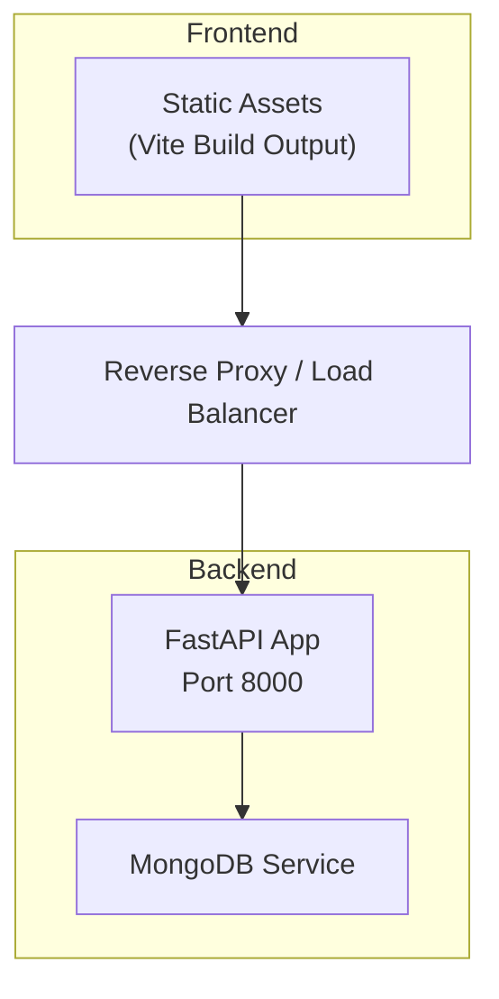
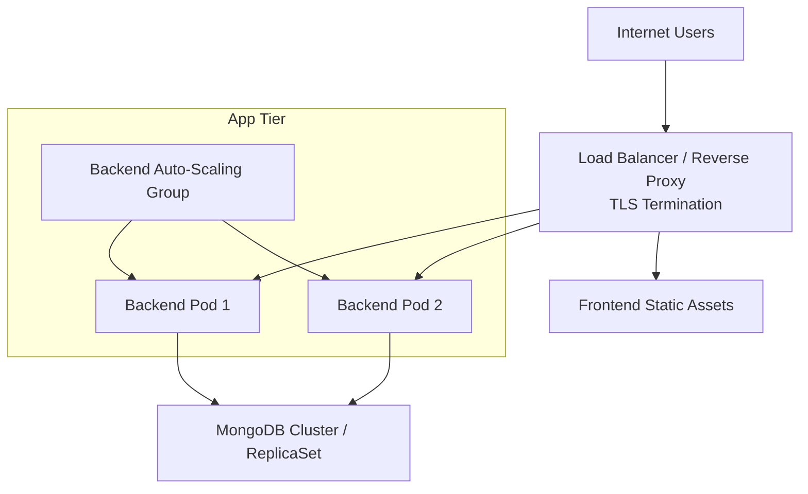
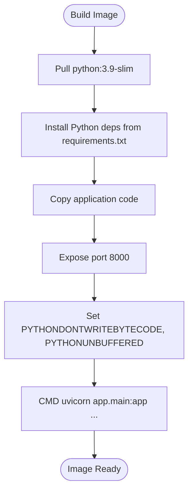
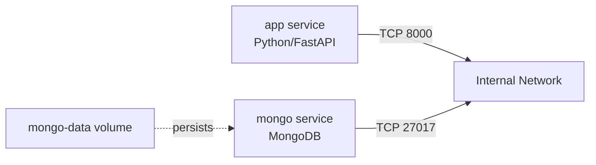
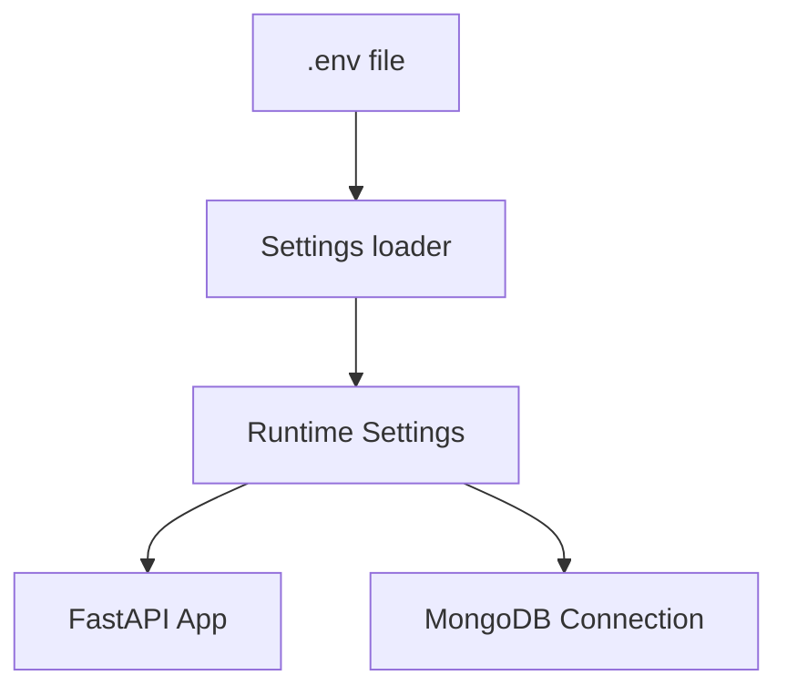
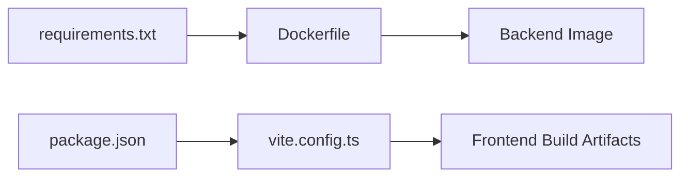

# Production Deployment

<cite>
**Referenced Files in This Document**
- [Dockerfile](file://backend/Dockerfile)
- [docker-compose.yml](file://backend/docker-compose.yml)
- [requirements.txt](file://backend/requirements.txt)
- [config.py](file://backend/app/core/config.py)
- [main.py](file://backend/app/main.py)
- [vite.config.ts](file://frontend/vite.config.ts)
- [package.json](file://frontend/package.json)
</cite>

## Table of Contents
1. [Introduction](#introduction)
2. [Project Structure](#project-structure)
3. [Core Components](#core-components)
4. [Architecture Overview](#architecture-overview)
5. [Detailed Component Analysis](#detailed-component-analysis)
6. [Dependency Analysis](#dependency-analysis)
7. [Performance Considerations](#performance-considerations)
8. [Troubleshooting Guide](#troubleshooting-guide)
9. [Conclusion](#conclusion)
10. [Appendices](#appendices)

## Introduction
This document provides production-grade deployment guidance for ShedMaster, covering containerization, orchestration, environment configuration, cloud platforms, CI/CD, load balancing, health checks, auto-scaling, security, and validation/rollback procedures. It synthesizes the existing backend and frontend configurations present in the repository to produce actionable, repeatable deployment practices.

## Project Structure
ShedMaster consists of:
- Backend: Python/FastAPI application with MongoDB connectivity, exposed on port 8000 via Uvicorn.
- Frontend: React application built with Vite, intended to serve static assets behind a reverse proxy.
- Orchestration: Docker Compose for local development and a foundation for production orchestration.

**Section sources**
- [docker-compose.yml:1-30](file://backend/docker-compose.yml#L1-L30)
- [Dockerfile:1-24](file://backend/Dockerfile#L1-L24)
- [main.py:66-88](file://backend/app/main.py#L66-L88)

## Core Components
- Backend service
  - Container base image: Python slim
  - Dependencies installed from requirements.txt
  - Application runs via Uvicorn on port 8000
  - Environment variables for database connection, secret key, and API prefix
- MongoDB service
  - Official MongoDB image with persistent volume
- Frontend build
  - Vite-based React app; production build generates static assets
- Reverse proxy
  - Recommended to terminate TLS and route traffic to backend

Key configuration locations:
- Backend settings and environment loading
- Health check endpoint
- CORS configuration for development and production hardening

**Section sources**
- [Dockerfile:1-24](file://backend/Dockerfile#L1-L24)
- [requirements.txt:1-19](file://backend/requirements.txt#L1-L19)
- [docker-compose.yml:10-18](file://backend/docker-compose.yml#L10-L18)
- [config.py:7-61](file://backend/app/core/config.py#L7-L61)
- [main.py:85-88](file://backend/app/main.py#L85-L88)

## Architecture Overview
The production architecture centers on a reverse proxy terminating HTTPS and routing to backend instances, with MongoDB as the data store. The frontend is served as static assets via the proxy.

[No sources needed since this diagram shows conceptual workflow, not actual code structure]

## Detailed Component Analysis

### Backend Containerization Strategy
- Multi-stage build recommendation
  - Stage 1: Build dependencies in a full image (e.g., python:3.9)
  - Stage 2: Copy only necessary runtime artifacts into python:3.9-slim
  - Benefits: smaller attack surface, faster cold starts, reduced maintenance
- Current state
  - Single-stage build using python:3.9-slim with pip install from requirements.txt
  - Application runs via Uvicorn on port 8000
- Security hardening
  - Run as non-root user
  - Drop unnecessary capabilities
  - Pin dependency versions
  - Enable read-only root filesystem except logs/cache dirs
- Resource limits
  - CPU/memory requests/limits for horizontal scaling predictability
- Health checks
  - Use GET /health for liveness/readiness probes

**Diagram sources**
- [Dockerfile:1-24](file://backend/Dockerfile#L1-L24)
- [requirements.txt:1-19](file://backend/requirements.txt#L1-L19)

**Section sources**
- [Dockerfile:1-24](file://backend/Dockerfile#L1-L24)
- [requirements.txt:1-19](file://backend/requirements.txt#L1-L19)

### Docker Compose Orchestration (Development to Production Baseline)
- Services
  - app: Builds from Dockerfile, exposes 8000, mounts backend code for hot reload, depends on mongo
  - mongo: Official image with persistent volume
- Networking
  - Use a dedicated compose network for service discovery
- Secrets and environment
  - Mount .env file or use Compose secrets for sensitive keys
- Persistence
  - Named volume for MongoDB data

**Diagram sources**
- [docker-compose.yml:3-29](file://backend/docker-compose.yml#L3-L29)

**Section sources**
- [docker-compose.yml:1-30](file://backend/docker-compose.yml#L1-L30)

### Environment Configuration Management
- Settings model
  - Loads from .env via pydantic-settings
  - Includes API prefix, CORS origins, MongoDB URL, database name, JWT secret, AI and email settings
- Runtime overrides
  - Use environment variables to override defaults
  - CORS origins configurable via comma-separated string
- Secrets handling
  - Store SECRET_KEY, MONGODB_URL, GEMINI_API_KEY in secrets manager or Compose secrets
  - Avoid committing secrets to source control
- SSL/TLS
  - Terminate TLS at reverse proxy; backend listens on HTTP
  - Configure HTTPS redirection if needed at proxy level
- Reverse proxy configuration
  - Route /api/v1 to backend
  - Serve frontend static assets from a dedicated path
  - Enforce HTTPS and security headers

**Diagram sources**
- [config.py:7-61](file://backend/app/core/config.py#L7-L61)

**Section sources**
- [config.py:7-61](file://backend/app/core/config.py#L7-L61)
- [main.py:56-64](file://backend/app/main.py#L56-L64)

### Cloud Platform Deployment Strategies (AWS, Azure, GCP)
- AWS
  - ECS with Fargate: Define task definition with backend and mongo; use secrets manager for credentials; attach ALB for ingress
  - EKS: Deploy Helm charts or K8s manifests; manage ConfigMaps/Secrets; expose via NLB or ALB
- Azure
  - Container Instances or AKS; use Azure Key Vault; Application Gateway for WAF and TLS termination
  - Azure Web Apps for Containers with MongoDB Atlas
- GCP
  - Cloud Run (backend) + Cloud SQL / MongoDB Atlas; or GKE with managed MongoDB
  - Cloud Load Balancing with SSL certificates managed by Google-managed certs

[No sources needed since this section provides general guidance]

### CI/CD Pipeline Setup
- Build stages
  - Lint and test backend and frontend
  - Build Docker images with versioned tags
- Security scanning
  - Scan images with Trivy/Snyk; fail on high/critical issues
- Release stages
  - Deploy to staging; run smoke tests and manual approval
  - Deploy to production with canary or blue/green rollout
- Rollback
  - Tag previous image; redeploy with automated rollback on failure

[No sources needed since this section provides general guidance]

### Load Balancing, Health Checks, and Auto-Scaling
- Load balancing
  - Use platform LB (ALB/NLB/Azure Load Balancer/Cloud Load Balancing) with sticky sessions if required
- Health checks
  - Liveness: GET /health
  - Readiness: Wait for MongoDB connection established
- Auto-scaling
  - Target CPU utilization or request latency thresholds
  - Minimum/maximum replicas based on workload profile

[No sources needed since this section provides general guidance]

### Security Considerations
- Network policies
  - Restrict inbound traffic to reverse proxy; allow backend-to-Mongo egress only
- Firewall configuration
  - Close ephemeral ports; allow only necessary TCP ports
- Vulnerability scanning
  - Regularly scan container images and dependencies
- Secrets management
  - Use platform-native secrets/store; rotate keys periodically
- Compliance
  - Encrypt data at rest and in transit; audit logs for access

[No sources needed since this section provides general guidance]

## Dependency Analysis
- Backend runtime dependencies are declared in requirements.txt and installed during build
- Frontend dependencies are declared in package.json; production build generates static assets
- Backend settings depend on environment variables loaded at startup

**Diagram sources**
- [requirements.txt:1-19](file://backend/requirements.txt#L1-L19)
- [Dockerfile:1-24](file://backend/Dockerfile#L1-L24)
- [package.json:1-46](file://frontend/package.json#L1-L46)
- [vite.config.ts:1-8](file://frontend/vite.config.ts#L1-L8)

**Section sources**
- [requirements.txt:1-19](file://backend/requirements.txt#L1-L19)
- [package.json:1-46](file://frontend/package.json#L1-L46)

## Performance Considerations
- Optimize container image size and startup time using multi-stage builds
- Tune Uvicorn workers and threads per pod based on CPU cores
- Enable connection pooling to MongoDB and reuse HTTP clients
- Cache static assets aggressively at the reverse proxy
- Monitor and scale based on CPU, memory, and request latency metrics

[No sources needed since this section provides general guidance]

## Troubleshooting Guide
- Health probe failures
  - Verify GET /health endpoint responds with healthy status
  - Confirm MongoDB connectivity at startup
- CORS errors
  - Ensure ALLOWED_ORIGINS includes frontend origin
  - Validate wildcard usage and trailing slashes
- Database connectivity
  - Check MONGODB_URL and credentials
  - Confirm replica set connectivity if applicable
- Reverse proxy issues
  - Validate TLS termination and routing rules
  - Confirm static asset serving and API prefix mapping

**Section sources**
- [main.py:85-88](file://backend/app/main.py#L85-L88)
- [config.py:14-23](file://backend/app/core/config.py#L14-L23)
- [docker-compose.yml:10-14](file://backend/docker-compose.yml#L10-L14)

## Conclusion
This guide outlines a production-ready deployment strategy for ShedMaster, grounded in the existing backend and frontend configurations. By adopting multi-stage container builds, robust environment management, platform-specific orchestration, and comprehensive security and observability practices, teams can reliably operate ShedMaster at scale.

## Appendices
- Deployment checklist
  - Build and scan images
  - Deploy infrastructure (LB, DB, secrets)
  - Deploy backend with health checks and autoscaling
  - Deploy frontend static assets via proxy
  - Validate endpoints and user flows
  - Configure monitoring and alerts
  - Prepare rollback plan

[No sources needed since this section provides general guidance]