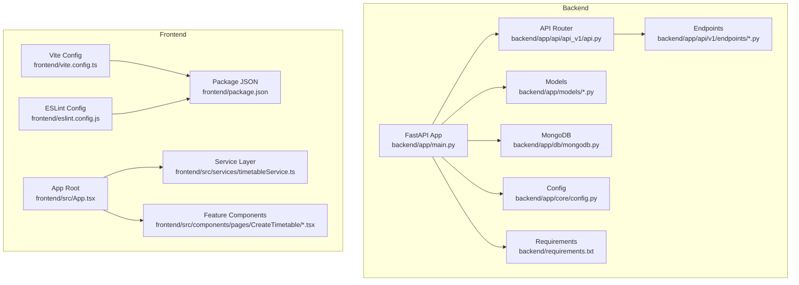
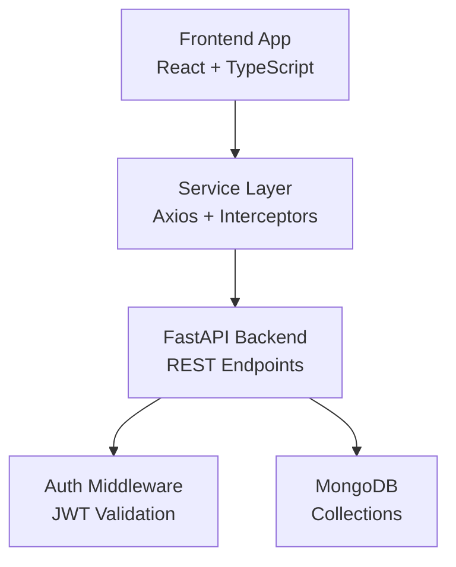
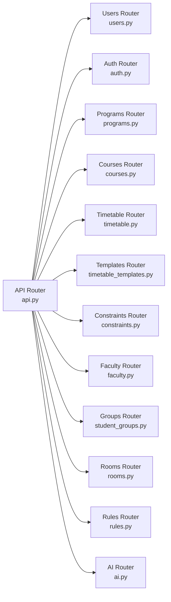
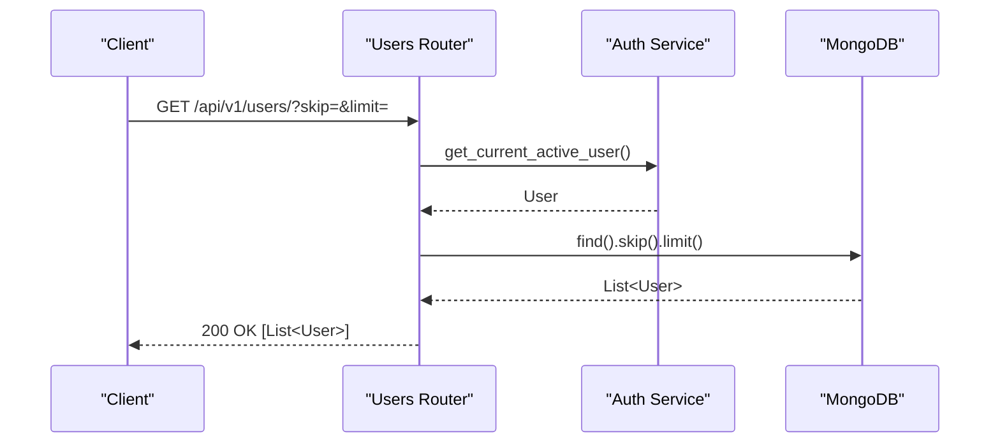
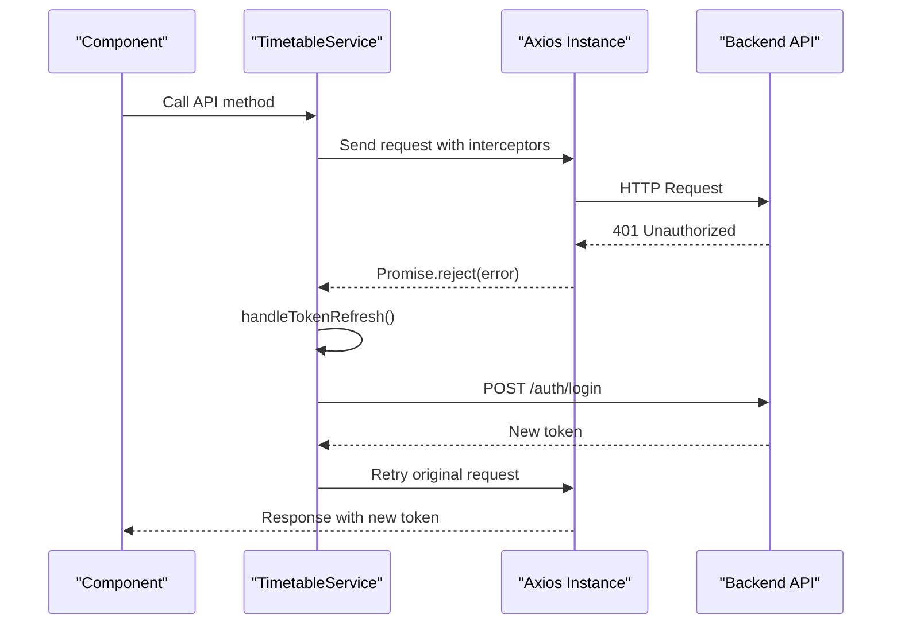
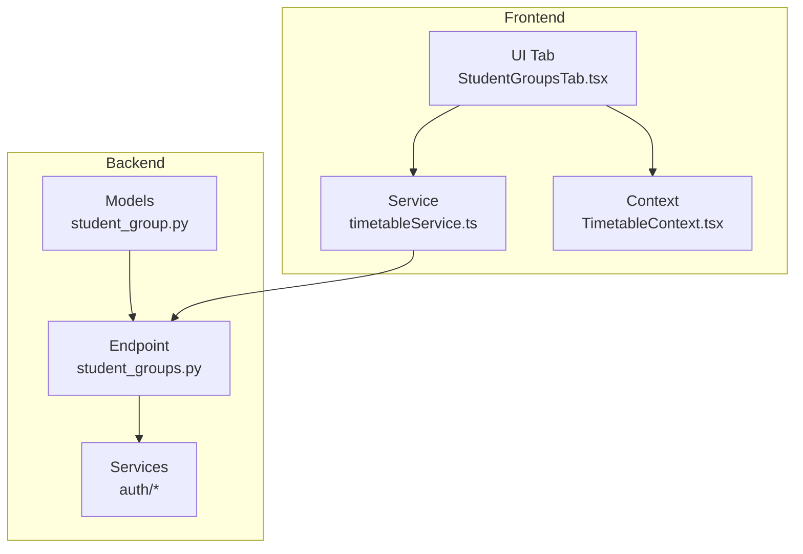
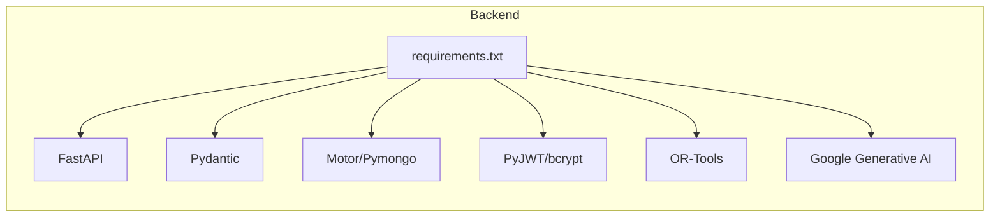

# Developer Guidelines

<cite>
**Referenced Files in This Document**
- [backend/app/main.py](file://backend/app/main.py)
- [backend/app/core/config.py](file://backend/app/core/config.py)
- [backend/app/api/api_v1/api.py](file://backend/app/api/api_v1/api.py)
- [backend/app/api/v1/endpoints/users.py](file://backend/app/api/v1/endpoints/users.py)
- [backend/app/models/user.py](file://backend/app/models/user.py)
- [backend/requirements.txt](file://backend/requirements.txt)
- [frontend/package.json](file://frontend/package.json)
- [frontend/eslint.config.js](file://frontend/eslint.config.js)
- [frontend/vite.config.ts](file://frontend/vite.config.ts)
- [frontend/src/App.tsx](file://frontend/src/App.tsx)
- [frontend/src/services/timetableService.ts](file://frontend/src/services/timetableService.ts)
- [frontend/src/components/pages/CreateTimetable/StudentGroupsTab.tsx](file://frontend/src/components/pages/CreateTimetable/StudentGroupsTab.tsx)
- [STUDENT_GROUPS_IMPLEMENTATION.md](file://STUDENT_GROUPS_IMPLEMENTATION.md)
- [TASKS.md](file://TASKS.md)
</cite>

## Table of Contents
1. [Introduction](#introduction)
2. [Project Structure](#project-structure)
3. [Core Components](#core-components)
4. [Architecture Overview](#architecture-overview)
5. [Detailed Component Analysis](#detailed-component-analysis)
6. [Dependency Analysis](#dependency-analysis)
7. [Performance Considerations](#performance-considerations)
8. [Troubleshooting Guide](#troubleshooting-guide)
9. [Development Workflow](#development-workflow)
10. [Code Review and Quality Assurance](#code-review-and-quality-assurance)
11. [Testing Requirements](#testing-requirements)
12. [Documentation Standards](#documentation-standards)
13. [Debugging and Profiling](#debugging-and-profiling)
14. [Extending Features and New Functionality](#extending-features-and-new-functionality)
15. [Conclusion](#conclusion)

## Introduction
This document provides comprehensive developer guidelines for contributing to ShedMaster. It covers coding standards for both the Python backend and TypeScript frontend, project structure conventions, naming patterns, architectural principles, development workflow, code review and QA requirements, testing expectations, documentation standards, debugging and profiling techniques, and guidance for extending existing features and implementing new functionality following established patterns.

## Project Structure
ShedMaster follows a clear separation of concerns:
- Backend: FastAPI application with modular API routing, Pydantic models, MongoDB integration, and AI services.
- Frontend: React application with TypeScript, Material-UI, React Router, TanStack Query, and Vite build tooling.
- Shared conventions: RESTful API design, consistent naming, and centralized configuration.

**Diagram sources**
- [backend/app/main.py:1-102](file://backend/app/main.py#L1-L102)
- [backend/app/api/api_v1/api.py:1-34](file://backend/app/api/api_v1/api.py#L1-L34)
- [backend/app/core/config.py:1-61](file://backend/app/core/config.py#L1-L61)
- [backend/requirements.txt:1-19](file://backend/requirements.txt#L1-L19)
- [frontend/vite.config.ts:1-8](file://frontend/vite.config.ts#L1-L8)
- [frontend/eslint.config.js:1-24](file://frontend/eslint.config.js#L1-L24)
- [frontend/package.json:1-46](file://frontend/package.json#L1-L46)
- [frontend/src/App.tsx:1-49](file://frontend/src/App.tsx#L1-L49)
- [frontend/src/services/timetableService.ts:1-772](file://frontend/src/services/timetableService.ts#L1-L772)
- [frontend/src/components/pages/CreateTimetable/StudentGroupsTab.tsx:1-809](file://frontend/src/components/pages/CreateTimetable/StudentGroupsTab.tsx#L1-L809)

**Section sources**
- [backend/app/main.py:1-102](file://backend/app/main.py#L1-L102)
- [backend/app/api/api_v1/api.py:1-34](file://backend/app/api/api_v1/api.py#L1-L34)
- [backend/app/core/config.py:1-61](file://backend/app/core/config.py#L1-L61)
- [backend/requirements.txt:1-19](file://backend/requirements.txt#L1-L19)
- [frontend/package.json:1-46](file://frontend/package.json#L1-L46)
- [frontend/eslint.config.js:1-24](file://frontend/eslint.config.js#L1-L24)
- [frontend/vite.config.ts:1-8](file://frontend/vite.config.ts#L1-L8)
- [frontend/src/App.tsx:1-49](file://frontend/src/App.tsx#L1-L49)

## Core Components
- Backend FastAPI application initializes CORS, registers routers, and handles validation errors.
- Centralized configuration via Pydantic settings for API, database, security, AI, and file storage.
- Modular API routing that includes all domain-specific routers under a single prefix.
- Pydantic models define data schemas and validation rules for MongoDB documents.
- Frontend React application with routing, theming, localization, and state management via React Context and TanStack Query.
- Axios-based service layer encapsulating API calls, interceptors for auth, and mock support toggled by environment.

Key implementation patterns:
- Centralized CORS configuration and lifecycle hooks for MongoDB connection.
- RESTful endpoints with Pydantic models for request/response validation.
- TypeScript interfaces mirroring backend models for type safety.
- Interceptors for automatic auth header injection and 401 handling.

**Section sources**
- [backend/app/main.py:25-102](file://backend/app/main.py#L25-L102)
- [backend/app/core/config.py:7-61](file://backend/app/core/config.py#L7-L61)
- [backend/app/api/api_v1/api.py:1-34](file://backend/app/api/api_v1/api.py#L1-L34)
- [backend/app/models/user.py:1-76](file://backend/app/models/user.py#L1-L76)
- [frontend/src/App.tsx:1-49](file://frontend/src/App.tsx#L1-L49)
- [frontend/src/services/timetableService.ts:161-261](file://frontend/src/services/timetableService.ts#L161-L261)

## Architecture Overview
The system uses a layered architecture:
- Presentation layer (React frontend) communicates with the backend via REST APIs.
- Business logic resides in FastAPI endpoints and services.
- Data access uses Motor/Pymongo with Pydantic models for schema enforcement.
- AI assistance endpoints integrate external providers for optimization and suggestions.

**Diagram sources**
- [frontend/src/services/timetableService.ts:161-261](file://frontend/src/services/timetableService.ts#L161-L261)
- [backend/app/main.py:42-54](file://backend/app/main.py#L42-L54)
- [backend/app/api/api_v1/api.py:1-34](file://backend/app/api/api_v1/api.py#L1-L34)

**Section sources**
- [frontend/src/services/timetableService.ts:161-261](file://frontend/src/services/timetableService.ts#L161-L261)
- [backend/app/main.py:42-54](file://backend/app/main.py#L42-L54)

## Detailed Component Analysis

### Backend API Router Composition
The API router aggregates all domain routers and assigns consistent prefixes and tags for documentation and organization.

**Diagram sources**
- [backend/app/api/api_v1/api.py:6-34](file://backend/app/api/api_v1/api.py#L6-L34)

**Section sources**
- [backend/app/api/api_v1/api.py:1-34](file://backend/app/api/api_v1/api.py#L1-L34)

### User Endpoint Flow
The user endpoints demonstrate consistent patterns: authentication checks, permission validation, CRUD operations, and MongoDB interactions.

**Diagram sources**
- [backend/app/api/v1/endpoints/users.py:11-25](file://backend/app/api/v1/endpoints/users.py#L11-L25)

**Section sources**
- [backend/app/api/v1/endpoints/users.py:1-123](file://backend/app/api/v1/endpoints/users.py#L1-L123)

### Frontend Service Layer Interceptor Flow
The service layer injects auth headers and handles 401 responses by refreshing tokens or redirecting to login.

**Diagram sources**
- [frontend/src/services/timetableService.ts:169-261](file://frontend/src/services/timetableService.ts#L169-L261)

**Section sources**
- [frontend/src/services/timetableService.ts:161-261](file://frontend/src/services/timetableService.ts#L161-L261)

### Student Groups Feature Architecture
The Student Groups feature demonstrates a complete implementation with backend models, endpoints, and frontend UI integration.

**Diagram sources**
- [STUDENT_GROUPS_IMPLEMENTATION.md:32-56](file://STUDENT_GROUPS_IMPLEMENTATION.md#L32-L56)
- [frontend/src/components/pages/CreateTimetable/StudentGroupsTab.tsx:1-809](file://frontend/src/components/pages/CreateTimetable/StudentGroupsTab.tsx#L1-L809)
- [frontend/src/services/timetableService.ts:495-528](file://frontend/src/services/timetableService.ts#L495-L528)

**Section sources**
- [STUDENT_GROUPS_IMPLEMENTATION.md:1-156](file://STUDENT_GROUPS_IMPLEMENTATION.md#L1-L156)
- [frontend/src/components/pages/CreateTimetable/StudentGroupsTab.tsx:1-809](file://frontend/src/components/pages/CreateTimetable/StudentGroupsTab.tsx#L1-L809)
- [frontend/src/services/timetableService.ts:495-528](file://frontend/src/services/timetableService.ts#L495-L528)

## Dependency Analysis
- Backend dependencies include FastAPI, Uvicorn, Pydantic, Motor/Pymongo, bcrypt, JWT, ortools, pandas, openpyxl, WeasyPrint, protobuf, and Google Generative AI.
- Frontend dependencies include React, React DOM, Material-UI, React Router, React Hook Form, ZUSTAND, Axios, React Query, date-fns, and Vite.

**Diagram sources**
- [backend/requirements.txt:1-19](file://backend/requirements.txt#L1-L19)

**Section sources**
- [backend/requirements.txt:1-19](file://backend/requirements.txt#L1-L19)
- [frontend/package.json:13-44](file://frontend/package.json#L13-L44)

## Performance Considerations
- Backend
  - Use pagination parameters to limit result sets.
  - Leverage MongoDB indexing for frequent queries.
  - Minimize payload sizes by avoiding unnecessary fields in responses.
  - Offload heavy computations to background tasks or external services.
- Frontend
  - Prefer lazy loading and code splitting for large components.
  - Use React Query caching and stale-time strategies effectively.
  - Debounce or throttle expensive UI interactions.
  - Avoid unnecessary re-renders by memoizing derived data.

[No sources needed since this section provides general guidance]

## Troubleshooting Guide
Common issues and resolutions:
- CORS errors: Verify allowed origins and methods in backend configuration.
- Authentication failures: Ensure Authorization header is present and valid; check interceptor logs.
- Validation errors: Inspect request bodies and Pydantic error details returned by the backend.
- Database connectivity: Confirm MongoDB connection string and network accessibility.

**Section sources**
- [backend/app/main.py:42-54](file://backend/app/main.py#L42-L54)
- [backend/app/core/config.py:14-23](file://backend/app/core/config.py#L14-L23)
- [frontend/src/services/timetableService.ts:169-261](file://frontend/src/services/timetableService.ts#L169-L261)

## Development Workflow
- Branching strategy
  - Use feature branches prefixed with feature/, fix/, chore/, or docs/.
  - Keep branches focused and small to facilitate reviews.
- Commit messages
  - Use imperative mood: "Add user authentication" not "Added authentication".
  - Include scope: feat(auth): Add JWT login flow.
  - Reference issues: feat(ui): Add dark mode #123.
- Pull requests
  - Squash and merge short feature branches; rebase long-running branches.
  - Include a summary of changes, testing steps, and links to related issues.
  - Ensure CI passes and all reviewers approve before merging.

[No sources needed since this section provides general guidance]

## Code Review and Quality Assurance
- Backend
  - Validate all inputs with Pydantic models; avoid raw dict access.
  - Use type hints consistently; enforce with mypy if configured.
  - Write unit tests for endpoints and services; maintain coverage.
  - Keep exception handlers informative but non-sensitive.
- Frontend
  - Enforce ESLint rules; fix warnings before submitting PRs.
  - Use TypeScript strict mode; avoid any or unknown types where possible.
  - Test components with React Testing Library; cover critical flows.
  - Validate forms with React Hook Form and Material-UI components.

**Section sources**
- [backend/app/models/user.py:1-76](file://backend/app/models/user.py#L1-L76)
- [frontend/eslint.config.js:1-24](file://frontend/eslint.config.js#L1-L24)

## Testing Requirements
- Backend
  - Unit tests for endpoints and services; mock MongoDB operations.
  - Integration tests for critical flows (auth, timetable generation).
  - Coverage targets: >80% for new features; maintain baseline for existing code.
- Frontend
  - Unit tests for services and components; snapshot tests sparingly.
  - End-to-end tests for key user journeys (login, create timetable).
  - Coverage targets: >70% for new components; maintain baseline for existing ones.

[No sources needed since this section provides general guidance]

## Documentation Standards
- API endpoints
  - Document all endpoints with clear descriptions, parameters, and responses.
  - Use OpenAPI/Swagger for auto-generated docs; keep schemas updated.
- Component documentation
  - Include component prop tables and usage examples.
  - Document state transitions and error handling.
- Architectural decisions
  - Record decisions in README or dedicated docs with rationale and trade-offs.

**Section sources**
- [backend/app/main.py:66-88](file://backend/app/main.py#L66-L88)
- [STUDENT_GROUPS_IMPLEMENTATION.md:58-88](file://STUDENT_GROUPS_IMPLEMENTATION.md#L58-L88)

## Debugging and Profiling
- Backend
  - Enable debug mode during development; use structured logging.
  - Utilize FastAPI’s built-in docs and ReDoc for interactive debugging.
  - Profile CPU/memory with cProfile or yep.
- Frontend
  - Use React DevTools and Redux DevTools (if applicable).
  - Monitor network requests and cache behavior with browser devtools.
  - Profile rendering performance with React Profiler.

[No sources needed since this section provides general guidance]

## Extending Features and New Functionality
- Follow established patterns
  - Add new domain routers under app/api/v1/endpoints/ and include them in the main API router.
  - Define Pydantic models in app/models/ with proper validators.
  - Implement CRUD endpoints with consistent permission checks and error handling.
  - Create TypeScript interfaces mirroring backend models in frontend/src/services/timetableService.ts.
- UI integration
  - Place new pages/components under frontend/src/components/pages/ or shared components under frontend/src/components/.
  - Use Material-UI components and follow existing theming and layout patterns.
  - Integrate with React Context and TanStack Query for state management.
- AI services
  - Add new AI endpoints under app/api/v1/endpoints/ai.py and implement service logic in app/services/ai/.
  - Ensure API keys and rate limits are configured via settings.

**Section sources**
- [backend/app/api/api_v1/api.py:6-34](file://backend/app/api/api_v1/api.py#L6-L34)
- [backend/app/models/user.py:1-76](file://backend/app/models/user.py#L1-L76)
- [frontend/src/services/timetableService.ts:1-772](file://frontend/src/services/timetableService.ts#L1-L772)
- [frontend/src/components/pages/CreateTimetable/StudentGroupsTab.tsx:1-809](file://frontend/src/components/pages/CreateTimetable/StudentGroupsTab.tsx#L1-L809)

## Conclusion
These guidelines establish a consistent foundation for developing, reviewing, and maintaining ShedMaster. By adhering to the coding standards, architectural principles, and development practices outlined above, contributors can deliver reliable, maintainable features that integrate seamlessly across the backend and frontend while ensuring a smooth developer experience.