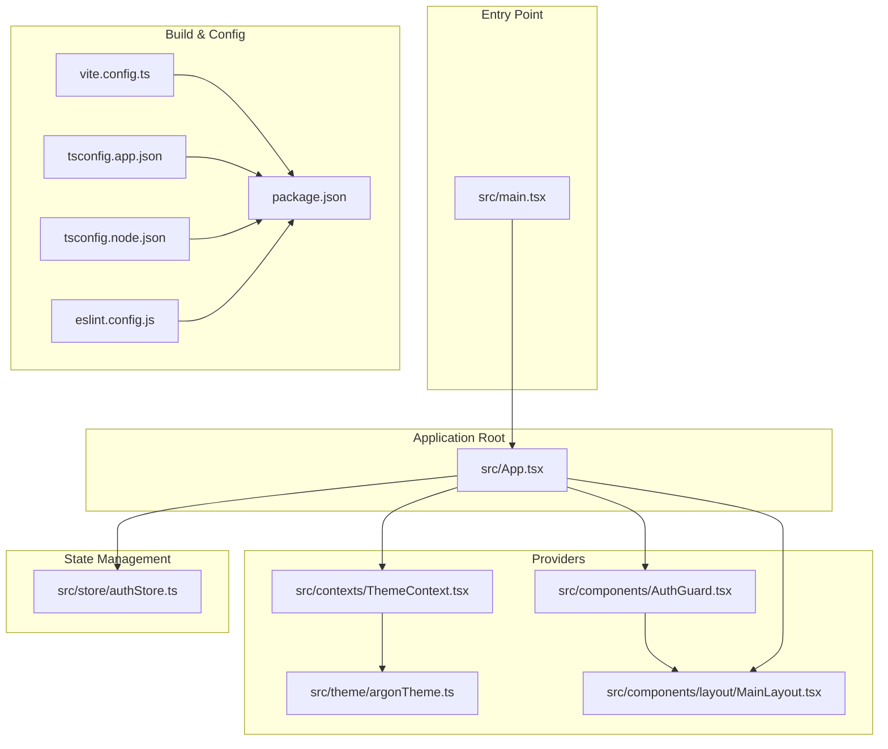
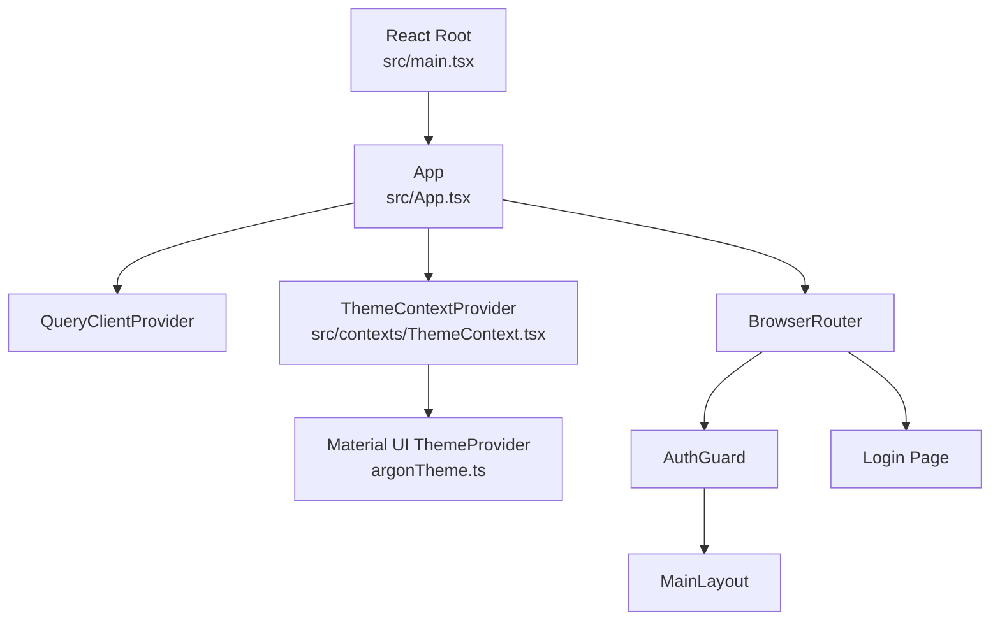
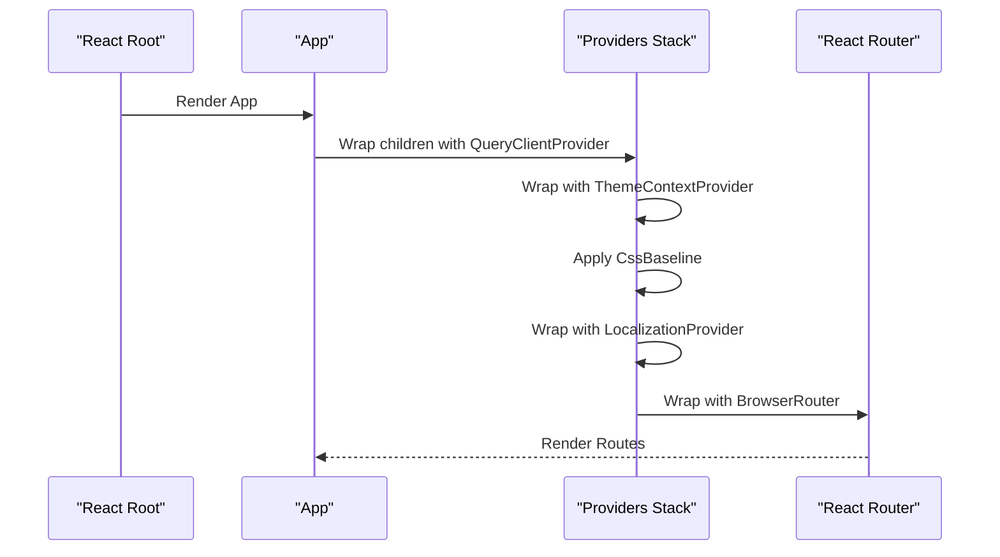
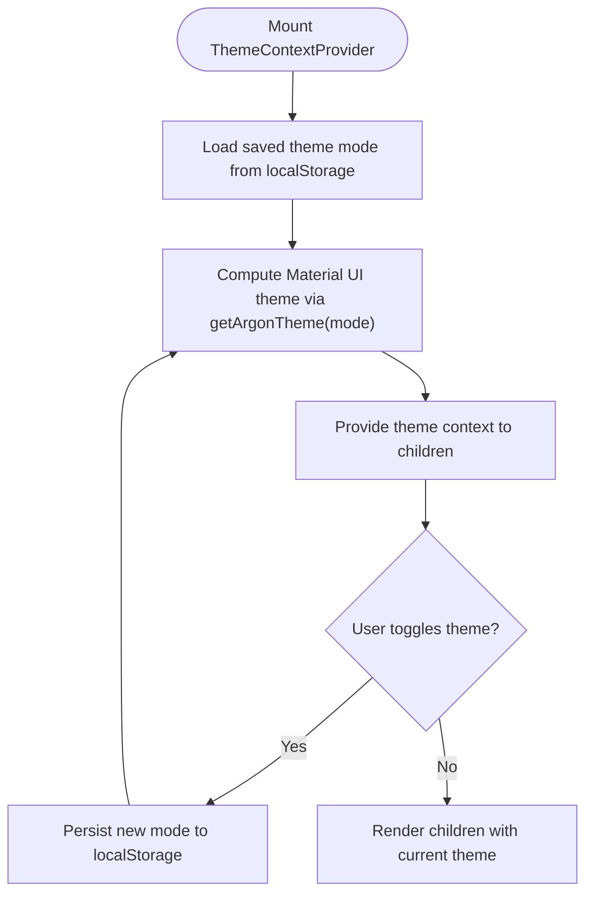
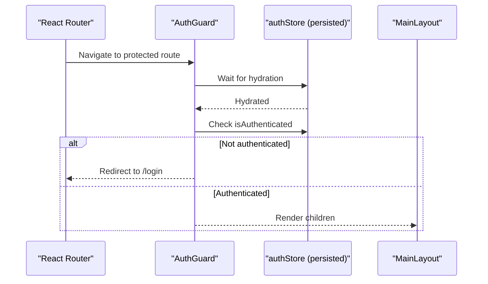
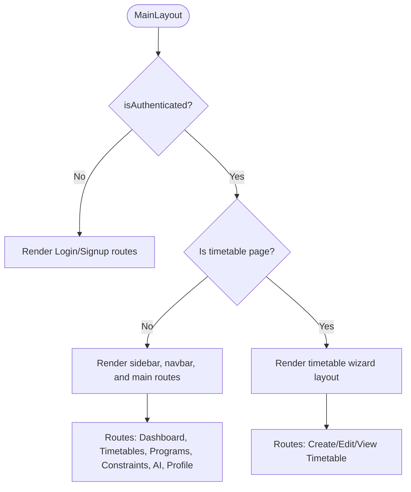
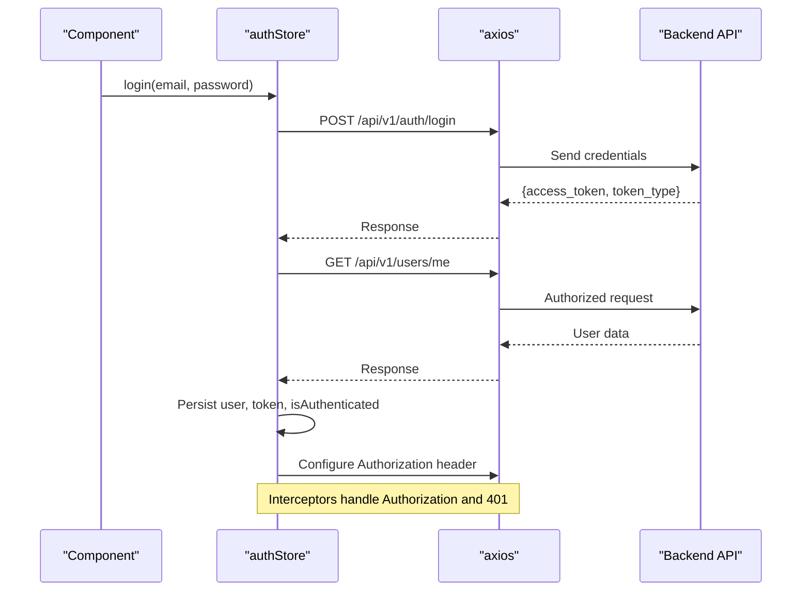
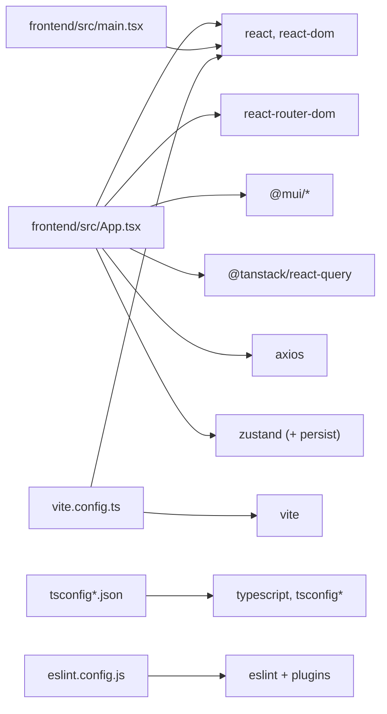

# Application Structure

<cite>
**Referenced Files in This Document**
- [main.tsx](file://frontend/src/main.tsx)
- [App.tsx](file://frontend/src/App.tsx)
- [vite.config.ts](file://frontend/vite.config.ts)
- [package.json](file://frontend/package.json)
- [tsconfig.json](file://frontend/tsconfig.json)
- [tsconfig.app.json](file://frontend/tsconfig.app.json)
- [tsconfig.node.json](file://frontend/tsconfig.node.json)
- [eslint.config.js](file://frontend/eslint.config.js)
- [ThemeContext.tsx](file://frontend/src/contexts/ThemeContext.tsx)
- [argonTheme.ts](file://frontend/src/theme/argonTheme.ts)
- [MainLayout.tsx](file://frontend/src/components/layout/MainLayout.tsx)
- [AuthGuard.tsx](file://frontend/src/components/AuthGuard.tsx)
- [authStore.ts](file://frontend/src/store/authStore.ts)
- [index.css](file://frontend/src/index.css)
- [App.css](file://frontend/src/App.css)
</cite>

## Table of Contents
1. [Introduction](#introduction)
2. [Project Structure](#project-structure)
3. [Core Components](#core-components)
4. [Architecture Overview](#architecture-overview)
5. [Detailed Component Analysis](#detailed-component-analysis)
6. [Dependency Analysis](#dependency-analysis)
7. [Performance Considerations](#performance-considerations)
8. [Troubleshooting Guide](#troubleshooting-guide)
9. [Conclusion](#conclusion)
10. [Appendices](#appendices)

## Introduction
This document explains the frontend application structure built with React 19 and TypeScript, configured with Vite. It covers the application entry point, routing configuration, provider setup, component hierarchy, build configuration, environment considerations, and guidance for extending the structure with additional providers or middleware.

## Project Structure
The frontend is organized around a clear separation of concerns:
- Entry point initializes the React root and renders the root App component.
- App orchestrates providers and routing.
- Layout components manage navigation and page rendering.
- Contexts encapsulate cross-cutting concerns like theming.
- Stores manage application state (authentication).
- Build and linting configurations define the development and production toolchain.

**Diagram sources**
- [main.tsx:1-11](file://frontend/src/main.tsx#L1-L11)
- [App.tsx:1-49](file://frontend/src/App.tsx#L1-L49)
- [ThemeContext.tsx:1-54](file://frontend/src/contexts/ThemeContext.tsx#L1-L54)
- [argonTheme.ts:1-276](file://frontend/src/theme/argonTheme.ts#L1-L276)
- [AuthGuard.tsx:1-32](file://frontend/src/components/AuthGuard.tsx#L1-L32)
- [MainLayout.tsx:1-157](file://frontend/src/components/layout/MainLayout.tsx#L1-L157)
- [authStore.ts:1-248](file://frontend/src/store/authStore.ts#L1-L248)
- [vite.config.ts:1-8](file://frontend/vite.config.ts#L1-L8)
- [package.json:1-46](file://frontend/package.json#L1-L46)
- [tsconfig.app.json:1-28](file://frontend/tsconfig.app.json#L1-L28)
- [tsconfig.node.json:1-26](file://frontend/tsconfig.node.json#L1-L26)
- [eslint.config.js:1-24](file://frontend/eslint.config.js#L1-L24)

**Section sources**
- [main.tsx:1-11](file://frontend/src/main.tsx#L1-L11)
- [vite.config.ts:1-8](file://frontend/vite.config.ts#L1-L8)
- [package.json:1-46](file://frontend/package.json#L1-L46)
- [tsconfig.json:1-8](file://frontend/tsconfig.json#L1-L8)
- [tsconfig.app.json:1-28](file://frontend/tsconfig.app.json#L1-L28)
- [tsconfig.node.json:1-26](file://frontend/tsconfig.node.json#L1-L26)
- [eslint.config.js:1-24](file://frontend/eslint.config.js#L1-L24)

## Core Components
This section documents the main building blocks of the application.

- Application Root and Providers
  - The App component composes providers and routing:
    - React Query provider for caching and data fetching.
    - ThemeContextProvider for theme mode and Material UI theme.
    - Material UI CssBaseline for baseline styles.
    - LocalizationProvider with AdapterDateFns for date pickers.
    - React Router for route definitions.
  - Providers are nested to ensure proper initialization order and scope.

- Routing Configuration
  - BrowserRouter wraps the route tree.
  - Public routes include Login.
  - Protected routes are wrapped with AuthGuard and rendered inside MainLayout.

- Authentication Guard
  - AuthGuard hydrates persisted auth state and redirects unauthenticated users to the login page.

- Theme Context
  - ThemeContextProvider manages theme mode (light/dark) with persistence in localStorage.
  - Uses getArgonTheme to produce Material UI themes for both modes.

- Authentication Store
  - Zustand store with persistence manages user session, login/logout, and axios interceptors for Authorization headers.

**Section sources**
- [App.tsx:1-49](file://frontend/src/App.tsx#L1-L49)
- [AuthGuard.tsx:1-32](file://frontend/src/components/AuthGuard.tsx#L1-L32)
- [ThemeContext.tsx:1-54](file://frontend/src/contexts/ThemeContext.tsx#L1-L54)
- [argonTheme.ts:1-276](file://frontend/src/theme/argonTheme.ts#L1-L276)
- [authStore.ts:1-248](file://frontend/src/store/authStore.ts#L1-L248)

## Architecture Overview
The runtime architecture centers on the App component as the composition root. Providers are layered to support theming, internationalization, data fetching, and routing. The MainLayout component handles authenticated navigation and page rendering, while AuthGuard ensures protected routes remain secure.

**Diagram sources**
- [main.tsx:1-11](file://frontend/src/main.tsx#L1-L11)
- [App.tsx:1-49](file://frontend/src/App.tsx#L1-L49)
- [ThemeContext.tsx:1-54](file://frontend/src/contexts/ThemeContext.tsx#L1-L54)
- [argonTheme.ts:1-276](file://frontend/src/theme/argonTheme.ts#L1-L276)
- [AuthGuard.tsx:1-32](file://frontend/src/components/AuthGuard.tsx#L1-L32)
- [MainLayout.tsx:1-157](file://frontend/src/components/layout/MainLayout.tsx#L1-L157)

## Detailed Component Analysis

### App Component and Provider Composition
The App component defines the provider stack and routing. It initializes a QueryClient for React Query, sets up Material UI CssBaseline, and composes LocalizationProvider with AdapterDateFns. The ThemeContextProvider wraps the entire tree, enabling theme switching and persistence. Finally, React Router defines public and protected routes.

**Diagram sources**
- [main.tsx:1-11](file://frontend/src/main.tsx#L1-L11)
- [App.tsx:1-49](file://frontend/src/App.tsx#L1-L49)

**Section sources**
- [App.tsx:1-49](file://frontend/src/App.tsx#L1-L49)

### ThemeContextProvider and Theme System
ThemeContextProvider manages theme mode and persists it to localStorage. It computes the Material UI theme via getArgonTheme and exposes a toggle function. The argonTheme module defines a premium glassmorphic design system with distinct light and dark palettes, typography, shapes, and component overrides.

**Diagram sources**
- [ThemeContext.tsx:1-54](file://frontend/src/contexts/ThemeContext.tsx#L1-L54)
- [argonTheme.ts:1-276](file://frontend/src/theme/argonTheme.ts#L1-L276)

**Section sources**
- [ThemeContext.tsx:1-54](file://frontend/src/contexts/ThemeContext.tsx#L1-L54)
- [argonTheme.ts:1-276](file://frontend/src/theme/argonTheme.ts#L1-L276)

### AuthGuard and Protected Routes
AuthGuard ensures that authenticated users can access protected routes. It waits for hydration of persisted auth state before deciding whether to render children or redirect to the login page.

**Diagram sources**
- [AuthGuard.tsx:1-32](file://frontend/src/components/AuthGuard.tsx#L1-L32)
- [authStore.ts:1-248](file://frontend/src/store/authStore.ts#L1-L248)

**Section sources**
- [AuthGuard.tsx:1-32](file://frontend/src/components/AuthGuard.tsx#L1-L32)
- [authStore.ts:1-248](file://frontend/src/store/authStore.ts#L1-L248)

### MainLayout Navigation and Page Routing
MainLayout coordinates navigation and page rendering. It conditionally renders either the main dashboard layout or a specialized timetable wizard layout depending on the current path. It also handles logout and integrates with the authentication store.

**Diagram sources**
- [MainLayout.tsx:1-157](file://frontend/src/components/layout/MainLayout.tsx#L1-L157)

**Section sources**
- [MainLayout.tsx:1-157](file://frontend/src/components/layout/MainLayout.tsx#L1-L157)

### Authentication Store and Axios Interceptors
The auth store manages user state, login/logout, and token handling. It persists state to storage and configures axios interceptors to attach Authorization headers and handle 401 responses by logging out the user.

**Diagram sources**
- [authStore.ts:1-248](file://frontend/src/store/authStore.ts#L1-L248)

**Section sources**
- [authStore.ts:1-248](file://frontend/src/store/authStore.ts#L1-L248)

## Dependency Analysis
The frontend relies on a focused set of libraries and tooling:
- React 19 and React DOM for UI rendering.
- React Router for declarative routing.
- Material UI for theming, components, and date pickers.
- React Query for caching and data fetching.
- Zustand for lightweight state management with persistence.
- Vite for build tooling and development server.
- TypeScript for type safety and configuration split across app and node targets.
- ESLint for code quality and React-specific hooks and refresh rules.

**Diagram sources**
- [package.json:1-46](file://frontend/package.json#L1-L46)
- [vite.config.ts:1-8](file://frontend/vite.config.ts#L1-L8)
- [tsconfig.app.json:1-28](file://frontend/tsconfig.app.json#L1-L28)
- [tsconfig.node.json:1-26](file://frontend/tsconfig.node.json#L1-L26)
- [eslint.config.js:1-24](file://frontend/eslint.config.js#L1-L24)

**Section sources**
- [package.json:1-46](file://frontend/package.json#L1-L46)
- [vite.config.ts:1-8](file://frontend/vite.config.ts#L1-L8)
- [tsconfig.json:1-8](file://frontend/tsconfig.json#L1-L8)
- [tsconfig.app.json:1-28](file://frontend/tsconfig.app.json#L1-L28)
- [tsconfig.node.json:1-26](file://frontend/tsconfig.node.json#L1-L26)
- [eslint.config.js:1-24](file://frontend/eslint.config.js#L1-L24)

## Performance Considerations
- Provider ordering matters: Place heavy providers higher in the tree to minimize re-renders. Keep QueryClientProvider near the root to maximize cache sharing.
- Theme computation: ThemeContextProvider computes the theme on each render; ensure theme changes are infrequent to avoid unnecessary re-renders.
- Routing: Use React Router lazy loading for large route bundles to improve initial load performance.
- Build optimization: Leverage Vite's native ES module support and tree-shaking. Keep TypeScript strictness enabled to catch performance-related issues early.
- CSS: Material UI baseline and custom CSS should be scoped to avoid global style conflicts and excessive repaints.

## Troubleshooting Guide
Common issues and resolutions:
- Theme not applying: Verify ThemeContextProvider wraps the application and that localStorage persistence is functioning.
- Authentication loop: Ensure AuthGuard hydration completes before navigation and that the auth store is hydrated from persistence.
- Axios Unauthorized errors: Confirm axios interceptors are registered and that Authorization headers are being set correctly.
- Build failures: Check Vite plugin configuration and TypeScript compiler options for bundler mode and module resolution.

**Section sources**
- [ThemeContext.tsx:1-54](file://frontend/src/contexts/ThemeContext.tsx#L1-L54)
- [AuthGuard.tsx:1-32](file://frontend/src/components/AuthGuard.tsx#L1-L32)
- [authStore.ts:1-248](file://frontend/src/store/authStore.ts#L1-L248)
- [vite.config.ts:1-8](file://frontend/vite.config.ts#L1-L8)
- [tsconfig.app.json:1-28](file://frontend/tsconfig.app.json#L1-L28)

## Conclusion
The frontend application follows a clean, layered architecture with React 19, TypeScript, and Vite. Providers are composed thoughtfully to support theming, routing, internationalization, and state management. The routing model separates public and protected areas, while the authentication store centralizes session handling and integrates with HTTP clients. The configuration files enable a robust development and production pipeline.

## Appendices

### Build Configuration and Environment
- Vite configuration enables the React plugin and serves as the single source of truth for build-time settings.
- Scripts in package.json define dev, build, preview, and lint commands.
- TypeScript configurations split app and node targets for optimal bundler mode and type checking.
- ESLint configuration enforces React hooks and refresh best practices.

**Section sources**
- [vite.config.ts:1-8](file://frontend/vite.config.ts#L1-L8)
- [package.json:1-46](file://frontend/package.json#L1-L46)
- [tsconfig.json:1-8](file://frontend/tsconfig.json#L1-L8)
- [tsconfig.app.json:1-28](file://frontend/tsconfig.app.json#L1-L28)
- [tsconfig.node.json:1-26](file://frontend/tsconfig.node.json#L1-L26)
- [eslint.config.js:1-24](file://frontend/eslint.config.js#L1-L24)

### Extending the Application Structure
To add new providers or middleware:
- Add the provider to the provider stack in App, ensuring it wraps the appropriate scope.
- If persistence is required, integrate with Zustand's persist middleware similarly to the auth store.
- For global CSS or Material UI overrides, extend the existing theme configuration or add new component overrides.
- For routing extensions, define new routes within the existing Router and guard protected routes with AuthGuard.
- For environment variables, define them in the Vite configuration and consume them via import.meta.env in components or stores.

**Section sources**
- [App.tsx:1-49](file://frontend/src/App.tsx#L1-L49)
- [authStore.ts:1-248](file://frontend/src/store/authStore.ts#L1-L248)
- [argonTheme.ts:1-276](file://frontend/src/theme/argonTheme.ts#L1-L276)
- [AuthGuard.tsx:1-32](file://frontend/src/components/AuthGuard.tsx#L1-L32)
- [vite.config.ts:1-8](file://frontend/vite.config.ts#L1-L8)