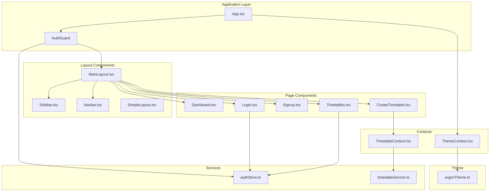
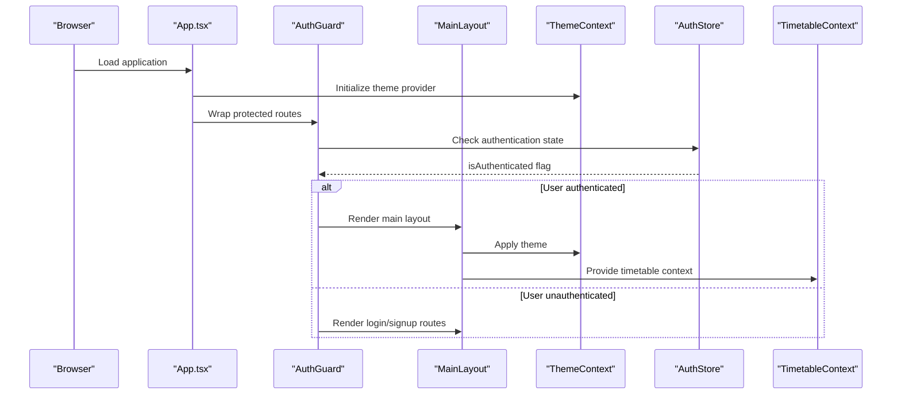
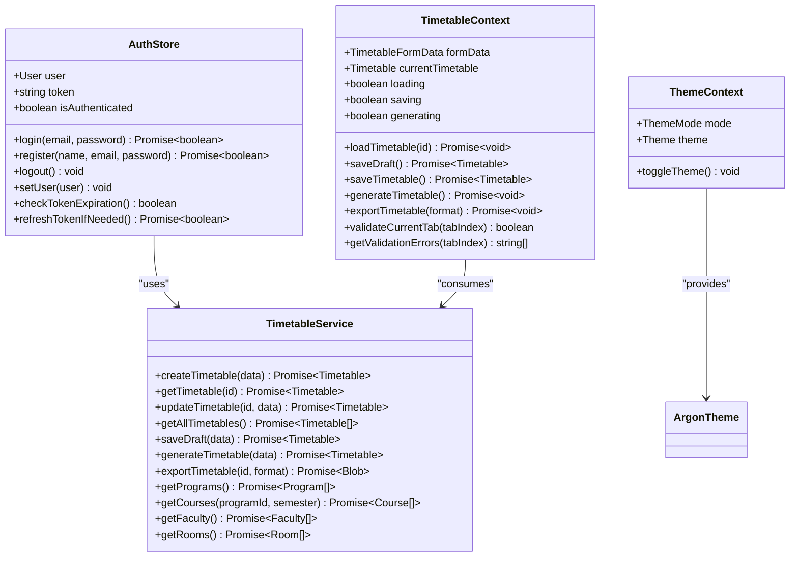
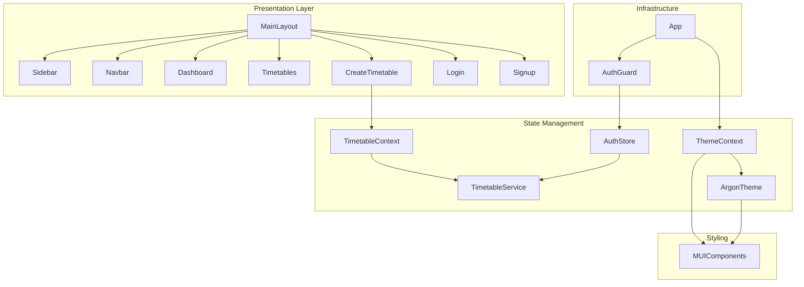

# Component Documentation

<cite>
**Referenced Files in This Document**
- [MainLayout.tsx](file://frontend/src/components/layout/MainLayout.tsx)
- [Navbar.tsx](file://frontend/src/components/layout/Navbar.tsx)
- [Sidebar.tsx](file://frontend/src/components/layout/Sidebar.tsx)
- [SimpleLayout.tsx](file://frontend/src/components/layout/SimpleLayout.tsx)
- [Dashboard.tsx](file://frontend/src/components/pages/Dashboard.tsx)
- [Login.tsx](file://frontend/src/components/pages/Login.tsx)
- [Signup.tsx](file://frontend/src/components/pages/Signup.tsx)
- [CreateTimetable.tsx](file://frontend/src/components/pages/CreateTimetable.tsx)
- [Timetables.tsx](file://frontend/src/components/pages/Timetables.tsx)
- [ThemeContext.tsx](file://frontend/src/contexts/ThemeContext.tsx)
- [TimetableContext.tsx](file://frontend/src/contexts/TimetableContext.tsx)
- [authStore.ts](file://frontend/src/store/authStore.ts)
- [timetableService.ts](file://frontend/src/services/timetableService.ts)
- [argonTheme.ts](file://frontend/src/theme/argonTheme.ts)
- [App.tsx](file://frontend/src/App.tsx)
</cite>

## Table of Contents
1. [Introduction](#introduction)
2. [Project Structure](#project-structure)
3. [Core Components](#core-components)
4. [Architecture Overview](#architecture-overview)
5. [Detailed Component Analysis](#detailed-component-analysis)
6. [Dependency Analysis](#dependency-analysis)
7. [Performance Considerations](#performance-considerations)
8. [Troubleshooting Guide](#troubleshooting-guide)
9. [Conclusion](#conclusion)

## Introduction
This document provides comprehensive documentation for the React component architecture of the academic timetable management system. It covers the main layout components (MainLayout, Navbar, Sidebar, SimpleLayout), page components (Dashboard, Login, Signup, CreateTimetable, Timetables), and supporting infrastructure (authentication, theming, and data contexts). The documentation explains component composition patterns, prop drilling solutions, reusability strategies, Material-UI usage, custom styling, and responsive design implementation. It also includes practical examples for extending and modifying components.

## Project Structure
The frontend follows a feature-based organization with clear separation between layout components, page components, shared contexts, services, and themes. The routing is configured at the application level and guarded by an authentication guard to ensure protected routes are only accessible to authenticated users.

**Diagram sources**
- [App.tsx:1-49](file://frontend/src/App.tsx#L1-L49)
- [MainLayout.tsx:1-157](file://frontend/src/components/layout/MainLayout.tsx#L1-L157)
- [Sidebar.tsx:1-156](file://frontend/src/components/layout/Sidebar.tsx#L1-L156)
- [Navbar.tsx:1-299](file://frontend/src/components/layout/Navbar.tsx#L1-L299)
- [SimpleLayout.tsx:1-47](file://frontend/src/components/layout/SimpleLayout.tsx#L1-L47)
- [Dashboard.tsx:1-193](file://frontend/src/components/pages/Dashboard.tsx#L1-L193)
- [Login.tsx:1-335](file://frontend/src/components/pages/Login.tsx#L1-L335)
- [Signup.tsx:1-248](file://frontend/src/components/pages/Signup.tsx#L1-L248)
- [CreateTimetable.tsx:1-459](file://frontend/src/components/pages/CreateTimetable.tsx#L1-L459)
- [Timetables.tsx:1-529](file://frontend/src/components/pages/Timetables.tsx#L1-L529)
- [ThemeContext.tsx:1-54](file://frontend/src/contexts/ThemeContext.tsx#L1-L54)
- [TimetableContext.tsx:1-629](file://frontend/src/contexts/TimetableContext.tsx#L1-L629)
- [authStore.ts:1-248](file://frontend/src/store/authStore.ts#L1-L248)
- [timetableService.ts:1-772](file://frontend/src/services/timetableService.ts#L1-L772)
- [argonTheme.ts:1-276](file://frontend/src/theme/argonTheme.ts#L1-L276)

**Section sources**
- [App.tsx:1-49](file://frontend/src/App.tsx#L1-L49)
- [MainLayout.tsx:1-157](file://frontend/src/components/layout/MainLayout.tsx#L1-L157)

## Core Components

### MainLayout
MainLayout orchestrates the overall application shell, managing authentication state, route rendering, and layout variants. It conditionally renders either the authenticated dashboard routes with sidebar and navbar or the login/signup routes when unauthenticated. It also handles a specialized "wizard" layout for timetable creation/editing with a fixed header and full-screen content area.

Key responsibilities:
- Authentication gating and redirection
- Conditional layout rendering (standard vs timetable wizard)
- Route management for dashboard and timetable creation
- Theme-aware background gradients and animations
- Responsive drawer toggling and navigation

Props and behavior:
- Uses react-router for route matching and navigation
- Integrates with auth store for user state
- Applies Material-UI theming for backgrounds and gradients
- Implements mobile-responsive drawer behavior

**Section sources**
- [MainLayout.tsx:23-157](file://frontend/src/components/layout/MainLayout.tsx#L23-L157)

### Navbar
Navbar provides the top application bar with responsive design, search functionality, notifications, and user profile management. It integrates with the theme context for dark/light mode switching and includes interactive elements like tooltips, menus, and popovers.

Key features:
- Responsive layout with mobile hamburger menu
- Dynamic page title based on current route
- Search form with controlled input state
- Notifications panel with popover
- User profile dropdown with settings and logout
- Theme toggle with persistent storage

Props and behavior:
- Receives user object, logout handler, and drawer toggle callback
- Uses MUI AppBar, Toolbar, and various interactive components
- Implements controlled state for search and menus
- Integrates with ThemeContext for mode switching

**Section sources**
- [Navbar.tsx:37-299](file://frontend/src/components/layout/Navbar.tsx#L37-L299)

### Sidebar
Sidebar implements a responsive navigation drawer with floating glassmorphism design. It displays menu items with active state highlighting and supports both desktop permanent and mobile temporary drawers.

Key features:
- Floating glass drawer with blur effects
- Active route highlighting with color accents
- Responsive breakpoint handling
- Mobile drawer toggle integration
- Menu item navigation with route transitions

Props and behavior:
- Accepts mobileOpen state and toggle handler
- Uses MUI Drawer with custom styling for glass effect
- Implements active state detection based on current location
- Supports both desktop and mobile navigation patterns

**Section sources**
- [Sidebar.tsx:26-156](file://frontend/src/components/layout/Sidebar.tsx#L26-L156)

### SimpleLayout
SimpleLayout serves as a minimal layout component for testing routing and basic navigation. It provides buttons to navigate between key pages and displays debug information about the current URL.

Usage pattern:
- Ideal for development and testing scenarios
- Demonstrates basic navigation with useNavigate
- Useful for verifying routing configuration

**Section sources**
- [SimpleLayout.tsx:5-47](file://frontend/src/components/layout/SimpleLayout.tsx#L5-L47)

## Architecture Overview

The component architecture follows a layered pattern with clear separation of concerns:

**Diagram sources**
- [App.tsx:21-46](file://frontend/src/App.tsx#L21-L46)
- [MainLayout.tsx:47-58](file://frontend/src/components/layout/MainLayout.tsx#L47-L58)
- [ThemeContext.tsx:28-53](file://frontend/src/contexts/ThemeContext.tsx#L28-L53)
- [authStore.ts:29-207](file://frontend/src/store/authStore.ts#L29-L207)
- [TimetableContext.tsx:260-626](file://frontend/src/contexts/TimetableContext.tsx#L260-L626)

## Detailed Component Analysis

### Authentication and State Management

The authentication system combines Zustand stores with Material-UI theming and axios interceptors for seamless API communication.

**Diagram sources**
- [authStore.ts:15-25](file://frontend/src/store/authStore.ts#L15-L25)
- [ThemeContext.tsx:8-12](file://frontend/src/contexts/ThemeContext.tsx#L8-L12)
- [TimetableContext.tsx:103-140](file://frontend/src/contexts/TimetableContext.tsx#L103-L140)
- [timetableService.ts:161-167](file://frontend/src/services/timetableService.ts#L161-L167)
- [argonTheme.ts:96-271](file://frontend/src/theme/argonTheme.ts#L96-L271)

### Page Components

#### Dashboard
The Dashboard component presents an overview of system metrics and recent activities using Material-UI cards, tables, and progress indicators. It demonstrates responsive grid layouts and interactive elements.

Key features:
- Statistics cards with trend indicators
- Recent activity table with status chips
- Upcoming tasks with progress bars
- System health card with gradient background
- Responsive layout with flexbox and grid

**Section sources**
- [Dashboard.tsx:29-193](file://frontend/src/components/pages/Dashboard.tsx#L29-L193)

#### Login
The Login component implements a modern glassmorphism design with animated backgrounds, form validation, and demo login functionality. It integrates with the auth store for authentication and provides error handling.

Key features:
- Animated gradient background with radial effects
- Glassmorphism card with backdrop blur
- Form validation and error display
- Demo login capability
- Responsive design with controlled inputs

**Section sources**
- [Login.tsx:31-335](file://frontend/src/components/pages/Login.tsx#L31-L335)

#### Signup
The Signup component provides user registration with form validation, password confirmation, and integration with the auth store. It offers a clean, modern form interface with Material-UI components.

Key features:
- Multi-step form validation
- Password visibility toggle
- Error handling and display
- Integration with auth store registration
- Responsive form layout

**Section sources**
- [Signup.tsx:25-248](file://frontend/src/components/pages/Signup.tsx#L25-L248)

#### CreateTimetable
CreateTimetable implements a complex multi-tab wizard for timetable creation with validation, progress tracking, and context-driven state management. It demonstrates advanced React patterns including context providers and dynamic component rendering.

Key features:
- Multi-tab wizard with validation per step
- Progress tracking and completion indicators
- Context-based state management for complex forms
- Draft and save functionality
- View mode for existing timetables
- Integration with timetable service

**Section sources**
- [CreateTimetable.tsx:91-459](file://frontend/src/components/pages/CreateTimetable.tsx#L91-L459)

#### Timetables
The Timetables component manages a collection of timetables with bulk operations, filtering, and CRUD actions. It demonstrates advanced state management with selection handling and dialog-based interactions.

Key features:
- Grid-based timetable listing
- Bulk selection and operations
- Dialog-based confirmation for deletions
- Authentication state management
- Error handling and loading states

**Section sources**
- [Timetables.tsx:37-529](file://frontend/src/components/pages/Timetables.tsx#L37-L529)

### Component Composition Patterns

The application employs several composition patterns to manage complexity and promote reusability:

1. **Higher-Order Context Providers**: MainLayout wraps CreateTimetable with TimetableProvider to supply context to nested components.

2. **Prop Drilling Solutions**: 
   - ThemeContext eliminates prop drilling for theme-related props
   - AuthStore centralizes authentication state
   - TimetableContext consolidates complex form state

3. **Render Props Pattern**: CreateTimetable uses dynamic component rendering based on tab configuration.

4. **Compound Components**: Sidebar and Navbar work together to provide cohesive navigation experience.

**Section sources**
- [CreateTimetable.tsx:449-456](file://frontend/src/components/pages/CreateTimetable.tsx#L449-L456)
- [ThemeContext.tsx:28-53](file://frontend/src/contexts/ThemeContext.tsx#L28-L53)
- [authStore.ts:29-207](file://frontend/src/store/authStore.ts#L29-L207)
- [TimetableContext.tsx:260-626](file://frontend/src/contexts/TimetableContext.tsx#L260-L626)

## Dependency Analysis

The component dependencies form a clear hierarchy with well-defined boundaries:

**Diagram sources**
- [MainLayout.tsx:13-21](file://frontend/src/components/layout/MainLayout.tsx#L13-L21)
- [App.tsx:8-16](file://frontend/src/App.tsx#L8-L16)
- [ThemeContext.tsx:44](file://frontend/src/contexts/ThemeContext.tsx#L44)
- [TimetableContext.tsx:3](file://frontend/src/contexts/TimetableContext.tsx#L3)
- [timetableService.ts:3](file://frontend/src/services/timetableService.ts#L3)

Key dependency characteristics:
- **Low coupling**: Components depend primarily on interfaces and contexts rather than concrete implementations
- **Clear boundaries**: State management, UI presentation, and service layers are well-separated
- **Reactive patterns**: Uses React hooks and context for state propagation
- **Type safety**: Comprehensive TypeScript interfaces for all data structures

**Section sources**
- [App.tsx:1-49](file://frontend/src/App.tsx#L1-L49)
- [MainLayout.tsx:1-157](file://frontend/src/components/layout/MainLayout.tsx#L1-L157)
- [ThemeContext.tsx:1-54](file://frontend/src/contexts/ThemeContext.tsx#L1-L54)
- [TimetableContext.tsx:1-629](file://frontend/src/contexts/TimetableContext.tsx#L1-L629)
- [authStore.ts:1-248](file://frontend/src/store/authStore.ts#L1-L248)
- [timetableService.ts:1-772](file://frontend/src/services/timetableService.ts#L1-L772)

## Performance Considerations

The application implements several performance optimization strategies:

1. **Lazy Loading**: Route-based lazy loading through React.lazy and Suspense
2. **Memoization**: useCallback and useMemo for expensive computations
3. **Virtualization**: Potential for table virtualization in Timetables component
4. **Efficient State Updates**: Granular state updates through context
5. **CSS-in-JS Optimization**: Styled components with memoized theme calculations
6. **Image Optimization**: SVG icons and vector graphics for crisp rendering
7. **Bundle Splitting**: Separate chunks for different feature areas

Responsive design considerations:
- Breakpoint-based responsive layouts
- Mobile-first design approach
- Adaptive component sizing
- Touch-friendly interaction targets

## Troubleshooting Guide

Common issues and solutions:

### Authentication Issues
- **Problem**: Users redirected to login despite being authenticated
- **Solution**: Check localStorage 'auth-storage' persistence and token expiration
- **Debug**: Verify axios interceptors and token refresh logic

### Context Provider Issues
- **Problem**: Context values undefined in components
- **Solution**: Ensure components are wrapped in appropriate providers
- **Debug**: Verify provider order in component tree

### Styling Problems
- **Problem**: Theme not applying correctly
- **Solution**: Check ThemeContextProvider wrapping order
- **Debug**: Verify theme mode persistence in localStorage

### Performance Issues
- **Problem**: Slow component rendering
- **Solution**: Implement React.memo for heavy components
- **Debug**: Use React DevTools Profiler for bottleneck identification

**Section sources**
- [authStore.ts:135-196](file://frontend/src/store/authStore.ts#L135-L196)
- [ThemeContext.tsx:28-53](file://frontend/src/contexts/ThemeContext.tsx#L28-L53)
- [TimetableContext.tsx:260-626](file://frontend/src/contexts/TimetableContext.tsx#L260-L626)

## Conclusion

The React component architecture demonstrates a mature, scalable approach to building complex web applications. The combination of Material-UI components, TypeScript interfaces, and modern React patterns creates a maintainable and extensible codebase. Key strengths include:

- **Clear separation of concerns** with well-defined component boundaries
- **Comprehensive state management** through context and stores
- **Responsive design** with adaptive layouts
- **Type safety** throughout the application
- **Extensibility** through modular component design

The architecture supports future enhancements including advanced analytics, additional wizards, and expanded timetable features while maintaining code quality and developer productivity.