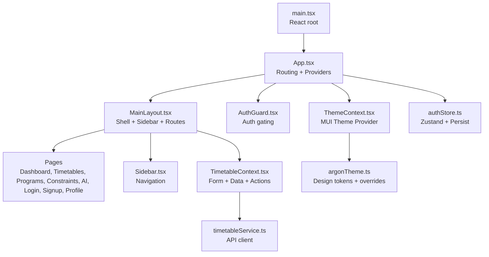
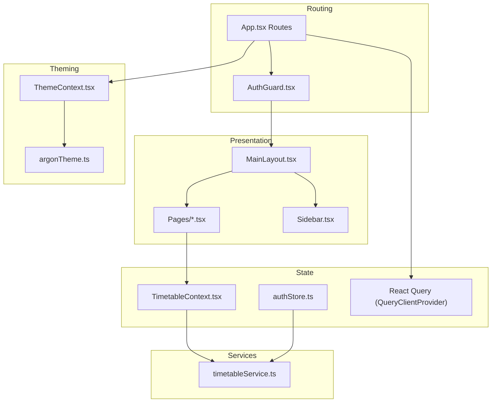
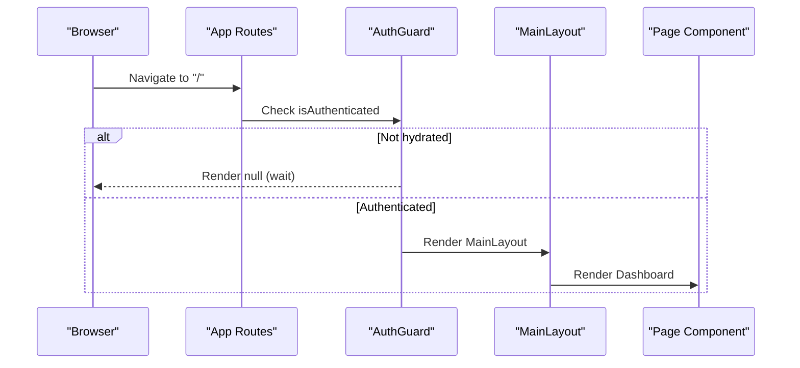
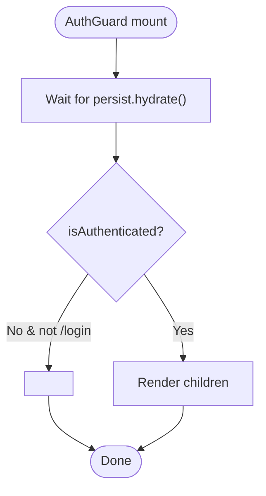
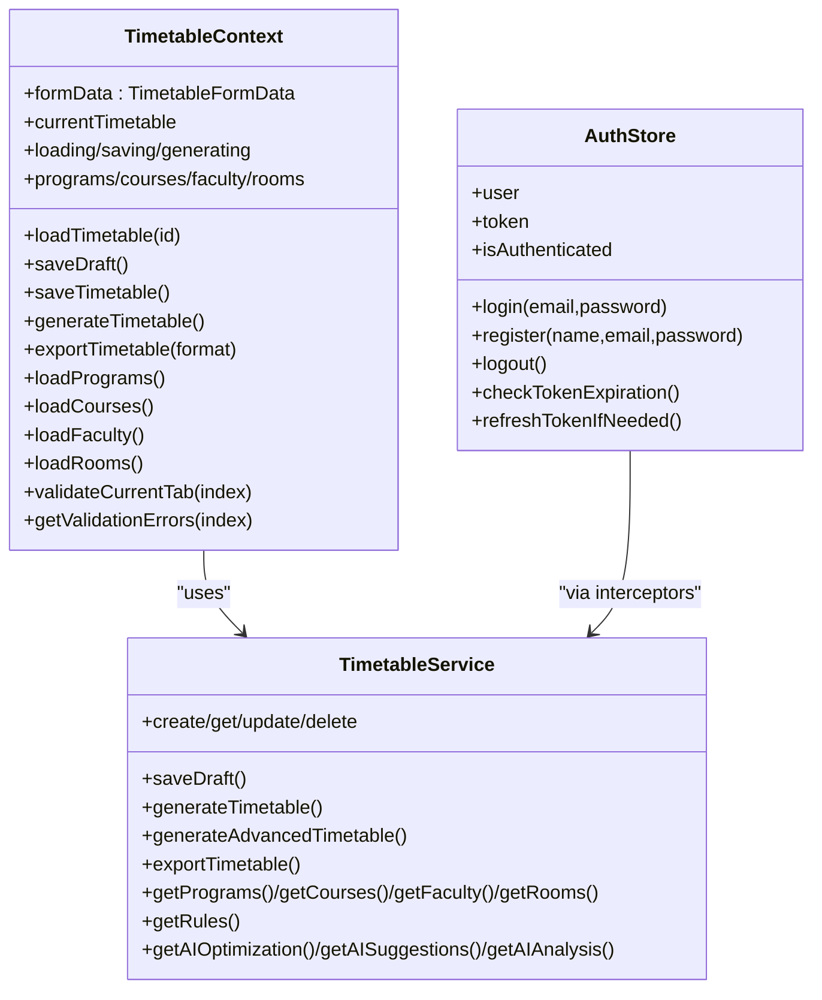
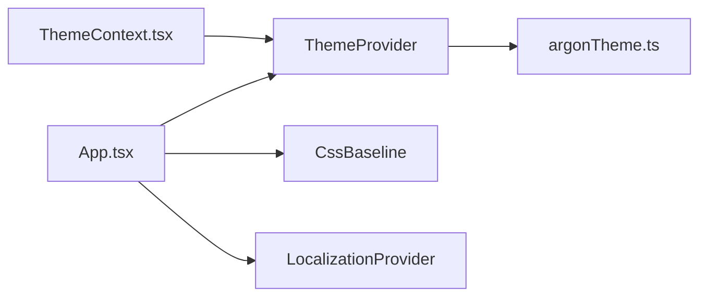
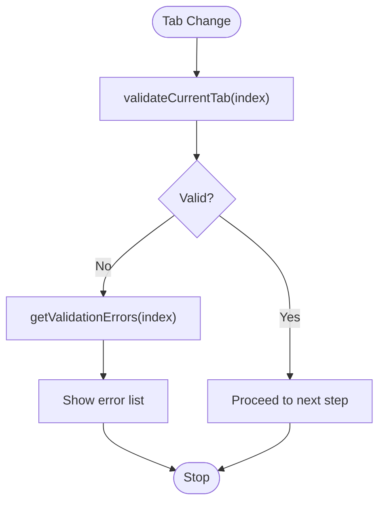
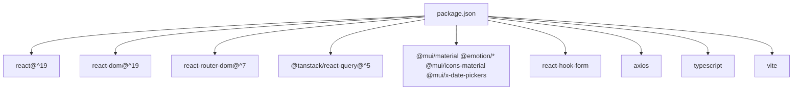

# Frontend Application

<cite>
**Referenced Files in This Document**
- [main.tsx](file://frontend/src/main.tsx)
- [App.tsx](file://frontend/src/App.tsx)
- [vite.config.ts](file://frontend/vite.config.ts)
- [package.json](file://frontend/package.json)
- [tsconfig.json](file://frontend/tsconfig.json)
- [MainLayout.tsx](file://frontend/src/components/layout/MainLayout.tsx)
- [AuthGuard.tsx](file://frontend/src/components/AuthGuard.tsx)
- [ThemeContext.tsx](file://frontend/src/contexts/ThemeContext.tsx)
- [TimetableContext.tsx](file://frontend/src/contexts/TimetableContext.tsx)
- [argonTheme.ts](file://frontend/src/theme/argonTheme.ts)
- [authStore.ts](file://frontend/src/store/authStore.ts)
- [timetableService.ts](file://frontend/src/services/timetableService.ts)
- [Dashboard.tsx](file://frontend/src/components/pages/Dashboard.tsx)
- [Login.tsx](file://frontend/src/components/pages/Login.tsx)
- [Sidebar.tsx](file://frontend/src/components/layout/Sidebar.tsx)
</cite>

## Table of Contents
1. [Introduction](#introduction)
2. [Project Structure](#project-structure)
3. [Core Components](#core-components)
4. [Architecture Overview](#architecture-overview)
5. [Detailed Component Analysis](#detailed-component-analysis)
6. [Dependency Analysis](#dependency-analysis)
7. [Performance Considerations](#performance-considerations)
8. [Troubleshooting Guide](#troubleshooting-guide)
9. [Conclusion](#conclusion)
10. [Appendices](#appendices)

## Introduction
This document describes the frontend of the ShedMaster React application. It covers the React 19 TypeScript application structure, Vite build configuration, component architecture, authentication guards, routing and navigation, state management strategies, Material-UI theming and responsive design, form handling and validation, error management, extension guidelines, performance optimization, and accessibility considerations.

## Project Structure
The frontend is organized around a clear separation of concerns:
- Entry point initializes the React root and renders the root App component.
- App composes routing, global providers, theming, localization, and React Query.
- Layout components encapsulate navigation and page routing.
- Pages implement domain-specific views.
- Contexts manage cross-cutting concerns like theming and timetable form/state.
- Stores manage authentication state with persistence.
- Services encapsulate backend API interactions.
- Theme defines Material-UI design tokens and components overrides.

**Diagram sources**
- [main.tsx:1-11](file://frontend/src/main.tsx#L1-L11)
- [App.tsx:1-49](file://frontend/src/App.tsx#L1-L49)
- [MainLayout.tsx:1-157](file://frontend/src/components/layout/MainLayout.tsx#L1-L157)
- [AuthGuard.tsx:1-32](file://frontend/src/components/AuthGuard.tsx#L1-L32)
- [ThemeContext.tsx:1-54](file://frontend/src/contexts/ThemeContext.tsx#L1-L54)
- [argonTheme.ts:1-276](file://frontend/src/theme/argonTheme.ts#L1-L276)
- [Sidebar.tsx:1-156](file://frontend/src/components/layout/Sidebar.tsx#L1-L156)
- [TimetableContext.tsx:1-629](file://frontend/src/contexts/TimetableContext.tsx#L1-L629)
- [timetableService.ts:1-772](file://frontend/src/services/timetableService.ts#L1-L772)
- [authStore.ts:1-248](file://frontend/src/store/authStore.ts#L1-L248)

**Section sources**
- [main.tsx:1-11](file://frontend/src/main.tsx#L1-L11)
- [App.tsx:1-49](file://frontend/src/App.tsx#L1-L49)
- [vite.config.ts:1-8](file://frontend/vite.config.ts#L1-L8)
- [package.json:1-46](file://frontend/package.json#L1-L46)
- [tsconfig.json:1-8](file://frontend/tsconfig.json#L1-L8)

## Core Components
- Root entry and rendering: Initializes the React 18+ root and mounts the App component.
- Application shell: Wraps routing, providers, Material-UI theming, localization, and React Query.
- Main layout: Provides sidebar navigation, navbar, and page routing with conditional layouts for timetable wizard vs. main app.
- Authentication guard: Hydrates persisted auth state and redirects unauthenticated users to login.
- Theme provider: Manages theme mode and persists to localStorage.
- Timetable context: Centralized form state, data loading, actions, and validation for timetable creation and editing.
- Auth store: Zustand store with persistence for user, token, and login/logout flows.
- Services: Strongly typed API client for backend endpoints.
- Pages: Dashboard, Login, Timetables, Programs, Constraints, AI Optimization, Create Timetable, and Profile.

**Section sources**
- [main.tsx:1-11](file://frontend/src/main.tsx#L1-L11)
- [App.tsx:1-49](file://frontend/src/App.tsx#L1-L49)
- [MainLayout.tsx:1-157](file://frontend/src/components/layout/MainLayout.tsx#L1-L157)
- [AuthGuard.tsx:1-32](file://frontend/src/components/AuthGuard.tsx#L1-L32)
- [ThemeContext.tsx:1-54](file://frontend/src/contexts/ThemeContext.tsx#L1-L54)
- [TimetableContext.tsx:1-629](file://frontend/src/contexts/TimetableContext.tsx#L1-L629)
- [authStore.ts:1-248](file://frontend/src/store/authStore.ts#L1-L248)
- [timetableService.ts:1-772](file://frontend/src/services/timetableService.ts#L1-L772)
- [Dashboard.tsx:1-193](file://frontend/src/components/pages/Dashboard.tsx#L1-L193)
- [Login.tsx:1-335](file://frontend/src/components/pages/Login.tsx#L1-L335)
- [Sidebar.tsx:1-156](file://frontend/src/components/layout/Sidebar.tsx#L1-L156)

## Architecture Overview
The frontend follows a layered architecture:
- Presentation layer: React components and pages.
- Routing layer: React Router DOM with nested routes inside MainLayout.
- State layer: React Context API for timetable form/data, Zustand for auth state.
- Services layer: Axios-based API client with interceptors and retry logic.
- Theming layer: Material-UI ThemeProvider with custom design system.

**Diagram sources**
- [App.tsx:1-49](file://frontend/src/App.tsx#L1-L49)
- [MainLayout.tsx:1-157](file://frontend/src/components/layout/MainLayout.tsx#L1-L157)
- [AuthGuard.tsx:1-32](file://frontend/src/components/AuthGuard.tsx#L1-L32)
- [Sidebar.tsx:1-156](file://frontend/src/components/layout/Sidebar.tsx#L1-L156)
- [TimetableContext.tsx:1-629](file://frontend/src/contexts/TimetableContext.tsx#L1-L629)
- [authStore.ts:1-248](file://frontend/src/store/authStore.ts#L1-L248)
- [timetableService.ts:1-772](file://frontend/src/services/timetableService.ts#L1-L772)
- [ThemeContext.tsx:1-54](file://frontend/src/contexts/ThemeContext.tsx#L1-L54)
- [argonTheme.ts:1-276](file://frontend/src/theme/argonTheme.ts#L1-L276)

## Detailed Component Analysis

### Routing and Navigation
- App sets up React Router with a single route for login and a catch-all protected route guarded by AuthGuard and rendered inside MainLayout.
- MainLayout defines nested routes for dashboard, timetables, programs, constraints, AI optimization, and profile.
- Timetable wizard routes (/timetables/create, /timetables/edit/:id, /timetables/:id) render within a specialized header and full-screen layout.
- Sidebar provides desktop/mobile navigation and updates active state based on current location.

**Diagram sources**
- [App.tsx:1-49](file://frontend/src/App.tsx#L1-L49)
- [AuthGuard.tsx:1-32](file://frontend/src/components/AuthGuard.tsx#L1-L32)
- [MainLayout.tsx:1-157](file://frontend/src/components/layout/MainLayout.tsx#L1-L157)

**Section sources**
- [App.tsx:1-49](file://frontend/src/App.tsx#L1-L49)
- [MainLayout.tsx:1-157](file://frontend/src/components/layout/MainLayout.tsx#L1-L157)
- [Sidebar.tsx:1-156](file://frontend/src/components/layout/Sidebar.tsx#L1-L156)

### Authentication and Guards
- AuthGuard hydrates persisted auth state and prevents navigation to protected routes until hydration completes.
- On unauthenticated access attempts, redirects to login.
- authStore manages login, logout, registration, token persistence, axios interceptors, and token refresh logic for admin users.

**Diagram sources**
- [AuthGuard.tsx:1-32](file://frontend/src/components/AuthGuard.tsx#L1-L32)

**Section sources**
- [AuthGuard.tsx:1-32](file://frontend/src/components/AuthGuard.tsx#L1-L32)
- [authStore.ts:1-248](file://frontend/src/store/authStore.ts#L1-L248)

### State Management Strategy
- React Context API: TimetableContext centralizes form data, loading states, available data lists, and actions (save, generate, export).
- React Query: Provided at the root to enable caching, background refetching, and optimistic updates for server state synchronization.
- Zustand: Used for auth state with persistence to localStorage for seamless reloads.

**Diagram sources**
- [TimetableContext.tsx:1-629](file://frontend/src/contexts/TimetableContext.tsx#L1-L629)
- [authStore.ts:1-248](file://frontend/src/store/authStore.ts#L1-L248)
- [timetableService.ts:1-772](file://frontend/src/services/timetableService.ts#L1-L772)

**Section sources**
- [TimetableContext.tsx:1-629](file://frontend/src/contexts/TimetableContext.tsx#L1-L629)
- [authStore.ts:1-248](file://frontend/src/store/authStore.ts#L1-L248)
- [timetableService.ts:1-772](file://frontend/src/services/timetableService.ts#L1-L772)

### Material-UI Integration and Theming
- ThemeContext wraps the app with ThemeProvider and persists theme mode in localStorage.
- argonTheme defines a modern, glass-morphism-inspired design system with light/dark variants, typography scales, component overrides, and custom shadows/blurs.
- App integrates CssBaseline and LocalizationProvider for date pickers.

**Diagram sources**
- [ThemeContext.tsx:1-54](file://frontend/src/contexts/ThemeContext.tsx#L1-L54)
- [argonTheme.ts:1-276](file://frontend/src/theme/argonTheme.ts#L1-L276)
- [App.tsx:1-49](file://frontend/src/App.tsx#L1-L49)

**Section sources**
- [ThemeContext.tsx:1-54](file://frontend/src/contexts/ThemeContext.tsx#L1-L54)
- [argonTheme.ts:1-276](file://frontend/src/theme/argonTheme.ts#L1-L276)
- [App.tsx:1-49](file://frontend/src/App.tsx#L1-L49)

### Form Handling Patterns and Validation
- TimetableContext defines a comprehensive form data structure spanning academic info, working days, time slots, courses, faculty, student groups, rooms, and constraints.
- Validation helpers compute per-tab validity and produce user-facing error messages.
- Actions orchestrate saving drafts, publishing, generation, and exports while managing loading states.

**Diagram sources**
- [TimetableContext.tsx:547-593](file://frontend/src/contexts/TimetableContext.tsx#L547-L593)

**Section sources**
- [TimetableContext.tsx:1-629](file://frontend/src/contexts/TimetableContext.tsx#L1-L629)

### Error Management
- Axios interceptors attach Authorization headers and handle 401 responses by logging out the user.
- AuthGuard defers navigation until persisted auth state is hydrated to prevent race conditions.
- Pages surface user-facing errors via alerts and controlled loading states.

**Section sources**
- [authStore.ts:209-247](file://frontend/src/store/authStore.ts#L209-L247)
- [timetableService.ts:170-261](file://frontend/src/services/timetableService.ts#L170-L261)
- [AuthGuard.tsx:1-32](file://frontend/src/components/AuthGuard.tsx#L1-L32)
- [Login.tsx:1-335](file://frontend/src/components/pages/Login.tsx#L1-L335)

### Extending Components and Adding New Pages
- To add a new page:
  - Create a new component under src/components/pages/.
  - Register a route in MainLayout under the appropriate parent route.
  - Optionally add a menu item in Sidebar.
- To extend forms:
  - Add fields to TimetableFormData in TimetableContext and update validation logic.
  - Wire inputs to setFormData/updateFormData.
- To integrate new API endpoints:
  - Add methods to timetableService and call them from TimetableContext actions.
  - Update loaders and error handling accordingly.

**Section sources**
- [MainLayout.tsx:1-157](file://frontend/src/components/layout/MainLayout.tsx#L1-L157)
- [Sidebar.tsx:1-156](file://frontend/src/components/layout/Sidebar.tsx#L1-L156)
- [TimetableContext.tsx:1-629](file://frontend/src/contexts/TimetableContext.tsx#L1-L629)
- [timetableService.ts:1-772](file://frontend/src/services/timetableService.ts#L1-L772)

## Dependency Analysis
Key runtime dependencies include React 19, Material-UI 7, React Router 7, React Query 5, and related date/time libraries. Build-time dependencies include Vite, TypeScript, and ESLint plugins.

**Diagram sources**
- [package.json:1-46](file://frontend/package.json#L1-L46)

**Section sources**
- [package.json:1-46](file://frontend/package.json#L1-L46)
- [vite.config.ts:1-8](file://frontend/vite.config.ts#L1-L8)
- [tsconfig.json:1-8](file://frontend/tsconfig.json#L1-L8)

## Performance Considerations
- Prefer React.lazy and Suspense for heavy page bundles when scaling.
- Use React Query’s background refetching and selective invalidation to minimize redundant network calls.
- Memoize expensive computations in contexts and components using useMemo/useCallback.
- Defer non-critical data fetching to after initial render.
- Optimize images and avoid unnecessary re-renders by isolating state and props.
- Keep localStorage usage minimal; authStore already persists efficiently.

## Troubleshooting Guide
- Authentication loops or immediate redirects:
  - Ensure AuthGuard waits for hydration before evaluating isAuthenticated.
  - Verify axios interceptors are attached and token exists in localStorage.
- 401 errors:
  - Confirm interceptors are setting Authorization headers.
  - Check token expiration and refresh logic for admin users.
- Theming issues:
  - Verify ThemeContextProvider wraps the app and localStorage theme mode is valid.
- Form validation failures:
  - Inspect validateCurrentTab and getValidationErrors for missing required fields.

**Section sources**
- [AuthGuard.tsx:1-32](file://frontend/src/components/AuthGuard.tsx#L1-L32)
- [authStore.ts:209-247](file://frontend/src/store/authStore.ts#L209-L247)
- [ThemeContext.tsx:1-54](file://frontend/src/contexts/ThemeContext.tsx#L1-L54)
- [TimetableContext.tsx:547-593](file://frontend/src/contexts/TimetableContext.tsx#L547-L593)

## Conclusion
The ShedMaster frontend employs a clean, modular architecture leveraging React 19, TypeScript, Material-UI, and React Router. Authentication is robust with persistent state and secure interceptors. Timetable creation is centralized in a dedicated context with strong typing and validation. The theming system provides a cohesive, modern look. Following the extension guidelines and performance recommendations will help maintain scalability and developer productivity.

## Appendices
- Build configuration: Vite plugin for React; TypeScript references for app/node configs.
- Example page: Dashboard demonstrates responsive layout and Material-UI components.
- Example login: Demonstrates form handling, validation feedback, and demo login flow.

**Section sources**
- [vite.config.ts:1-8](file://frontend/vite.config.ts#L1-L8)
- [tsconfig.json:1-8](file://frontend/tsconfig.json#L1-L8)
- [Dashboard.tsx:1-193](file://frontend/src/components/pages/Dashboard.tsx#L1-L193)
- [Login.tsx:1-335](file://frontend/src/components/pages/Login.tsx#L1-L335)