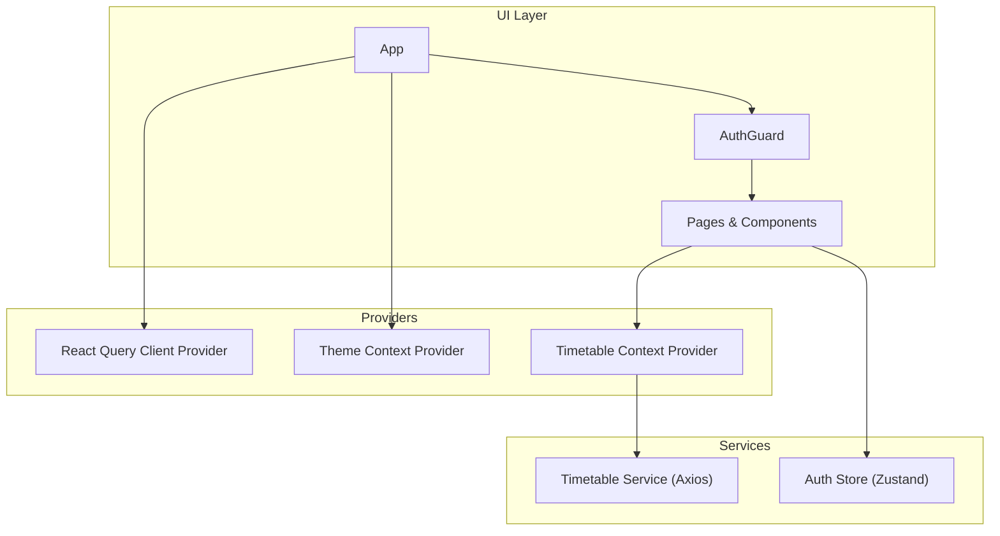
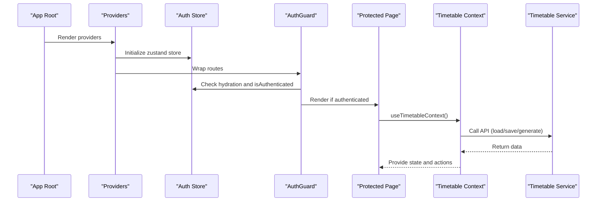
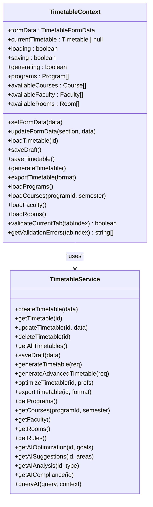
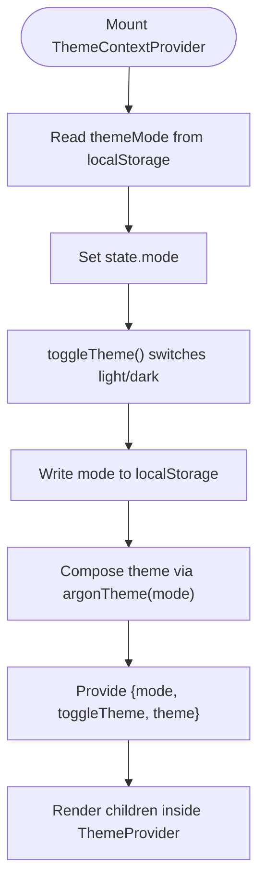
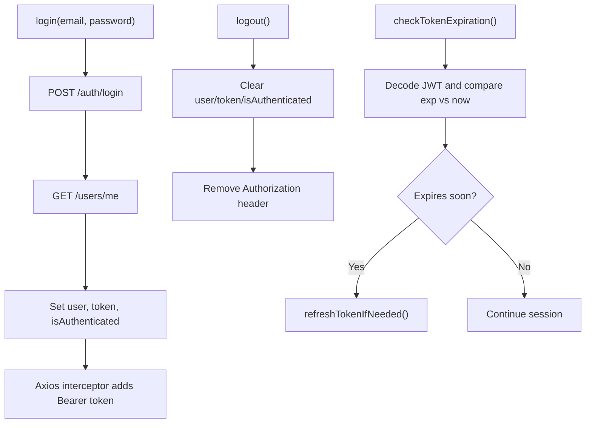
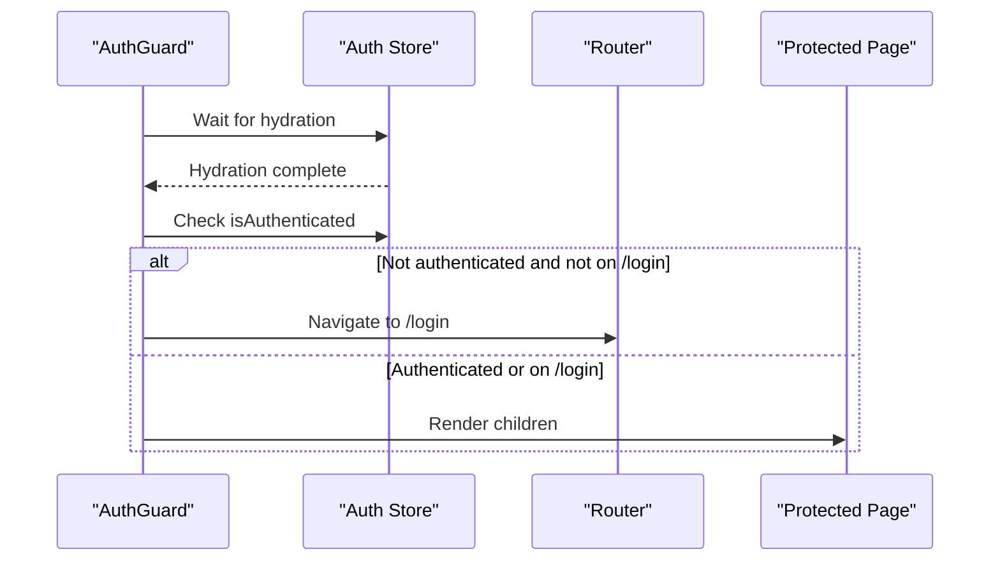
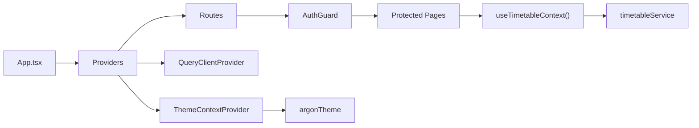

# State Management

<cite>
**Referenced Files in This Document**
- [TimetableContext.tsx](file://frontend/src/contexts/TimetableContext.tsx)
- [ThemeContext.tsx](file://frontend/src/contexts/ThemeContext.tsx)
- [authStore.ts](file://frontend/src/store/authStore.ts)
- [AuthGuard.tsx](file://frontend/src/components/AuthGuard.tsx)
- [timetableService.ts](file://frontend/src/services/timetableService.ts)
- [App.tsx](file://frontend/src/App.tsx)
- [main.tsx](file://frontend/src/main.tsx)
- [argonTheme.ts](file://frontend/src/theme/argonTheme.ts)
- [AcademicStructureTab.tsx](file://frontend/src/components/pages/CreateTimetable/AcademicStructureTab.tsx)
- [Login.tsx](file://frontend/src/components/pages/Login.tsx)
</cite>

## Table of Contents
1. [Introduction](#introduction)
2. [Project Structure](#project-structure)
3. [Core Components](#core-components)
4. [Architecture Overview](#architecture-overview)
5. [Detailed Component Analysis](#detailed-component-analysis)
6. [Dependency Analysis](#dependency-analysis)
7. [Performance Considerations](#performance-considerations)
8. [Troubleshooting Guide](#troubleshooting-guide)
9. [Conclusion](#conclusion)

## Introduction
This document explains the state management architecture of the React application, focusing on:
- React Context API for timetable data and theming
- Zustand-based authentication store
- Authentication guard for route protection
- Patterns for state updates, subscriptions, and provider composition
- Guidance on consuming state in components and avoiding unnecessary re-renders

It also clarifies that the project currently uses React Context and Zustand for client-side state, and does not integrate React Query for server state synchronization.

## Project Structure
The state management stack is organized around three primary areas:
- Context providers for UI and data orchestration
- Authentication store for user sessions
- Route protection wrapper for guarded navigation

**Diagram sources**
- [App.tsx:19-45](file://frontend/src/App.tsx#L19-L45)
- [TimetableContext.tsx:260-626](file://frontend/src/contexts/TimetableContext.tsx#L260-L626)
- [ThemeContext.tsx:28-53](file://frontend/src/contexts/ThemeContext.tsx#L28-L53)
- [timetableService.ts:161-646](file://frontend/src/services/timetableService.ts#L161-L646)
- [authStore.ts:29-207](file://frontend/src/store/authStore.ts#L29-L207)

**Section sources**
- [App.tsx:19-45](file://frontend/src/App.tsx#L19-L45)
- [main.tsx:6-10](file://frontend/src/main.tsx#L6-L10)

## Core Components
- TimetableContext: Manages form data, current timetable, loading states, and actions to load/save/generate/export timetables. It encapsulates the timetable service for server communication.
- ThemeContext: Provides theme mode switching and Material-UI theme composition with persistence.
- authStore: Centralized authentication state using Zustand with persistence and axios interceptors for automatic token injection.
- AuthGuard: Route protection wrapper that hydrates persisted auth state before rendering protected routes.

Key characteristics:
- Contexts are composed at the root level in App.tsx.
- Components consume contexts via dedicated hooks.
- No React Query integration is present in the codebase.

**Section sources**
- [TimetableContext.tsx:103-140](file://frontend/src/contexts/TimetableContext.tsx#L103-L140)
- [ThemeContext.tsx:8-12](file://frontend/src/contexts/ThemeContext.tsx#L8-L12)
- [authStore.ts:15-25](file://frontend/src/store/authStore.ts#L15-L25)
- [AuthGuard.tsx:5-31](file://frontend/src/components/AuthGuard.tsx#L5-L31)

## Architecture Overview
The application composes providers at the root and exposes state via hooks. Authentication is handled by Zustand with persistent storage and axios interceptors. The timetable context orchestrates data fetching and mutations through a typed service.

**Diagram sources**
- [App.tsx:21-46](file://frontend/src/App.tsx#L21-L46)
- [AuthGuard.tsx:5-31](file://frontend/src/components/AuthGuard.tsx#L5-L31)
- [authStore.ts:29-207](file://frontend/src/store/authStore.ts#L29-L207)
- [TimetableContext.tsx:260-626](file://frontend/src/contexts/TimetableContext.tsx#L260-L626)
- [timetableService.ts:161-646](file://frontend/src/services/timetableService.ts#L161-L646)

## Detailed Component Analysis

### TimetableContext
Responsibilities:
- Manage combined form data for multi-tab creation
- Track current timetable and loading states
- Load available data (programs, courses, faculty, rooms)
- Save drafts, publish final timetables, and trigger AI generation
- Export timetables in various formats

Implementation highlights:
- Uses React Context with a dedicated hook for safe consumption
- Encapsulates service calls behind action methods
- Maintains metadata merging logic to preserve backend inconsistencies
- Exposes validation helpers for tabbed forms

**Diagram sources**
- [TimetableContext.tsx:103-140](file://frontend/src/contexts/TimetableContext.tsx#L103-L140)
- [timetableService.ts:161-646](file://frontend/src/services/timetableService.ts#L161-L646)

**Section sources**
- [TimetableContext.tsx:260-626](file://frontend/src/contexts/TimetableContext.tsx#L260-L626)
- [timetableService.ts:161-646](file://frontend/src/services/timetableService.ts#L161-L646)

### ThemeContext
Responsibilities:
- Persist theme mode in localStorage
- Provide Material-UI theme object based on mode
- Wrap children with ThemeProvider

Patterns:
- Initializes mode from localStorage or defaults to light
- Updates localStorage on mode change
- Composes theme using a dedicated theme factory

**Diagram sources**
- [ThemeContext.tsx:28-53](file://frontend/src/contexts/ThemeContext.tsx#L28-L53)
- [argonTheme.ts:96-271](file://frontend/src/theme/argonTheme.ts#L96-L271)

**Section sources**
- [ThemeContext.tsx:28-53](file://frontend/src/contexts/ThemeContext.tsx#L28-L53)
- [argonTheme.ts:96-271](file://frontend/src/theme/argonTheme.ts#L96-L271)

### authStore (Zustand)
Responsibilities:
- Manage user, token, and authentication status
- Login, register, logout flows
- Token expiration checks and refresh logic
- Persist state to localStorage with selective serialization
- Global axios interceptors for request/response handling

Patterns:
- Uses Zustand’s create with persist middleware
- Intercepts requests to attach Authorization header
- Intercepts responses to handle 401 and log out

**Diagram sources**
- [authStore.ts:29-207](file://frontend/src/store/authStore.ts#L29-L207)

**Section sources**
- [authStore.ts:29-207](file://frontend/src/store/authStore.ts#L29-L207)

### AuthGuard
Responsibilities:
- Hydrate persisted auth store before rendering
- Redirect unauthenticated users to login
- Allow access to login route regardless of auth state

Patterns:
- Uses Zustand’s persistence hydration callback
- Guards all routes under a wildcard path

**Diagram sources**
- [AuthGuard.tsx:5-31](file://frontend/src/components/AuthGuard.tsx#L5-L31)
- [authStore.ts:198-206](file://frontend/src/store/authStore.ts#L198-L206)

**Section sources**
- [AuthGuard.tsx:5-31](file://frontend/src/components/AuthGuard.tsx#L5-L31)

### State Consumption in Components
Examples:
- AcademicStructureTab consumes TimetableContext to load programs and update form data.
- Login page consumes authStore to perform login and navigate on success.

Patterns:
- Use dedicated hooks to access context/store
- Keep handlers lightweight; delegate heavy work to context actions or store methods
- Avoid spreading large objects into props; pass only required fields

**Section sources**
- [AcademicStructureTab.tsx:26-38](file://frontend/src/components/pages/CreateTimetable/AcademicStructureTab.tsx#L26-L38)
- [Login.tsx:31-60](file://frontend/src/components/pages/Login.tsx#L31-L60)

## Dependency Analysis
Provider composition and dependencies:
- App composes QueryClientProvider, ThemeContextProvider, CssBaseline, LocalizationProvider, and routes
- AuthGuard wraps protected routes and depends on authStore hydration
- TimetableContext depends on timetableService for all server interactions
- ThemeContext depends on argonTheme for theme composition

**Diagram sources**
- [App.tsx:21-46](file://frontend/src/App.tsx#L21-L46)
- [TimetableContext.tsx:260-626](file://frontend/src/contexts/TimetableContext.tsx#L260-L626)
- [timetableService.ts:161-646](file://frontend/src/services/timetableService.ts#L161-L646)
- [ThemeContext.tsx:28-53](file://frontend/src/contexts/ThemeContext.tsx#L28-L53)
- [argonTheme.ts:96-271](file://frontend/src/theme/argonTheme.ts#L96-L271)

**Section sources**
- [App.tsx:21-46](file://frontend/src/App.tsx#L21-L46)
- [TimetableContext.tsx:260-626](file://frontend/src/contexts/TimetableContext.tsx#L260-L626)
- [timetableService.ts:161-646](file://frontend/src/services/timetableService.ts#L161-L646)
- [ThemeContext.tsx:28-53](file://frontend/src/contexts/ThemeContext.tsx#L28-L53)
- [argonTheme.ts:96-271](file://frontend/src/theme/argonTheme.ts#L96-L271)

## Performance Considerations
- Context granularity: TimetableContext aggregates many pieces of state. Consider splitting into smaller contexts if components only need subsets of state to reduce re-renders.
- Memoization: Use callbacks and memoization for action functions to prevent unnecessary prop changes.
- Avoid deep object updates: Prefer immutable updates to minimize downstream re-renders.
- Provider order: Keep providers minimal and only wrap necessary subtrees.

[No sources needed since this section provides general guidance]

## Troubleshooting Guide
Common issues and resolutions:
- Authentication redirects loop: Ensure AuthGuard waits for hydration before evaluating isAuthenticated.
- Missing Authorization header: Verify axios interceptors are initialized and auth store is hydrated.
- Backend ID mismatch: TimetableContext normalizes backend IDs to a consistent field before updating state.
- Token refresh failures: Confirm admin-only refresh logic and that localStorage contains valid auth data.

**Section sources**
- [AuthGuard.tsx:10-22](file://frontend/src/components/AuthGuard.tsx#L10-L22)
- [authStore.ts:209-247](file://frontend/src/store/authStore.ts#L209-L247)
- [TimetableContext.tsx:304-368](file://frontend/src/contexts/TimetableContext.tsx#L304-L368)
- [timetableService.ts:263-305](file://frontend/src/services/timetableService.ts#L263-L305)

## Conclusion
The application uses a clean separation of concerns:
- TimetableContext manages complex form and server state
- ThemeContext handles UI theming with persistence
- authStore centralizes authentication with robust interceptors
- AuthGuard ensures secure routing

There is no React Query integration in the current codebase. If you decide to adopt React Query for server state synchronization, caching, and optimistic updates, consider:
- Wrapping queries around TimetableContext actions
- Using query keys aligned with timetable IDs and program/semester scopes
- Implementing optimistic updates for saves and publishes
- Leveraging query invalidation and refetch strategies for consistency

[No sources needed since this section summarizes without analyzing specific files]