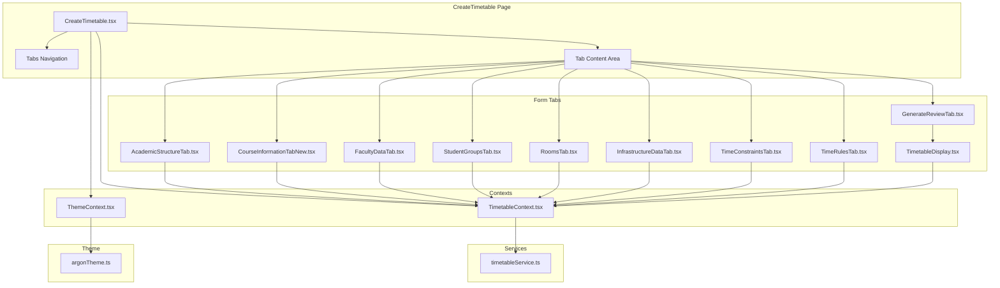
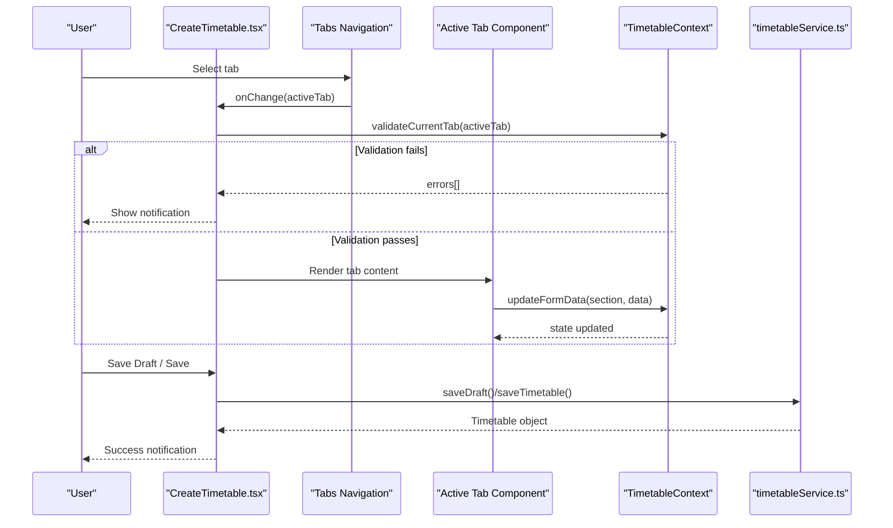
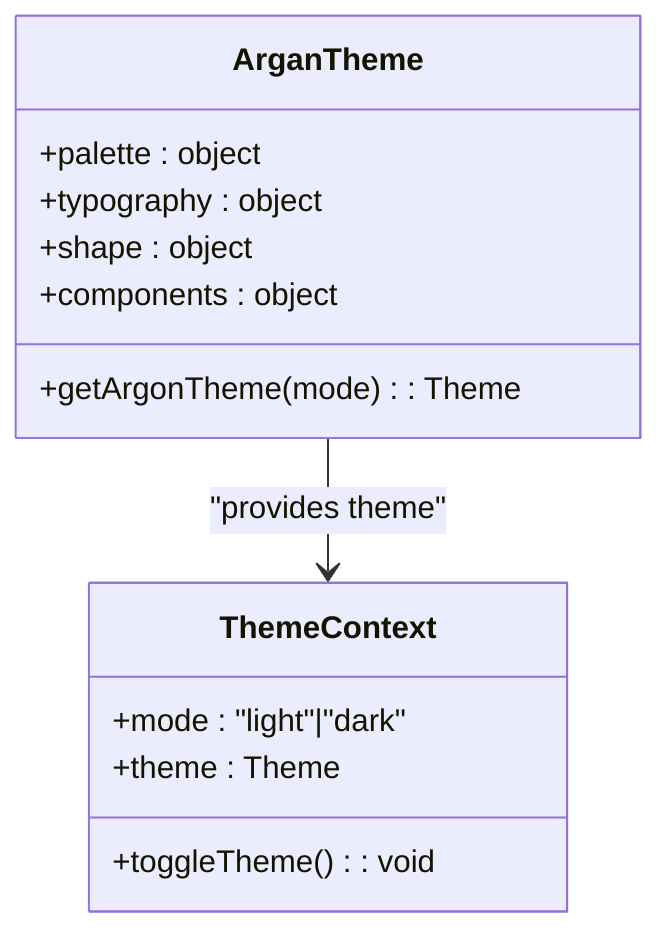
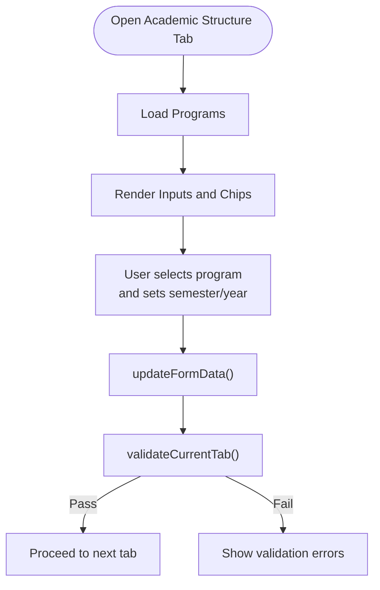
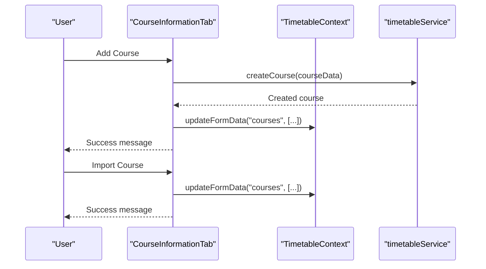
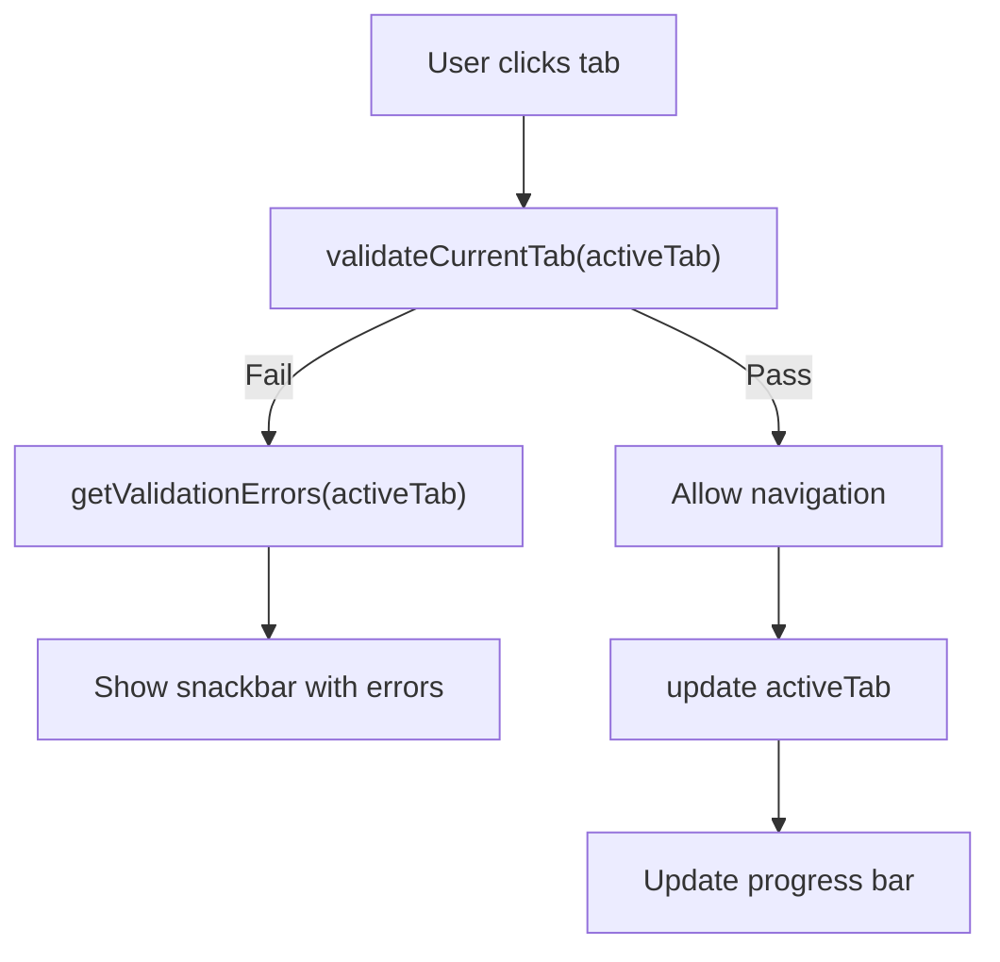
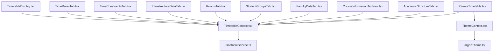

# User Interface Components

<cite>
**Referenced Files in This Document**
- [argonTheme.ts](file://frontend/src/theme/argonTheme.ts)
- [ThemeContext.tsx](file://frontend/src/contexts/ThemeContext.tsx)
- [TimetableContext.tsx](file://frontend/src/contexts/TimetableContext.tsx)
- [timetableService.ts](file://frontend/src/services/timetableService.ts)
- [CreateTimetable.tsx](file://frontend/src/components/pages/CreateTimetable.tsx)
- [AcademicStructureTab.tsx](file://frontend/src/components/pages/CreateTimetable/AcademicStructureTab.tsx)
- [CourseInformationTabNew.tsx](file://frontend/src/components/pages/CreateTimetable/CourseInformationTabNew.tsx)
- [FacultyDataTab.tsx](file://frontend/src/components/pages/CreateTimetable/FacultyDataTab.tsx)
- [InfrastructureDataTab.tsx](file://frontend/src/components/pages/CreateTimetable/InfrastructureDataTab.tsx)
- [RoomsTab.tsx](file://frontend/src/components/pages/CreateTimetable/RoomsTab.tsx)
- [StudentGroupsTab.tsx](file://frontend/src/components/pages/CreateTimetable/StudentGroupsTab.tsx)
- [TimeConstraintsTab.tsx](file://frontend/src/components/pages/CreateTimetable/TimeConstraintsTab.tsx)
- [TimeRulesTab.tsx](file://frontend/src/components/pages/CreateTimetable/TimeRulesTab.tsx)
- [TimetableDisplay.tsx](file://frontend/src/components/pages/CreateTimetable/TimetableDisplay.tsx)
</cite>

## Table of Contents
1. [Introduction](#introduction)
2. [Project Structure](#project-structure)
3. [Core Components](#core-components)
4. [Architecture Overview](#architecture-overview)
5. [Detailed Component Analysis](#detailed-component-analysis)
6. [Dependency Analysis](#dependency-analysis)
7. [Performance Considerations](#performance-considerations)
8. [Troubleshooting Guide](#troubleshooting-guide)
9. [Conclusion](#conclusion)

## Introduction
This document provides comprehensive documentation for the Material-UI-based user interface components and custom implementations used in the CreateTimetable workflow. It covers the Argan theme configuration, color schemes, typography, and spacing; details the multi-step form components for academic structure, courses, faculty, infrastructure/rooms, student groups, time constraints, and time rules; explains validation patterns, error handling, and user input processing; and demonstrates responsive design and accessibility features. Examples of form state management and step navigation patterns are included to help developers extend and maintain the system effectively.

## Project Structure
The UI components are organized under the frontend/src/components/pages/CreateTimetable directory, with supporting contexts, services, and theme configuration located in dedicated folders. The main CreateTimetable page orchestrates tabbed navigation and integrates with the TimetableContext for state management and the ThemeContext for theme configuration.

**Diagram sources**
- [CreateTimetable.tsx:1-459](file://frontend/src/components/pages/CreateTimetable.tsx#L1-L459)
- [TimetableContext.tsx:1-629](file://frontend/src/contexts/TimetableContext.tsx#L1-L629)
- [ThemeContext.tsx:1-54](file://frontend/src/contexts/ThemeContext.tsx#L1-L54)
- [argonTheme.ts:1-276](file://frontend/src/theme/argonTheme.ts#L1-L276)
- [timetableService.ts:1-772](file://frontend/src/services/timetableService.ts#L1-L772)

**Section sources**
- [CreateTimetable.tsx:1-459](file://frontend/src/components/pages/CreateTimetable.tsx#L1-L459)
- [TimetableContext.tsx:1-629](file://frontend/src/contexts/TimetableContext.tsx#L1-L629)
- [ThemeContext.tsx:1-54](file://frontend/src/contexts/ThemeContext.tsx#L1-L54)
- [argonTheme.ts:1-276](file://frontend/src/theme/argonTheme.ts#L1-L276)
- [timetableService.ts:1-772](file://frontend/src/services/timetableService.ts#L1-L772)

## Core Components
This section outlines the central theme and state management systems that power the UI.

- Argan Theme Configuration
  - Color Palette: Defines primary, secondary, success, info, warning, error, and grey palettes, plus text and background colors for both light and dark modes.
  - Typography: Sets font family and scalable heading/body sizes with modern letter-spacing and button styling.
  - Shape: Uses softened border radius for contemporary UI elements.
  - Components: Applies global styles and overrides for Material-UI components including CssBaseline, Card, Paper, Button, AppBar, Drawer, Table, InputBase, ListItemButton, and others to achieve a glass-like aesthetic and hover effects.
  - Glass Effect: Provides blur, transparency, and subtle borders for elevated surfaces.

- Theme Context
  - Manages theme mode (light/dark) persisted in localStorage.
  - Exposes theme toggling and provides ThemeProvider wrapping the application.

- Timetable Context
  - Centralizes form state for all tabs with a unified TimetableFormData structure.
  - Provides actions for loading programs, courses, faculty, and rooms; saving drafts and final timetables; generating schedules; and exporting.
  - Implements validation helpers for step-wise navigation and error reporting.

**Section sources**
- [argonTheme.ts:1-276](file://frontend/src/theme/argonTheme.ts#L1-L276)
- [ThemeContext.tsx:1-54](file://frontend/src/contexts/ThemeContext.tsx#L1-L54)
- [TimetableContext.tsx:1-629](file://frontend/src/contexts/TimetableContext.tsx#L1-L629)

## Architecture Overview
The CreateTimetable page composes a tabbed interface with validation-driven navigation. Each tab updates the shared form state through the TimetableContext. Data persistence and retrieval are handled by timetableService, which communicates with backend endpoints. The ThemeContext supplies the Argan theme to all components.

**Diagram sources**
- [CreateTimetable.tsx:144-205](file://frontend/src/components/pages/CreateTimetable.tsx#L144-L205)
- [TimetableContext.tsx:547-593](file://frontend/src/contexts/TimetableContext.tsx#L547-L593)
- [timetableService.ts:308-442](file://frontend/src/services/timetableService.ts#L308-L442)

## Detailed Component Analysis

### Argan Theme Configuration
The Argan theme defines a modern, glass-inspired design system with carefully tuned colors, typography, and component overrides.

- Color Scheme
  - Light/Dark palettes for primary, secondary, and semantic colors.
  - Text and background colors tailored for readability and contrast.
- Typography
  - Outfit/Inter font stack with scalable headings and body text.
  - Button text-transform set to none for a contemporary feel.
- Shape and Components
  - Softer border radius and glass-like backgrounds for cards and papers.
  - Hover and focus states for interactive elements.
  - Custom styles for inputs, buttons, lists, and tables.

**Diagram sources**
- [argonTheme.ts:96-271](file://frontend/src/theme/argonTheme.ts#L96-L271)
- [ThemeContext.tsx:28-53](file://frontend/src/contexts/ThemeContext.tsx#L28-L53)

**Section sources**
- [argonTheme.ts:1-276](file://frontend/src/theme/argonTheme.ts#L1-L276)
- [ThemeContext.tsx:1-54](file://frontend/src/contexts/ThemeContext.tsx#L1-L54)

### Academic Structure Tab
Configures academic program, semester, academic year, and working days.

- Features
  - Program selection with department auto-fill.
  - Semester and academic year inputs.
  - Working days toggle chips with counts.
  - Gradient headers and stats cards.
- State Updates
  - updateFormData for program_id, semester, academic_year, and working_days.
- Validation
  - Required fields enforced in step validation.

**Diagram sources**
- [AcademicStructureTab.tsx:35-74](file://frontend/src/components/pages/CreateTimetable/AcademicStructureTab.tsx#L35-L74)
- [TimetableContext.tsx:547-564](file://frontend/src/contexts/TimetableContext.tsx#L547-L564)

**Section sources**
- [AcademicStructureTab.tsx:1-382](file://frontend/src/components/pages/CreateTimetable/AcademicStructureTab.tsx#L1-L382)
- [TimetableContext.tsx:547-564](file://frontend/src/contexts/TimetableContext.tsx#L547-L564)

### Course Information Tab
Manages course creation, import, and editing.

- Features
  - Add new courses with code, name, credits, type, hours/week, minutes/session, and optional primary faculty.
  - Import courses from available catalog.
  - Edit/delete courses with backend synchronization.
  - Stats cards for total courses and credits.
- State and Service Integration
  - updateFormData for formData.courses.
  - timetableService.getCourses(), createCourse(), updateCourse(), deleteCourse().
- Validation
  - Requires program and semester selection before adding courses.

**Diagram sources**
- [CourseInformationTabNew.tsx:93-165](file://frontend/src/components/pages/CreateTimetable/CourseInformationTabNew.tsx#L93-L165)
- [timetableService.ts:422-463](file://frontend/src/services/timetableService.ts#L422-L463)

**Section sources**
- [CourseInformationTabNew.tsx:1-800](file://frontend/src/components/pages/CreateTimetable/CourseInformationTabNew.tsx#L1-L800)
- [timetableService.ts:422-463](file://frontend/src/services/timetableService.ts#L422-L463)

### Faculty Data Tab
Handles faculty creation, import, editing, and deletion.

- Features
  - Add new faculty with name, employee ID, department, designation, email, subjects, max hours/week, and available days.
  - Import existing faculty from backend.
  - Edit/update and delete faculty with backend synchronization.
  - Stats cards for selected faculty, availability, and total weekly hours.
- State and Service Integration
  - updateFormData for formData.faculty.
  - timetableService.getFaculty(), createFaculty(), updateFaculty(), deleteFaculty().

**Section sources**
- [FacultyDataTab.tsx:1-1015](file://frontend/src/components/pages/CreateTimetable/FacultyDataTab.tsx#L1-L1015)
- [timetableService.ts:470-488](file://frontend/src/services/timetableService.ts#L470-L488)

### Infrastructure/Rooms Tab
Manages rooms and facilities for scheduling.

- Features
  - Import available rooms from backend.
  - Add new rooms with name, building, floor, capacity, room type, facilities, accessibility, and equipment.
  - Edit/update and delete rooms.
  - Stats cards for total rooms, capacity, and labs.
- State and Service Integration
  - updateFormData for formData.rooms.
  - timetableService.getRooms(), createRoom(), updateRoom(), deleteRoom().

**Section sources**
- [InfrastructureDataTab.tsx:1-851](file://frontend/src/components/pages/CreateTimetable/InfrastructureDataTab.tsx#L1-L851)
- [RoomsTab.tsx:1-858](file://frontend/src/components/pages/CreateTimetable/RoomsTab.tsx#L1-L858)
- [timetableService.ts:530-560](file://frontend/src/services/timetableService.ts#L530-L560)

### Student Groups Tab
Organizes student groups and class sections.

- Features
  - Import existing student groups from backend.
  - Add new groups with name, selected courses, year, semester, section, student strength, and group type.
  - Edit/update and delete groups.
  - Stats cards for total groups and students.
- State and Service Integration
  - updateFormData for formData.student_groups.
  - timetableService.getCourses(), getStudentGroups(), createStudentGroup(), updateStudentGroup(), deleteStudentGroup().

**Section sources**
- [StudentGroupsTab.tsx:1-809](file://frontend/src/components/pages/CreateTimetable/StudentGroupsTab.tsx#L1-L809)
- [timetableService.ts:495-523](file://frontend/src/services/timetableService.ts#L495-L523)

### Time Constraints Tab
Defines daily time slots, working days, and scheduling constraints.

- Features
  - Configure start/end times, period duration, break duration, and optional lunch break with start/end times.
  - Toggle working days.
  - Adjust constraints: max periods per day, max consecutive hours, minimum break between same subject, and preferences like avoiding first/last slots, balancing workload, preferring morning slots.
  - Dynamic summary showing working days, estimated periods/day, and teaching hours/day.
- State Updates
  - updateFormData for time_slots, working_days, and constraints.

**Section sources**
- [TimeConstraintsTab.tsx:1-401](file://frontend/src/components/pages/CreateTimetable/TimeConstraintsTab.tsx#L1-L401)

### Time Rules Tab
Defines reusable scheduling rules and time settings.

- Features
  - Create, edit, and delete rules with parameters for time settings (lunch time, start/end times, intervals, max continuous hours, max classes per day, max lab classes per day, max repeat per day).
  - Lists defined rules with action buttons.
  - Stats cards for total rules, active rules, and rules with parameters.
- Service Integration
  - timetableService.getRules(), createRule(), updateRule(), deleteRule().

**Section sources**
- [TimeRulesTab.tsx:1-293](file://frontend/src/components/pages/CreateTimetable/TimeRulesTab.tsx#L1-L293)
- [timetableService.ts:562-580](file://frontend/src/services/timetableService.ts#L562-L580)

### Timetable Display
Renders the generated timetable in a grid format with course information and statistics.

- Features
  - Displays timetable grid with days and time slots.
  - Handles labs spanning multiple slots and break slots.
  - Shows course information table with totals and types.
  - Displays generation statistics including optimization score and session counts.
  - Export buttons for CSV/PDF.
- Data Processing
  - Processes schedule details from metadata or timetable entries.
  - Normalizes days and time slots, fills grid cells, and handles long sessions.

**Section sources**
- [TimetableDisplay.tsx:1-661](file://frontend/src/components/pages/CreateTimetable/TimetableDisplay.tsx#L1-L661)

### Step Navigation and Validation Patterns
The main CreateTimetable page manages tab navigation with validation and progress tracking.

- Navigation
  - Tabs component with icons and descriptions.
  - Completed tabs marked with a check icon.
- Validation
  - validateCurrentTab checks required fields per tab.
  - getValidationErrors returns human-readable messages.
- Progress Tracking
  - Calculates completion percentage based on validated tabs.
- Auto-save Behavior
  - Draft saving before tab change (temporarily disabled in code comments).
- Actions
  - Save Draft and Save actions integrate with TimetableContext.

**Diagram sources**
- [CreateTimetable.tsx:144-167](file://frontend/src/components/pages/CreateTimetable.tsx#L144-L167)
- [TimetableContext.tsx:547-593](file://frontend/src/contexts/TimetableContext.tsx#L547-L593)

**Section sources**
- [CreateTimetable.tsx:1-459](file://frontend/src/components/pages/CreateTimetable.tsx#L1-L459)
- [TimetableContext.tsx:547-593](file://frontend/src/contexts/TimetableContext.tsx#L547-L593)

## Dependency Analysis
This section maps the relationships among UI components, contexts, services, and theme configuration.

**Diagram sources**
- [CreateTimetable.tsx:27-36](file://frontend/src/components/pages/CreateTimetable.tsx#L27-L36)
- [TimetableContext.tsx:1-629](file://frontend/src/contexts/TimetableContext.tsx#L1-L629)
- [ThemeContext.tsx:1-54](file://frontend/src/contexts/ThemeContext.tsx#L1-L54)
- [argonTheme.ts:1-276](file://frontend/src/theme/argonTheme.ts#L1-L276)
- [timetableService.ts:1-772](file://frontend/src/services/timetableService.ts#L1-L772)

**Section sources**
- [CreateTimetable.tsx:1-459](file://frontend/src/components/pages/CreateTimetable.tsx#L1-L459)
- [TimetableContext.tsx:1-629](file://frontend/src/contexts/TimetableContext.tsx#L1-L629)
- [ThemeContext.tsx:1-54](file://frontend/src/contexts/ThemeContext.tsx#L1-L54)
- [argonTheme.ts:1-276](file://frontend/src/theme/argonTheme.ts#L1-L276)
- [timetableService.ts:1-772](file://frontend/src/services/timetableService.ts#L1-L772)

## Performance Considerations
- State Updates
  - useCallback is used for context actions to prevent unnecessary re-renders.
  - updateFormData merges partial state efficiently.
- API Calls
  - Interceptors handle auth headers and token refresh to reduce manual auth handling overhead.
  - Loading states are used across forms to prevent redundant requests.
- Rendering
  - Memoization is applied for computed values (e.g., schedule grid) to avoid recalculations.
  - Conditional rendering for loading states reduces UI thrash.

[No sources needed since this section provides general guidance]

## Troubleshooting Guide
- Authentication and Token Refresh
  - The service adds request interceptors to attach Authorization headers and handle 401 responses by refreshing tokens and retrying requests.
  - Logs detailed auth state and errors during interceptor execution.
- Error Handling in Forms
  - Each form tab uses local state for error and success notifications.
  - Validation prevents navigation until required fields are filled.
- Common Issues
  - CORS and backend connectivity: Auto-save temporarily disabled in navigation to isolate issues.
  - Backend ID mismatches: Tabs validate backend IDs before updates and prompt users to recreate entries when necessary.
  - Data consistency: Many tabs automatically refresh backend data after create/update/delete operations.

**Section sources**
- [timetableService.ts:170-261](file://frontend/src/services/timetableService.ts#L170-L261)
- [CreateTimetable.tsx:144-154](file://frontend/src/components/pages/CreateTimetable.tsx#L144-L154)
- [FacultyDataTab.tsx:286-356](file://frontend/src/components/pages/CreateTimetable/FacultyDataTab.tsx#L286-L356)
- [CourseInformationTabNew.tsx:201-255](file://frontend/src/components/pages/CreateTimetable/CourseInformationTabNew.tsx#L201-L255)

## Conclusion
The CreateTimetable UI leverages a cohesive theme system, centralized state management, and robust validation to deliver a seamless multi-step form experience. The modular tab architecture, combined with service-layer integration and thoughtful error handling, ensures scalability and maintainability. Developers can extend functionality by adding new tabs that integrate with TimetableContext and utilize the Argan theme for consistent styling.

[No sources needed since this section summarizes without analyzing specific files]