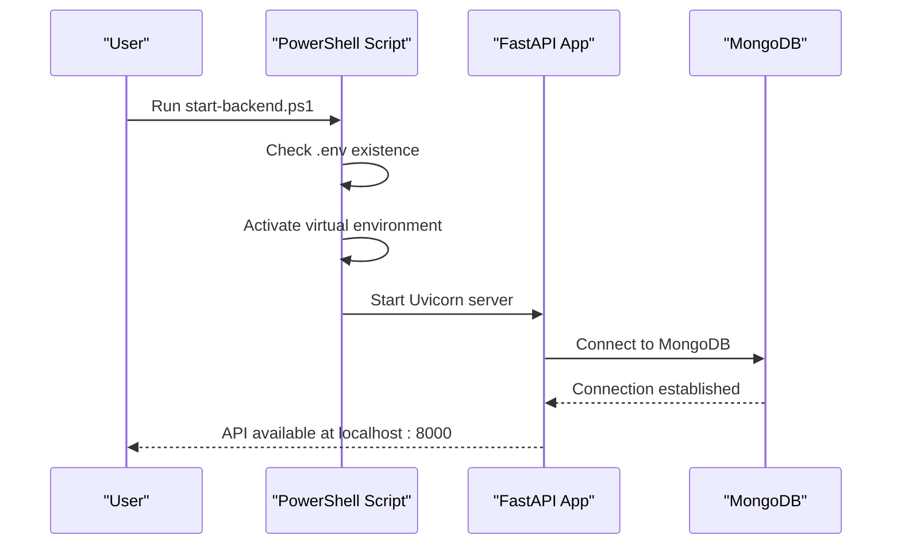

# Getting Started

<cite>
**Referenced Files in This Document**
- [requirements.txt](file://backend/requirements.txt)
- [Dockerfile](file://backend/Dockerfile)
- [docker-compose.yml](file://backend/docker-compose.yml)
- [package.json](file://frontend/package.json)
- [start-backend.ps1](file://start-backend.ps1)
- [start-fullstack.ps1](file://start-fullstack.ps1)
- [main.py](file://backend/app/main.py)
- [config.py](file://backend/app/core/config.py)
- [mongodb.py](file://backend/app/db/mongodb.py)
- [create_admin_user.py](file://backend/create_admin_user.py)
- [create_admin_simple.py](file://backend/create_admin_simple.py)
- [reset.py](file://backend/reset.py)
</cite>

## Table of Contents
1. [Introduction](#introduction)
2. [Prerequisites](#prerequisites)
3. [Installation](#installation)
4. [Environment Configuration](#environment-configuration)
5. [Startup Procedures](#startup-procedures)
6. [First-Time Setup](#first-time-setup)
7. [Verification Checklist](#verification-checklist)
8. [Troubleshooting Guide](#troubleshooting-guide)
9. [Conclusion](#conclusion)

## Introduction
ShedMaster is an AI-powered timetable generation system for educational institutions, compliant with NEP 2020. It consists of a FastAPI backend with MongoDB storage and a React frontend. The system supports constraint-based scheduling, AI optimization via Google Gemini, and multi-format exports.

## Prerequisites
Before installing ShedMaster, ensure your environment meets the following requirements:

- Python 3.8 or higher
- Node.js 16 or higher
- MongoDB (local or cloud Atlas)
- Google Gemini API key (for AI features)

These requirements are derived from:
- Backend dependencies including FastAPI, Uvicorn, Pydantic, Motor, PyMongo, google-generativeai, and others
- Frontend dependencies managed via Node.js and npm
- MongoDB connectivity for the backend
- Google Gemini integration for AI features

**Section sources**
- [requirements.txt:1-19](file://backend/requirements.txt#L1-L19)
- [package.json:1-46](file://frontend/package.json#L1-L46)

## Installation

### Development Environment
Follow these steps to set up ShedMaster for development:

1. Clone the repository to your local machine.
2. Navigate to the backend directory and create a Python virtual environment:
   - Use Python 3.8+ to create and activate a virtual environment.
3. Install backend dependencies:
   - Run pip install with the provided requirements file.
4. Navigate to the frontend directory and install Node.js dependencies:
   - Use npm install to install all frontend packages.
5. Prepare environment variables:
   - Create a .env file in the backend directory with required variables (see Environment Configuration).
6. Start the backend:
   - Use the provided PowerShell script to launch the backend server.
7. Start the frontend:
   - From the frontend directory, run npm run dev to start the React development server.

Key references:
- Backend dependencies and runtime requirements
- Frontend package management
- PowerShell startup scripts for backend and full-stack

**Section sources**
- [requirements.txt:1-19](file://backend/requirements.txt#L1-L19)
- [package.json:1-46](file://frontend/package.json#L1-L46)
- [start-backend.ps1:1-35](file://start-backend.ps1#L1-L35)
- [start-fullstack.ps1:1-39](file://start-fullstack.ps1#L1-L39)

### Production Environment
For production deployment, use Docker Compose:

1. Build the Docker images:
   - The backend Dockerfile defines the base image, dependencies, and runtime command.
2. Start services:
   - The docker-compose.yml file orchestrates the backend and MongoDB containers.
3. Configure environment variables:
   - Set MONGODB_URL, DATABASE_NAME, and SECRET_KEY in your environment or compose file.
4. Access the application:
   - Backend API runs on port 8000; MongoDB runs on port 27017.

Key references:
- Dockerfile configuration for Python 3.9 slim image and Uvicorn command
- docker-compose.yml defining app and mongo services with volume mounts

**Section sources**
- [Dockerfile:1-24](file://backend/Dockerfile#L1-L24)
- [docker-compose.yml:1-30](file://backend/docker-compose.yml#L1-L30)

## Environment Configuration
Configure the following environment variables for proper operation:

- MONGODB_URL: MongoDB connection string (local or Atlas)
- DATABASE_NAME: Target database name (default timetable_system)
- SECRET_KEY: Secret key for JWT tokens
- GOOGLE_GEMINI_API_KEY: API key for Google Gemini (required for AI features)
- ALLOWED_ORIGINS: Comma-separated list of allowed CORS origins (optional)
- API_V1_STR: API version prefix (default /api/v1)

Configuration behavior:
- Settings are loaded from a .env file using Pydantic settings
- CORS middleware allows configured origins for cross-origin requests
- MongoDB connection is tested during startup with a ping command

Important defaults and validations:
- Default MONGODB_URL points to localhost:27017
- Default DATABASE_NAME is timetable_system1
- SECRET_KEY must be set for secure token operations
- ALLOWED_ORIGINS accepts a comma-separated string or list

**Section sources**
- [config.py:1-61](file://backend/app/core/config.py#L1-L61)
- [main.py:56-64](file://backend/app/main.py#L56-L64)
- [mongodb.py:11-33](file://backend/app/db/mongodb.py#L11-L33)

## Startup Procedures

### Using PowerShell Scripts
The repository provides convenient startup scripts:

- start-backend.ps1:
  - Checks for .env presence
  - Activates the Python virtual environment
  - Starts the FastAPI server with hot reload
  - Sets MONGODB_URL to localhost:27017
  - Exposes API docs at /docs

- start-fullstack.ps1:
  - Launches both backend and frontend in separate PowerShell windows
  - Starts backend on port 8000
  - Starts frontend on port 5173 (Vite default)

Startup flow:

**Diagram sources**
- [start-backend.ps1:1-35](file://start-backend.ps1#L1-L35)
- [main.py:25-31](file://backend/app/main.py#L25-L31)
- [mongodb.py:11-26](file://backend/app/db/mongodb.py#L11-L26)

**Section sources**
- [start-backend.ps1:1-35](file://start-backend.ps1#L1-L35)
- [start-fullstack.ps1:1-39](file://start-fullstack.ps1#L1-L39)

### Using Docker Compose
Production startup with Docker Compose:

1. Build and start services:
   - The compose file builds the backend image and starts MongoDB
   - Backend container exposes port 8000
   - MongoDB container persists data in a named volume

2. Service dependencies:
   - Backend depends on MongoDB service
   - Volume mounting enables live code updates for development

**Section sources**
- [docker-compose.yml:1-30](file://backend/docker-compose.yml#L1-L30)
- [Dockerfile:15-23](file://backend/Dockerfile#L15-L23)

## First-Time Setup

### Initial Admin User Creation
Create the default administrator account using one of the provided scripts:

- create_admin_user.py:
  - Connects to MongoDB on localhost:27017
  - Creates an admin user with email admin@example.com
  - Uses bcrypt to hash the default password admin123

- create_admin_simple.py:
  - Uses the application's database connection utility
  - Provides detailed feedback on connection and creation process
  - Handles existing user detection

Reset procedure:
- reset.py removes existing admin users for clean re-initialization

Default credentials:
- Email: admin@example.com
- Password: admin123

**Section sources**
- [create_admin_user.py:1-46](file://backend/create_admin_user.py#L1-L46)
- [create_admin_simple.py:1-61](file://backend/create_admin_simple.py#L1-L61)
- [reset.py:1-12](file://backend/reset.py#L1-L12)

## Verification Checklist

### Backend Health Checks
After startup, verify the backend is running correctly:

1. Root endpoint:
   - GET / should return application metadata and feature list

2. Health check:
   - GET /health should return a healthy status response

3. CORS validation:
   - GET /test-cors and POST /test-cors should succeed
   - Verify allowed origins include frontend URLs

4. API documentation:
   - Open /docs to access interactive API documentation

5. MongoDB connection:
   - Check logs for successful connection messages
   - Confirm database name matches configuration

**Section sources**
- [main.py:66-102](file://backend/app/main.py#L66-L102)
- [mongodb.py:11-33](file://backend/app/db/mongodb.py#L11-L33)

### Frontend Integration
Verify frontend connectivity:

1. Start frontend with npm run dev
2. Access http://localhost:5173
3. Confirm API requests reach backend at http://localhost:8000
4. Test login with default admin credentials

**Section sources**
- [package.json:6-12](file://frontend/package.json#L6-L12)

## Troubleshooting Guide

### Common Installation Issues

- Python environment problems:
  - Ensure Python 3.8+ is installed and accessible
  - Recreate virtual environment if dependencies fail

- Node.js dependencies:
  - Clear npm cache if package installation fails
  - Verify Node.js 16+ requirement

- MongoDB connectivity:
  - Check MONGODB_URL format and accessibility
  - For local MongoDB, ensure the service is running on localhost:27017
  - Verify DATABASE_NAME matches the configured value

- CORS errors:
  - Add frontend origins to ALLOWED_ORIGINS
  - Ensure CORS middleware configuration matches actual ports

- Docker-related issues:
  - Rebuild images after dependency changes
  - Check volume permissions for persistent data

### Environment Configuration Problems

- Missing .env file:
  - The backend startup script requires a .env file
  - Ensure all required variables are present

- API key issues:
  - Verify GOOGLE_GEMINI_API_KEY is set for AI features
  - Check quota and billing configuration in Google Cloud Console

- Port conflicts:
  - Backend runs on port 8000 by default
  - Frontend runs on port 5173 by default
  - Adjust ports if conflicts exist

**Section sources**
- [start-backend.ps1:7-16](file://start-backend.ps1#L7-L16)
- [config.py:14-23](file://backend/app/core/config.py#L14-L23)
- [docker-compose.yml:8-18](file://backend/docker-compose.yml#L8-L18)

## Conclusion
You now have the essential information to install, configure, and run ShedMaster. Use the provided scripts for quick startup, configure environment variables according to your deployment needs, and follow the verification checklist to ensure everything is working correctly. For production deployments, prefer Docker Compose as outlined in the installation guide.