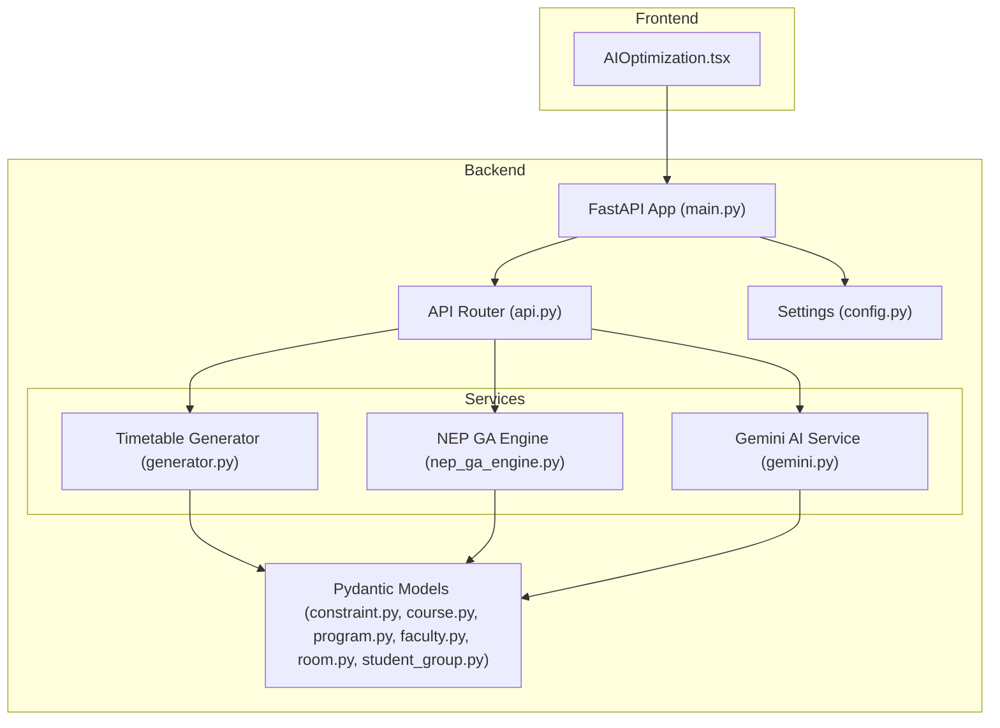
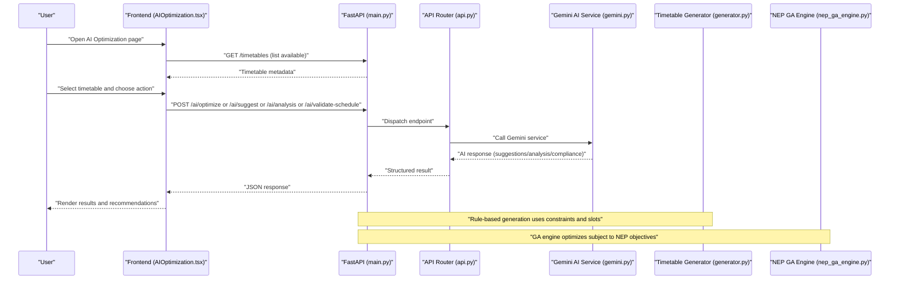
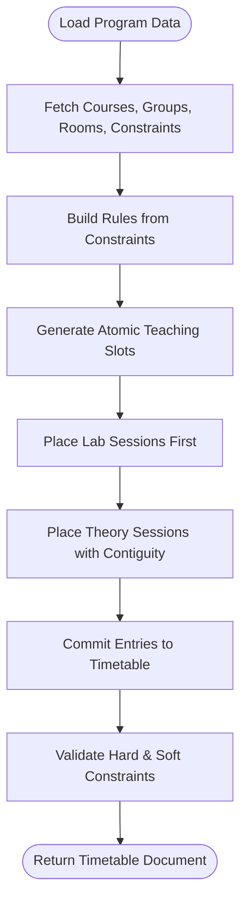
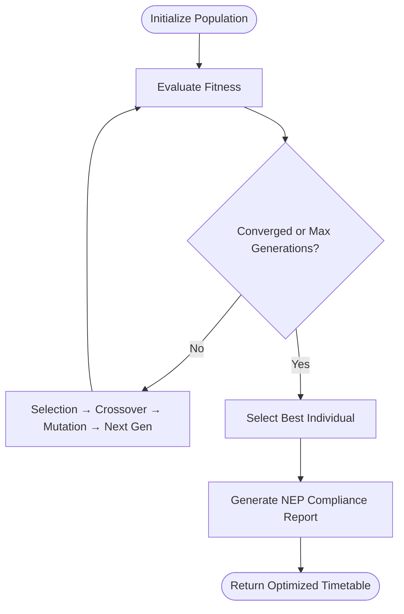
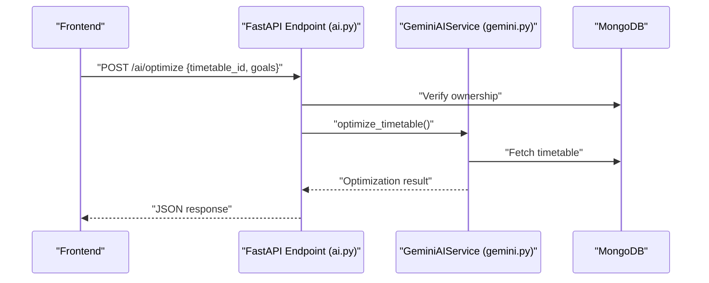
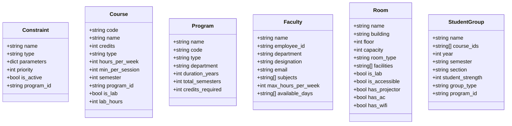
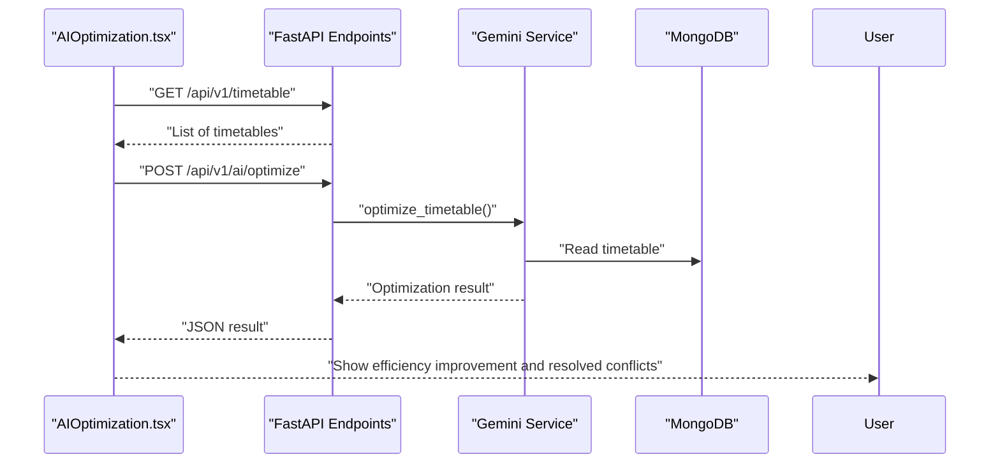
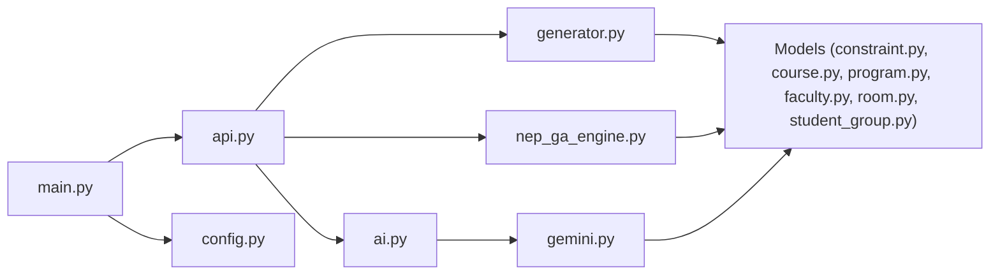

# Introduction and Purpose

<cite>
**Referenced Files in This Document**
- [main.py](file://backend/app/main.py)
- [api.py](file://backend/app/api/api_v1/api.py)
- [generator.py](file://backend/app/services/timetable/generator.py)
- [nep_ga_engine.py](file://backend/app/services/timetable/nep_ga_engine.py)
- [gemini.py](file://backend/app/services/ai/gemini.py)
- [ai.py](file://backend/app/api/v1/endpoints/ai.py)
- [config.py](file://backend/app/core/config.py)
- [constraint.py](file://backend/app/models/constraint.py)
- [course.py](file://backend/app/models/course.py)
- [program.py](file://backend/app/models/program.py)
- [faculty.py](file://backend/app/models/faculty.py)
- [room.py](file://backend/app/models/room.py)
- [student_group.py](file://backend/app/models/student_group.py)
- [AIOptimization.tsx](file://frontend/src/components/pages/AIOptimization.tsx)
</cite>

## Table of Contents
1. [Introduction](#introduction)
2. [Project Structure](#project-structure)
3. [Core Components](#core-components)
4. [Architecture Overview](#architecture-overview)
5. [Detailed Component Analysis](#detailed-component-analysis)
6. [Dependency Analysis](#dependency-analysis)
7. [Performance Considerations](#performance-considerations)
8. [Troubleshooting Guide](#troubleshooting-guide)
9. [Conclusion](#conclusion)

## Introduction
ShedMaster is an AI-powered academic timetable system designed to modernize and optimize scheduling workflows in educational institutions. Its mission is to streamline timetable creation while ensuring compliance with the National Education Policy (NEP) 2020. The platform combines human expertise with AI-driven optimization to address persistent challenges in academic scheduling, including manual inefficiencies, constraint violations, workload imbalances, and lack of holistic planning.

Key objectives:
- Automate and improve the timetable generation process using constraint-based logic and AI.
- Enforce NEP 2020 guidelines such as practical/theory balance, multidisciplinary integration, continuous evaluation support, and faculty workload limits.
- Reduce administrative burden and human error through intelligent scheduling engines and AI-assisted insights.
- Provide actionable analytics and suggestions to continuously improve timetables.

Target institutions:
- Universities and colleges adopting NEP 2020 frameworks.
- Institutions transitioning to Choice-Based Credit System (CBCS) and flexible academic structures.
- Schools requiring robust scheduling for practical labs, workshops, and research time allocation.

Value proposition:
- Constraint-first generation with NEP-aware optimization.
- AI-powered suggestions, analyses, and compliance validation.
- Human-in-the-loop governance with transparent controls and iterative refinement.

## Project Structure
The system follows a layered architecture:
- Backend: FastAPI server exposing REST endpoints, MongoDB persistence, and AI services.
- AI Services: Gemini-based optimization, suggestions, and NEP compliance validation.
- Timetable Engines: Rule-based generator and NEP-aligned genetic algorithm engine.
- Frontend: React-based UI enabling timetable creation, AI optimization, and analytics.

**Diagram sources**
- [main.py:33-101](file://backend/app/main.py#L33-L101)
- [api.py:1-34](file://backend/app/api/api_v1/api.py#L1-L34)
- [generator.py:163-401](file://backend/app/services/timetable/generator.py#L163-L401)
- [nep_ga_engine.py:33-127](file://backend/app/services/timetable/nep_ga_engine.py#L33-L127)
- [gemini.py:9-288](file://backend/app/services/ai/gemini.py#L9-L288)
- [constraint.py:6-30](file://backend/app/models/constraint.py#L6-L30)
- [course.py:6-43](file://backend/app/models/course.py#L6-L43)
- [program.py:6-33](file://backend/app/models/program.py#L6-L33)
- [faculty.py:5-39](file://backend/app/models/faculty.py#L5-L39)
- [room.py:6-43](file://backend/app/models/room.py#L6-L43)
- [student_group.py:5-36](file://backend/app/models/student_group.py#L5-L36)
- [config.py:7-61](file://backend/app/core/config.py#L7-L61)

**Section sources**
- [main.py:33-101](file://backend/app/main.py#L33-L101)
- [api.py:1-34](file://backend/app/api/api_v1/api.py#L1-L34)

## Core Components
- Constraint-based Timetable Generator: Implements hard and soft constraints, atomic time slots, and placement heuristics for labs and theory courses.
- NEP-2020 Compliant Genetic Algorithm Engine: Extends optimization with NEP-specific objectives such as practical/theory ratios, faculty workload limits, and multidisciplinary balance.
- Gemini AI Service: Provides optimization suggestions, efficiency analysis, NEP compliance validation, and natural language assistance.
- API Endpoints: Secure endpoints for AI optimization, suggestions, analysis, NEP validation, and constraint management.
- Pydantic Data Models: Strongly typed models for constraints, courses, programs, faculty, rooms, and student groups.

These components work together to transform raw academic data and institutional policies into efficient, compliant, and balanced timetables.

**Section sources**
- [generator.py:163-401](file://backend/app/services/timetable/generator.py#L163-L401)
- [nep_ga_engine.py:33-127](file://backend/app/services/timetable/nep_ga_engine.py#L33-L127)
- [gemini.py:9-288](file://backend/app/services/ai/gemini.py#L9-L288)
- [ai.py:46-266](file://backend/app/api/v1/endpoints/ai.py#L46-L266)
- [constraint.py:6-30](file://backend/app/models/constraint.py#L6-L30)
- [course.py:6-43](file://backend/app/models/course.py#L6-L43)
- [program.py:6-33](file://backend/app/models/program.py#L6-L33)
- [faculty.py:5-39](file://backend/app/models/faculty.py#L5-L39)
- [room.py:6-43](file://backend/app/models/room.py#L6-L43)
- [student_group.py:5-36](file://backend/app/models/student_group.py#L5-L36)

## Architecture Overview
The system’s runtime flow integrates frontend interactions, backend orchestration, and AI services to produce optimized timetables.

**Diagram sources**
- [main.py:66-101](file://backend/app/main.py#L66-L101)
- [api.py:1-34](file://backend/app/api/api_v1/api.py#L1-L34)
- [gemini.py:18-154](file://backend/app/services/ai/gemini.py#L18-L154)
- [generator.py:235-401](file://backend/app/services/timetable/generator.py#L235-L401)
- [nep_ga_engine.py:259-318](file://backend/app/services/timetable/nep_ga_engine.py#L259-L318)
- [AIOptimization.tsx:121-372](file://frontend/src/components/pages/AIOptimization.tsx#L121-L372)

## Detailed Component Analysis

### Constraint-Based Timetable Generator
The generator loads program, course, group, room, and constraint data, constructs atomic time slots, and places labs first followed by theory sessions. It enforces hard constraints (room/faculty/group availability) and respects soft constraints (preferences, contiguous periods, and NEP-aligned rules).

**Diagram sources**
- [generator.py:169-233](file://backend/app/services/timetable/generator.py#L169-L233)
- [generator.py:273-301](file://backend/app/services/timetable/generator.py#L273-L301)
- [generator.py:303-379](file://backend/app/services/timetable/generator.py#L303-L379)
- [generator.py:380-401](file://backend/app/services/timetable/generator.py#L380-L401)

**Section sources**
- [generator.py:163-401](file://backend/app/services/timetable/generator.py#L163-L401)

### NEP-2020 Compliant Genetic Algorithm Engine
The NEP GA engine evolves feasible solutions using a population of chromosomes representing course sessions. Fitness considers hard constraints, soft preferences, NEP compliance (workload, practical/theory balance, multidisciplinary distribution), and general optimization metrics. It tracks convergence and produces a best timetable with compliance reports.

**Diagram sources**
- [nep_ga_engine.py:259-318](file://backend/app/services/timetable/nep_ga_engine.py#L259-L318)
- [nep_ga_engine.py:350-430](file://backend/app/services/timetable/nep_ga_engine.py#L350-L430)
- [nep_ga_engine.py:453-527](file://backend/app/services/timetable/nep_ga_engine.py#L453-L527)
- [nep_ga_engine.py:722-794](file://backend/app/services/timetable/nep_ga_engine.py#L722-L794)

**Section sources**
- [nep_ga_engine.py:33-127](file://backend/app/services/timetable/nep_ga_engine.py#L33-L127)
- [nep_ga_engine.py:259-318](file://backend/app/services/timetable/nep_ga_engine.py#L259-L318)
- [nep_ga_engine.py:453-527](file://backend/app/services/timetable/nep_ga_engine.py#L453-L527)

### Gemini AI Service and API Endpoints
The AI service integrates with Google Gemini to provide optimization suggestions, efficiency analysis, NEP compliance validation, and natural language assistance. The API endpoints enforce user ownership checks and delegate to the AI service.

**Diagram sources**
- [ai.py:46-73](file://backend/app/api/v1/endpoints/ai.py#L46-L73)
- [gemini.py:18-60](file://backend/app/services/ai/gemini.py#L18-L60)
- [config.py:34-35](file://backend/app/core/config.py#L34-L35)

**Section sources**
- [gemini.py:9-288](file://backend/app/services/ai/gemini.py#L9-L288)
- [ai.py:46-266](file://backend/app/api/v1/endpoints/ai.py#L46-L266)
- [config.py:34-35](file://backend/app/core/config.py#L34-L35)

### Data Models and Domain Entities
The system models core entities with strict validation:
- Constraint: Named, typed, prioritized scheduling rules with parameters.
- Course: Academic offerings with credits, hours, lab flags, and semester mapping.
- Program: Academic program definition with type, duration, and semester count.
- Faculty: Teaching capacity, availability, and subject specializations.
- Room: Facilities, capacity, accessibility, and type (classroom vs lab).
- Student Group: Cohorts grouped by year, semester, section, and course enrollments.

**Diagram sources**
- [constraint.py:6-30](file://backend/app/models/constraint.py#L6-L30)
- [course.py:6-43](file://backend/app/models/course.py#L6-L43)
- [program.py:6-33](file://backend/app/models/program.py#L6-L33)
- [faculty.py:5-39](file://backend/app/models/faculty.py#L5-L39)
- [room.py:6-43](file://backend/app/models/room.py#L6-L43)
- [student_group.py:5-36](file://backend/app/models/student_group.py#L5-L36)

**Section sources**
- [constraint.py:6-30](file://backend/app/models/constraint.py#L6-L30)
- [course.py:6-43](file://backend/app/models/course.py#L6-L43)
- [program.py:6-33](file://backend/app/models/program.py#L6-L33)
- [faculty.py:5-39](file://backend/app/models/faculty.py#L5-L39)
- [room.py:6-43](file://backend/app/models/room.py#L6-L43)
- [student_group.py:5-36](file://backend/app/models/student_group.py#L5-L36)

### Frontend Integration and User Experience
The frontend provides a tabbed interface for AI optimization, suggestions, analysis, chatbot assistance, and NEP compliance validation. It interacts with backend endpoints to fetch available timetables, run AI tasks, and render results with progress indicators and actionable insights.

**Diagram sources**
- [AIOptimization.tsx:162-201](file://frontend/src/components/pages/AIOptimization.tsx#L162-L201)
- [AIOptimization.tsx:214-255](file://frontend/src/components/pages/AIOptimization.tsx#L214-L255)
- [AIOptimization.tsx:258-276](file://frontend/src/components/pages/AIOptimization.tsx#L258-L276)
- [AIOptimization.tsx:279-311](file://frontend/src/components/pages/AIOptimization.tsx#L279-L311)
- [AIOptimization.tsx:344-372](file://frontend/src/components/pages/AIOptimization.tsx#L344-L372)

**Section sources**
- [AIOptimization.tsx:121-372](file://frontend/src/components/pages/AIOptimization.tsx#L121-L372)

## Dependency Analysis
High-level dependencies:
- FastAPI app initializes MongoDB connections and registers routers.
- API router aggregates endpoints for users, auth, programs, courses, timetable, templates, constraints, faculty, student groups, rooms, rules, and AI.
- Timetable services depend on Pydantic models and MongoDB collections.
- AI service depends on configuration for Gemini API key and MongoDB for data retrieval.

**Diagram sources**
- [main.py:25-101](file://backend/app/main.py#L25-L101)
- [api.py:1-34](file://backend/app/api/api_v1/api.py#L1-L34)
- [ai.py:1-362](file://backend/app/api/v1/endpoints/ai.py#L1-L362)
- [gemini.py:1-288](file://backend/app/services/ai/gemini.py#L1-L288)
- [generator.py:1-402](file://backend/app/services/timetable/generator.py#L1-L402)
- [nep_ga_engine.py:1-794](file://backend/app/services/timetable/nep_ga_engine.py#L1-L794)
- [config.py:1-61](file://backend/app/core/config.py#L1-L61)

**Section sources**
- [main.py:25-101](file://backend/app/main.py#L25-L101)
- [api.py:1-34](file://backend/app/api/api_v1/api.py#L1-L34)
- [ai.py:1-362](file://backend/app/api/v1/endpoints/ai.py#L1-L362)
- [gemini.py:1-288](file://backend/app/services/ai/gemini.py#L1-L288)
- [generator.py:1-402](file://backend/app/services/timetable/generator.py#L1-L402)
- [nep_ga_engine.py:1-794](file://backend/app/services/timetable/nep_ga_engine.py#L1-L794)
- [config.py:1-61](file://backend/app/core/config.py#L1-L61)

## Performance Considerations
- Timetable generation scales with the number of courses, groups, and time slots. Using atomic slots and early pruning reduces search space.
- The NEP GA engine balances population size, generations, and mutation rates to manage compute costs while maintaining solution quality.
- AI requests are asynchronous and rely on external APIs; caching and rate limiting should be considered at the gateway or client layer.
- Frontend rendering of large timetables benefits from pagination and virtualization; current UI components indicate tabular displays suitable for moderate datasets.

## Troubleshooting Guide
Common issues and resolutions:
- AI service not configured: If the Gemini API key is missing, AI endpoints return configuration errors. Set the key in environment variables and restart the backend.
- Ownership validation failures: AI endpoints require the timetable to belong to the requesting user; ensure the correct user context and timetable ID.
- MongoDB connectivity: Verify connection settings and database availability; startup/shutdown hooks manage lifecycle.
- CORS errors: Confirm allowed origins and frontend port alignment; the backend exposes explicit CORS configuration.

**Section sources**
- [config.py:34-35](file://backend/app/core/config.py#L34-L35)
- [ai.py:54-63](file://backend/app/api/v1/endpoints/ai.py#L54-L63)
- [main.py:56-64](file://backend/app/main.py#L56-L64)

## Conclusion
ShedMaster delivers a comprehensive, NEP 2020-aligned solution for academic timetabling by merging constraint-based generation with AI-powered insights. It empowers institutions to automate complex scheduling decisions, reduce manual effort, and maintain compliance while preserving human oversight. Through modular services, strong data models, and an intuitive frontend, ShedMaster accelerates the path toward efficient, fair, and future-ready academic calendars.