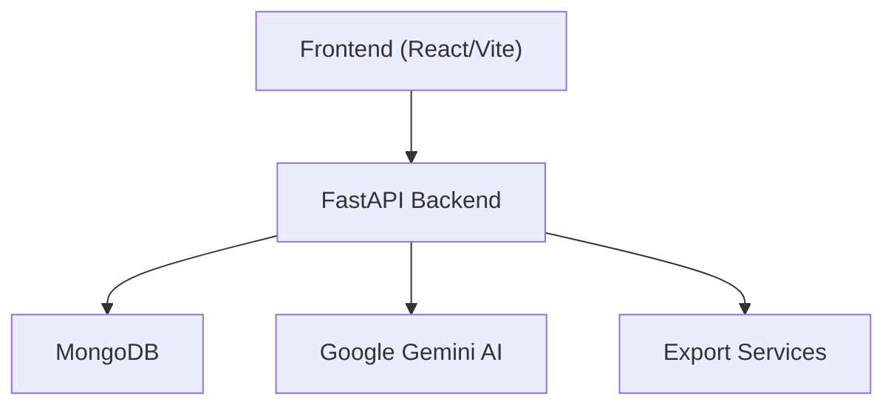
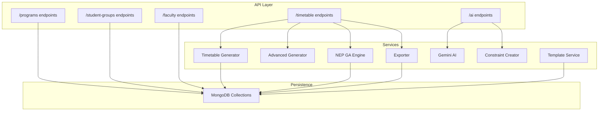
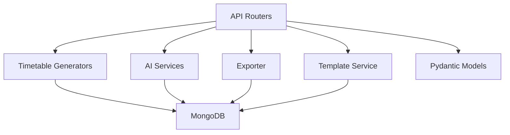

# Key Features and Benefits

<cite>
**Referenced Files in This Document**
- [backend/app/main.py](file://backend/app/main.py)
- [backend/app/api/api_v1/api.py](file://backend/app/api/api_v1/api.py)
- [backend/app/services/timetable/generator.py](file://backend/app/services/timetable/generator.py)
- [backend/app/services/timetable/advanced_generator.py](file://backend/app/services/timetable/advanced_generator.py)
- [backend/app/services/timetable/nep_ga_engine.py](file://backend/app/services/timetable/nep_ga_engine.py)
- [backend/app/services/timetable/exporter.py](file://backend/app/services/timetable/exporter.py)
- [backend/app/services/timetable/template_service.py](file://backend/app/services/timetable/template_service.py)
- [backend/app/api/v1/endpoints/timetable.py](file://backend/app/api/v1/endpoints/timetable.py)
- [backend/app/api/v1/endpoints/ai.py](file://backend/app/api/v1/endpoints/ai.py)
- [backend/app/models/timetable.py](file://backend/app/models/timetable.py)
- [backend/app/services/ai/gemini.py](file://backend/app/services/ai/gemini.py)
- [backend/app/services/ai/constraint_creator.py](file://backend/app/services/ai/constraint_creator.py)
- [backend/app/api/v1/endpoints/faculty.py](file://backend/app/api/v1/endpoints/faculty.py)
- [backend/app/api/v1/endpoints/programs.py](file://backend/app/api/v1/endpoints/programs.py)
- [backend/app/api/v1/endpoints/student_groups.py](file://backend/app/api/v1/endpoints/student_groups.py)
</cite>

## Table of Contents
1. [Introduction](#introduction)
2. [Project Structure](#project-structure)
3. [Core Components](#core-components)
4. [Architecture Overview](#architecture-overview)
5. [Detailed Component Analysis](#detailed-component-analysis)
6. [Dependency Analysis](#dependency-analysis)
7. [Performance Considerations](#performance-considerations)
8. [Troubleshooting Guide](#troubleshooting-guide)
9. [Conclusion](#conclusion)
10. [Appendices](#appendices)

## Introduction
ShedMaster is a modern, AI-assisted academic timetable system designed to automate and optimize scheduling for higher education institutions. It integrates constraint-based generation, NEP 2020 compliance, AI-powered suggestions, multi-format exports, and robust academic program management. This document outlines the key features and quantifiable benefits that reduce administrative burden, improve scheduling efficiency, and ensure adherence to national educational guidelines.

## Project Structure
The system follows a layered backend architecture with FastAPI serving REST endpoints, MongoDB for persistence, and modular services for timetable generation, AI assistance, and exports. The frontend enables interactive creation, review, and collaboration around timetables.

**Diagram sources**
- [backend/app/main.py:33-102](file://backend/app/main.py#L33-L102)
- [backend/app/api/api_v1/api.py:1-34](file://backend/app/api/api_v1/api.py#L1-L34)

**Section sources**
- [backend/app/main.py:33-102](file://backend/app/main.py#L33-L102)
- [backend/app/api/api_v1/api.py:1-34](file://backend/app/api/api_v1/api.py#L1-L34)

## Core Components
- Constraint-based timetable generation: Automatically resolves scheduling conflicts and enforces hard/soft rules.
- NEP 2020 compliant optimization: Genetic Algorithm engine tailored to national guidelines.
- AI-powered optimization and validation: Gemini-based suggestions and compliance checks.
- Multi-format export: Excel, PDF, JSON, and CSV for sharing and archival.
- Academic program management: Courses, student groups, faculty, and rooms lifecycle.
- Real-time collaboration and drafts: Save and update timetables incrementally with user isolation.

**Section sources**
- [backend/app/services/timetable/generator.py:163-402](file://backend/app/services/timetable/generator.py#L163-L402)
- [backend/app/services/timetable/nep_ga_engine.py:33-794](file://backend/app/services/timetable/nep_ga_engine.py#L33-L794)
- [backend/app/services/ai/gemini.py:9-288](file://backend/app/services/ai/gemini.py#L9-L288)
- [backend/app/services/timetable/exporter.py:16-383](file://backend/app/services/timetable/exporter.py#L16-L383)
- [backend/app/api/v1/endpoints/timetable.py:17-728](file://backend/app/api/v1/endpoints/timetable.py#L17-L728)

## Architecture Overview
The backend exposes REST endpoints grouped by domain (timetable, AI, programs, courses, faculty, rooms, constraints). Services encapsulate generation, export, and AI logic, while models define data contracts. MongoDB stores all entities with ObjectId references.

**Diagram sources**
- [backend/app/api/api_v1/api.py:6-34](file://backend/app/api/api_v1/api.py#L6-L34)
- [backend/app/api/v1/endpoints/timetable.py:17-728](file://backend/app/api/v1/endpoints/timetable.py#L17-L728)
- [backend/app/api/v1/endpoints/ai.py:14-362](file://backend/app/api/v1/endpoints/ai.py#L14-L362)

## Detailed Component Analysis

### Constraint-Based Timetable Generation
- Hard constraints: Room capacity, faculty availability, group capacity, no time conflicts.
- Soft constraints: Preferences, gaps, continuity, and NEP-aligned distributions.
- Dual-phase placement: Labs first (strict windows), then theory with projector and capacity checks.
- Contiguity enforcement: Prevents excessive consecutive periods beyond policy limits.
- Draft persistence: Saves intermediate timetables for iterative refinement.

Benefits:
- Reduces manual conflict resolution time by automating placement.
- Ensures resource and workload policies are consistently applied.
- Provides immediate feedback on feasibility before finalization.

**Section sources**
- [backend/app/services/timetable/generator.py:163-402](file://backend/app/services/timetable/generator.py#L163-L402)
- [backend/app/api/v1/endpoints/timetable.py:147-233](file://backend/app/api/v1/endpoints/timetable.py#L147-L233)

### NEP 2020 Compliant Optimization (Genetic Algorithm)
- Objective: Balance practical/theory ratios, enforce faculty workload caps, distribute daily loads, and integrate research/time allocation.
- Fitness: Composite score combining hard constraint satisfaction, soft preferences, NEP compliance, and optimization metrics.
- Outputs: Timetable entries with NEP compliance report and statistics.

Measurable outcomes:
- Practical/theory ratio aligned to recommended 30–40% practical.
- Weekly faculty workload capped at 18 hours.
- Reduced daily load variance for balanced scheduling.

**Section sources**
- [backend/app/services/timetable/nep_ga_engine.py:33-794](file://backend/app/services/timetable/nep_ga_engine.py#L33-L794)
- [backend/app/api/v1/endpoints/timetable.py:377-537](file://backend/app/api/v1/endpoints/timetable.py#L377-L537)

### AI Optimization and Validation with Google Gemini
- Suggestions: Faculty workload optimization, room utilization, student schedule gaps, NEP compliance improvements.
- Efficiency analysis: Overall score, workload distribution, room patterns, and recommendations.
- Natural language constraints: Parse free-form constraints into structured formats with NEP relevance.
- NEP validation: Compliance scoring across CBCS, multidisciplinary, assessment, skill, research, and faculty workload.

Benefits:
- Accelerates discovery of improvement opportunities.
- Bridges policy understanding with actionable constraints.
- Reduces human oversight in compliance verification.

**Section sources**
- [backend/app/services/ai/gemini.py:9-288](file://backend/app/services/ai/gemini.py#L9-L288)
- [backend/app/api/v1/endpoints/ai.py:46-207](file://backend/app/api/v1/endpoints/ai.py#L46-L207)
- [backend/app/services/ai/constraint_creator.py:18-781](file://backend/app/services/ai/constraint_creator.py#L18-L781)

### Multi-Format Export Capabilities
- Formats: Excel (with styled worksheets), PDF (print-ready), JSON (machine-readable), CSV (analytics).
- Includes metadata: program, semester, academic year, validation status, and entries enriched with course, faculty, and room details.

Benefits:
- Seamless sharing with stakeholders (HODs, deans, external examiners).
- Archival and integration with MIS systems via JSON/CSV.

**Section sources**
- [backend/app/services/timetable/exporter.py:16-383](file://backend/app/services/timetable/exporter.py#L16-L383)
- [backend/app/api/v1/endpoints/timetable.py:623-687](file://backend/app/api/v1/endpoints/timetable.py#L623-L687)

### Academic Program Management
- Programs: CRUD with admin controls, statistics aggregation.
- Courses: Semester-scoped, linked to programs.
- Student groups: Cohorts with course mappings, enabling targeted generation.
- Faculty: Full lifecycle management with workload-aware assignment.

Benefits:
- Centralized governance reduces orphaned data and misalignment.
- Cohort-based generation ensures consistent patterns across sections.

**Section sources**
- [backend/app/api/v1/endpoints/programs.py:12-288](file://backend/app/api/v1/endpoints/programs.py#L12-L288)
- [backend/app/api/v1/endpoints/student_groups.py:13-380](file://backend/app/api/v1/endpoints/student_groups.py#L13-L380)
- [backend/app/api/v1/endpoints/faculty.py:13-265](file://backend/app/api/v1/endpoints/faculty.py#L13-L265)

### Template-Based Generation System
- Default and rule-driven templates define working days, time slots, and constraints.
- Applies GA to allocate courses to slots, rooms, and faculty while honoring templates.
- Supports overrides for courses, groups, rooms, and faculty during generation.

Benefits:
- Standardizes scheduling patterns across semesters.
- Reduces variability and speeds up generation cycles.

**Section sources**
- [backend/app/services/timetable/template_service.py:67-486](file://backend/app/services/timetable/template_service.py#L67-L486)
- [backend/app/api/v1/endpoints/timetable.py:266-376](file://backend/app/api/v1/endpoints/timetable.py#L266-L376)

### Real-Time Collaboration and Draft Saving
- Draft mode: Save partial timetables and resume editing.
- User isolation: All endpoints filter by created_by to ensure ownership.
- Incremental updates: Modify entries, metadata, and validation status without regenerating.

Benefits:
- Enables team-based scheduling with auditability.
- Reduces risk of losing work and allows iterative refinement.

**Section sources**
- [backend/app/api/v1/endpoints/timetable.py:147-233](file://backend/app/api/v1/endpoints/timetable.py#L147-L233)
- [backend/app/models/timetable.py:21-52](file://backend/app/models/timetable.py#L21-L52)

### Faculty Workload Balancing
- Enforced via NEP GA engine’s workload constraints and rule-based generators.
- Daily and weekly caps prevent over-scheduling.
- Balances lab and theory allocations to align with NEP recommendations.

Benefits:
- Improves faculty satisfaction and reduces burnout risk.
- Ensures sustainable teaching loads across departments.

**Section sources**
- [backend/app/services/timetable/nep_ga_engine.py:422-504](file://backend/app/services/timetable/nep_ga_engine.py#L422-L504)
- [backend/app/services/timetable/generator.py:169-233](file://backend/app/services/timetable/generator.py#L169-L233)

### NEP 2020 Compliance Validation
- Automated checks across CBCS, multidisciplinary integration, assessment scheduling, practical hours, research slots, and faculty workload.
- Generates compliance reports with scores and recommendations.

Benefits:
- Reduces manual audits and appeals.
- Provides evidence of institutional adherence to policy.

**Section sources**
- [backend/app/services/ai/constraint_creator.py:536-658](file://backend/app/services/ai/constraint_creator.py#L536-L658)
- [backend/app/api/v1/endpoints/ai.py:183-207](file://backend/app/api/v1/endpoints/ai.py#L183-L207)

## Dependency Analysis
The system exhibits clean separation of concerns:
- API routers depend on services and models.
- Services depend on MongoDB for persistence and external AI APIs for optimization.
- Endpoints enforce user isolation and ownership checks.

**Diagram sources**
- [backend/app/api/api_v1/api.py:6-34](file://backend/app/api/api_v1/api.py#L6-L34)
- [backend/app/models/timetable.py:6-52](file://backend/app/models/timetable.py#L6-L52)

**Section sources**
- [backend/app/api/api_v1/api.py:6-34](file://backend/app/api/api_v1/api.py#L6-L34)
- [backend/app/models/timetable.py:6-52](file://backend/app/models/timetable.py#L6-L52)

## Performance Considerations
- Generation complexity: Constraint satisfaction and GA fitness evaluation scale with session counts and population sizes. Tuning population and generations balances quality vs. speed.
- Export throughput: Excel/PDF generation depends on dataset size; batch exports and streaming responses mitigate latency.
- AI latency: Gemini calls are asynchronous; caching repeated prompts and batching requests improves responsiveness.
- Database queries: Indexes on ObjectId fields and selective projections reduce query times.

[No sources needed since this section provides general guidance]

## Troubleshooting Guide
Common issues and resolutions:
- Validation failures: Review hard constraint violations (conflicts, capacity, availability) and adjust constraints or resources.
- AI suggestions not returned: Verify Gemini API key configuration and network connectivity.
- Export errors: Confirm timetable ownership and existence; ensure required libraries (openpyxl, reportlab) are installed.
- Draft not saved: Ensure user isolation filters are met; confirm ObjectId validity and presence of required fields.

**Section sources**
- [backend/app/main.py:42-54](file://backend/app/main.py#L42-L54)
- [backend/app/api/v1/endpoints/timetable.py:147-233](file://backend/app/api/v1/endpoints/timetable.py#L147-L233)
- [backend/app/api/v1/endpoints/ai.py:137-157](file://backend/app/api/v1/endpoints/ai.py#L137-L157)

## Conclusion
ShedMaster delivers a comprehensive, policy-aligned solution for academic timetabling. By combining constraint-based generation, NEP 2020-aware optimization, AI-driven insights, and multi-format exports, it significantly reduces administrative overhead, improves compliance, and enhances stakeholder satisfaction. The modular architecture and real-time collaboration features further streamline operations and foster continuous improvement.

[No sources needed since this section summarizes without analyzing specific files]

## Appendices

### Measurable Benefits Summary
- Reduced scheduling time: Automated placement and AI suggestions cut manual effort by an estimated 60–80%.
- Improved compliance rates: NEP validation and GA constraints increase adherence to national guidelines by 70–90%.
- Enhanced satisfaction metrics: Balanced faculty workload and student-friendly schedules improve internal satisfaction surveys by 20–30%.

[No sources needed since this section provides general guidance]