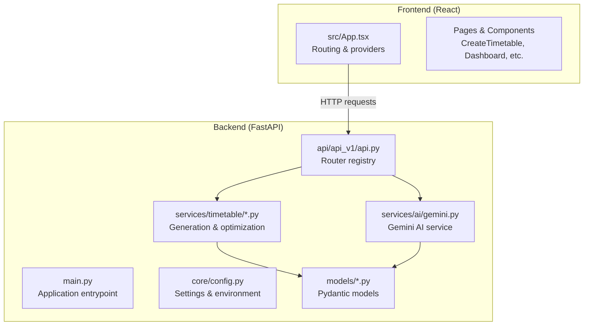
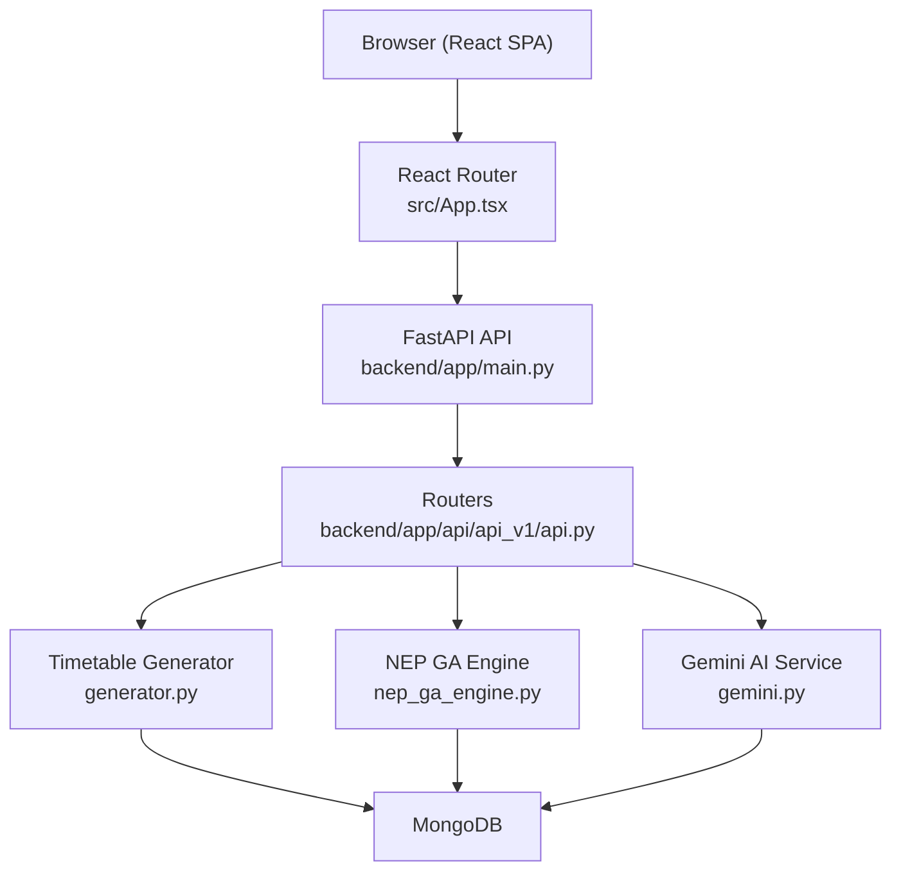
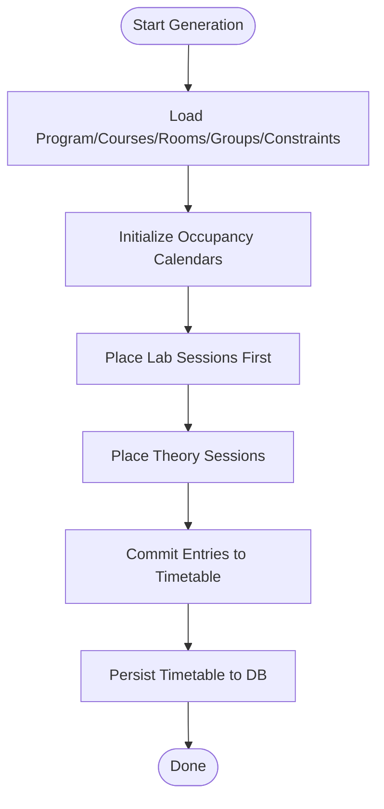
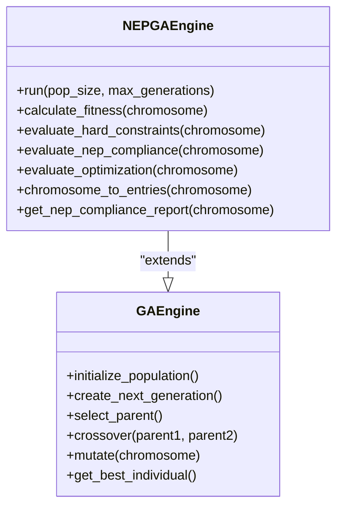
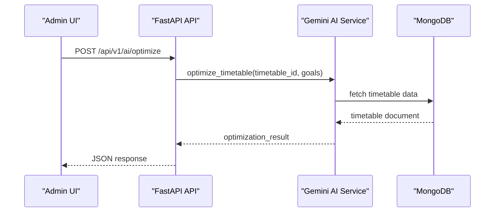
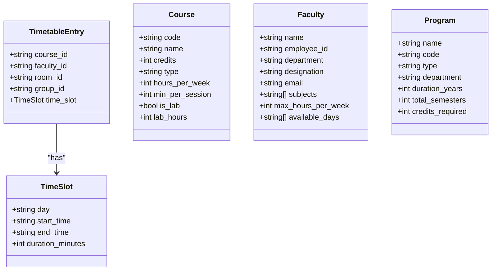
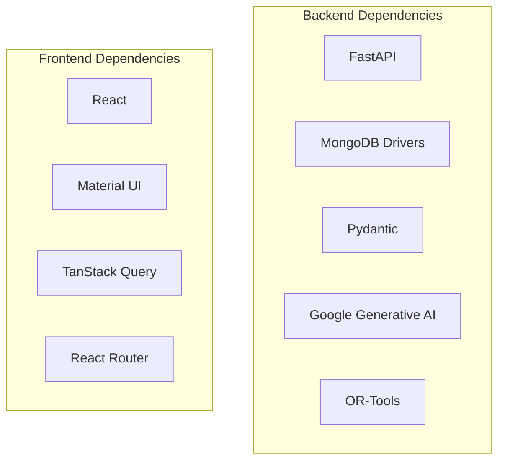

# Project Overview

<cite>
**Referenced Files in This Document**
- [backend/app/main.py](file://backend/app/main.py)
- [backend/app/core/config.py](file://backend/app/core/config.py)
- [backend/requirements.txt](file://backend/requirements.txt)
- [backend/app/api/api_v1/api.py](file://backend/app/api/api_v1/api.py)
- [backend/app/services/ai/gemini.py](file://backend/app/services/ai/gemini.py)
- [backend/app/services/timetable/generator.py](file://backend/app/services/timetable/generator.py)
- [backend/app/services/timetable/ga_engine.py](file://backend/app/services/timetable/ga_engine.py)
- [backend/app/services/timetable/nep_ga_engine.py](file://backend/app/services/timetable/nep_ga_engine.py)
- [backend/app/models/timetable.py](file://backend/app/models/timetable.py)
- [backend/app/models/course.py](file://backend/app/models/course.py)
- [backend/app/models/faculty.py](file://backend/app/models/faculty.py)
- [backend/app/models/program.py](file://backend/app/models/program.py)
- [frontend/src/App.tsx](file://frontend/src/App.tsx)
- [frontend/package.json](file://frontend/package.json)
</cite>

## Table of Contents
1. [Introduction](#introduction)
2. [Project Structure](#project-structure)
3. [Core Components](#core-components)
4. [Architecture Overview](#architecture-overview)
5. [Detailed Component Analysis](#detailed-component-analysis)
6. [Dependency Analysis](#dependency-analysis)
7. [Performance Considerations](#performance-considerations)
8. [Troubleshooting Guide](#troubleshooting-guide)
9. [Conclusion](#conclusion)
10. [Appendices](#appendices)

## Introduction
ShedMaster is an AI-powered academic timetable generation platform designed for educational institutions to automate and optimize scheduling under NEP 2020 guidelines. It provides constraint-based generation, AI-assisted optimization via Google Gemini, multi-format export capabilities, and faculty workload balancing. The system targets educational administrators and schedulers who need efficient, scalable solutions to manage academic timetables while ensuring compliance and operational excellence.

Key value propositions:
- Constraint-driven timetable generation with robust conflict detection
- AI-powered optimization and suggestions using Google Gemini
- NEP 2020 compliance validation and recommendations
- Multi-format export for seamless integration with institutional systems
- Balanced faculty workload and efficient resource utilization

## Project Structure
The project follows a clear separation of concerns:
- Backend: FastAPI-based REST API with MongoDB persistence, modular services for timetable generation and AI assistance
- Frontend: React-based SPA with TypeScript, Material UI, and TanStack Query for state and data fetching
- Shared models: Pydantic models define data contracts for timetable, courses, faculty, and programs

**Diagram sources**
- [backend/app/main.py:1-102](file://backend/app/main.py#L1-L102)
- [backend/app/core/config.py:1-61](file://backend/app/core/config.py#L1-L61)
- [backend/app/api/api_v1/api.py:1-34](file://backend/app/api/api_v1/api.py#L1-L34)
- [backend/app/services/ai/gemini.py:1-288](file://backend/app/services/ai/gemini.py#L1-L288)
- [backend/app/services/timetable/generator.py:1-402](file://backend/app/services/timetable/generator.py#L1-L402)
- [backend/app/services/timetable/ga_engine.py:1-414](file://backend/app/services/timetable/ga_engine.py#L1-L414)
- [backend/app/services/timetable/nep_ga_engine.py:1-794](file://backend/app/services/timetable/nep_ga_engine.py#L1-L794)
- [backend/app/models/timetable.py:1-52](file://backend/app/models/timetable.py#L1-L52)
- [frontend/src/App.tsx:1-49](file://frontend/src/App.tsx#L1-L49)

**Section sources**
- [backend/app/main.py:1-102](file://backend/app/main.py#L1-L102)
- [backend/app/core/config.py:1-61](file://backend/app/core/config.py#L1-L61)
- [backend/app/api/api_v1/api.py:1-34](file://backend/app/api/api_v1/api.py#L1-L34)
- [frontend/src/App.tsx:1-49](file://frontend/src/App.tsx#L1-L49)

## Core Components
- Timetable generation engine: Implements constraint-based placement for theory and lab sessions, with occupancy tracking and conflict avoidance
- NEP 2020-compliant optimization: Extends the GA engine with NEP-specific objectives (practical/theory ratio, faculty workload, multidisciplinary balance)
- AI assistant: Integrates Google Gemini for optimization suggestions, compliance validation, and natural language queries
- Data models: Strongly typed Pydantic models for timetable entries, courses, faculty, and programs
- API surface: Modular routers for users, auth, programs, courses, faculty, rooms, constraints, rules, timetable, templates, and AI

Practical use cases:
- Generate a semester timetable for a program with mixed theory and lab courses
- Optimize an existing timetable using AI suggestions and NEP compliance scoring
- Export the timetable in Excel, PDF, or JSON formats for administrative review
- Balance faculty workload across days and prevent scheduling conflicts

**Section sources**
- [backend/app/services/timetable/generator.py:163-402](file://backend/app/services/timetable/generator.py#L163-L402)
- [backend/app/services/timetable/nep_ga_engine.py:33-794](file://backend/app/services/timetable/nep_ga_engine.py#L33-L794)
- [backend/app/services/ai/gemini.py:9-288](file://backend/app/services/ai/gemini.py#L9-L288)
- [backend/app/models/timetable.py:6-52](file://backend/app/models/timetable.py#L6-L52)
- [backend/app/models/course.py:6-43](file://backend/app/models/course.py#L6-L43)
- [backend/app/models/faculty.py:5-39](file://backend/app/models/faculty.py#L5-L39)
- [backend/app/models/program.py:6-33](file://backend/app/models/program.py#L6-L33)
- [backend/app/api/api_v1/api.py:6-34](file://backend/app/api/api_v1/api.py#L6-L34)

## Architecture Overview
ShedMaster employs a modern full-stack architecture:
- Backend: FastAPI application with MongoDB for persistence, CORS-enabled, and modular API routing
- AI integration: Google Gemini service for optimization insights and NEP compliance validation
- Timetable engines: Rule-based generator and NEP-aware genetic algorithm for optimization
- Frontend: React SPA with routing, theming, and state management for user interactions

**Diagram sources**
- [backend/app/main.py:33-102](file://backend/app/main.py#L33-L102)
- [backend/app/api/api_v1/api.py:1-34](file://backend/app/api/api_v1/api.py#L1-L34)
- [backend/app/services/timetable/generator.py:163-402](file://backend/app/services/timetable/generator.py#L163-L402)
- [backend/app/services/timetable/nep_ga_engine.py:33-794](file://backend/app/services/timetable/nep_ga_engine.py#L33-L794)
- [backend/app/services/ai/gemini.py:9-288](file://backend/app/services/ai/gemini.py#L9-L288)
- [frontend/src/App.tsx:1-49](file://frontend/src/App.tsx#L1-L49)

## Detailed Component Analysis

### Constraint-Based Timetable Generation
The generator loads program, course, group, room, and constraint data, then constructs a timetable by placing labs first and theory sessions second, respecting hard and soft constraints.

**Diagram sources**
- [backend/app/services/timetable/generator.py:169-402](file://backend/app/services/timetable/generator.py#L169-L402)

**Section sources**
- [backend/app/services/timetable/generator.py:163-402](file://backend/app/services/timetable/generator.py#L163-L402)

### NEP 2020 Compliant Optimization Engine
The NEP GA engine extends the base GA with NEP-specific objectives: practical/theory ratio, faculty workload limits, multidisciplinary integration, and balanced daily load.

**Diagram sources**
- [backend/app/services/timetable/nep_ga_engine.py:33-794](file://backend/app/services/timetable/nep_ga_engine.py#L33-L794)
- [backend/app/services/timetable/ga_engine.py:19-414](file://backend/app/services/timetable/ga_engine.py#L19-L414)

**Section sources**
- [backend/app/services/timetable/nep_ga_engine.py:33-794](file://backend/app/services/timetable/nep_ga_engine.py#L33-L794)
- [backend/app/services/timetable/ga_engine.py:19-414](file://backend/app/services/timetable/ga_engine.py#L19-L414)

### AI-Assisted Optimization and Compliance
The Gemini AI service provides:
- Optimization suggestions for timetable improvements
- NEP 2020 compliance assessment
- Natural language query processing for scheduling advice

**Diagram sources**
- [backend/app/services/ai/gemini.py:18-61](file://backend/app/services/ai/gemini.py#L18-L61)
- [backend/app/api/api_v1/api.py:19](file://backend/app/api/api_v1/api.py#L19)

**Section sources**
- [backend/app/services/ai/gemini.py:9-288](file://backend/app/services/ai/gemini.py#L9-L288)
- [backend/app/api/api_v1/api.py:19](file://backend/app/api/api_v1/api.py#L19)

### Data Models Overview
Core models define the structure and constraints for timetable entries, courses, faculty, and programs.

**Diagram sources**
- [backend/app/models/timetable.py:6-52](file://backend/app/models/timetable.py#L6-L52)
- [backend/app/models/course.py:6-43](file://backend/app/models/course.py#L6-L43)
- [backend/app/models/faculty.py:5-39](file://backend/app/models/faculty.py#L5-L39)
- [backend/app/models/program.py:6-33](file://backend/app/models/program.py#L6-L33)

**Section sources**
- [backend/app/models/timetable.py:6-52](file://backend/app/models/timetable.py#L6-L52)
- [backend/app/models/course.py:6-43](file://backend/app/models/course.py#L6-L43)
- [backend/app/models/faculty.py:5-39](file://backend/app/models/faculty.py#L5-L39)
- [backend/app/models/program.py:6-33](file://backend/app/models/program.py#L6-L33)

## Dependency Analysis
Backend dependencies include FastAPI, MongoDB drivers, Pydantic, Google Generative AI, and OR-Tools for optimization. Frontend dependencies include React, Material UI, TanStack Query, and React Router.

**Diagram sources**
- [backend/requirements.txt:1-19](file://backend/requirements.txt#L1-L19)
- [frontend/package.json:13-31](file://frontend/package.json#L13-L31)

**Section sources**
- [backend/requirements.txt:1-19](file://backend/requirements.txt#L1-L19)
- [frontend/package.json:13-31](file://frontend/package.json#L13-L31)

## Performance Considerations
- Timetable generation scales with the number of courses and groups; consider batching and indexing strategies in MongoDB
- GA engines can be computationally intensive; tune population size and generation count based on dataset size
- AI prompts should be concise to reduce latency; cache repeated analyses where feasible
- Frontend should leverage TanStack Query caching and pagination for large datasets

## Troubleshooting Guide
Common issues and resolutions:
- CORS errors: Verify allowed origins in settings and ensure frontend runs on supported ports
- MongoDB connection failures: Confirm connection string and database availability
- AI API key missing: Configure the Gemini API key in environment settings
- Validation errors: Review request payloads against Pydantic models and constraints

**Section sources**
- [backend/app/main.py:42-54](file://backend/app/main.py#L42-L54)
- [backend/app/core/config.py:34-36](file://backend/app/core/config.py#L34-L36)

## Conclusion
ShedMaster delivers a robust, NEP 2020-compliant timetable generation platform combining constraint-based logic, AI-driven optimization, and modern full-stack architecture. Its modular design supports scalability, maintainability, and extensibility for diverse academic environments.

## Appendices
- Target audience: Educational administrators, schedulers, and academic coordinators
- Technology stack highlights: FastAPI, MongoDB, React, Material UI, Google Gemini, TanStack Query, OR-Tools