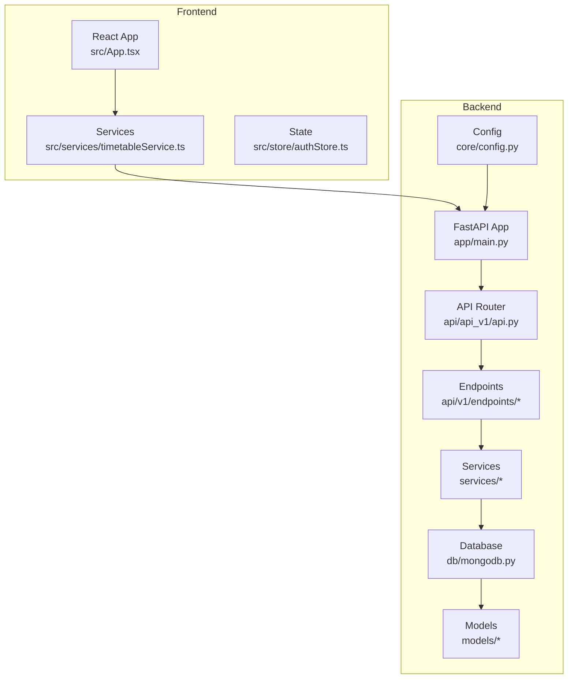
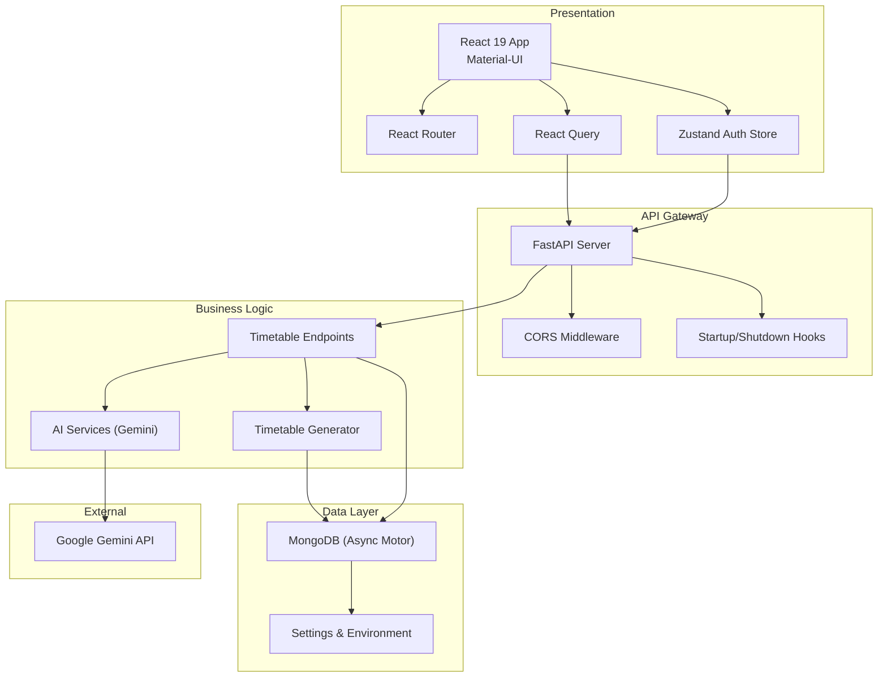
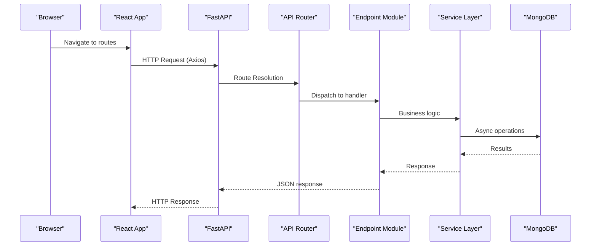
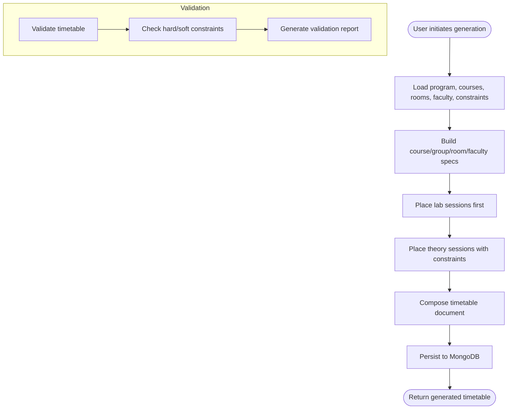
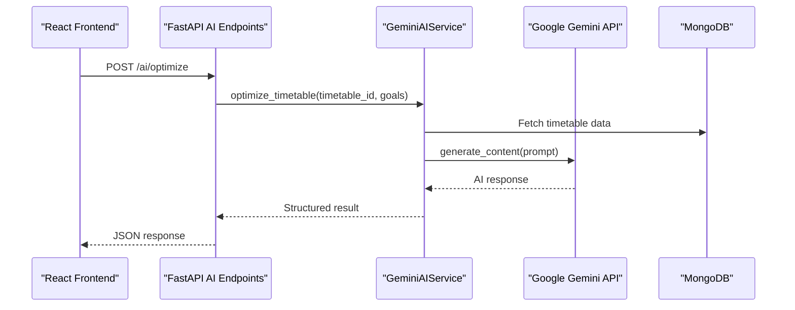
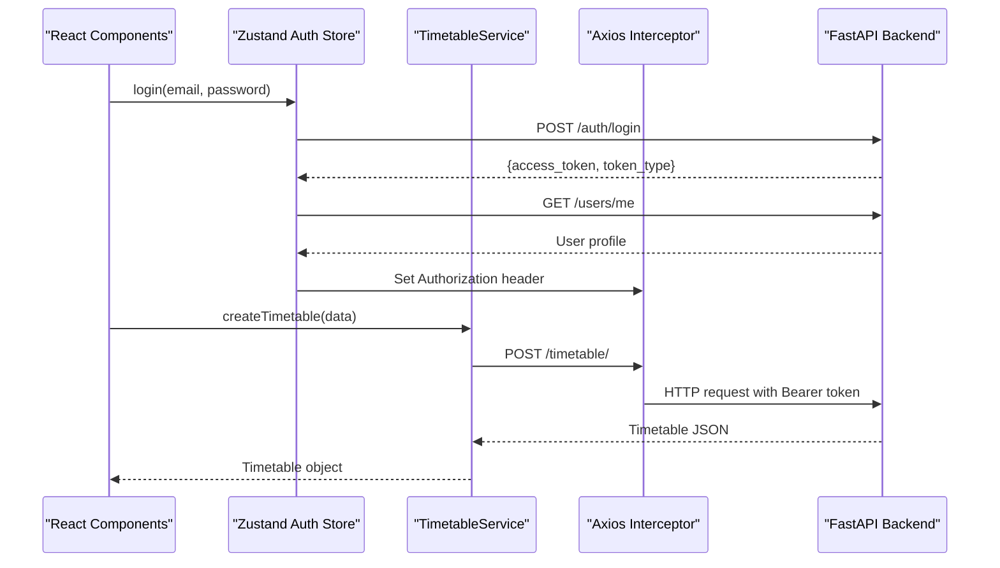
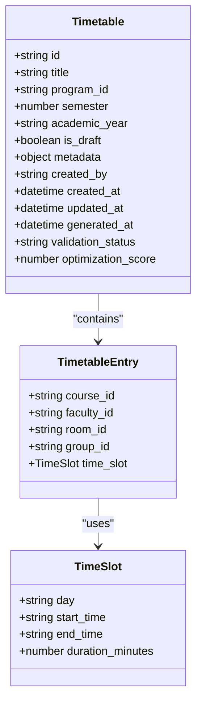
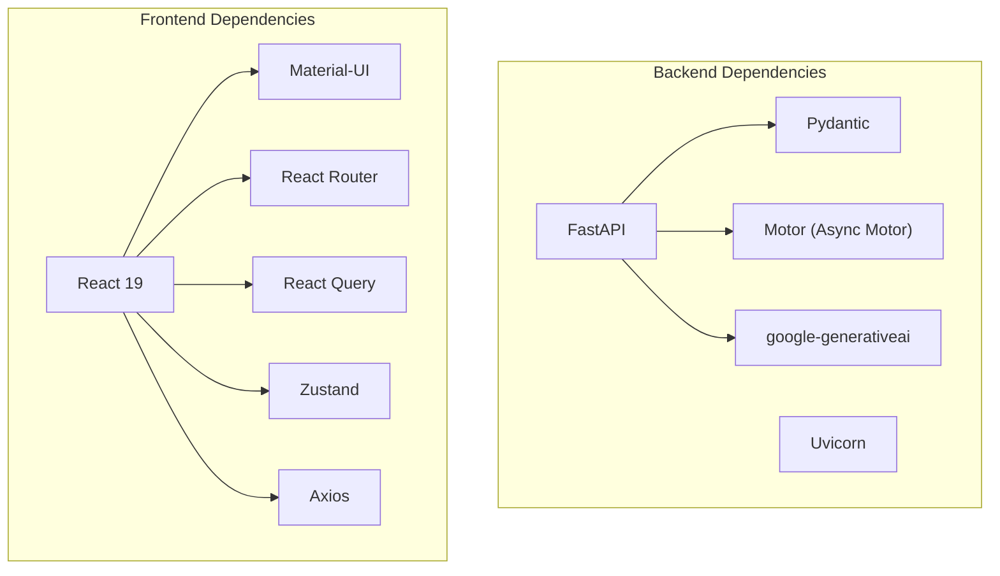
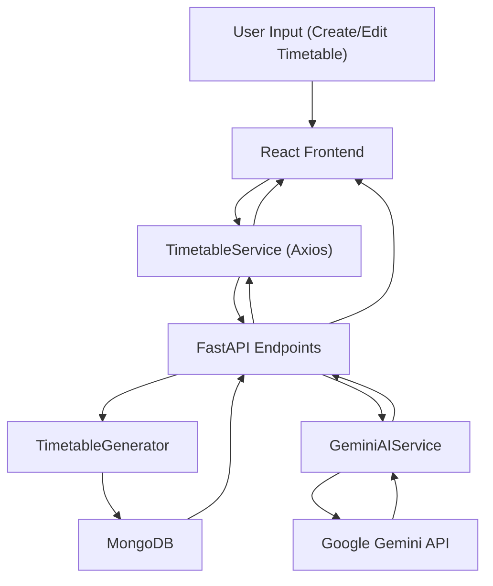

# System Architecture Overview

<cite>
**Referenced Files in This Document**
- [backend/app/main.py](file://backend/app/main.py)
- [backend/app/api/api_v1/api.py](file://backend/app/api/api_v1/api.py)
- [backend/app/db/mongodb.py](file://backend/app/db/mongodb.py)
- [backend/app/core/config.py](file://backend/app/core/config.py)
- [backend/app/api/v1/endpoints/timetable.py](file://backend/app/api/v1/endpoints/timetable.py)
- [backend/app/services/timetable/generator.py](file://backend/app/services/timetable/generator.py)
- [backend/app/services/ai/gemini.py](file://backend/app/services/ai/gemini.py)
- [backend/app/models/timetable.py](file://backend/app/models/timetable.py)
- [frontend/src/App.tsx](file://frontend/src/App.tsx)
- [frontend/src/services/timetableService.ts](file://frontend/src/services/timetableService.ts)
- [frontend/src/store/authStore.ts](file://frontend/src/store/authStore.ts)
- [frontend/package.json](file://frontend/package.json)
- [backend/requirements.txt](file://backend/requirements.txt)
</cite>

## Table of Contents
1. [Introduction](#introduction)
2. [Project Structure](#project-structure)
3. [Core Components](#core-components)
4. [Architecture Overview](#architecture-overview)
5. [Detailed Component Analysis](#detailed-component-analysis)
6. [Dependency Analysis](#dependency-analysis)
7. [Performance Considerations](#performance-considerations)
8. [Troubleshooting Guide](#troubleshooting-guide)
9. [Conclusion](#conclusion)
10. [Appendices](#appendices)

## Introduction
This document presents the system architecture for ShedMaster, a timetable generation platform for educational institutions. The system follows a clean separation of concerns with a FastAPI backend providing asynchronous MongoDB-backed REST APIs and a React 19 frontend leveraging Material-UI components. It integrates AI assistance via Google Gemini for optimization and validation, supports NEP 2020 compliance, and offers robust state management and client-server communication patterns.

## Project Structure
The repository is organized into two primary domains:
- Backend: FastAPI application with modular endpoint routers, service layers, and MongoDB integration
- Frontend: React 19 application with Material-UI, React Router, Zustand for state, and React Query for caching

**Diagram sources**
- [backend/app/main.py:1-102](file://backend/app/main.py#L1-L102)
- [backend/app/api/api_v1/api.py:1-34](file://backend/app/api/api_v1/api.py#L1-L34)
- [backend/app/db/mongodb.py:1-41](file://backend/app/db/mongodb.py#L1-L41)
- [backend/app/core/config.py:1-61](file://backend/app/core/config.py#L1-L61)
- [frontend/src/App.tsx:1-49](file://frontend/src/App.tsx#L1-L49)
- [frontend/src/services/timetableService.ts:1-772](file://frontend/src/services/timetableService.ts#L1-L772)
- [frontend/src/store/authStore.ts:1-248](file://frontend/src/store/authStore.ts#L1-L248)

**Section sources**
- [backend/app/main.py:1-102](file://backend/app/main.py#L1-L102)
- [backend/app/api/api_v1/api.py:1-34](file://backend/app/api/api_v1/api.py#L1-L34)
- [frontend/src/App.tsx:1-49](file://frontend/src/App.tsx#L1-L49)

## Core Components
- FastAPI Application: Central server with CORS middleware, health checks, and lifecycle hooks for MongoDB connections
- Endpoint Routers: Modular API organization under a single router with domain-specific prefixes (users, auth, programs, courses, timetable, constraints, faculty, student-groups, rooms, rules, ai)
- Service Layer: Business logic for timetable generation, AI optimization, and data export
- MongoDB Integration: Asynchronous Motor client with connection pooling and graceful fallback
- React Frontend: Component-driven UI with Material-UI, React Router for navigation, Zustand for global auth state, and React Query for data fetching

**Section sources**
- [backend/app/main.py:33-102](file://backend/app/main.py#L33-L102)
- [backend/app/api/api_v1/api.py:21-34](file://backend/app/api/api_v1/api.py#L21-L34)
- [backend/app/db/mongodb.py:11-41](file://backend/app/db/mongodb.py#L11-L41)
- [frontend/src/App.tsx:19-49](file://frontend/src/App.tsx#L19-L49)

## Architecture Overview
ShedMaster employs a layered architecture:
- Presentation Layer (React 19 + Material-UI): Handles UI rendering, routing, and user interactions
- Business Logic Layer (FastAPI + Services): Implements timetable generation, AI optimization, and validation
- Data Access Layer (MongoDB): Provides asynchronous persistence with ObjectId conversions and user isolation
- Integration Layer: Google Gemini API for AI assistance and external service integrations

**Diagram sources**
- [backend/app/main.py:25-102](file://backend/app/main.py#L25-L102)
- [backend/app/api/v1/endpoints/timetable.py:17-728](file://backend/app/api/v1/endpoints/timetable.py#L17-L728)
- [backend/app/services/ai/gemini.py:9-288](file://backend/app/services/ai/gemini.py#L9-L288)
- [backend/app/db/mongodb.py:11-41](file://backend/app/db/mongodb.py#L11-L41)
- [backend/app/core/config.py:7-61](file://backend/app/core/config.py#L7-L61)
- [frontend/src/App.tsx:19-49](file://frontend/src/App.tsx#L19-L49)
- [frontend/src/services/timetableService.ts:161-772](file://frontend/src/services/timetableService.ts#L161-L772)

## Detailed Component Analysis

### Backend Entry Point and Routing
The FastAPI application initializes MongoDB on startup, configures CORS for local development, and mounts the API router under a versioned prefix. The API router aggregates domain-specific routers, enabling microservices-like organization.

**Diagram sources**
- [backend/app/main.py:25-102](file://backend/app/main.py#L25-L102)
- [backend/app/api/api_v1/api.py:21-34](file://backend/app/api/api_v1/api.py#L21-L34)
- [backend/app/api/v1/endpoints/timetable.py:17-728](file://backend/app/api/v1/endpoints/timetable.py#L17-L728)
- [backend/app/db/mongodb.py:11-41](file://backend/app/db/mongodb.py#L11-L41)

**Section sources**
- [backend/app/main.py:25-102](file://backend/app/main.py#L25-L102)
- [backend/app/api/api_v1/api.py:21-34](file://backend/app/api/api_v1/api.py#L21-L34)

### Timetable Generation and Validation Pipeline
The timetable module orchestrates constraint-based generation, advanced template-based generation, NEP 2020 compliant optimization, and validation. It ensures user isolation by filtering records by the authenticated user and converts ObjectId fields for frontend compatibility.

**Diagram sources**
- [backend/app/api/v1/endpoints/timetable.py:234-376](file://backend/app/api/v1/endpoints/timetable.py#L234-L376)
- [backend/app/services/timetable/generator.py:169-402](file://backend/app/services/timetable/generator.py#L169-L402)

**Section sources**
- [backend/app/api/v1/endpoints/timetable.py:234-376](file://backend/app/api/v1/endpoints/timetable.py#L234-L376)
- [backend/app/services/timetable/generator.py:169-402](file://backend/app/services/timetable/generator.py#L169-L402)

### AI Optimization and Compliance
The AI service integrates with Google Gemini to provide optimization suggestions, efficiency analysis, NEP 2020 compliance validation, and natural language query processing. The service handles API key configuration and gracefully degrades when the key is unavailable.

**Diagram sources**
- [backend/app/services/ai/gemini.py:18-61](file://backend/app/services/ai/gemini.py#L18-L61)
- [backend/app/api/v1/endpoints/timetable.py:689-708](file://backend/app/api/v1/endpoints/timetable.py#L689-L708)

**Section sources**
- [backend/app/services/ai/gemini.py:9-288](file://backend/app/services/ai/gemini.py#L9-L288)
- [backend/app/api/v1/endpoints/timetable.py:689-708](file://backend/app/api/v1/endpoints/timetable.py#L689-L708)

### Client-Server Communication and State Management
The frontend uses Axios for HTTP communication, interceptors for authentication, and Zustand for global state. React Query manages caching and optimistic updates. Authentication state persists in localStorage and is propagated via axios defaults.

**Diagram sources**
- [frontend/src/store/authStore.ts:36-120](file://frontend/src/store/authStore.ts#L36-L120)
- [frontend/src/services/timetableService.ts:161-343](file://frontend/src/services/timetableService.ts#L161-L343)
- [frontend/src/App.tsx:19-49](file://frontend/src/App.tsx#L19-L49)

**Section sources**
- [frontend/src/store/authStore.ts:1-248](file://frontend/src/store/authStore.ts#L1-L248)
- [frontend/src/services/timetableService.ts:161-772](file://frontend/src/services/timetableService.ts#L161-L772)
- [frontend/src/App.tsx:19-49](file://frontend/src/App.tsx#L19-L49)

### Data Models and Persistence
Pydantic models define request/response schemas for timetables and related entities. MongoDB stores documents with ObjectId fields, and endpoints convert them to strings for frontend consumption. User isolation is enforced by filtering queries with the authenticated user’s ObjectId.

**Diagram sources**
- [backend/app/models/timetable.py:6-52](file://backend/app/models/timetable.py#L6-L52)

**Section sources**
- [backend/app/models/timetable.py:6-52](file://backend/app/models/timetable.py#L6-L52)
- [backend/app/api/v1/endpoints/timetable.py:47-114](file://backend/app/api/v1/endpoints/timetable.py#L47-L114)

## Dependency Analysis
The backend leverages FastAPI for routing and Pydantic for validation, Motor for asynchronous MongoDB operations, and Google Generative AI for external AI services. The frontend depends on React 19, Material-UI, React Router, React Query, and Zustand.

**Diagram sources**
- [backend/requirements.txt:1-19](file://backend/requirements.txt#L1-L19)
- [frontend/package.json:13-31](file://frontend/package.json#L13-L31)

**Section sources**
- [backend/requirements.txt:1-19](file://backend/requirements.txt#L1-L19)
- [frontend/package.json:13-31](file://frontend/package.json#L13-L31)

## Performance Considerations
- Asynchronous Operations: Motor enables non-blocking database operations, improving throughput under concurrent loads
- Pagination and Filtering: Endpoints support skip/limit and targeted filters to reduce payload sizes
- Caching: React Query caches responses to minimize redundant network calls
- Export Formats: Streaming responses for Excel/PDF reduce memory overhead during exports
- AI Calls: Gemini integration is optional and gracefully handled when API keys are absent

[No sources needed since this section provides general guidance]

## Troubleshooting Guide
Common issues and resolutions:
- MongoDB Connection Failures: The application attempts connection with timeouts and logs warnings; ensure the database is reachable and credentials are correct
- CORS Errors: Verify allowed origins match the frontend development server URLs
- Authentication Failures: Confirm tokens are present in localStorage and axios interceptors are applied
- AI Service Unavailable: When GEMINI_API_KEY is unset, AI endpoints return informative messages; configure the key to enable AI features

**Section sources**
- [backend/app/db/mongodb.py:11-41](file://backend/app/db/mongodb.py#L11-L41)
- [backend/app/main.py:56-64](file://backend/app/main.py#L56-L64)
- [frontend/src/store/authStore.ts:209-248](file://frontend/src/store/authStore.ts#L209-L248)
- [backend/app/services/ai/gemini.py:10-17](file://backend/app/services/ai/gemini.py#L10-L17)

## Conclusion
ShedMaster demonstrates a well-structured, scalable architecture combining FastAPI, asynchronous MongoDB, and a modern React frontend. The modular endpoint organization, robust service layer, and AI integration deliver a comprehensive solution for timetable generation with NEP 2020 compliance. The frontend’s state management and caching strategies ensure responsive interactions, while the backend’s design supports maintainability and extensibility.

[No sources needed since this section summarizes without analyzing specific files]

## Appendices

### Technology Stack Choices and Rationale
- FastAPI: High-performance ASGI framework with automatic OpenAPI documentation and Pydantic integration
- MongoDB (Motor): Flexible schema, horizontal scaling, and async support for I/O-bound workloads
- React 19 + Material-UI: Modern component model with a rich UI library for rapid development
- React Query: Efficient caching, background updates, and optimistic UI patterns
- Zustand: Lightweight global state management with minimal boilerplate
- Google Gemini: Natural language understanding and optimization insights for scheduling

**Section sources**
- [backend/requirements.txt:1-19](file://backend/requirements.txt#L1-L19)
- [frontend/package.json:13-31](file://frontend/package.json#L13-L31)

### Data Flow Architecture
The end-to-end flow from user input to AI optimization and persistence:

**Diagram sources**
- [frontend/src/services/timetableService.ts:161-772](file://frontend/src/services/timetableService.ts#L161-L772)
- [backend/app/api/v1/endpoints/timetable.py:17-728](file://backend/app/api/v1/endpoints/timetable.py#L17-L728)
- [backend/app/services/timetable/generator.py:169-402](file://backend/app/services/timetable/generator.py#L169-L402)
- [backend/app/services/ai/gemini.py:18-61](file://backend/app/services/ai/gemini.py#L18-L61)

### System Boundaries and Integration Points
- Internal Boundaries: Presentation (React), Business (FastAPI), Data (MongoDB)
- External Integrations: Google Gemini API for AI assistance
- Security: JWT-based authentication, user isolation via ObjectId filtering, CORS configuration

**Section sources**
- [backend/app/api/v1/endpoints/timetable.py:30-44](file://backend/app/api/v1/endpoints/timetable.py#L30-L44)
- [backend/app/core/config.py:29-32](file://backend/app/core/config.py#L29-L32)
- [backend/app/main.py:56-64](file://backend/app/main.py#L56-L64)

### Infrastructure Requirements and Deployment Topology
- Backend: Python runtime with FastAPI and Uvicorn; environment variables for database and AI keys
- Database: MongoDB replica set or cloud instance with async driver
- Frontend: Static build served via Nginx or CDN; ensure CORS alignment with backend origins
- Optional: Containerization with Docker and orchestration via docker-compose for local development

[No sources needed since this section provides general guidance]