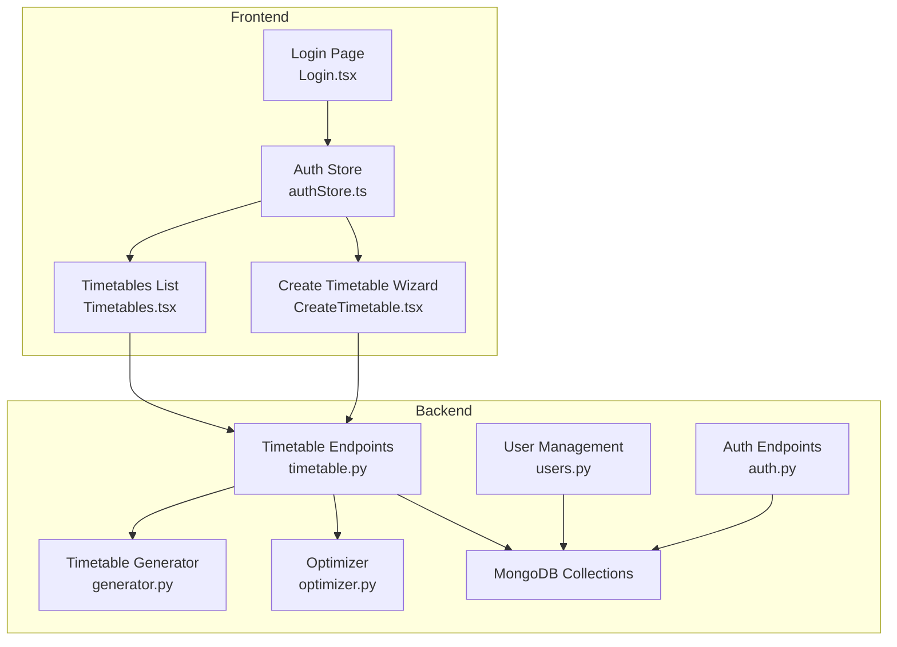
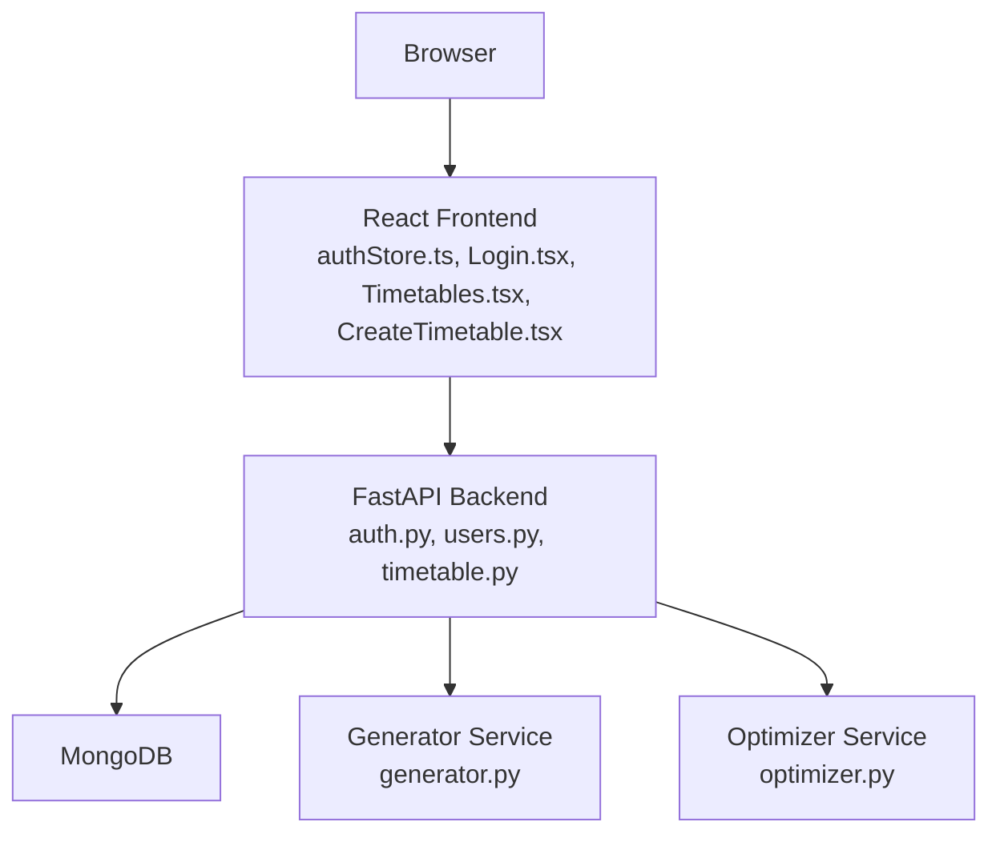
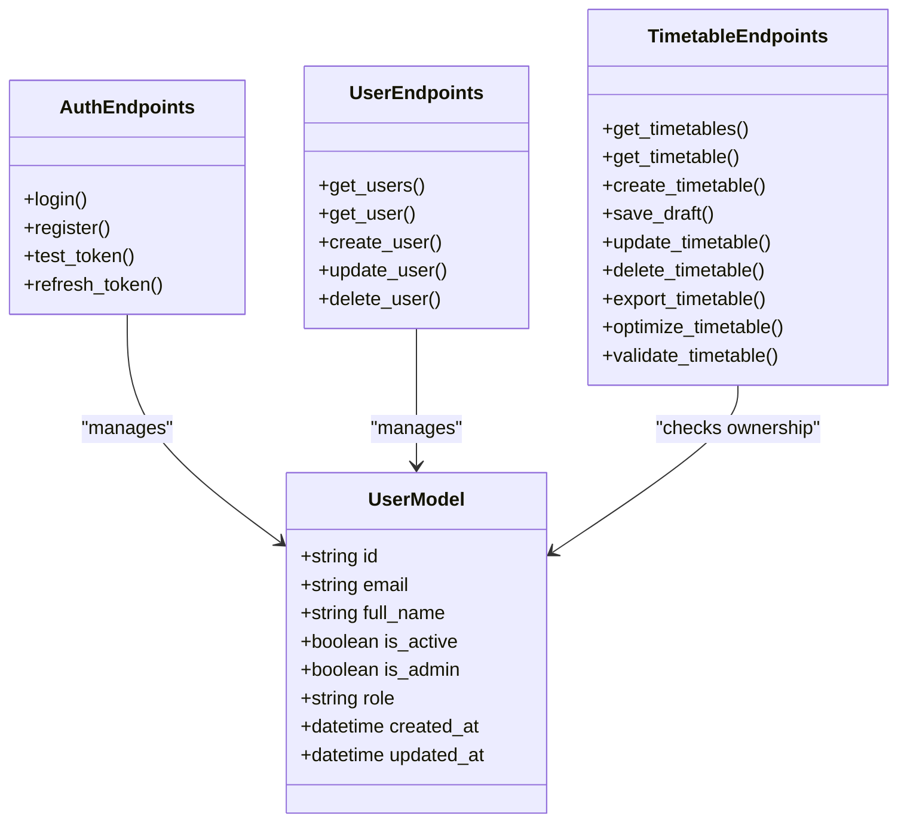
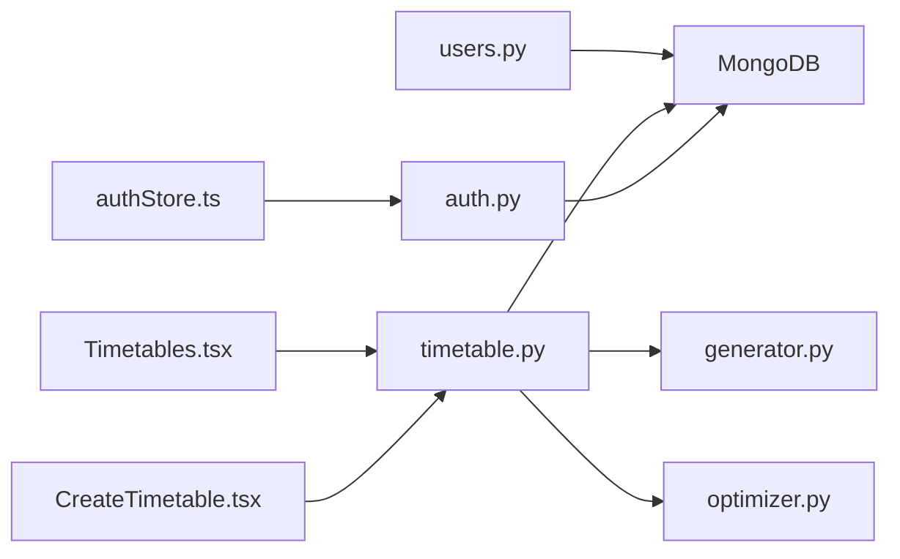

# Target Audience

<cite>
**Referenced Files in This Document**
- [user.py](file://backend/app/models/user.py)
- [users.py](file://backend/app/api/v1/endpoints/users.py)
- [auth.py](file://backend/app/api/v1/endpoints/auth.py)
- [timetable.py](file://backend/app/api/v1/endpoints/timetable.py)
- [generator.py](file://backend/app/services/timetable/generator.py)
- [optimizer.py](file://backend/app/services/ai/optimizer.py)
- [Login.tsx](file://frontend/src/components/pages/Login.tsx)
- [authStore.ts](file://frontend/src/store/authStore.ts)
- [Timetables.tsx](file://frontend/src/components/pages/Timetables.tsx)
- [CreateTimetable.tsx](file://frontend/src/components/pages/CreateTimetable.tsx)
- [Department_Information.csv](file://archive/Department_Information.csv)
- [Employee_Information.csv](file://archive/Employee_Information.csv)
</cite>

## Table of Contents
1. [Introduction](#introduction)
2. [Project Structure](#project-structure)
3. [Core Components](#core-components)
4. [Architecture Overview](#architecture-overview)
5. [Detailed Component Analysis](#detailed-component-analysis)
6. [Dependency Analysis](#dependency-analysis)
7. [Performance Considerations](#performance-considerations)
8. [Troubleshooting Guide](#troubleshooting-guide)
9. [Conclusion](#conclusion)
10. [Appendices](#appendices)

## Introduction
This document defines the target audience for the ShedMaster Academic Timetable System. It identifies primary and secondary users, outlines the role-based access control model, describes skill and training needs, and presents institutional demographics. It also explains decision drivers for adoption, common pain points with traditional scheduling, user personas, and onboarding/support considerations.

## Project Structure
ShedMaster is a full-stack academic scheduling platform with:
- Backend: FastAPI REST API with MongoDB persistence, providing user management, timetable lifecycle, generation, validation, optimization, and export.
- Frontend: React application with TypeScript, offering login, user management, timetable creation, editing, viewing, and export.

**Diagram sources**
- [Login.tsx:1-335](file://frontend/src/components/pages/Login.tsx#L1-L335)
- [authStore.ts:1-248](file://frontend/src/store/authStore.ts#L1-L248)
- [Timetables.tsx:1-529](file://frontend/src/components/pages/Timetables.tsx#L1-L529)
- [CreateTimetable.tsx:1-459](file://frontend/src/components/pages/CreateTimetable.tsx#L1-L459)
- [auth.py:1-123](file://backend/app/api/v1/endpoints/auth.py#L1-L123)
- [users.py:1-123](file://backend/app/api/v1/endpoints/users.py#L1-L123)
- [timetable.py:1-728](file://backend/app/api/v1/endpoints/timetable.py#L1-L728)
- [generator.py:1-402](file://backend/app/services/timetable/generator.py#L1-L402)
- [optimizer.py:1-59](file://backend/app/services/ai/optimizer.py#L1-L59)

**Section sources**
- [Login.tsx:1-335](file://frontend/src/components/pages/Login.tsx#L1-L335)
- [authStore.ts:1-248](file://frontend/src/store/authStore.ts#L1-L248)
- [Timetables.tsx:1-529](file://frontend/src/components/pages/Timetables.tsx#L1-L529)
- [CreateTimetable.tsx:1-459](file://frontend/src/components/pages/CreateTimetable.tsx#L1-L459)
- [auth.py:1-123](file://backend/app/api/v1/endpoints/auth.py#L1-L123)
- [users.py:1-123](file://backend/app/api/v1/endpoints/users.py#L1-L123)
- [timetable.py:1-728](file://backend/app/api/v1/endpoints/timetable.py#L1-L728)
- [generator.py:1-402](file://backend/app/services/timetable/generator.py#L1-L402)
- [optimizer.py:1-59](file://backend/app/services/ai/optimizer.py#L1-L59)

## Core Components
- Role-based access control: Users have role and admin flags; endpoints enforce permissions and ownership.
- Timetable lifecycle: Creation, editing, validation, optimization, export, and deletion.
- Generation and optimization: Rule-based generator and lightweight AI scoring.
- Frontend UX: Login, dashboard, and guided creation wizard.

Key implementation anchors:
- User model and permissions: [user.py:27-76](file://backend/app/models/user.py#L27-L76), [users.py:11-123](file://backend/app/api/v1/endpoints/users.py#L11-L123)
- Authentication and token handling: [auth.py:29-123](file://backend/app/api/v1/endpoints/auth.py#L29-L123), [authStore.ts:36-120](file://frontend/src/store/authStore.ts#L36-L120)
- Timetable CRUD and ownership checks: [timetable.py:17-622](file://backend/app/api/v1/endpoints/timetable.py#L17-L622)
- Generation and scoring: [generator.py:235-402](file://backend/app/services/timetable/generator.py#L235-L402), [optimizer.py:6-59](file://backend/app/services/ai/optimizer.py#L6-L59)
- Frontend views: [Login.tsx:1-335](file://frontend/src/components/pages/Login.tsx#L1-L335), [Timetables.tsx:1-529](file://frontend/src/components/pages/Timetables.tsx#L1-L529), [CreateTimetable.tsx:1-459](file://frontend/src/components/pages/CreateTimetable.tsx#L1-L459)

**Section sources**
- [user.py:27-76](file://backend/app/models/user.py#L27-L76)
- [users.py:11-123](file://backend/app/api/v1/endpoints/users.py#L11-L123)
- [auth.py:29-123](file://backend/app/api/v1/endpoints/auth.py#L29-L123)
- [authStore.ts:36-120](file://frontend/src/store/authStore.ts#L36-L120)
- [timetable.py:17-622](file://backend/app/api/v1/endpoints/timetable.py#L17-L622)
- [generator.py:235-402](file://backend/app/services/timetable/generator.py#L235-L402)
- [optimizer.py:6-59](file://backend/app/services/ai/optimizer.py#L6-L59)
- [Login.tsx:1-335](file://frontend/src/components/pages/Login.tsx#L1-L335)
- [Timetables.tsx:1-529](file://frontend/src/components/pages/Timetables.tsx#L1-L529)
- [CreateTimetable.tsx:1-459](file://frontend/src/components/pages/CreateTimetable.tsx#L1-L459)

## Architecture Overview
The system separates concerns across frontend and backend:
- Frontend handles UI, routing, and local auth state.
- Backend enforces authentication, authorization, and business logic for timetables and users.
- MongoDB stores users, timetables, constraints, rooms, courses, and related entities.

**Diagram sources**
- [authStore.ts:1-248](file://frontend/src/store/authStore.ts#L1-L248)
- [Login.tsx:1-335](file://frontend/src/components/pages/Login.tsx#L1-L335)
- [Timetables.tsx:1-529](file://frontend/src/components/pages/Timetables.tsx#L1-L529)
- [CreateTimetable.tsx:1-459](file://frontend/src/components/pages/CreateTimetable.tsx#L1-L459)
- [auth.py:1-123](file://backend/app/api/v1/endpoints/auth.py#L1-L123)
- [users.py:1-123](file://backend/app/api/v1/endpoints/users.py#L1-L123)
- [timetable.py:1-728](file://backend/app/api/v1/endpoints/timetable.py#L1-L728)
- [generator.py:1-402](file://backend/app/services/timetable/generator.py#L1-L402)
- [optimizer.py:1-59](file://backend/app/services/ai/optimizer.py#L1-L59)

## Detailed Component Analysis

### Role-Based Access Control (RBAC)
- User model supports role and admin flags; endpoints restrict access accordingly.
- Ownership enforcement ensures users can only access their own timetables and resources.
- Admin-only actions include user creation/deletion and viewing all users.

**Diagram sources**
- [user.py:27-76](file://backend/app/models/user.py#L27-L76)
- [auth.py:29-123](file://backend/app/api/v1/endpoints/auth.py#L29-L123)
- [users.py:11-123](file://backend/app/api/v1/endpoints/users.py#L11-L123)
- [timetable.py:17-622](file://backend/app/api/v1/endpoints/timetable.py#L17-L622)

**Section sources**
- [user.py:27-76](file://backend/app/models/user.py#L27-L76)
- [users.py:11-123](file://backend/app/api/v1/endpoints/users.py#L11-L123)
- [timetable.py:17-622](file://backend/app/api/v1/endpoints/timetable.py#L17-L622)

### Primary Users
- Educational administrators
  - Responsibilities: Create and manage institutional timetables; configure academic structure; oversee exports and approvals.
  - Needs: Centralized control, auditability, and compliance reporting.
- Academic coordinators
  - Responsibilities: Coordinate curriculum offerings, manage course and room data, and supervise timetable generation.
  - Needs: Guided workflows, validation feedback, and export capabilities.
- Scheduling managers
  - Responsibilities: Oversee the timetable lifecycle, validate entries, and optimize schedules.
  - Needs: Optimization scoring, conflict detection, and bulk operations.

### Secondary Users
- Faculty members
  - Responsibilities: Review and approve their schedules; confirm availability and preferences.
  - Needs: Self-service access to personal schedules and approval workflows.
- Academic planners
  - Responsibilities: Coordinate curriculum offerings, align with institutional policies, and maintain constraints.
  - Needs: Constraint management, rule templates, and policy alignment tools.

### Decision Drivers for Adoption
- Time savings: Automated generation and optimization reduce manual effort.
- Compliance assurance: Built-in constraints and validation help meet institutional standards.
- Quality improvements: Scoring and optimization improve balance and reduce conflicts.

### Pain Points with Traditional Methods
- Manual scheduling inefficiencies and human errors.
- Difficulty enforcing institutional constraints consistently.
- Lack of centralized oversight and audit trails.
- Time-intensive validation and approval cycles.

### User Personas and Expectations
- Administrator Persona
  - Goals: Centralize control, ensure compliance, and streamline approvals.
  - Expectations: Secure RBAC, comprehensive reporting, and bulk administrative controls.
- Scheduler Persona
  - Goals: Generate high-quality timetables quickly and resolve conflicts efficiently.
  - Expectations: Strong validation, optimization scoring, and export formats.
- Faculty Persona
  - Goals: View and approve personal schedules with minimal friction.
  - Expectations: Easy access, clear notifications, and simple approval steps.

### Onboarding and Support Considerations
- Role-specific training paths: Administrators vs. schedulers vs. faculty.
- Guided onboarding in the frontend creation wizard.
- Help tooltips and contextual guidance in the UI.
- Support channels for troubleshooting and escalation.

## Dependency Analysis
The system’s core dependencies include:
- Authentication and authorization across frontend and backend.
- Ownership checks in timetable endpoints.
- Generation and optimization services invoked by endpoints.

**Diagram sources**
- [authStore.ts:1-248](file://frontend/src/store/authStore.ts#L1-L248)
- [auth.py:1-123](file://backend/app/api/v1/endpoints/auth.py#L1-L123)
- [Timetables.tsx:1-529](file://frontend/src/components/pages/Timetables.tsx#L1-L529)
- [CreateTimetable.tsx:1-459](file://frontend/src/components/pages/CreateTimetable.tsx#L1-L459)
- [timetable.py:1-728](file://backend/app/api/v1/endpoints/timetable.py#L1-L728)
- [generator.py:1-402](file://backend/app/services/timetable/generator.py#L1-L402)
- [optimizer.py:1-59](file://backend/app/services/ai/optimizer.py#L1-L59)

**Section sources**
- [authStore.ts:1-248](file://frontend/src/store/authStore.ts#L1-L248)
- [auth.py:1-123](file://backend/app/api/v1/endpoints/auth.py#L1-L123)
- [Timetables.tsx:1-529](file://frontend/src/components/pages/Timetables.tsx#L1-L529)
- [CreateTimetable.tsx:1-459](file://frontend/src/components/pages/CreateTimetable.tsx#L1-L459)
- [timetable.py:1-728](file://backend/app/api/v1/endpoints/timetable.py#L1-L728)
- [generator.py:1-402](file://backend/app/services/timetable/generator.py#L1-L402)
- [optimizer.py:1-59](file://backend/app/services/ai/optimizer.py#L1-L59)

## Performance Considerations
- Token handling and refresh logic in the frontend store.
- Ownership checks and filtering in backend endpoints to prevent cross-user access.
- Efficient export formats and streaming responses for large timetables.

## Troubleshooting Guide
Common issues and mitigations:
- Authentication failures: Verify credentials and token validity; check interceptors and refresh logic.
- Permission errors: Confirm user role and ownership checks in endpoints.
- Timetable access errors: Ensure the timetable belongs to the authenticated user.

**Section sources**
- [authStore.ts:135-196](file://frontend/src/store/authStore.ts#L135-L196)
- [auth.py:29-64](file://backend/app/api/v1/endpoints/auth.py#L29-L64)
- [timetable.py:73-114](file://backend/app/api/v1/endpoints/timetable.py#L73-L114)

## Conclusion
ShedMaster targets educational institutions seeking efficient, compliant, and high-quality timetable management. Its RBAC model, guided workflows, and optimization tools address key pain points in traditional scheduling, enabling administrators, coordinators, and schedulers to work collaboratively while ensuring faculty visibility and approval.

## Appendices

### Institutional Demographics
- Universities, colleges, and schools across diverse departments and programs.
- Typical departments include engineering, sciences, humanities, management, and applied disciplines.

**Section sources**
- [Department_Information.csv:1-42](file://archive/Department_Information.csv#L1-L42)
- [Employee_Information.csv:1-1002](file://archive/Employee_Information.csv#L1-L1002)