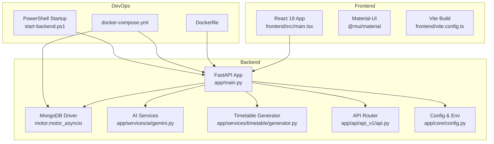
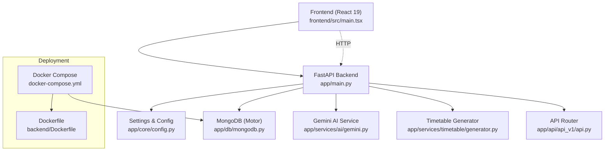
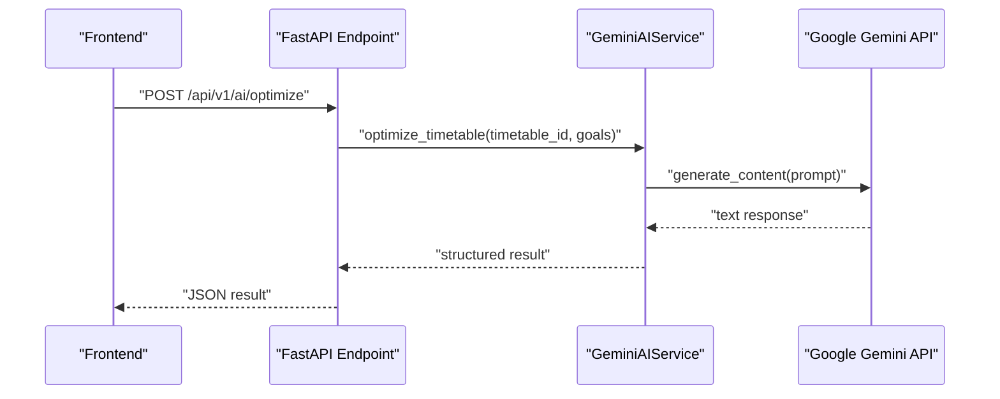
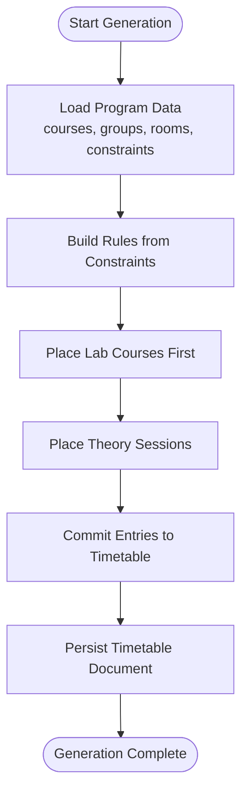
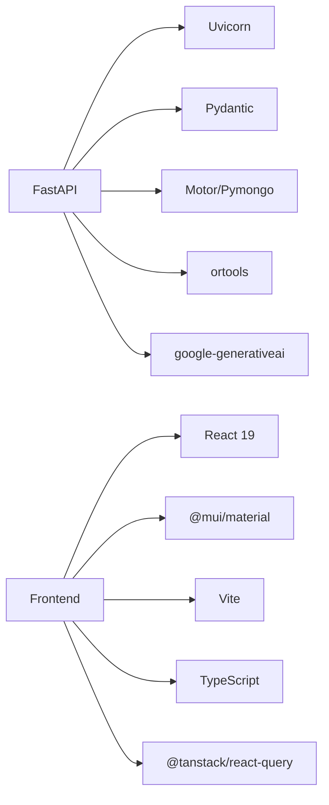

# Technology Stack

<cite>
**Referenced Files in This Document**
- [requirements.txt](file://backend/requirements.txt)
- [Dockerfile](file://backend/Dockerfile)
- [docker-compose.yml](file://backend/docker-compose.yml)
- [main.py](file://backend/app/main.py)
- [config.py](file://backend/app/core/config.py)
- [mongodb.py](file://backend/app/db/mongodb.py)
- [gemini.py](file://backend/app/services/ai/gemini.py)
- [generator.py](file://backend/app/services/timetable/generator.py)
- [api.py](file://backend/app/api/api_v1/api.py)
- [package.json](file://frontend/package.json)
- [vite.config.ts](file://frontend/vite.config.ts)
- [main.tsx](file://frontend/src/main.tsx)
- [App.tsx](file://frontend/src/App.tsx)
- [start-backend.ps1](file://start-backend.ps1)
</cite>

## Table of Contents
1. [Introduction](#introduction)
2. [Project Structure](#project-structure)
3. [Core Components](#core-components)
4. [Architecture Overview](#architecture-overview)
5. [Detailed Component Analysis](#detailed-component-analysis)
6. [Dependency Analysis](#dependency-analysis)
7. [Performance Considerations](#performance-considerations)
8. [Troubleshooting Guide](#troubleshooting-guide)
9. [Conclusion](#conclusion)
10. [Appendices](#appendices)

## Introduction
This document provides comprehensive technology stack documentation for the ShedMaster system. It explains the backend and frontend technologies, AI integration, development tools, database and ORM choices, build and deployment mechanisms, and operational scripts. It also outlines the rationale behind each technology choice, version compatibility considerations, upgrade paths, and environment configuration requirements.

## Project Structure
ShedMaster follows a clear separation of concerns:
- Backend: FastAPI application with asynchronous MongoDB connectivity via Motor, AI services powered by Google Gemini, and modular API routing.
- Frontend: React 19 application with Material-UI theming and components, TypeScript for type safety, and Vite for build tooling.
- DevOps: Docker containerization with docker-compose for local development, plus PowerShell scripts for streamlined startup.

**Diagram sources**
- [main.py:1-102](file://backend/app/main.py#L1-L102)
- [mongodb.py:1-41](file://backend/app/db/mongodb.py#L1-L41)
- [gemini.py:1-288](file://backend/app/services/ai/gemini.py#L1-L288)
- [generator.py:1-402](file://backend/app/services/timetable/generator.py#L1-L402)
- [api.py:1-34](file://backend/app/api/api_v1/api.py#L1-L34)
- [config.py:1-61](file://backend/app/core/config.py#L1-L61)
- [main.tsx:1-11](file://frontend/src/main.tsx#L1-L11)
- [App.tsx:1-49](file://frontend/src/App.tsx#L1-L49)
- [vite.config.ts:1-8](file://frontend/vite.config.ts#L1-L8)
- [Dockerfile:1-24](file://backend/Dockerfile#L1-L24)
- [docker-compose.yml:1-30](file://backend/docker-compose.yml#L1-L30)
- [start-backend.ps1:1-35](file://start-backend.ps1#L1-L35)

**Section sources**
- [main.py:1-102](file://backend/app/main.py#L1-L102)
- [config.py:1-61](file://backend/app/core/config.py#L1-L61)
- [mongodb.py:1-41](file://backend/app/db/mongodb.py#L1-L41)
- [gemini.py:1-288](file://backend/app/services/ai/gemini.py#L1-L288)
- [generator.py:1-402](file://backend/app/services/timetable/generator.py#L1-L402)
- [api.py:1-34](file://backend/app/api/api_v1/api.py#L1-L34)
- [package.json:1-46](file://frontend/package.json#L1-L46)
- [vite.config.ts:1-8](file://frontend/vite.config.ts#L1-L8)
- [main.tsx:1-11](file://frontend/src/main.tsx#L1-L11)
- [App.tsx:1-49](file://frontend/src/App.tsx#L1-L49)
- [Dockerfile:1-24](file://backend/Dockerfile#L1-L24)
- [docker-compose.yml:1-30](file://backend/docker-compose.yml#L1-L30)
- [start-backend.ps1:1-35](file://start-backend.ps1#L1-L35)

## Core Components
- Backend Web Framework: FastAPI provides high-performance ASGI server capabilities, automatic OpenAPI/Swagger documentation, and robust request validation.
- Database: MongoDB with Motor for asynchronous operations, enabling non-blocking I/O and scalable document storage.
- AI Integration: Google Gemini API for natural language processing, optimization suggestions, and NEP 2020 compliance validation.
- Timetable Generation: Constraint-based generator leveraging ortools for optimization modeling and solving.
- Frontend: React 19 with TypeScript for type safety, Material-UI for component design, and Vite for fast builds and hot reload.
- State Management: React Query for caching, invalidation, and optimistic updates.
- Containerization: Docker with docker-compose for local development and deployment consistency.
- Scripts: PowerShell startup script for simplified backend launch with environment setup.

**Section sources**
- [requirements.txt:1-19](file://backend/requirements.txt#L1-L19)
- [main.py:1-102](file://backend/app/main.py#L1-L102)
- [mongodb.py:1-41](file://backend/app/db/mongodb.py#L1-L41)
- [gemini.py:1-288](file://backend/app/services/ai/gemini.py#L1-L288)
- [generator.py:1-402](file://backend/app/services/timetable/generator.py#L1-L402)
- [package.json:1-46](file://frontend/package.json#L1-L46)
- [vite.config.ts:1-8](file://frontend/vite.config.ts#L1-L8)
- [Dockerfile:1-24](file://backend/Dockerfile#L1-L24)
- [docker-compose.yml:1-30](file://backend/docker-compose.yml#L1-L30)
- [start-backend.ps1:1-35](file://start-backend.ps1#L1-L35)

## Architecture Overview
The system architecture centers around a FastAPI backend exposing REST endpoints, backed by MongoDB. AI assistance is integrated through Google Gemini, and the frontend is a React SPA communicating with the backend APIs. Docker and docker-compose enable reproducible environments.

**Diagram sources**
- [main.py:1-102](file://backend/app/main.py#L1-L102)
- [config.py:1-61](file://backend/app/core/config.py#L1-L61)
- [mongodb.py:1-41](file://backend/app/db/mongodb.py#L1-L41)
- [gemini.py:1-288](file://backend/app/services/ai/gemini.py#L1-L288)
- [generator.py:1-402](file://backend/app/services/timetable/generator.py#L1-L402)
- [api.py:1-34](file://backend/app/api/api_v1/api.py#L1-L34)
- [main.tsx:1-11](file://frontend/src/main.tsx#L1-L11)
- [Dockerfile:1-24](file://backend/Dockerfile#L1-L24)
- [docker-compose.yml:1-30](file://backend/docker-compose.yml#L1-L30)

## Detailed Component Analysis

### Backend Web Framework (FastAPI)
- Purpose: High-performance ASGI web framework with automatic API docs, dependency injection, and strict request validation.
- Key Features Used:
  - Lifespan hooks for MongoDB connection lifecycle.
  - CORS middleware for frontend integration.
  - Centralized exception handling for validation errors.
  - Modular router composition for clean API organization.

**Section sources**
- [main.py:1-102](file://backend/app/main.py#L1-L102)
- [api.py:1-34](file://backend/app/api/api_v1/api.py#L1-L34)

### Database Layer (MongoDB + Motor)
- Purpose: Asynchronous document storage with non-blocking I/O.
- Implementation Highlights:
  - AsyncIOMotorClient connection with ping verification.
  - Graceful fallback if DB connection fails during startup.
  - Centralized settings for host, database name, and timeouts.

**Section sources**
- [mongodb.py:1-41](file://backend/app/db/mongodb.py#L1-L41)
- [config.py:25-28](file://backend/app/core/config.py#L25-L28)

### AI Integration (Google Gemini)
- Purpose: Natural language processing, optimization suggestions, and NEP 2020 compliance validation.
- Implementation Highlights:
  - Configurable API key and model selection.
  - Structured prompts for timetable analysis and suggestions.
  - JSON-based result parsing scaffolding for future enhancements.

**Diagram sources**
- [gemini.py:18-60](file://backend/app/services/ai/gemini.py#L18-L60)
- [api.py:1-34](file://backend/app/api/api_v1/api.py#L1-L34)

**Section sources**
- [gemini.py:1-288](file://backend/app/services/ai/gemini.py#L1-L288)
- [config.py:34-36](file://backend/app/core/config.py#L34-L36)

### Timetable Generation Engine
- Purpose: Constraint-based generation with ortools for optimization.
- Implementation Highlights:
  - Data models for courses, groups, rooms, and time slots.
  - Rule engine for time settings, lunch breaks, and maximum periods.
  - Two-phase placement: labs first, then theory sessions with projector constraints.
  - Draft timetable persistence and metadata tracking.

**Diagram sources**
- [generator.py:169-401](file://backend/app/services/timetable/generator.py#L169-L401)

**Section sources**
- [generator.py:1-402](file://backend/app/services/timetable/generator.py#L1-L402)
- [requirements.txt](file://backend/requirements.txt#L10)

### Frontend Stack (React 19 + Material-UI + Vite)
- Purpose: Modern, type-safe React application with Material-UI components and fast build pipeline.
- Key Technologies:
  - React 19 and React DOM 19 for UI rendering.
  - Material-UI for design system and prebuilt components.
  - Vite for development server and optimized production builds.
  - React Query for data fetching and caching.
  - TypeScript for type safety and developer experience.

**Section sources**
- [package.json:1-46](file://frontend/package.json#L1-L46)
- [vite.config.ts:1-8](file://frontend/vite.config.ts#L1-L8)
- [main.tsx:1-11](file://frontend/src/main.tsx#L1-L11)
- [App.tsx:1-49](file://frontend/src/App.tsx#L1-L49)

### Development Tools and Build Pipeline
- TypeScript: Type safety across the frontend codebase.
- React Query: Centralized caching and state management for API data.
- Vite: Lightning-fast dev server and optimized bundling.
- npm scripts: Dev, build, lint, and preview commands.

**Section sources**
- [package.json:6-12](file://frontend/package.json#L6-L12)
- [vite.config.ts:1-8](file://frontend/vite.config.ts#L1-L8)

### Containerization and Deployment
- Dockerfile: Python 3.9 slim base, dependency installation, working directory setup, port exposure, and Uvicorn command.
- docker-compose: Orchestrates backend and MongoDB services, mounts app code for live reload, and persists MongoDB data.
- Environment Variables: Controlled via compose and runtime scripts.

**Section sources**
- [Dockerfile:1-24](file://backend/Dockerfile#L1-L24)
- [docker-compose.yml:1-30](file://backend/docker-compose.yml#L1-L30)

### Startup and Environment Configuration
- PowerShell Script: Guides users to create a .env file, activates the Python environment, sets MONGODB_URL and PYTHONPATH, and starts the server with hot reload.
- Backend Settings: Centralized configuration via Pydantic settings with environment variable support.

**Section sources**
- [start-backend.ps1:1-35](file://start-backend.ps1#L1-L35)
- [config.py:1-61](file://backend/app/core/config.py#L1-L61)

## Dependency Analysis
The backend declares dependencies for FastAPI, Uvicorn, Pydantic, Motor, ortools, pandas, openpyxl, WeasyPrint, ReportLab, protobuf, and Google Generative AI. These choices align with:
- FastAPI/Uvicorn for performance and async capabilities.
- Motor for non-blocking MongoDB access.
- ortools for constraint satisfaction and optimization.
- Google Generative AI for NLP and suggestions.
- Additional libraries for data processing and exports.

**Diagram sources**
- [requirements.txt:1-19](file://backend/requirements.txt#L1-L19)
- [package.json:13-31](file://frontend/package.json#L13-L31)

**Section sources**
- [requirements.txt:1-19](file://backend/requirements.txt#L1-L19)
- [package.json:1-46](file://frontend/package.json#L1-L46)

## Performance Considerations
- Asynchronous I/O: Motor enables non-blocking database operations, improving throughput under concurrent requests.
- Efficient Routing: FastAPI’s router composition minimizes overhead and improves maintainability.
- AI Prompting: Structured prompts reduce token usage and improve response consistency.
- Build Optimization: Vite’s pre-bundling and tree-shaking reduce bundle sizes and speed up development.
- Container Efficiency: Python 3.9 slim image reduces container footprint.

[No sources needed since this section provides general guidance]

## Troubleshooting Guide
- CORS Issues: Verify allowed origins in the backend CORS middleware match frontend origins.
- Database Connectivity: Confirm MONGODB_URL and DATABASE_NAME in environment variables; check MongoDB logs and connectivity.
- AI API Key: Ensure GEMINI_API_KEY is set; otherwise AI endpoints will return configuration errors.
- Health Checks: Use the /health endpoint to validate backend status.
- Frontend Dev Server: Use Vite’s dev script; ensure ports are free and dependencies are installed.

**Section sources**
- [main.py:56-64](file://backend/app/main.py#L56-L64)
- [config.py:25-36](file://backend/app/core/config.py#L25-L36)
- [gemini.py:10-17](file://backend/app/services/ai/gemini.py#L10-L17)
- [docker-compose.yml:10-13](file://backend/docker-compose.yml#L10-L13)

## Conclusion
ShedMaster leverages a modern, scalable stack: FastAPI for a high-performance backend, MongoDB with Motor for flexible document storage, ortools for optimization, and React 19 with Material-UI for a responsive frontend. AI assistance via Google Gemini enhances usability with natural language processing and optimization suggestions. Docker and docker-compose streamline development and deployment, while TypeScript, React Query, and Vite improve developer productivity and user experience.

[No sources needed since this section summarizes without analyzing specific files]

## Appendices

### Version Compatibility and Upgrade Paths
- Python: Backend runs on Python 3.9; consider upgrading to 3.11+ for improved performance and security.
- FastAPI/Uvicorn: Latest LTS versions recommended; keep aligned for security patches.
- Motor/Pymongo: Use compatible versions; Motor 3.x pairs well with PyMongo 4.x.
- ortools: Pin to a stable release; test thoroughly after upgrades.
- React 19: Stay current with minor releases; check breaking changes in major updates.
- Material-UI: Align with React 19; monitor deprecation notices.
- Vite: Prefer latest stable; verify plugin compatibility.
- Google Generative AI: Keep library updated; review API changes.

[No sources needed since this section provides general guidance]

### Setup Requirements and Environment Configuration
- Backend:
  - Python 3.9+, pip, virtual environment.
  - MongoDB instance (local or cloud).
  - .env file with MONGODB_URL, DATABASE_NAME, SECRET_KEY, GEMINI_API_KEY.
- Frontend:
  - Node.js and npm.
  - Install dependencies via package manager.
- DevOps:
  - Docker and docker-compose for local orchestration.
- Startup:
  - Use the provided PowerShell script to initialize environment and start the backend.

**Section sources**
- [start-backend.ps1:6-16](file://start-backend.ps1#L6-L16)
- [config.py:25-36](file://backend/app/core/config.py#L25-L36)
- [docker-compose.yml:10-13](file://backend/docker-compose.yml#L10-L13)
- [Dockerfile:1-24](file://backend/Dockerfile#L1-L24)