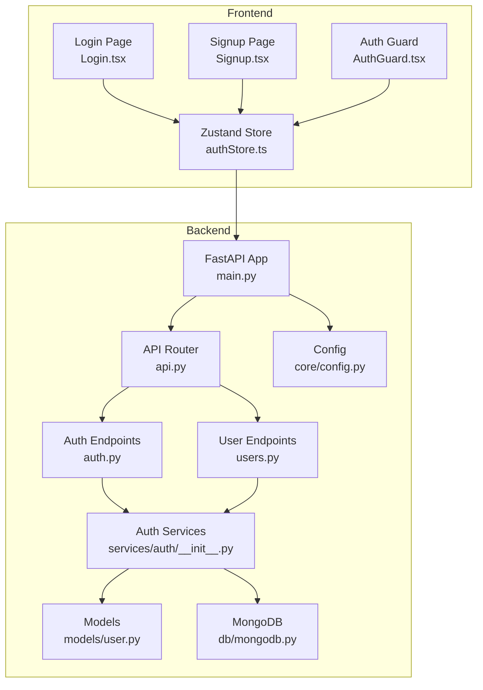
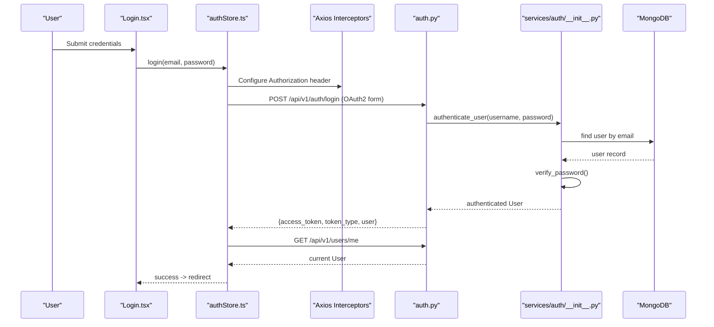
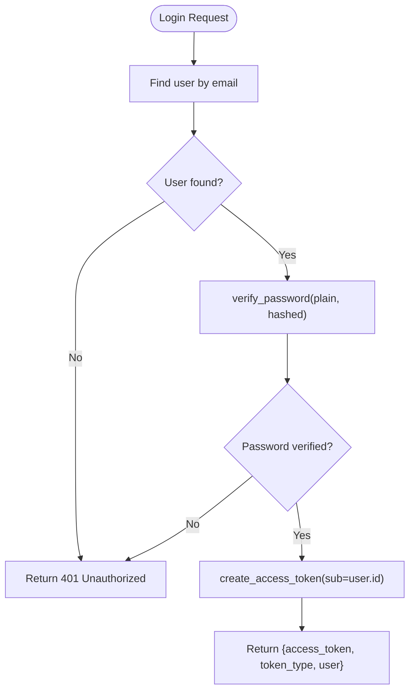
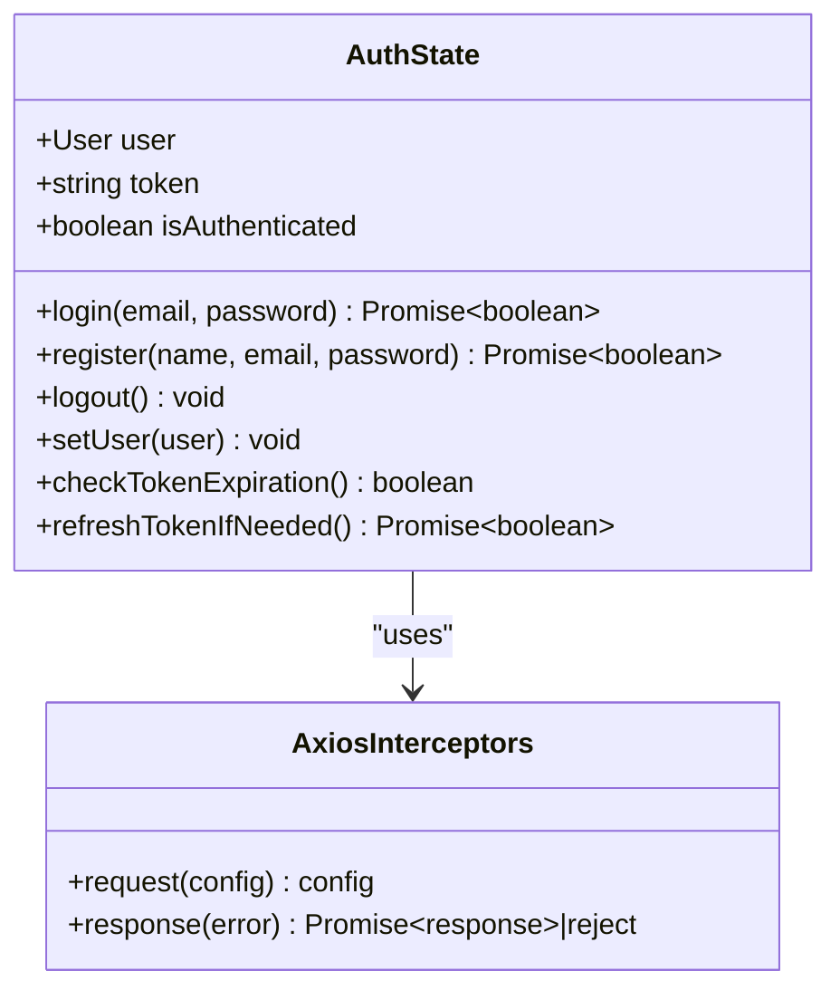
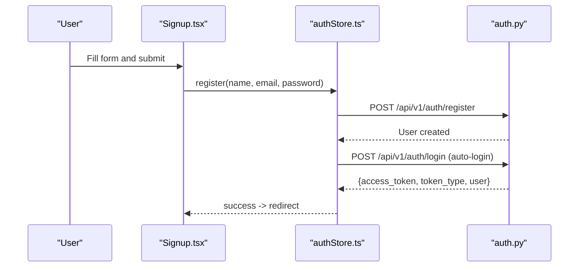
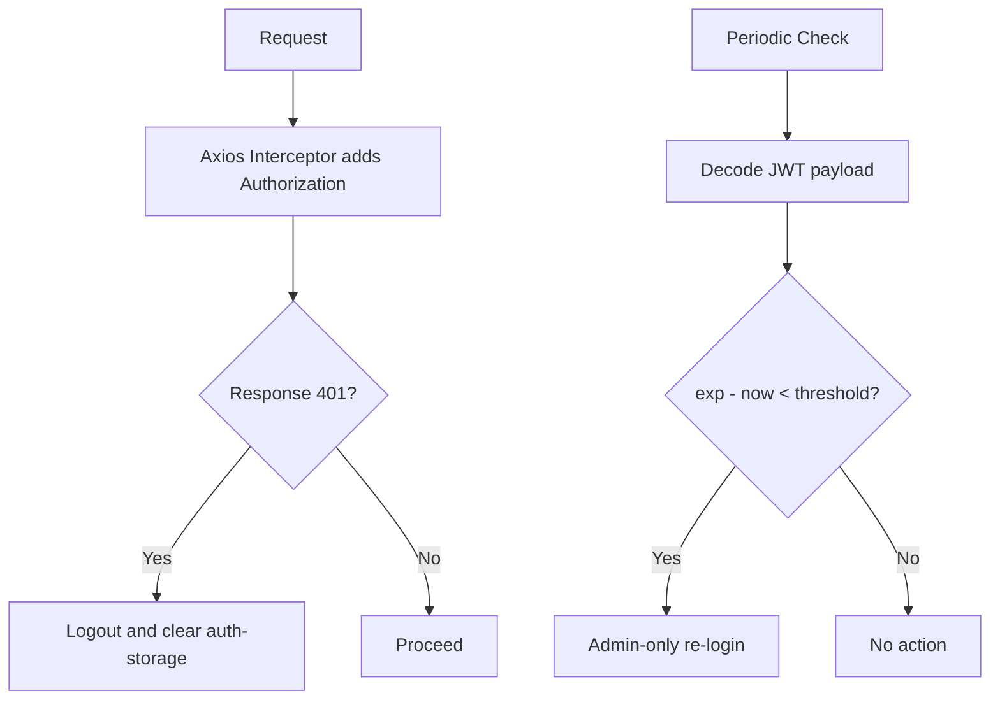
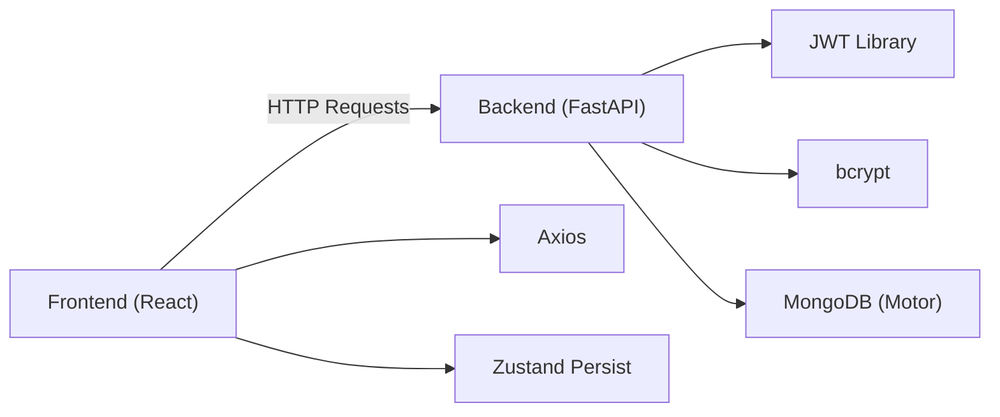

# Authentication System

<cite>
**Referenced Files in This Document**
- [auth.py](file://backend/app/api/v1/endpoints/auth.py)
- [__init__.py](file://backend/app/services/auth/__init__.py)
- [user.py](file://backend/app/models/user.py)
- [config.py](file://backend/app/core/config.py)
- [api.py](file://backend/app/api/api_v1/api.py)
- [main.py](file://backend/app/main.py)
- [authStore.ts](file://frontend/src/store/authStore.ts)
- [Login.tsx](file://frontend/src/components/pages/Login.tsx)
- [Signup.tsx](file://frontend/src/components/pages/Signup.tsx)
- [AuthGuard.tsx](file://frontend/src/components/AuthGuard.tsx)
- [users.py](file://backend/app/api/v1/endpoints/users.py)
- [mongodb.py](file://backend/app/db/mongodb.py)
</cite>

## Table of Contents
1. [Introduction](#introduction)
2. [Project Structure](#project-structure)
3. [Core Components](#core-components)
4. [Architecture Overview](#architecture-overview)
5. [Detailed Component Analysis](#detailed-component-analysis)
6. [Dependency Analysis](#dependency-analysis)
7. [Performance Considerations](#performance-considerations)
8. [Security Considerations](#security-considerations)
9. [Troubleshooting Guide](#troubleshooting-guide)
10. [Conclusion](#conclusion)

## Introduction
This document describes ShedMaster’s JWT-based authentication system. It covers the complete authentication lifecycle: user registration, login, logout, and token refresh. It explains JWT token structure, expiration handling, and secure storage practices. It also documents the frontend authentication state management using a Zustand store, including token persistence and automatic logout on token expiration. Password security is implemented with bcrypt hashing and salt generation. API endpoints are documented with request/response schemas, error handling, and status codes. Frontend components for login/signup forms include validation, error handling, and user feedback. Security considerations such as CSRF protection, XSS prevention, and secure cookie handling are addressed, along with practical integration examples for both backend and frontend.

## Project Structure
The authentication system spans backend and frontend:
- Backend FastAPI endpoints under `/api/v1/endpoints/auth.py` and related services under `/services/auth`.
- Frontend Zustand store under `/frontend/src/store/authStore.ts` and UI components under `/frontend/src/components/pages`.

**Diagram sources**
- [main.py:1-102](file://backend/app/main.py#L1-L102)
- [api.py:1-34](file://backend/app/api/api_v1/api.py#L1-L34)
- [auth.py:1-123](file://backend/app/api/v1/endpoints/auth.py#L1-L123)
- [users.py:1-123](file://backend/app/api/v1/endpoints/users.py#L1-L123)
- [__init__.py:1-190](file://backend/app/services/auth/__init__.py#L1-L190)
- [user.py:1-76](file://backend/app/models/user.py#L1-L76)
- [config.py:1-61](file://backend/app/core/config.py#L1-L61)
- [mongodb.py:1-41](file://backend/app/db/mongodb.py#L1-L41)
- [authStore.ts:1-248](file://frontend/src/store/authStore.ts#L1-L248)
- [Login.tsx:1-335](file://frontend/src/components/pages/Login.tsx#L1-L335)
- [Signup.tsx:1-248](file://frontend/src/components/pages/Signup.tsx#L1-L248)
- [AuthGuard.tsx:1-32](file://frontend/src/components/AuthGuard.tsx#L1-L32)

**Section sources**
- [main.py:1-102](file://backend/app/main.py#L1-L102)
- [api.py:1-34](file://backend/app/api/api_v1/api.py#L1-L34)

## Core Components
- Backend JWT and password handling: bcrypt hashing, token creation, and user authentication.
- Backend API endpoints: login, registration, token testing, and refresh.
- Frontend Zustand store: state management, token persistence, interceptors, and auto-refresh logic.
- Frontend UI components: Login and Signup forms with validation and feedback.
- Auth guard for protected routes.

Key implementation references:
- JWT creation and decoding, password hashing and verification, and user retrieval are implemented in the auth services module.
- API endpoints define the contract for authentication operations.
- Frontend store manages token lifecycle and integrates with Axios interceptors.

**Section sources**
- [__init__.py:1-190](file://backend/app/services/auth/__init__.py#L1-L190)
- [auth.py:1-123](file://backend/app/api/v1/endpoints/auth.py#L1-L123)
- [authStore.ts:1-248](file://frontend/src/store/authStore.ts#L1-L248)

## Architecture Overview
The authentication flow connects frontend UI, Zustand store, and backend endpoints:

**Diagram sources**
- [Login.tsx:1-335](file://frontend/src/components/pages/Login.tsx#L1-L335)
- [authStore.ts:1-248](file://frontend/src/store/authStore.ts#L1-L248)
- [auth.py:1-123](file://backend/app/api/v1/endpoints/auth.py#L1-L123)
- [__init__.py:1-190](file://backend/app/services/auth/__init__.py#L1-L190)
- [users.py:1-123](file://backend/app/api/v1/endpoints/users.py#L1-L123)
- [mongodb.py:1-41](file://backend/app/db/mongodb.py#L1-L41)

## Detailed Component Analysis

### Backend JWT and Password Security
- Password hashing: bcrypt is used to hash passwords during registration and to verify during login.
- Token creation: HS256 algorithm with a configurable secret key and expiration minutes.
- Token decoding: Validates JWT signature and extracts subject (user ID) for user lookup.

**Diagram sources**
- [auth.py:29-64](file://backend/app/api/v1/endpoints/auth.py#L29-L64)
- [__init__.py:62-88](file://backend/app/services/auth/__init__.py#L62-L88)
- [__init__.py:41-59](file://backend/app/services/auth/__init__.py#L41-L59)

**Section sources**
- [__init__.py:26-38](file://backend/app/services/auth/__init__.py#L26-L38)
- [__init__.py:41-59](file://backend/app/services/auth/__init__.py#L41-L59)
- [auth.py:29-64](file://backend/app/api/v1/endpoints/auth.py#L29-L64)

### Backend API Endpoints
- POST /api/v1/auth/login: OAuth2-compatible login returning access token and user info.
- POST /api/v1/auth/register: Creates a new user account with password hashing.
- POST /api/v1/auth/test-register: Validates registration data without creating an account.
- POST /api/v1/auth/test-token: Tests token validity via dependency injection.
- POST /api/v1/auth/refresh-token: Refreshes access token for the current active user.
- GET /api/v1/users/me: Returns current authenticated user.

Request/response schemas and error handling:
- Login returns access_token, token_type, and user object with id, email, full_name, role, is_admin.
- Registration throws 400 for duplicate email and 500 for unexpected errors.
- Token testing and refresh endpoints depend on active user validation.
- Users/me requires authentication and returns current user.

**Section sources**
- [auth.py:17-123](file://backend/app/api/v1/endpoints/auth.py#L17-L123)
- [users.py:27-34](file://backend/app/api/v1/endpoints/users.py#L27-L34)

### Frontend Authentication State Management (Zustand)
The Zustand store manages:
- User state, token, and authentication flag.
- Login and register actions that call backend endpoints and fetch user info.
- Token persistence using localStorage via the persist middleware.
- Axios interceptors to attach Authorization header and handle 401 responses.
- Token expiration checks and admin-only auto-refresh logic.

**Diagram sources**
- [authStore.ts:15-25](file://frontend/src/store/authStore.ts#L15-L25)
- [authStore.ts:209-247](file://frontend/src/store/authStore.ts#L209-L247)

**Section sources**
- [authStore.ts:1-248](file://frontend/src/store/authStore.ts#L1-L248)

### Frontend Components: Login and Signup Forms
- Login.tsx: Collects email/password, handles validation, displays errors, and redirects on success.
- Signup.tsx: Collects name, email, password, confirm password with client-side validation and error feedback.
- AuthGuard.tsx: Protects routes by checking authentication state and redirecting to login when unauthenticated.

**Diagram sources**
- [Signup.tsx:1-248](file://frontend/src/components/pages/Signup.tsx#L1-L248)
- [authStore.ts:76-120](file://frontend/src/store/authStore.ts#L76-L120)
- [auth.py:78-100](file://backend/app/api/v1/endpoints/auth.py#L78-L100)

**Section sources**
- [Login.tsx:1-335](file://frontend/src/components/pages/Login.tsx#L1-L335)
- [Signup.tsx:1-248](file://frontend/src/components/pages/Signup.tsx#L1-L248)
- [AuthGuard.tsx:1-32](file://frontend/src/components/AuthGuard.tsx#L1-L32)

### Token Expiration Handling and Auto-Refresh
- Frontend expiration check decodes JWT payload to compare exp against current time.
- Admin-only auto-refresh re-authenticates with stored credentials and updates the token.
- Axios response interceptor logs out on 401 Unauthorized.

**Diagram sources**
- [authStore.ts:135-196](file://frontend/src/store/authStore.ts#L135-L196)
- [authStore.ts:209-247](file://frontend/src/store/authStore.ts#L209-L247)

**Section sources**
- [authStore.ts:135-196](file://frontend/src/store/authStore.ts#L135-L196)
- [authStore.ts:209-247](file://frontend/src/store/authStore.ts#L209-L247)

## Dependency Analysis
- Backend depends on FastAPI, JWT library, bcrypt, and Motor for MongoDB.
- Auth endpoints depend on auth services for user authentication and token creation.
- Frontend depends on Axios and Zustand with persistence middleware.
- CORS is configured in the main application to allow frontend origins.

**Diagram sources**
- [main.py:56-64](file://backend/app/main.py#L56-L64)
- [__init__.py:4-7](file://backend/app/services/auth/__init__.py#L4-L7)
- [mongodb.py:1-41](file://backend/app/db/mongodb.py#L1-L41)
- [authStore.ts:1-4](file://frontend/src/store/authStore.ts#L1-L4)

**Section sources**
- [main.py:56-64](file://backend/app/main.py#L56-L64)
- [config.py:14-32](file://backend/app/core/config.py#L14-L32)

## Performance Considerations
- Token expiration is set to 30 days by default, reducing refresh frequency but increasing risk exposure.
- bcrypt hashing is computationally intensive; consider tuning cost factor if performance becomes an issue.
- Frontend auto-refresh is admin-only to minimize unnecessary re-authentication.
- Axios interceptors add minimal overhead; ensure they are not duplicated.

## Security Considerations
- CSRF protection: The backend exposes a preflight handler for CORS but does not implement CSRF tokens. Consider adding CSRF middleware or SameSite cookies for enhanced protection.
- XSS prevention: Frontend components render user feedback via Material UI alerts; sanitize any dynamic content and avoid innerHTML.
- Secure cookie handling: Tokens are stored in localStorage. Prefer HttpOnly cookies with SameSite and Secure flags for production. The current implementation stores tokens in memory and localStorage, which is less secure than cookies.
- Password security: bcrypt is used for hashing and verification. Enforce strong password policies and consider rate limiting login attempts.
- Token scope: Access tokens are long-lived (30 days). Consider short-lived access tokens with refresh tokens for higher security.

## Troubleshooting Guide
Common issues and resolutions:
- Login fails with 401 Unauthorized: Verify credentials and ensure user is active.
- Registration fails with 400 Bad Request: Email may already be registered.
- 401 Unauthorized responses: Axios interceptor triggers logout; clear auth-storage and re-authenticate.
- Token expiration: Use admin-only auto-refresh or prompt user to log in again.
- CORS errors: Confirm frontend origins are allowed in CORS configuration.

**Section sources**
- [auth.py:36-47](file://backend/app/api/v1/endpoints/auth.py#L36-L47)
- [auth.py:89-100](file://backend/app/api/v1/endpoints/auth.py#L89-L100)
- [authStore.ts:238-247](file://frontend/src/store/authStore.ts#L238-L247)

## Conclusion
ShedMaster’s authentication system provides a robust JWT-based flow with bcrypt password hashing, persistent frontend state via Zustand, and Axios interceptors for seamless token management. While the current implementation prioritizes simplicity, production deployments should adopt CSRF protections, HttpOnly cookies, and refresh tokens for enhanced security. The modular backend and frontend components enable straightforward extension and maintenance.