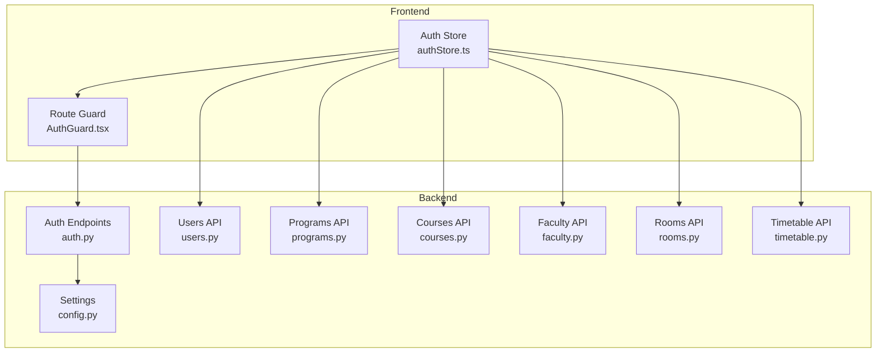
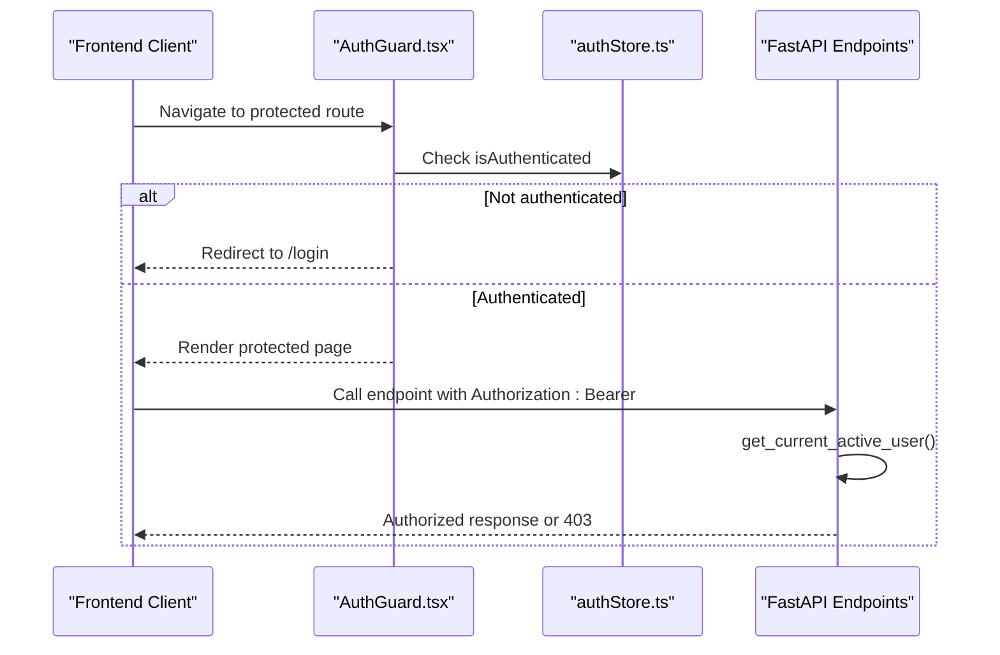
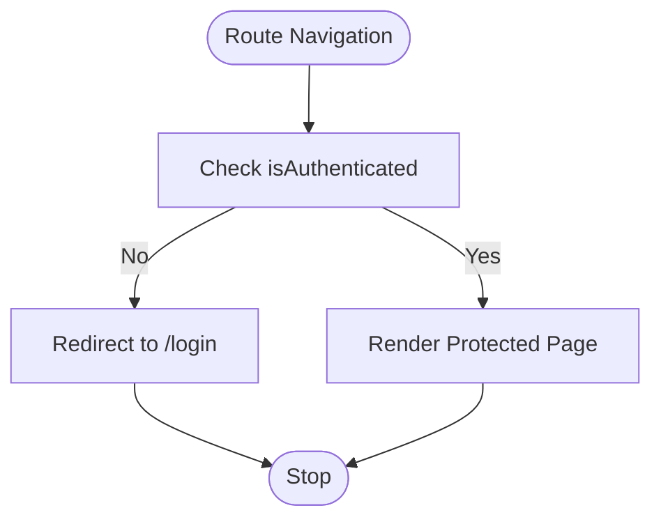
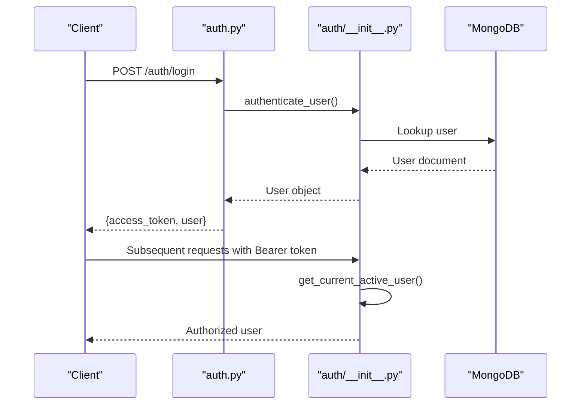
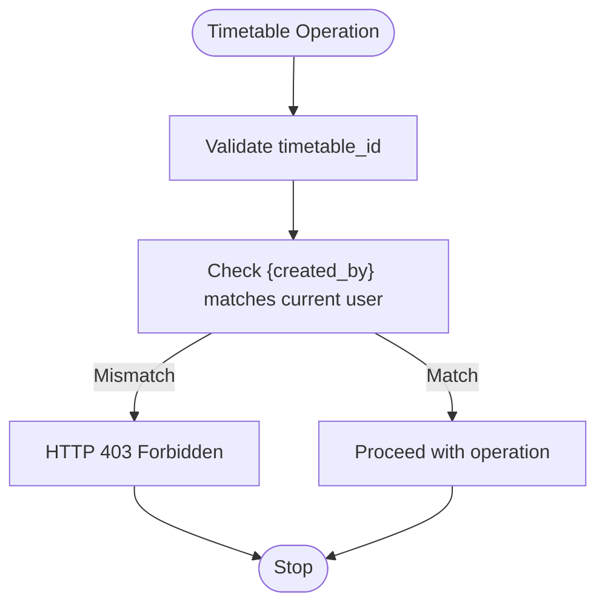
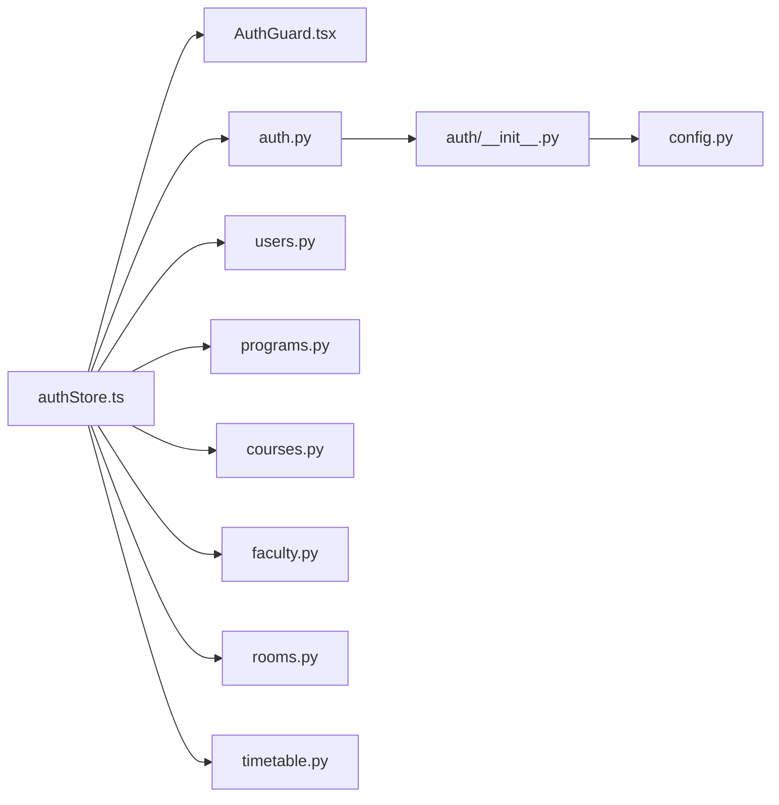

# Authorization and Permissions

<cite>
**Referenced Files in This Document**
- [user.py](file://backend/app/models/user.py)
- [auth.py](file://backend/app/api/v1/endpoints/auth.py)
- [users.py](file://backend/app/api/v1/endpoints/users.py)
- [timetable.py](file://backend/app/api/v1/endpoints/timetable.py)
- [programs.py](file://backend/app/api/v1/endpoints/programs.py)
- [courses.py](file://backend/app/api/v1/endpoints/courses.py)
- [faculty.py](file://backend/app/api/v1/endpoints/faculty.py)
- [rooms.py](file://backend/app/api/v1/endpoints/rooms.py)
- [authStore.ts](file://frontend/src/store/authStore.ts)
- [AuthGuard.tsx](file://frontend/src/components/AuthGuard.tsx)
- [config.py](file://backend/app/core/config.py)
</cite>

## Table of Contents
1. [Introduction](#introduction)
2. [Project Structure](#project-structure)
3. [Core Components](#core-components)
4. [Architecture Overview](#architecture-overview)
5. [Detailed Component Analysis](#detailed-component-analysis)
6. [Dependency Analysis](#dependency-analysis)
7. [Performance Considerations](#performance-considerations)
8. [Troubleshooting Guide](#troubleshooting-guide)
9. [Conclusion](#conclusion)
10. [Appendices](#appendices)

## Introduction
This document explains ShedMaster’s role-based access control (RBAC) system. It defines user roles, permission matrices for CRUD operations on academic data, and the implementation of protected routes on both frontend and backend. It also covers dynamic permission checks, data isolation, and guidelines for extending the system with new roles and permissions.

## Project Structure
The authorization model spans three layers:
- Backend FastAPI endpoints define resource-level permissions and enforce ownership/data-isolation rules.
- Backend services provide reusable dependency injectors for authentication and authorization.
- Frontend stores and route guards protect client-side navigation and feature rendering.

**Diagram sources**
- [authStore.ts:1-248](file://frontend/src/store/authStore.ts#L1-L248)
- [AuthGuard.tsx:1-32](file://frontend/src/components/AuthGuard.tsx#L1-L32)
- [config.py:1-61](file://backend/app/core/config.py#L1-L61)
- [auth.py:1-123](file://backend/app/api/v1/endpoints/auth.py#L1-L123)
- [users.py:1-123](file://backend/app/api/v1/endpoints/users.py#L1-L123)
- [programs.py:1-288](file://backend/app/api/v1/endpoints/programs.py#L1-L288)
- [courses.py:1-279](file://backend/app/api/v1/endpoints/courses.py#L1-L279)
- [faculty.py:1-265](file://backend/app/api/v1/endpoints/faculty.py#L1-L265)
- [rooms.py:1-258](file://backend/app/api/v1/endpoints/rooms.py#L1-L258)
- [timetable.py:1-728](file://backend/app/api/v1/endpoints/timetable.py#L1-L728)

**Section sources**
- [authStore.ts:1-248](file://frontend/src/store/authStore.ts#L1-L248)
- [AuthGuard.tsx:1-32](file://frontend/src/components/AuthGuard.tsx#L1-L32)
- [config.py:1-61](file://backend/app/core/config.py#L1-L61)

## Core Components
- User model with role and admin flags:
  - Fields include identity, activity flag, admin flag, and role string.
  - Used across backend models and services.
- Authentication and authorization services:
  - JWT-based token creation and verification.
  - Current user retrieval and active-user guard.
  - Admin guard for elevated endpoints.
- Frontend auth store:
  - Manages token lifecycle, user session, and Axios interceptors.
  - Provides guarded access to protected routes.

Key implementation references:
- User model and fields: [user.py:27-76](file://backend/app/models/user.py#L27-L76)
- Token creation and current user extraction: [auth.py:41-144](file://backend/app/api/v1/endpoints/auth.py#L41-L144)
- Admin guard usage in endpoints: [users.py:21](file://backend/app/api/v1/endpoints/users.py#L21), [programs.py:113](file://backend/app/api/v1/endpoints/programs.py#L113)
- Frontend auth store and interceptors: [authStore.ts:36-196](file://frontend/src/store/authStore.ts#L36-L196)

**Section sources**
- [user.py:27-76](file://backend/app/models/user.py#L27-L76)
- [auth.py:41-144](file://backend/app/api/v1/endpoints/auth.py#L41-L144)
- [users.py:21](file://backend/app/api/v1/endpoints/users.py#L21)
- [programs.py:113](file://backend/app/api/v1/endpoints/programs.py#L113)
- [authStore.ts:36-196](file://frontend/src/store/authStore.ts#L36-L196)

## Architecture Overview
The RBAC architecture enforces:
- Ownership isolation: Users can only access resources they created.
- Role-based elevation: Admins bypass ownership checks for sensitive operations.
- Frontend protection: Route guards prevent unauthorized navigation.
- Token-based authentication: JWT bearer tokens propagate user identity.

**Diagram sources**
- [AuthGuard.tsx:5-31](file://frontend/src/components/AuthGuard.tsx#L5-L31)
- [authStore.ts:209-247](file://frontend/src/store/authStore.ts#L209-L247)
- [auth.py:91-144](file://backend/app/api/v1/endpoints/auth.py#L91-L144)

## Detailed Component Analysis

### Roles and Permissions Matrix
- Role: Administrator
  - Full CRUD on academic data (programs, courses, faculty, rooms).
  - Manage users (CRUD) and view others’ data.
  - Elevated privileges for system-level operations.
  - Enforced via admin guards and explicit permission checks in endpoints.
- Role: Faculty Member
  - Can create and manage their own faculty records.
  - May be granted limited constraint creation/update/delete by role checks in constraints endpoint.
  - Cannot modify others’ data; ownership enforced per record.
- Role: System User (default)
  - Can view academic data (programs, courses) and personal timetables.
  - Cannot create, update, or delete academic data unless explicitly elevated.

Permission matrix summary:
- Programs: Admin-only create/update/delete; view-all.
- Courses: View-all; create/update/delete require ownership or admin.
- Faculty: Own-create/update/delete; view-all.
- Rooms: View-all; create/update/delete require ownership or admin.
- Timetables: Own-create/update/delete; view-all filtered by ownership.

Evidence:
- Admin-only program operations: [programs.py:113](file://backend/app/api/v1/endpoints/programs.py#L113), [programs.py:150](file://backend/app/api/v1/endpoints/programs.py#L150), [programs.py:181](file://backend/app/api/v1/endpoints/programs.py#L181)
- Ownership enforcement in timetable CRUD: [timetable.py:550-589](file://backend/app/api/v1/endpoints/timetable.py#L550-L589)
- Faculty ownership pattern: [faculty.py:155-197](file://backend/app/api/v1/endpoints/faculty.py#L155-L197)
- Users endpoint admin-only access: [users.py:21](file://backend/app/api/v1/endpoints/users.py#L21)

**Section sources**
- [programs.py:113](file://backend/app/api/v1/endpoints/programs.py#L113)
- [programs.py:150](file://backend/app/api/v1/endpoints/programs.py#L150)
- [programs.py:181](file://backend/app/api/v1/endpoints/programs.py#L181)
- [timetable.py:550-589](file://backend/app/api/v1/endpoints/timetable.py#L550-L589)
- [faculty.py:155-197](file://backend/app/api/v1/endpoints/faculty.py#L155-L197)
- [users.py:21](file://backend/app/api/v1/endpoints/users.py#L21)

### Protected Routes and Guards

#### Frontend AuthGuard
- Hydrates persisted auth state and redirects unauthenticated users to login.
- Allows navigation only when authenticated.

**Diagram sources**
- [AuthGuard.tsx:5-31](file://frontend/src/components/AuthGuard.tsx#L5-L31)

**Section sources**
- [AuthGuard.tsx:5-31](file://frontend/src/components/AuthGuard.tsx#L5-L31)

#### Backend Authentication and Authorization
- Token creation and decoding with JWT.
- Current user retrieval and active-user validation.
- Admin guard for endpoints requiring elevated privileges.

**Diagram sources**
- [auth.py:29-64](file://backend/app/api/v1/endpoints/auth.py#L29-L64)
- [auth.py:91-144](file://backend/app/api/v1/endpoints/auth.py#L91-L144)
- [auth.py:147-156](file://backend/app/api/v1/endpoints/auth.py#L147-L156)

**Section sources**
- [auth.py:29-64](file://backend/app/api/v1/endpoints/auth.py#L29-L64)
- [auth.py:91-144](file://backend/app/api/v1/endpoints/auth.py#L91-L144)
- [auth.py:147-156](file://backend/app/api/v1/endpoints/auth.py#L147-L156)

### Dynamic Permission Checking for CRUD Operations

#### Timetable CRUD (Ownership Isolation)
- All endpoints filter by created_by to ensure users access only their timetables.
- Explicit checks on update/delete to confirm ownership.

**Diagram sources**
- [timetable.py:550-589](file://backend/app/api/v1/endpoints/timetable.py#L550-L589)

**Section sources**
- [timetable.py:550-589](file://backend/app/api/v1/endpoints/timetable.py#L550-L589)

#### Academic Data CRUD (Ownership and Admin)
- Programs: Admin-only create/update/delete; view-all.
- Courses: View-all; create/update/delete require ownership or admin.
- Faculty: Own-create/update/delete; view-all.
- Rooms: View-all; create/update/delete require ownership or admin.

Examples:
- Admin-only program operations: [programs.py:113](file://backend/app/api/v1/endpoints/programs.py#L113), [programs.py:150](file://backend/app/api/v1/endpoints/programs.py#L150), [programs.py:181](file://backend/app/api/v1/endpoints/programs.py#L181)
- Faculty ownership pattern: [faculty.py:155-197](file://backend/app/api/v1/endpoints/faculty.py#L155-L197)
- Rooms update/delete with ownership: [rooms.py:164-180](file://backend/app/api/v1/endpoints/rooms.py#L164-L180)

**Section sources**
- [programs.py:113](file://backend/app/api/v1/endpoints/programs.py#L113)
- [programs.py:150](file://backend/app/api/v1/endpoints/programs.py#L150)
- [programs.py:181](file://backend/app/api/v1/endpoints/programs.py#L181)
- [faculty.py:155-197](file://backend/app/api/v1/endpoints/faculty.py#L155-L197)
- [rooms.py:164-180](file://backend/app/api/v1/endpoints/rooms.py#L164-L180)

### Permission-Based UI Rendering and Conditional Access
- Frontend auth store exposes user role and admin flag to components.
- Guards prevent navigation to protected areas.
- Components can conditionally render actions based on user role and ownership.

References:
- User shape and flags: [user.py:27-36](file://backend/app/models/user.py#L27-L36)
- Frontend store getters and setters: [authStore.ts:15-25](file://frontend/src/store/authStore.ts#L15-L25)
- Interceptors attach Authorization header: [authStore.ts:209-236](file://frontend/src/store/authStore.ts#L209-L236)

**Section sources**
- [user.py:27-36](file://backend/app/models/user.py#L27-L36)
- [authStore.ts:15-25](file://frontend/src/store/authStore.ts#L15-L25)
- [authStore.ts:209-236](file://frontend/src/store/authStore.ts#L209-L236)

### Edge Cases and Audit Considerations
- Data visibility restrictions:
  - Timetables are filtered by created_by to prevent cross-user exposure.
  - Programs and courses endpoints return all records by default; administrators can manage them centrally.
- Collaborative editing permissions:
  - Current implementation enforces ownership per record; collaborative editing requires explicit permission logic (e.g., shared-with lists) and is not present in the referenced files.
- Audit trail requirements:
  - No explicit audit logging is implemented in the referenced files. Consider adding created_by, modified_by, timestamps, and event logs for sensitive operations.

Evidence:
- Ownership filtering in timetable endpoints: [timetable.py:30-44](file://backend/app/api/v1/endpoints/timetable.py#L30-L44), [timetable.py:83-87](file://backend/app/api/v1/endpoints/timetable.py#L83-L87)
- Program view-all behavior: [programs.py:23-35](file://backend/app/api/v1/endpoints/programs.py#L23-L35)

**Section sources**
- [timetable.py:30-44](file://backend/app/api/v1/endpoints/timetable.py#L30-L44)
- [timetable.py:83-87](file://backend/app/api/v1/endpoints/timetable.py#L83-L87)
- [programs.py:23-35](file://backend/app/api/v1/endpoints/programs.py#L23-L35)

## Dependency Analysis
- Frontend depends on backend for authentication and authorization.
- Backend endpoints depend on services for user resolution and admin checks.
- Configuration supplies token settings and API base path.

**Diagram sources**
- [authStore.ts:1-248](file://frontend/src/store/authStore.ts#L1-L248)
- [AuthGuard.tsx:1-32](file://frontend/src/components/AuthGuard.tsx#L1-L32)
- [auth.py:1-123](file://backend/app/api/v1/endpoints/auth.py#L1-L123)
- [users.py:1-123](file://backend/app/api/v1/endpoints/users.py#L1-L123)
- [programs.py:1-288](file://backend/app/api/v1/endpoints/programs.py#L1-L288)
- [courses.py:1-279](file://backend/app/api/v1/endpoints/courses.py#L1-L279)
- [faculty.py:1-265](file://backend/app/api/v1/endpoints/faculty.py#L1-L265)
- [rooms.py:1-258](file://backend/app/api/v1/endpoints/rooms.py#L1-L258)
- [timetable.py:1-728](file://backend/app/api/v1/endpoints/timetable.py#L1-L728)
- [config.py:1-61](file://backend/app/core/config.py#L1-L61)

**Section sources**
- [authStore.ts:1-248](file://frontend/src/store/authStore.ts#L1-L248)
- [AuthGuard.tsx:1-32](file://frontend/src/components/AuthGuard.tsx#L1-L32)
- [auth.py:1-123](file://backend/app/api/v1/endpoints/auth.py#L1-L123)
- [users.py:1-123](file://backend/app/api/v1/endpoints/users.py#L1-L123)
- [programs.py:1-288](file://backend/app/api/v1/endpoints/programs.py#L1-L288)
- [courses.py:1-279](file://backend/app/api/v1/endpoints/courses.py#L1-L279)
- [faculty.py:1-265](file://backend/app/api/v1/endpoints/faculty.py#L1-L265)
- [rooms.py:1-258](file://backend/app/api/v1/endpoints/rooms.py#L1-L258)
- [timetable.py:1-728](file://backend/app/api/v1/endpoints/timetable.py#L1-L728)
- [config.py:1-61](file://backend/app/core/config.py#L1-L61)

## Performance Considerations
- Token verification occurs on every protected request; keep token size minimal and avoid unnecessary claims.
- Ownership filters reduce database result sets but still scan collections; consider indexing created_by and ObjectId fields for large datasets.
- Frontend caching of non-sensitive lists (e.g., programs, courses) can reduce repeated network calls.

## Troubleshooting Guide
Common issues and resolutions:
- 401 Unauthorized on protected endpoints:
  - Verify Authorization header presence and validity.
  - Confirm token not expired; refresh if needed.
  - References: [authStore.ts:209-236](file://frontend/src/store/authStore.ts#L209-L236), [auth.py:91-144](file://backend/app/api/v1/endpoints/auth.py#L91-L144)
- 403 Forbidden when accessing resources:
  - Ensure ownership for user-owned resources (timetables, faculty).
  - Admin privileges required for certain operations (programs, users).
  - References: [timetable.py:550-589](file://backend/app/api/v1/endpoints/timetable.py#L550-L589), [programs.py:113](file://backend/app/api/v1/endpoints/programs.py#L113), [users.py:21](file://backend/app/api/v1/endpoints/users.py#L21)
- Frontend route not redirecting:
  - Confirm AuthGuard hydration and isAuthenticated state.
  - References: [AuthGuard.tsx:5-31](file://frontend/src/components/AuthGuard.tsx#L5-L31)

**Section sources**
- [authStore.ts:209-236](file://frontend/src/store/authStore.ts#L209-L236)
- [auth.py:91-144](file://backend/app/api/v1/endpoints/auth.py#L91-L144)
- [timetable.py:550-589](file://backend/app/api/v1/endpoints/timetable.py#L550-L589)
- [programs.py:113](file://backend/app/api/v1/endpoints/programs.py#L113)
- [users.py:21](file://backend/app/api/v1/endpoints/users.py#L21)
- [AuthGuard.tsx:5-31](file://frontend/src/components/AuthGuard.tsx#L5-L31)

## Conclusion
ShedMaster implements a clear RBAC model with ownership isolation for user-created resources and admin elevation for system-level tasks. Frontend guards and backend dependency injectors work together to secure routes and endpoints. Extending the system with new roles and permissions should preserve ownership filters, leverage admin guards for sensitive operations, and add explicit permission checks where collaboration is introduced.

## Appendices

### Guidelines for Extending the Permission System
- Define roles and permissions:
  - Add role constants and permission flags in user models and services.
- Enforce ownership:
  - Always filter by created_by for user-owned resources.
- Admin elevation:
  - Use admin guards for endpoints requiring elevated privileges.
- Frontend integration:
  - Expose role and permission flags via auth store.
  - Conditionally render UI elements based on user role and ownership.
- Audit and compliance:
  - Track created_by, modified_by, and timestamps for sensitive operations.
  - Consider adding audit logs for deletions and modifications.