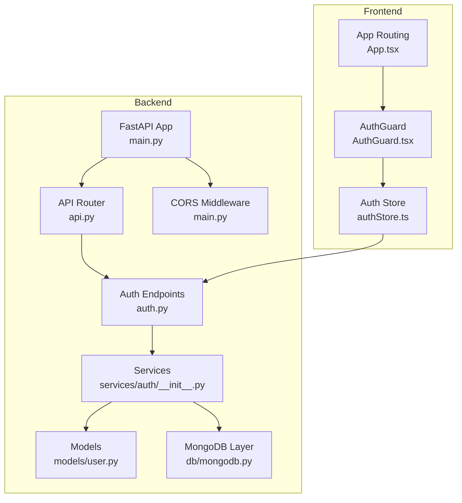
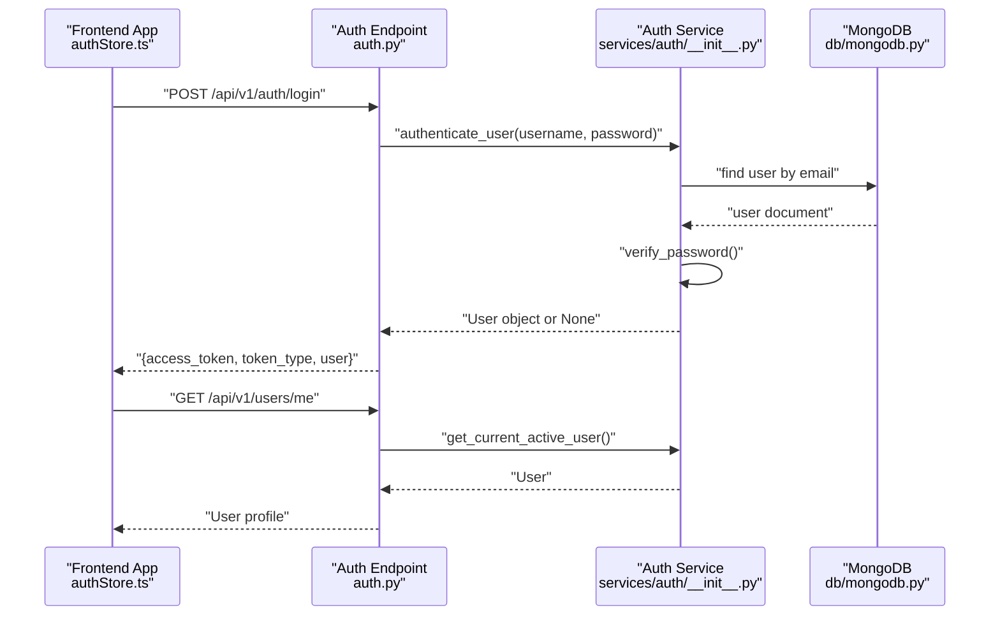
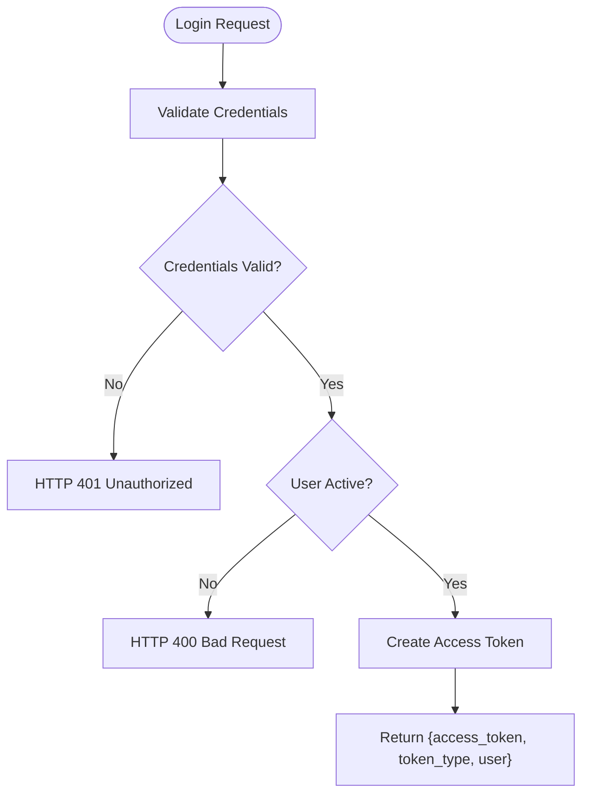
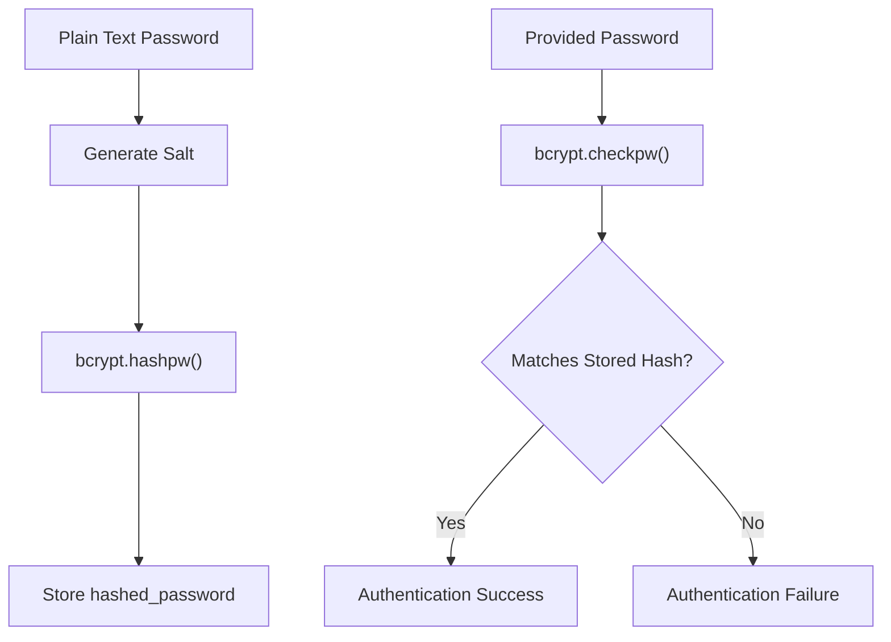
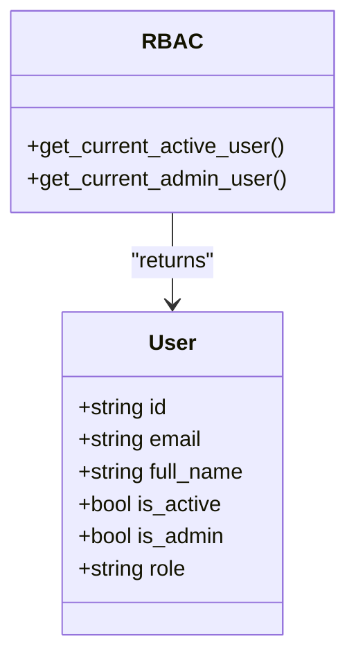
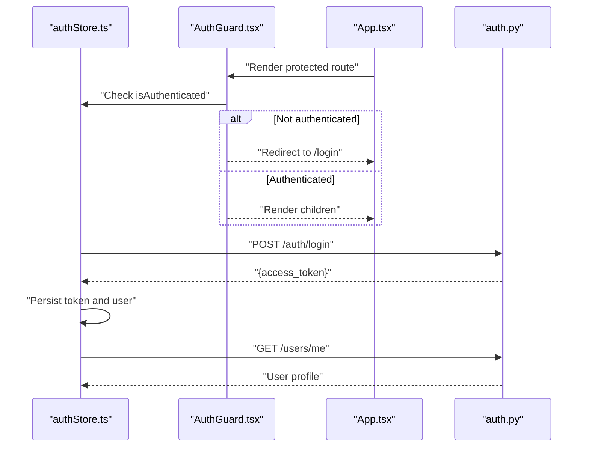
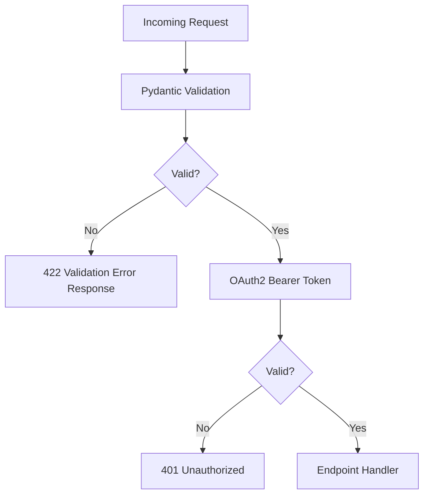
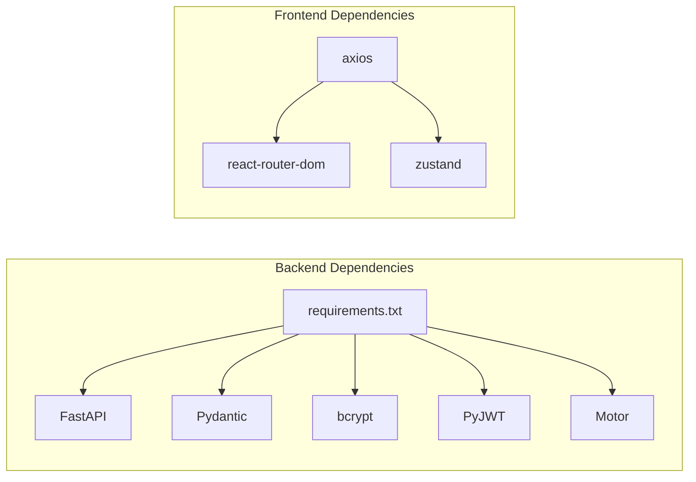

# Security and Authentication

<cite>
**Referenced Files in This Document**
- [auth.py](file://backend/app/api/v1/endpoints/auth.py)
- [__init__.py](file://backend/app/services/auth/__init__.py)
- [user.py](file://backend/app/models/user.py)
- [config.py](file://backend/app/core/config.py)
- [main.py](file://backend/app/main.py)
- [mongodb.py](file://backend/app/db/mongodb.py)
- [api.py](file://backend/app/api/api_v1/api.py)
- [AuthGuard.tsx](file://frontend/src/components/AuthGuard.tsx)
- [authStore.ts](file://frontend/src/store/authStore.ts)
- [App.tsx](file://frontend/src/App.tsx)
- [users.py](file://backend/app/api/v1/endpoints/users.py)
- [constraints.py](file://backend/app/api/v1/endpoints/constraints.py)
- [rules.py](file://backend/app/api/v1/endpoints/rules.py)
- [requirements.txt](file://backend/requirements.txt)
- [test_endpoints.py](file://test_endpoints.py)
- [test_login.py](file://test_login.py)
</cite>

## Table of Contents
1. [Introduction](#introduction)
2. [Project Structure](#project-structure)
3. [Core Components](#core-components)
4. [Architecture Overview](#architecture-overview)
5. [Detailed Component Analysis](#detailed-component-analysis)
6. [Dependency Analysis](#dependency-analysis)
7. [Performance Considerations](#performance-considerations)
8. [Troubleshooting Guide](#troubleshooting-guide)
9. [Conclusion](#conclusion)
10. [Appendices](#appendices)

## Introduction
This document provides comprehensive security documentation for ShedMaster’s authentication and authorization system. It covers JWT-based authentication, role-based access control (RBAC), password security, API security patterns, and frontend authentication state management. It also includes production hardening guidance for CORS, HTTPS, and deployment best practices tailored for academic scheduling applications.

## Project Structure
The authentication and authorization system spans backend endpoints, services, models, and frontend state management:

- Backend API endpoints under `/api/v1/endpoints` define authentication routes and RBAC-protected resources.
- Services encapsulate JWT creation/verification, password hashing, and user retrieval.
- Models define user schemas and validation rules.
- Frontend uses a Zustand store for authentication state and Axios interceptors for token injection.
- CORS middleware is configured at the FastAPI level.

**Diagram sources**
- [main.py:33-102](file://backend/app/main.py#L33-L102)
- [api.py:1-34](file://backend/app/api/api_v1/api.py#L1-L34)
- [auth.py:1-123](file://backend/app/api/v1/endpoints/auth.py#L1-L123)
- [__init__.py:1-190](file://backend/app/services/auth/__init__.py#L1-L190)
- [user.py:1-76](file://backend/app/models/user.py#L1-L76)
- [mongodb.py:1-41](file://backend/app/db/mongodb.py#L1-L41)
- [App.tsx:1-49](file://frontend/src/App.tsx#L1-L49)
- [AuthGuard.tsx:1-32](file://frontend/src/components/AuthGuard.tsx#L1-L32)
- [authStore.ts:1-248](file://frontend/src/store/authStore.ts#L1-L248)

**Section sources**
- [main.py:33-102](file://backend/app/main.py#L33-L102)
- [api.py:1-34](file://backend/app/api/api_v1/api.py#L1-L34)

## Core Components
- JWT-based authentication with bearer tokens for protected endpoints.
- Password hashing using bcrypt with salt generation.
- Role-based access control with user roles and admin privileges.
- Frontend authentication state management with token persistence and Axios interceptors.
- CORS configuration for development and production hardening.

Key implementation references:
- Authentication endpoints and token issuance: [auth.py:29-L64], [auth.py:78-L100], [auth.py:109-L122]
- JWT creation and verification: [__init__.py:41-L59], [__init__.py:91-L134]
- Password hashing and verification: [__init__.py:26-L38]
- User schemas and validation: [user.py:27-L76]
- CORS and middleware setup: [main.py:56-L64]
- Frontend auth store and interceptors: [authStore.ts:29-L248], [AuthGuard.tsx:5-L31]

**Section sources**
- [auth.py:29-122](file://backend/app/api/v1/endpoints/auth.py#L29-L122)
- [__init__.py:26-134](file://backend/app/services/auth/__init__.py#L26-L134)
- [user.py:27-76](file://backend/app/models/user.py#L27-L76)
- [main.py:56-64](file://backend/app/main.py#L56-L64)
- [authStore.ts:29-248](file://frontend/src/store/authStore.ts#L29-L248)
- [AuthGuard.tsx:5-31](file://frontend/src/components/AuthGuard.tsx#L5-L31)

## Architecture Overview
The authentication flow integrates backend endpoints, services, and frontend state management:

**Diagram sources**
- [auth.py:29-64](file://backend/app/api/v1/endpoints/auth.py#L29-L64)
- [__init__.py:62-88](file://backend/app/services/auth/__init__.py#L62-L88)
- [mongodb.py:11-33](file://backend/app/db/mongodb.py#L11-L33)

## Detailed Component Analysis

### JWT Authentication Flow
- Login endpoint validates credentials and issues a signed JWT with an expiration configured via settings.
- Access tokens are validated on subsequent requests using a bearer token scheme.
- Token refresh is supported via a dedicated endpoint.

**Diagram sources**
- [auth.py:29-64](file://backend/app/api/v1/endpoints/auth.py#L29-L64)
- [__init__.py:41-59](file://backend/app/services/auth/__init__.py#L41-L59)

**Section sources**
- [auth.py:29-64](file://backend/app/api/v1/endpoints/auth.py#L29-L64)
- [__init__.py:41-59](file://backend/app/services/auth/__init__.py#L41-L59)

### Password Security
- Passwords are hashed using bcrypt with per-instance salt generation.
- Verification compares the provided password against the stored hash.
- Registration stores only the hashed password.

**Diagram sources**
- [__init__.py:26-38](file://backend/app/services/auth/__init__.py#L26-L38)
- [auth.py:159-189](file://backend/app/api/v1/endpoints/auth.py#L159-L189)

**Section sources**
- [__init__.py:26-38](file://backend/app/services/auth/__init__.py#L26-L38)
- [auth.py:159-189](file://backend/app/api/v1/endpoints/auth.py#L159-L189)

### Role-Based Access Control (RBAC)
- Users have attributes: role, is_admin, is_active.
- Protected endpoints depend on active user retrieval; admin-only endpoints enforce admin privilege.
- Examples:
  - General resource endpoints require active user: [rules.py:14], [constraints.py:14].
  - Admin-only user creation: [users.py:52-L75].
  - Admin-only constraint deletion (creator or admin): [constraints.py:93-L113].

**Diagram sources**
- [user.py:73-76](file://backend/app/models/user.py#L73-L76)
- [__init__.py:137-156](file://backend/app/services/auth/__init__.py#L137-L156)

**Section sources**
- [users.py:52-75](file://backend/app/api/v1/endpoints/users.py#L52-L75)
- [constraints.py:93-113](file://backend/app/api/v1/endpoints/constraints.py#L93-L113)
- [rules.py:14-20](file://backend/app/api/v1/endpoints/rules.py#L14-L20)

### Frontend Authentication State Management
- Zustand store manages user, token, and authentication state.
- Axios interceptors automatically attach Authorization headers for authenticated requests.
- AuthGuard redirects unauthenticated users to the login page.
- Token expiration checks and refresh logic are present with admin-focused refresh.

**Diagram sources**
- [App.tsx:21-46](file://frontend/src/App.tsx#L21-L46)
- [AuthGuard.tsx:5-31](file://frontend/src/components/AuthGuard.tsx#L5-L31)
- [authStore.ts:29-120](file://frontend/src/store/authStore.ts#L29-L120)
- [auth.py:29-64](file://backend/app/api/v1/endpoints/auth.py#L29-L64)

**Section sources**
- [authStore.ts:29-120](file://frontend/src/store/authStore.ts#L29-L120)
- [AuthGuard.tsx:5-31](file://frontend/src/components/AuthGuard.tsx#L5-L31)
- [App.tsx:21-46](file://frontend/src/App.tsx#L21-L46)

### API Security Patterns
- Request validation: FastAPI validation exceptions are captured and returned with structured error details.
- Input sanitization: Pydantic models enforce field types and presence; email validation is applied.
- Token-based protection: OAuth2 bearer token scheme secures endpoints via dependency injection.

**Diagram sources**
- [main.py:42-54](file://backend/app/main.py#L42-L54)
- [user.py:27-76](file://backend/app/models/user.py#L27-L76)
- [__init__.py:21-23](file://backend/app/services/auth/__init__.py#L21-L23)

**Section sources**
- [main.py:42-54](file://backend/app/main.py#L42-L54)
- [user.py:27-76](file://backend/app/models/user.py#L27-L76)
- [__init__.py:21-23](file://backend/app/services/auth/__init__.py#L21-L23)

## Dependency Analysis
- Backend depends on FastAPI, Pydantic, bcrypt, JWT, and Motor for MongoDB.
- Frontend depends on Axios, React Router, and Zustand for state management.

**Diagram sources**
- [requirements.txt:1-19](file://backend/requirements.txt#L1-L19)
- [authStore.ts:3](file://frontend/src/store/authStore.ts#L3)

**Section sources**
- [requirements.txt:1-19](file://backend/requirements.txt#L1-L19)
- [authStore.ts:3](file://frontend/src/store/authStore.ts#L3)

## Performance Considerations
- Token expiration is long-lived (30 days), which reduces refresh overhead but increases risk exposure. Consider shorter expirations with automatic refresh for sensitive operations.
- Password hashing uses bcrypt; ensure hashing cost is tuned appropriately for your hardware.
- MongoDB connection uses timeouts; ensure robust retry logic and monitoring in production.

## Troubleshooting Guide
Common issues and mitigations:
- 401 Unauthorized on protected endpoints:
  - Ensure Authorization header is set with the bearer token.
  - Verify token validity and expiration.
  - Check backend CORS configuration for cross-origin requests.
- 403 Forbidden:
  - Confirm user has required role/admin privileges.
  - Review endpoint-specific RBAC logic.
- Validation errors (422):
  - Inspect returned validation errors for missing or invalid fields.
- CORS failures:
  - Confirm allowed origins and credentials settings.
- Token refresh:
  - Use the refresh endpoint for active sessions; note current implementation focuses on admin auto-refresh.

**Section sources**
- [main.py:42-54](file://backend/app/main.py#L42-L54)
- [users.py:61-62](file://backend/app/api/v1/endpoints/users.py#L61-L62)
- [constraints.py:108-109](file://backend/app/api/v1/endpoints/constraints.py#L108-L109)
- [auth.py:109-122](file://backend/app/api/v1/endpoints/auth.py#L109-L122)
- [main.py:56-64](file://backend/app/main.py#L56-L64)

## Conclusion
ShedMaster implements a clear JWT-based authentication flow with bcrypt password hashing and a pragmatic RBAC model. The frontend integrates tightly with backend endpoints via Axios interceptors and a persisted auth store. Production readiness requires tightening token lifetimes, enforcing HTTPS, restricting CORS origins, and adding rate limiting and audit logging.

## Appendices

### Security Best Practices for Production Deployment
- Enforce HTTPS/TLS for all endpoints.
- Restrict CORS to specific origins and remove wildcard configurations.
- Use short-lived access tokens with secure refresh mechanisms.
- Add rate limiting and request validation middleware.
- Implement audit logs for authentication and sensitive operations.
- Rotate SECRET_KEY regularly and store securely via environment variables.
- Add CSRF protection for state-changing forms if applicable.
- Sanitize and validate all inputs; avoid exposing internal stack traces.

### CORS Configuration Guidance
- Current development configuration allows local Vite origins; tighten for production.
- Remove wildcard origins and specify exact domains.

**Section sources**
- [main.py:56-64](file://backend/app/main.py#L56-L64)
- [config.py:14-23](file://backend/app/core/config.py#L14-L23)

### Testing Authentication Endpoints
- Automated tests demonstrate login and authenticated endpoint access patterns.

**Section sources**
- [test_endpoints.py:1-93](file://test_endpoints.py#L1-L93)
- [test_login.py:1-10](file://test_login.py#L1-L10)