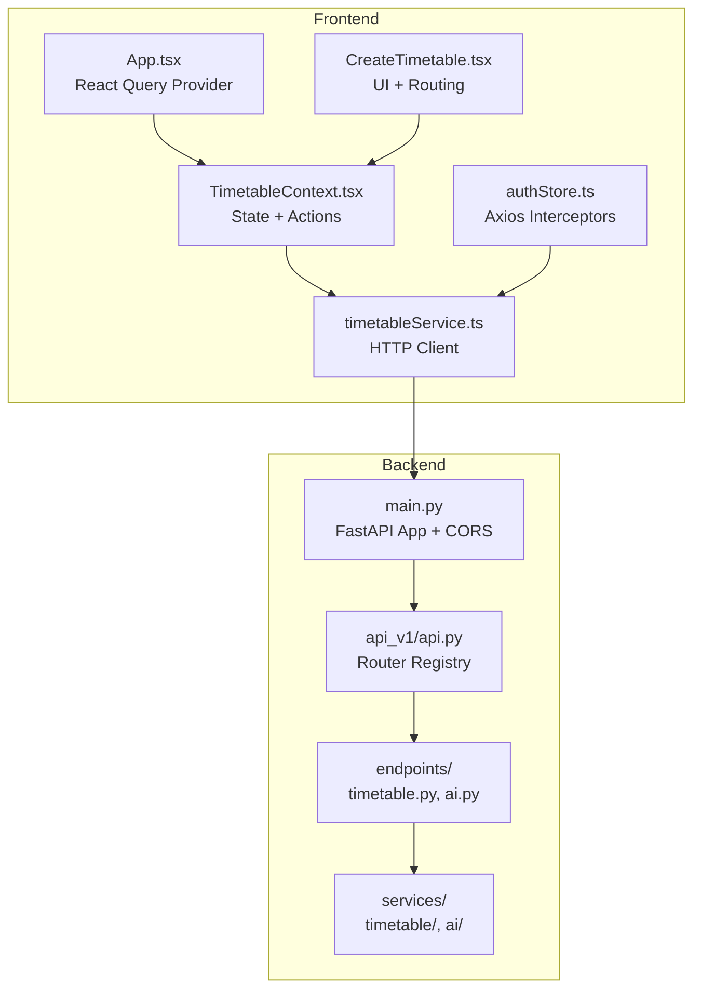
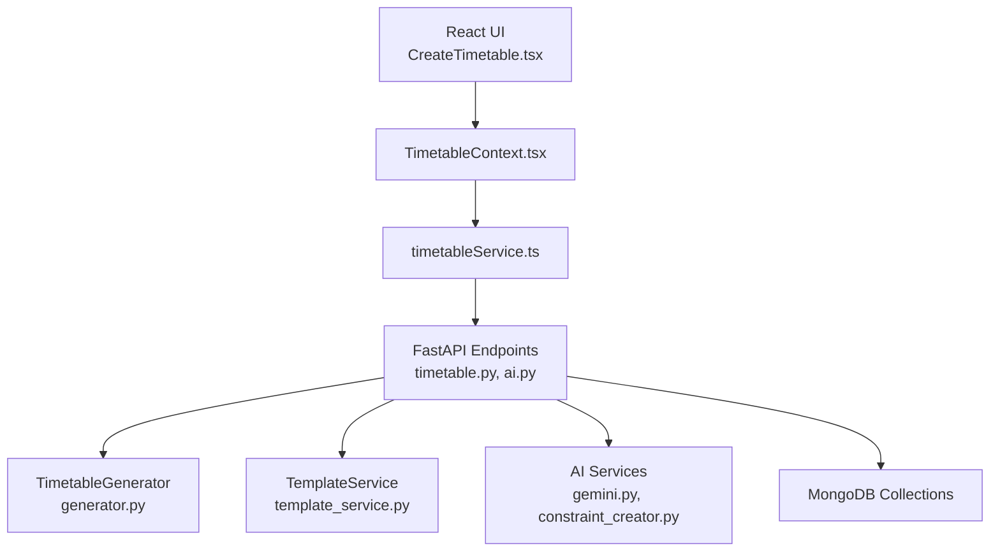
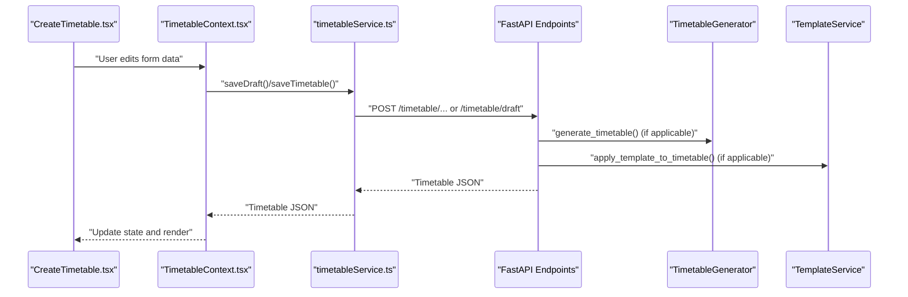
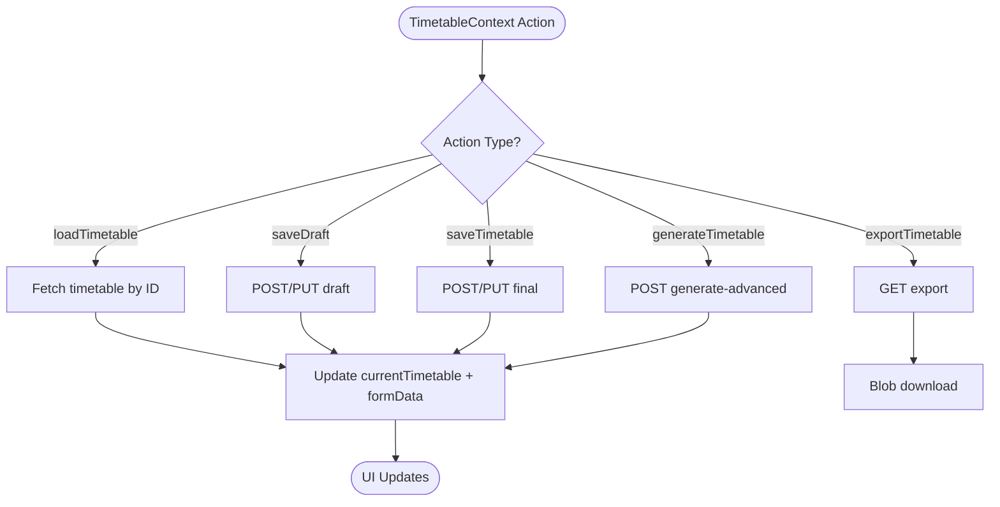
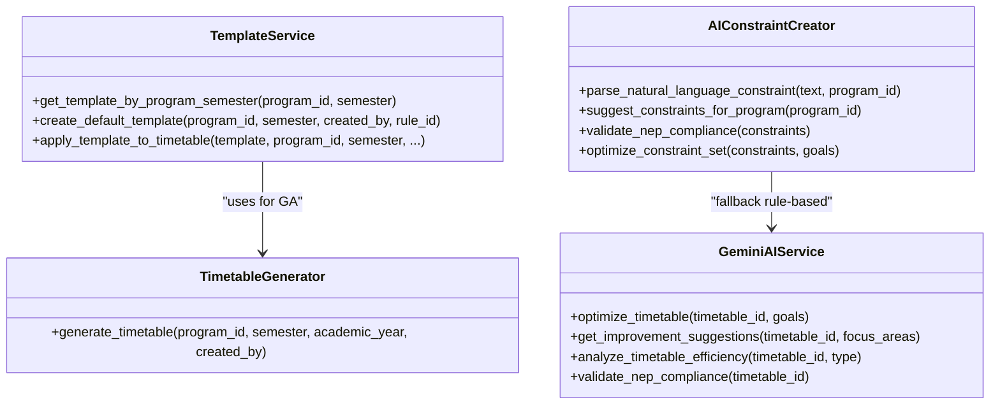
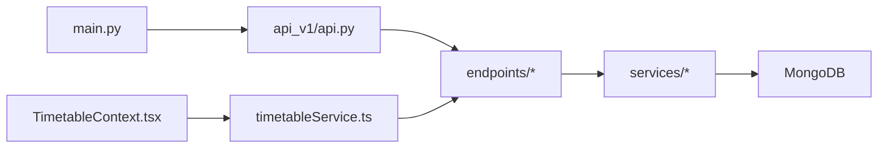
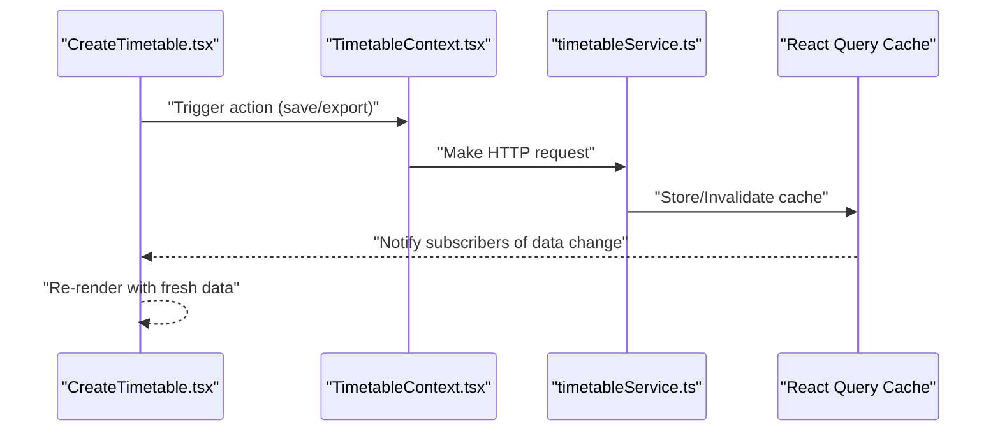
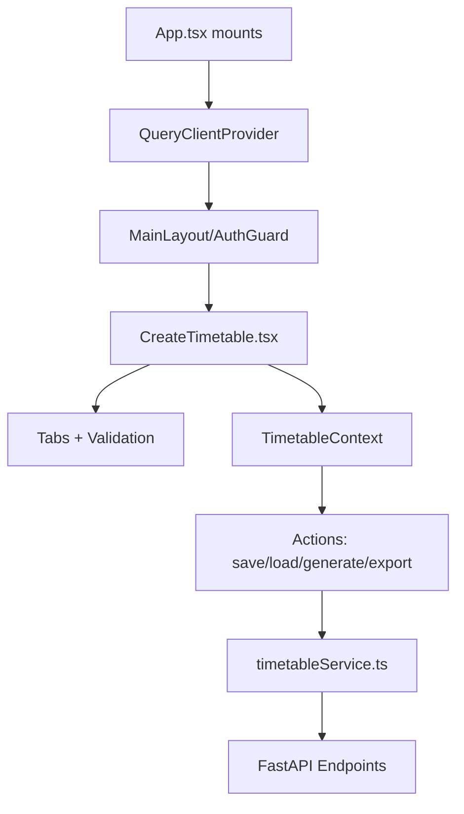
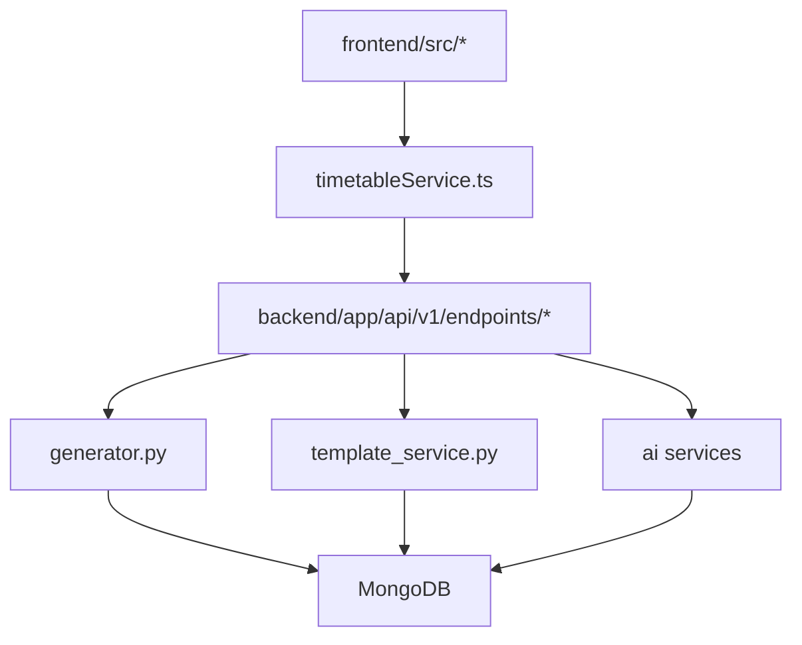

# Component Relationships

<cite>
**Referenced Files in This Document**
- [backend/app/main.py](file://backend/app/main.py)
- [backend/app/api/api_v1/api.py](file://backend/app/api/api_v1/api.py)
- [backend/app/api/v1/endpoints/timetable.py](file://backend/app/api/v1/endpoints/timetable.py)
- [backend/app/api/v1/endpoints/ai.py](file://backend/app/api/v1/endpoints/ai.py)
- [backend/app/services/timetable/generator.py](file://backend/app/services/timetable/generator.py)
- [backend/app/services/timetable/template_service.py](file://backend/app/services/timetable/template_service.py)
- [backend/app/services/ai/constraint_creator.py](file://backend/app/services/ai/constraint_creator.py)
- [backend/app/services/ai/gemini.py](file://backend/app/services/ai/gemini.py)
- [frontend/src/App.tsx](file://frontend/src/App.tsx)
- [frontend/src/contexts/TimetableContext.tsx](file://frontend/src/contexts/TimetableContext.tsx)
- [frontend/src/services/timetableService.ts](file://frontend/src/services/timetableService.ts)
- [frontend/src/components/pages/CreateTimetable.tsx](file://frontend/src/components/pages/CreateTimetable.tsx)
- [frontend/src/store/authStore.ts](file://frontend/src/store/authStore.ts)
</cite>

## Table of Contents
1. [Introduction](#introduction)
2. [Project Structure](#project-structure)
3. [Core Components](#core-components)
4. [Architecture Overview](#architecture-overview)
5. [Detailed Component Analysis](#detailed-component-analysis)
6. [Dependency Analysis](#dependency-analysis)
7. [Performance Considerations](#performance-considerations)
8. [Troubleshooting Guide](#troubleshooting-guide)
9. [Conclusion](#conclusion)

## Introduction
This document explains the component relationships within ShedMaster's architecture, focusing on how the React frontend communicates with FastAPI endpoints, how TimetableContext synchronizes state with backend services, and how the service layer integrates constraint management, AI optimization, and template-based generation. It also covers dependency injection patterns, React Query integration for real-time state updates, and component lifecycle management.

## Project Structure
ShedMaster follows a clear separation of concerns:
- Frontend (React + TypeScript) with React Query for caching and state synchronization
- Backend (FastAPI) with modular API routers and service-layer components
- Shared data models and service abstractions bridging frontend and backend

**Diagram sources**
- [frontend/src/App.tsx:19-46](file://frontend/src/App.tsx#L19-L46)
- [frontend/src/contexts/TimetableContext.tsx:260-626](file://frontend/src/contexts/TimetableContext.tsx#L260-L626)
- [frontend/src/services/timetableService.ts:161-771](file://frontend/src/services/timetableService.ts#L161-L771)
- [frontend/src/components/pages/CreateTimetable.tsx:449-459](file://frontend/src/components/pages/CreateTimetable.tsx#L449-L459)
- [frontend/src/store/authStore.ts:29-247](file://frontend/src/store/authStore.ts#L29-L247)
- [backend/app/main.py:33-102](file://backend/app/main.py#L33-L102)
- [backend/app/api/api_v1/api.py:1-34](file://backend/app/api/api_v1/api.py#L1-L34)
- [backend/app/api/v1/endpoints/timetable.py:15-728](file://backend/app/api/v1/endpoints/timetable.py#L15-L728)
- [backend/app/api/v1/endpoints/ai.py:12-362](file://backend/app/api/v1/endpoints/ai.py#L12-L362)

**Section sources**
- [backend/app/main.py:33-102](file://backend/app/main.py#L33-L102)
- [backend/app/api/api_v1/api.py:1-34](file://backend/app/api/api_v1/api.py#L1-L34)
- [frontend/src/App.tsx:19-46](file://frontend/src/App.tsx#L19-L46)

## Core Components
- TimetableContext: Central React state container for form data, current timetable, loading states, and actions (save, generate, export). It orchestrates HTTP calls via timetableService.
- timetableService: Axios-based HTTP client that encapsulates backend endpoints, injects auth headers, and handles token refresh.
- FastAPI endpoints: Typed routers exposing CRUD, generation, export, and AI-assisted operations.
- Service layer: Timetable generators, template service, and AI assistants implement business logic and integrate with MongoDB.

Key relationships:
- TimetableContext depends on timetableService for all backend interactions.
- timetableService depends on axios interceptors (from authStore and internal interceptors) for authentication.
- Backend endpoints depend on service classes for generation and AI tasks.
- TemplateService coordinates GA-based allocation using program/course/student-group/room/faculty data.

**Section sources**
- [frontend/src/contexts/TimetableContext.tsx:103-626](file://frontend/src/contexts/TimetableContext.tsx#L103-L626)
- [frontend/src/services/timetableService.ts:161-771](file://frontend/src/services/timetableService.ts#L161-L771)
- [backend/app/api/v1/endpoints/timetable.py:15-728](file://backend/app/api/v1/endpoints/timetable.py#L15-L728)
- [backend/app/services/timetable/template_service.py:67-486](file://backend/app/services/timetable/template_service.py#L67-L486)

## Architecture Overview
The system uses a layered architecture:
- Presentation Layer: React components and contexts
- Application Layer: FastAPI routers and endpoint handlers
- Domain Services: Business logic for generation, templates, and AI
- Data Access: MongoDB collections accessed via shared database utilities

**Diagram sources**
- [frontend/src/components/pages/CreateTimetable.tsx:91-459](file://frontend/src/components/pages/CreateTimetable.tsx#L91-L459)
- [frontend/src/contexts/TimetableContext.tsx:260-626](file://frontend/src/contexts/TimetableContext.tsx#L260-L626)
- [frontend/src/services/timetableService.ts:161-771](file://frontend/src/services/timetableService.ts#L161-L771)
- [backend/app/api/v1/endpoints/timetable.py:15-728](file://backend/app/api/v1/endpoints/timetable.py#L15-L728)
- [backend/app/api/v1/endpoints/ai.py:12-362](file://backend/app/api/v1/endpoints/ai.py#L12-L362)
- [backend/app/services/timetable/generator.py:163-402](file://backend/app/services/timetable/generator.py#L163-L402)
- [backend/app/services/timetable/template_service.py:208-486](file://backend/app/services/timetable/template_service.py#L208-L486)
- [backend/app/services/ai/gemini.py:9-288](file://backend/app/services/ai/gemini.py#L9-L288)
- [backend/app/services/ai/constraint_creator.py:18-781](file://backend/app/services/ai/constraint_creator.py#L18-L781)

## Detailed Component Analysis

### Frontend-Backend Communication Flow
This sequence illustrates a typical form-to-generation workflow:
1. User fills tabs in CreateTimetable.tsx
2. TimetableContext saves drafts or final timetables via timetableService
3. timetableService makes HTTP requests to FastAPI endpoints
4. Endpoints delegate to service classes for generation or AI assistance
5. Responses update TimetableContext state and UI

**Diagram sources**
- [frontend/src/components/pages/CreateTimetable.tsx:118-134](file://frontend/src/components/pages/CreateTimetable.tsx#L118-L134)
- [frontend/src/contexts/TimetableContext.tsx:370-442](file://frontend/src/contexts/TimetableContext.tsx#L370-L442)
- [frontend/src/services/timetableService.ts:308-364](file://frontend/src/services/timetableService.ts#L308-L364)
- [backend/app/api/v1/endpoints/timetable.py:234-376](file://backend/app/api/v1/endpoints/timetable.py#L234-L376)
- [backend/app/services/timetable/generator.py:235-402](file://backend/app/services/timetable/generator.py#L235-L402)
- [backend/app/services/timetable/template_service.py:209-414](file://backend/app/services/timetable/template_service.py#L209-L414)

**Section sources**
- [frontend/src/components/pages/CreateTimetable.tsx:118-134](file://frontend/src/components/pages/CreateTimetable.tsx#L118-L134)
- [frontend/src/contexts/TimetableContext.tsx:370-442](file://frontend/src/contexts/TimetableContext.tsx#L370-L442)
- [frontend/src/services/timetableService.ts:308-364](file://frontend/src/services/timetableService.ts#L308-L364)
- [backend/app/api/v1/endpoints/timetable.py:234-376](file://backend/app/api/v1/endpoints/timetable.py#L234-L376)

### TimetableContext and Backend State Synchronization
TimetableContext centralizes state and actions:
- Maintains formData, currentTimetable, and loading flags
- Provides actions: loadTimetable, saveDraft, saveTimetable, generateTimetable, exportTimetable
- Loads supporting data: programs, courses, faculty, rooms
- Validates current tab and computes validation errors

**Diagram sources**
- [frontend/src/contexts/TimetableContext.tsx:304-480](file://frontend/src/contexts/TimetableContext.tsx#L304-L480)
- [frontend/src/services/timetableService.ts:314-373](file://frontend/src/services/timetableService.ts#L314-L373)

**Section sources**
- [frontend/src/contexts/TimetableContext.tsx:103-626](file://frontend/src/contexts/TimetableContext.tsx#L103-L626)
- [frontend/src/services/timetableService.ts:308-373](file://frontend/src/services/timetableService.ts#L308-L373)

### Service Layer Architecture: generator.py, template_service.py, AI Integration
- TimetableGenerator: Implements constraint-based generation, loads program/course/group/room/faculty data, and produces timetable documents.
- TemplateService: Normalizes overrides, fetches program/course/student-group/room/faculty data, runs GA engine, and creates timetable entries with metadata.
- AI Services: GeminiAIService and AIConstraintCreator provide AI-powered optimization, suggestions, NEP compliance checks, and constraint parsing/optimization.

**Diagram sources**
- [backend/app/services/timetable/generator.py:163-402](file://backend/app/services/timetable/generator.py#L163-L402)
- [backend/app/services/timetable/template_service.py:209-414](file://backend/app/services/timetable/template_service.py#L209-L414)
- [backend/app/services/ai/gemini.py:9-288](file://backend/app/services/ai/gemini.py#L9-L288)
- [backend/app/services/ai/constraint_creator.py:18-781](file://backend/app/services/ai/constraint_creator.py#L18-L781)

**Section sources**
- [backend/app/services/timetable/generator.py:163-402](file://backend/app/services/timetable/generator.py#L163-L402)
- [backend/app/services/timetable/template_service.py:209-414](file://backend/app/services/timetable/template_service.py#L209-L414)
- [backend/app/services/ai/gemini.py:9-288](file://backend/app/services/ai/gemini.py#L9-L288)
- [backend/app/services/ai/constraint_creator.py:18-781](file://backend/app/services/ai/constraint_creator.py#L18-L781)

### Dependency Injection Patterns
- FastAPI app wiring: main.py registers routers and middleware; endpoints import services as needed.
- Service composition: endpoints instantiate service classes (e.g., TimetableGenerator, TemplateService) to execute business logic.
- Frontend dependency injection: TimetableContext depends on timetableService; timetableService encapsulates axios and interceptors, providing a clean interface to endpoints.

**Diagram sources**
- [backend/app/main.py:33-102](file://backend/app/main.py#L33-L102)
- [backend/app/api/api_v1/api.py:1-34](file://backend/app/api/api_v1/api.py#L1-L34)
- [backend/app/api/v1/endpoints/timetable.py:15-728](file://backend/app/api/v1/endpoints/timetable.py#L15-L728)
- [frontend/src/contexts/TimetableContext.tsx:260-626](file://frontend/src/contexts/TimetableContext.tsx#L260-L626)
- [frontend/src/services/timetableService.ts:161-771](file://frontend/src/services/timetableService.ts#L161-L771)

**Section sources**
- [backend/app/main.py:33-102](file://backend/app/main.py#L33-L102)
- [backend/app/api/api_v1/api.py:1-34](file://backend/app/api/api_v1/api.py#L1-L34)
- [frontend/src/contexts/TimetableContext.tsx:260-626](file://frontend/src/contexts/TimetableContext.tsx#L260-L626)
- [frontend/src/services/timetableService.ts:161-771](file://frontend/src/services/timetableService.ts#L161-L771)

### React Query Integration and Real-Time State Updates
- App.tsx initializes QueryClientProvider globally, enabling caching and automatic refetching.
- TimetableContext actions trigger HTTP requests; React Query caches responses and can invalidate/refetch on mutations.
- The observer pattern manifests as cached state updates across components when backend data changes.

**Diagram sources**
- [frontend/src/App.tsx:19-46](file://frontend/src/App.tsx#L19-L46)
- [frontend/src/contexts/TimetableContext.tsx:370-442](file://frontend/src/contexts/TimetableContext.tsx#L370-L442)
- [frontend/src/services/timetableService.ts:308-364](file://frontend/src/services/timetableService.ts#L308-L364)

**Section sources**
- [frontend/src/App.tsx:19-46](file://frontend/src/App.tsx#L19-L46)
- [frontend/src/contexts/TimetableContext.tsx:370-442](file://frontend/src/contexts/TimetableContext.tsx#L370-L442)
- [frontend/src/services/timetableService.ts:308-364](file://frontend/src/services/timetableService.ts#L308-L364)

### Component Lifecycle Management and Inter-Component Communication
- CreateTimetable.tsx manages tab navigation, validation, and progress tracking.
- TimetableContext exposes actions and computed state; components consume via hooks.
- AuthStore and axios interceptors ensure consistent authentication across requests.

**Diagram sources**
- [frontend/src/App.tsx:21-46](file://frontend/src/App.tsx#L21-L46)
- [frontend/src/components/pages/CreateTimetable.tsx:91-459](file://frontend/src/components/pages/CreateTimetable.tsx#L91-L459)
- [frontend/src/contexts/TimetableContext.tsx:260-626](file://frontend/src/contexts/TimetableContext.tsx#L260-L626)
- [frontend/src/services/timetableService.ts:161-771](file://frontend/src/services/timetableService.ts#L161-L771)

**Section sources**
- [frontend/src/components/pages/CreateTimetable.tsx:91-459](file://frontend/src/components/pages/CreateTimetable.tsx#L91-L459)
- [frontend/src/contexts/TimetableContext.tsx:260-626](file://frontend/src/contexts/TimetableContext.tsx#L260-L626)
- [frontend/src/store/authStore.ts:29-247](file://frontend/src/store/authStore.ts#L29-L247)

## Dependency Analysis
- Frontend depends on timetableService for HTTP operations; timetableService depends on axios interceptors for auth.
- Backend endpoints depend on service classes for business logic; services depend on MongoDB collections.
- Router registry in api_v1/api.py wires all endpoints under /api/v1.

**Diagram sources**
- [frontend/src/services/timetableService.ts:161-771](file://frontend/src/services/timetableService.ts#L161-L771)
- [backend/app/api/v1/endpoints/timetable.py:15-728](file://backend/app/api/v1/endpoints/timetable.py#L15-L728)
- [backend/app/services/timetable/generator.py:163-402](file://backend/app/services/timetable/generator.py#L163-L402)
- [backend/app/services/timetable/template_service.py:209-414](file://backend/app/services/timetable/template_service.py#L209-L414)
- [backend/app/services/ai/gemini.py:9-288](file://backend/app/services/ai/gemini.py#L9-L288)
- [backend/app/services/ai/constraint_creator.py:18-781](file://backend/app/services/ai/constraint_creator.py#L18-L781)

**Section sources**
- [backend/app/api/api_v1/api.py:1-34](file://backend/app/api/api_v1/api.py#L1-L34)
- [backend/app/api/v1/endpoints/timetable.py:15-728](file://backend/app/api/v1/endpoints/timetable.py#L15-L728)

## Performance Considerations
- Use React Query cache effectively to avoid redundant network calls during navigation and repeated actions.
- Batch operations (e.g., bulk course creation) leverage backend bulk endpoints to reduce latency.
- Template-based generation offloads heavy computation to GA engine; consider tuning population size and generations for large datasets.
- AI endpoints may be rate-limited; implement retry/backoff strategies and cache results where appropriate.

## Troubleshooting Guide
Common issues and resolutions:
- Authentication failures: Verify axios interceptors and authStore token handling; ensure Authorization header is present on requests.
- CORS errors: Confirm frontend origin is allowed in main.py CORS configuration.
- Validation errors: FastAPI validation_exception_handler returns detailed errors; check request bodies and field types.
- Token refresh: TimetableService attempts refresh for admin users; otherwise, redirect to login.

**Section sources**
- [backend/app/main.py:42-54](file://backend/app/main.py#L42-L54)
- [frontend/src/store/authStore.ts:209-247](file://frontend/src/store/authStore.ts#L209-L247)
- [frontend/src/services/timetableService.ts:263-305](file://frontend/src/services/timetableService.ts#L263-L305)

## Conclusion
ShedMaster’s architecture cleanly separates frontend and backend concerns, with TimetableContext serving as the central state coordinator. The service layer integrates constraint management, AI optimization, and template-based generation, while FastAPI endpoints provide typed, secure APIs. React Query enables efficient caching and real-time updates, and dependency injection patterns keep components loosely coupled and testable.