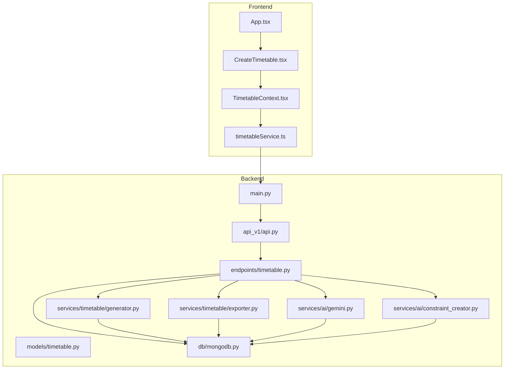
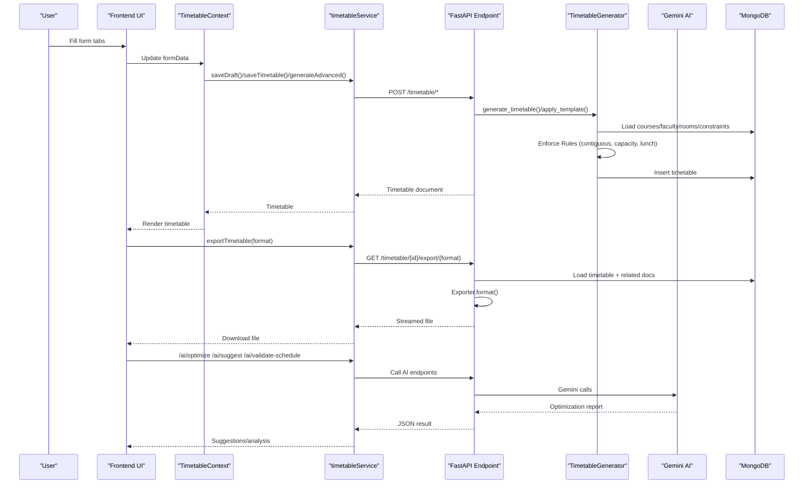
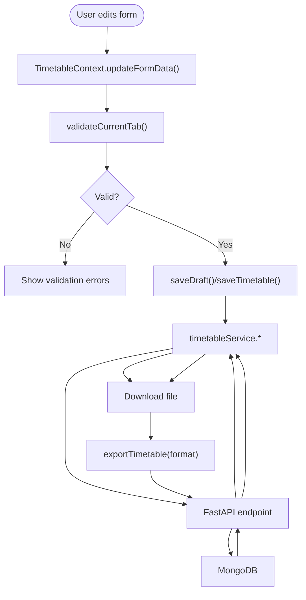
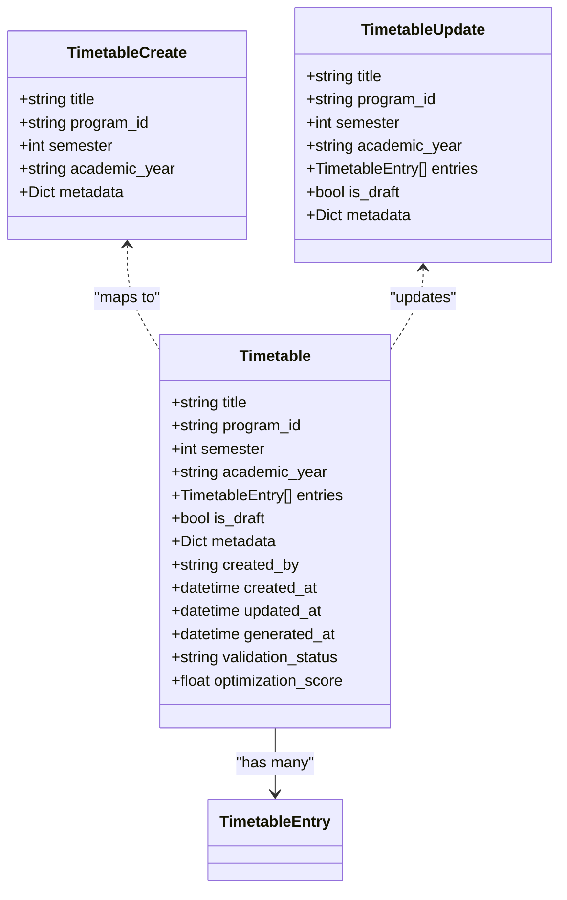
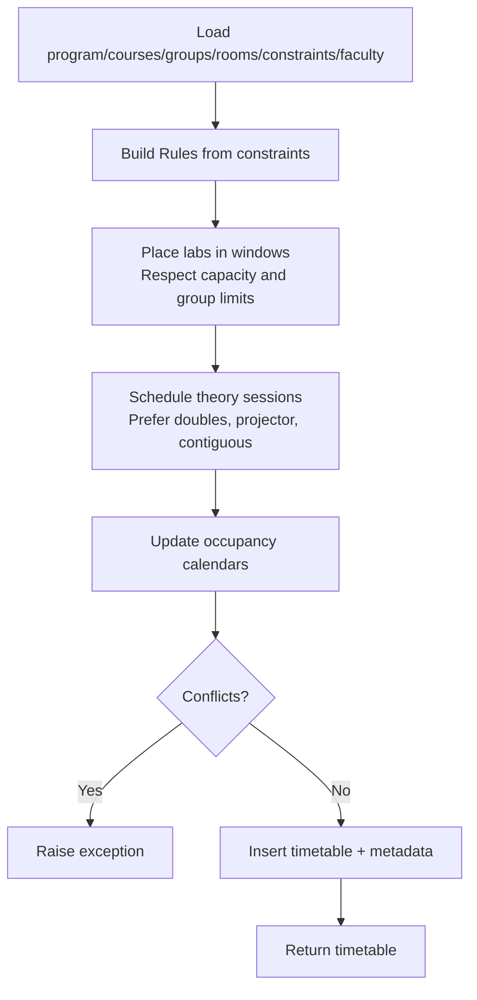
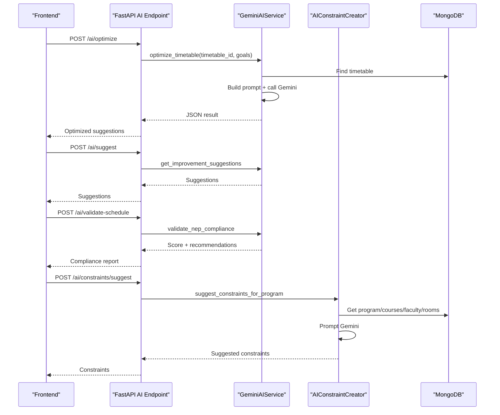
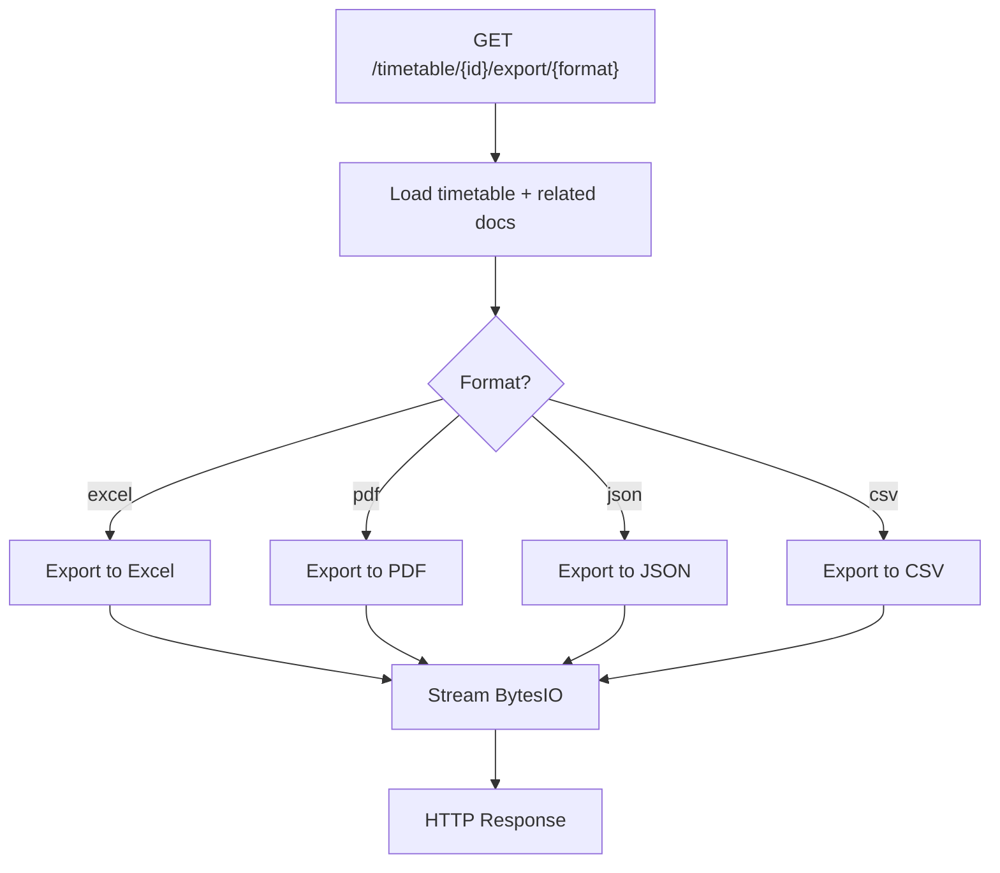
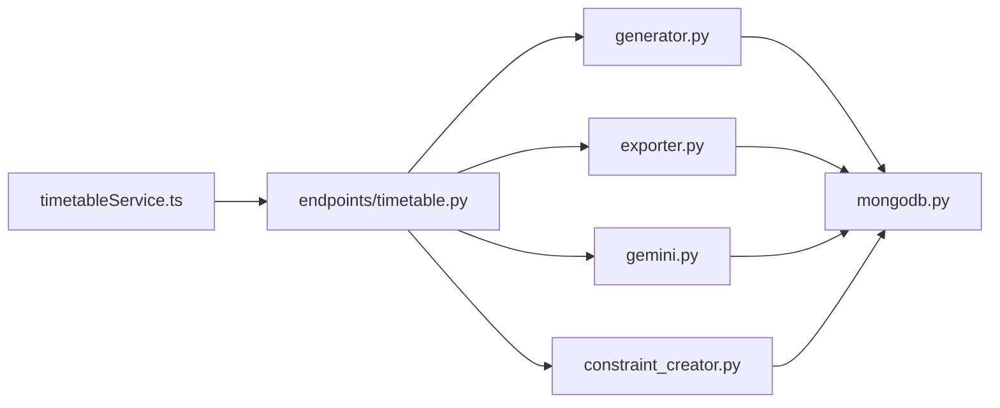

# Data Flow Architecture

<cite>
**Referenced Files in This Document**
- [backend/app/main.py](file://backend/app/main.py)
- [backend/app/db/mongodb.py](file://backend/app/db/mongodb.py)
- [backend/app/api/api_v1/api.py](file://backend/app/api/api_v1/api.py)
- [backend/app/api/v1/endpoints/timetable.py](file://backend/app/api/v1/endpoints/timetable.py)
- [backend/app/models/timetable.py](file://backend/app/models/timetable.py)
- [backend/app/services/timetable/generator.py](file://backend/app/services/timetable/generator.py)
- [backend/app/services/timetable/exporter.py](file://backend/app/services/timetable/exporter.py)
- [backend/app/services/ai/gemini.py](file://backend/app/services/ai/gemini.py)
- [backend/app/services/ai/constraint_creator.py](file://backend/app/services/ai/constraint_creator.py)
- [backend/app/services/timetable/ga_engine.py](file://backend/app/services/timetable/ga_engine.py)
- [frontend/src/App.tsx](file://frontend/src/App.tsx)
- [frontend/src/components/pages/CreateTimetable.tsx](file://frontend/src/components/pages/CreateTimetable.tsx)
- [frontend/src/contexts/TimetableContext.tsx](file://frontend/src/contexts/TimetableContext.tsx)
- [frontend/src/services/timetableService.ts](file://frontend/src/services/timetableService.ts)
</cite>

## Table of Contents
1. [Introduction](#introduction)
2. [Project Structure](#project-structure)
3. [Core Components](#core-components)
4. [Architecture Overview](#architecture-overview)
5. [Detailed Component Analysis](#detailed-component-analysis)
6. [Dependency Analysis](#dependency-analysis)
7. [Performance Considerations](#performance-considerations)
8. [Troubleshooting Guide](#troubleshooting-guide)
9. [Conclusion](#conclusion)

## Introduction
This document describes the complete data flow architecture for ShedMaster’s timetable generation pipeline. It traces user input from React forms through backend APIs, MongoDB persistence, constraint-based generation, AI optimization using Google Gemini, and export to Excel, PDF, and JSON. It also covers validation, error propagation, rollback safeguards, caching and state synchronization, and performance monitoring opportunities.

## Project Structure
The system comprises:
- Frontend (React + TypeScript) with routing, state management, and service layer
- Backend (FastAPI) with REST endpoints, validation, and business logic
- MongoDB for persistent storage
- AI services for optimization and constraint assistance

**Diagram sources**
- [backend/app/main.py:1-102](file://backend/app/main.py#L1-L102)
- [backend/app/api/api_v1/api.py:1-34](file://backend/app/api/api_v1/api.py#L1-L34)
- [backend/app/api/v1/endpoints/timetable.py:1-728](file://backend/app/api/v1/endpoints/timetable.py#L1-L728)
- [backend/app/db/mongodb.py:1-41](file://backend/app/db/mongodb.py#L1-L41)
- [frontend/src/App.tsx:1-49](file://frontend/src/App.tsx#L1-L49)
- [frontend/src/components/pages/CreateTimetable.tsx:1-459](file://frontend/src/components/pages/CreateTimetable.tsx#L1-L459)
- [frontend/src/contexts/TimetableContext.tsx:1-629](file://frontend/src/contexts/TimetableContext.tsx#L1-L629)
- [frontend/src/services/timetableService.ts:1-772](file://frontend/src/services/timetableService.ts#L1-L772)

**Section sources**
- [backend/app/main.py:1-102](file://backend/app/main.py#L1-L102)
- [backend/app/api/api_v1/api.py:1-34](file://backend/app/api/api_v1/api.py#L1-L34)
- [frontend/src/App.tsx:1-49](file://frontend/src/App.tsx#L1-L49)

## Core Components
- Frontend Application and Routing
  - App initializes providers, theme, localization, and routes.
  - CreateTimetable orchestrates multi-tab form data collection and validation.
  - TimetableContext manages form state, loading, saving, and generation actions.
  - timetableService encapsulates API calls and auth token injection.

- Backend API and Data Models
  - FastAPI app configures CORS, validation, and MongoDB lifecycle.
  - API router aggregates endpoints for timetables, constraints, AI, and exports.
  - Pydantic models define request/response shapes for timetables.

- Generation and Export Services
  - Constraint-based generator builds timetables respecting rules and capacities.
  - Exporter produces Excel, PDF, JSON, and CSV outputs with enriched metadata.
  - AI services leverage Google Gemini for optimization, suggestions, and NEP validation.

**Section sources**
- [frontend/src/App.tsx:1-49](file://frontend/src/App.tsx#L1-L49)
- [frontend/src/components/pages/CreateTimetable.tsx:1-459](file://frontend/src/components/pages/CreateTimetable.tsx#L1-L459)
- [frontend/src/contexts/TimetableContext.tsx:1-629](file://frontend/src/contexts/TimetableContext.tsx#L1-L629)
- [frontend/src/services/timetableService.ts:1-772](file://frontend/src/services/timetableService.ts#L1-L772)
- [backend/app/main.py:1-102](file://backend/app/main.py#L1-L102)
- [backend/app/api/api_v1/api.py:1-34](file://backend/app/api/api_v1/api.py#L1-L34)
- [backend/app/models/timetable.py:1-52](file://backend/app/models/timetable.py#L1-L52)

## Architecture Overview
The end-to-end flow:
1. User fills React form tabs (Academic, Courses, Faculty, Student Groups, Rooms, Rules).
2. TimetableContext persists metadata and coordinates save/generate actions.
3. timetableService sends requests to backend endpoints.
4. Backend validates and authenticates, loads data from MongoDB, runs generation or export.
5. AI services (Gemini) assist with optimization and constraint suggestions.
6. Results are persisted to MongoDB and returned to the frontend.
7. Export endpoints stream Excel/PDF/JSON to the client.

**Diagram sources**
- [frontend/src/contexts/TimetableContext.tsx:370-480](file://frontend/src/contexts/TimetableContext.tsx#L370-L480)
- [frontend/src/services/timetableService.ts:308-373](file://frontend/src/services/timetableService.ts#L308-L373)
- [backend/app/api/v1/endpoints/timetable.py:234-728](file://backend/app/api/v1/endpoints/timetable.py#L234-L728)
- [backend/app/services/timetable/generator.py:235-402](file://backend/app/services/timetable/generator.py#L235-L402)
- [backend/app/services/timetable/exporter.py:22-383](file://backend/app/services/timetable/exporter.py#L22-L383)
- [backend/app/services/ai/gemini.py:18-288](file://backend/app/services/ai/gemini.py#L18-L288)

## Detailed Component Analysis

### Frontend Data Flow and State Management
- Form orchestration
  - CreateTimetable renders tabbed UI and tracks completion via validation.
  - TimetableContext aggregates form sections (basic info, working days, time slots, courses, faculty, student groups, rooms, constraints).
  - buildPersistedMetadata preserves working days/time slots and other metadata across saves.

- Persistence and generation
  - saveDraft/updateTimetable send TimetableCreate/Update payloads to backend.
  - generateAdvancedTimetable triggers template-based generation with optional overrides.
  - exportTimetable streams files from backend and triggers browser downloads.

- Authentication and interceptors
  - timetableService injects Authorization header from localStorage auth-storage.
  - Interceptors log requests/responses and handle 401 refresh logic.

**Diagram sources**
- [frontend/src/contexts/TimetableContext.tsx:547-594](file://frontend/src/contexts/TimetableContext.tsx#L547-L594)
- [frontend/src/contexts/TimetableContext.tsx:370-480](file://frontend/src/contexts/TimetableContext.tsx#L370-L480)
- [frontend/src/services/timetableService.ts:308-373](file://frontend/src/services/timetableService.ts#L308-L373)

**Section sources**
- [frontend/src/components/pages/CreateTimetable.tsx:91-214](file://frontend/src/components/pages/CreateTimetable.tsx#L91-L214)
- [frontend/src/contexts/TimetableContext.tsx:260-629](file://frontend/src/contexts/TimetableContext.tsx#L260-L629)
- [frontend/src/services/timetableService.ts:161-306](file://frontend/src/services/timetableService.ts#L161-L306)

### Backend API and Data Models
- CORS and validation
  - main.py configures CORS for frontend origins, global lifespan for DB, and a custom validation exception handler returning structured errors.

- Endpoint routing
  - api_v1/api.py aggregates routers for users, auth, programs, courses, timetable, templates, constraints, faculty, student groups, rooms, rules, and AI.

- Timetable endpoints
  - CRUD operations enforce user isolation by filtering on created_by.
  - Generation endpoints:
    - /timetable/generate: constraint-based generation.
    - /timetable/generate-advanced: template-based generation with overrides.
    - /timetable/generate-nep-ga: NEP-compliant GA engine.
  - Export endpoints stream Excel/PDF/JSON.
  - AI endpoints delegate to AI services.

**Diagram sources**
- [backend/app/models/timetable.py:6-52](file://backend/app/models/timetable.py#L6-L52)

**Section sources**
- [backend/app/main.py:41-54](file://backend/app/main.py#L41-L54)
- [backend/app/api/api_v1/api.py:1-34](file://backend/app/api/api_v1/api.py#L1-L34)
- [backend/app/api/v1/endpoints/timetable.py:17-145](file://backend/app/api/v1/endpoints/timetable.py#L17-L145)
- [backend/app/models/timetable.py:1-52](file://backend/app/models/timetable.py#L1-L52)

### Constraint-Based Generation and Scheduling Rules
- Data loading
  - generator.py loads program, courses, groups, rooms, constraints, and faculty from MongoDB.
  - Rules are derived from constraints (time settings, max periods, contiguous limits, lab windows).

- Placement logic
  - Labs placed first in designated windows, respecting room capacity and group limits.
  - Theory sessions scheduled with preference for double periods, projector availability, and contiguous limits.
  - Occupancy calendars track room, group, and faculty schedules to prevent conflicts.

- Output
  - Inserts timetable document with metadata (days, period minutes, max periods per day).
  - Returns the persisted timetable.

**Diagram sources**
- [backend/app/services/timetable/generator.py:169-233](file://backend/app/services/timetable/generator.py#L169-L233)
- [backend/app/services/timetable/generator.py:273-379](file://backend/app/services/timetable/generator.py#L273-L379)
- [backend/app/services/timetable/generator.py:380-402](file://backend/app/services/timetable/generator.py#L380-L402)

**Section sources**
- [backend/app/services/timetable/generator.py:163-402](file://backend/app/services/timetable/generator.py#L163-L402)

### AI Optimization Pipeline with Google Gemini
- Optimization
  - GeminiAIService.optimize_timetable accepts a timetable_id and optimization goals, constructs a prompt, and returns a structured analysis and suggestions.

- Suggestions and Analysis
  - get_improvement_suggestions and analyze_timetable_efficiency provide actionable insights and efficiency metrics.

- NEP 2020 Validation
  - validate_nep_compliance checks against NEP guidelines and returns a compliance score and recommendations.

- Constraint Creation
  - AIConstraintCreator parses natural language constraints into structured objects, suggests program-specific constraints, validates NEP compliance, and optimizes constraint sets.

**Diagram sources**
- [backend/app/services/ai/gemini.py:18-288](file://backend/app/services/ai/gemini.py#L18-L288)
- [backend/app/services/ai/constraint_creator.py:179-500](file://backend/app/services/ai/constraint_creator.py#L179-L500)

**Section sources**
- [backend/app/services/ai/gemini.py:9-288](file://backend/app/services/ai/gemini.py#L9-L288)
- [backend/app/services/ai/constraint_creator.py:18-781](file://backend/app/services/ai/constraint_creator.py#L18-L781)

### Export Pipeline (Excel, PDF, JSON, CSV)
- Exporter capabilities
  - TimetableExporter supports Excel, PDF, JSON, and CSV formats.
  - Enriches entries with course, faculty, and room details.
  - Streams binary responses for Excel/PDF; returns JSON blobs for JSON.

- Multiple export
  - Supports exporting multiple timetables into a single Excel workbook or consolidated JSON.

**Diagram sources**
- [backend/app/api/v1/endpoints/timetable.py:623-687](file://backend/app/api/v1/endpoints/timetable.py#L623-L687)
- [backend/app/services/timetable/exporter.py:22-383](file://backend/app/services/timetable/exporter.py#L22-L383)

**Section sources**
- [backend/app/api/v1/endpoints/timetable.py:623-687](file://backend/app/api/v1/endpoints/timetable.py#L623-L687)
- [backend/app/services/timetable/exporter.py:16-383](file://backend/app/services/timetable/exporter.py#L16-L383)

### Data Transformation Between Frontend Models and Backend Schemas
- Frontend types
  - timetableService.ts defines TimetableBase/TimetableCreate/TimetableUpdate and related entities (Course, Faculty, Room, StudentGroup, Rule).
- Backend models
  - models/timetable.py defines Pydantic models for Timetable, TimetableCreate, TimetableUpdate, and nested TimeSlot.
- Transformation points
  - Frontend sends TimetableCreate; backend converts program_id to ObjectId and created_by to ObjectId before persisting.
  - ObjectIds are converted to strings for JSON responses to keep frontend compatibility.

**Section sources**
- [frontend/src/services/timetableService.ts:22-58](file://frontend/src/services/timetableService.ts#L22-L58)
- [backend/app/models/timetable.py:21-52](file://backend/app/models/timetable.py#L21-L52)
- [backend/app/api/v1/endpoints/timetable.py:116-145](file://backend/app/api/v1/endpoints/timetable.py#L116-L145)

### Validation, Error Propagation, and Rollback Mechanisms
- Validation
  - FastAPI validation exceptions are captured and returned with structured details and body.
  - Endpoint-level validation ensures user isolation (created_by filters) and raises 404 for not-found resources.
- Error propagation
  - Exceptions raised in generation/export propagate to HTTPException with 500 status.
  - Frontend interceptors handle 401 and attempt token refresh.
- Rollback safeguards
  - Generation uses atomic inserts; failures abort without partial writes.
  - Export reads fresh data per request to avoid stale views.

**Section sources**
- [backend/app/main.py:41-54](file://backend/app/main.py#L41-L54)
- [backend/app/api/v1/endpoints/timetable.py:17-114](file://backend/app/api/v1/endpoints/timetable.py#L17-L114)
- [frontend/src/services/timetableService.ts:223-261](file://frontend/src/services/timetableService.ts#L223-L261)

### Caching Strategies and State Synchronization
- Frontend caching
  - React Query client is initialized; however, no explicit cache configuration is shown in the provided files.
  - localStorage stores auth-storage for bearer token injection.
- Backend caching
  - No explicit Redis/Memcached is configured; MongoDB queries are executed per request.
- State synchronization
  - TimetableContext merges metadata from backend responses to maintain continuity across reloads.
  - ObjectID conversions ensure consistent IDs across frontend/backend boundaries.

**Section sources**
- [frontend/src/App.tsx:19](file://frontend/src/App.tsx#L19)
- [frontend/src/contexts/TimetableContext.tsx:304-368](file://frontend/src/contexts/TimetableContext.tsx#L304-L368)
- [backend/app/api/v1/endpoints/timetable.py:51-114](file://backend/app/api/v1/endpoints/timetable.py#L51-L114)

## Dependency Analysis
Key dependencies and coupling:
- Frontend depends on timetableService for all backend interactions.
- Backend endpoints depend on generator, exporter, and AI services.
- All services depend on MongoDB via db/mongodb.py.
- API router composes all endpoint modules.

**Diagram sources**
- [frontend/src/services/timetableService.ts:161-772](file://frontend/src/services/timetableService.ts#L161-L772)
- [backend/app/api/v1/endpoints/timetable.py:1-728](file://backend/app/api/v1/endpoints/timetable.py#L1-L728)
- [backend/app/services/timetable/generator.py:1-402](file://backend/app/services/timetable/generator.py#L1-L402)
- [backend/app/services/timetable/exporter.py:1-383](file://backend/app/services/timetable/exporter.py#L1-L383)
- [backend/app/services/ai/gemini.py:1-288](file://backend/app/services/ai/gemini.py#L1-L288)
- [backend/app/services/ai/constraint_creator.py:1-781](file://backend/app/services/ai/constraint_creator.py#L1-L781)
- [backend/app/db/mongodb.py:1-41](file://backend/app/db/mongodb.py#L1-L41)

**Section sources**
- [backend/app/api/api_v1/api.py:6-34](file://backend/app/api/api_v1/api.py#L6-L34)
- [backend/app/db/mongodb.py:1-41](file://backend/app/db/mongodb.py#L1-L41)

## Performance Considerations
- Database queries
  - Generator performs multiple collection scans; consider indexing on program_id, semester, and is_active fields.
  - Exporter performs per-entry lookups; batch operations could reduce round-trips.
- AI latency
  - Gemini calls are external; add timeouts and retry policies; consider local fallbacks.
- Frontend responsiveness
  - Use React Query caching and optimistic updates for save/generate actions.
  - Debounce auto-save to reduce network overhead.
- Algorithmic efficiency
  - GA engine parameters (population size, generations) can be tuned; early stopping thresholds are already present.
  - Contiguity checks and occupancy updates are O(n) per placement; ensure efficient slot comparisons.

[No sources needed since this section provides general guidance]

## Troubleshooting Guide
- CORS and authentication
  - Verify frontend origins in CORS middleware and presence of Authorization header in requests.
- Validation errors
  - Inspect structured validation responses and request bodies for missing fields or wrong types.
- 401 token expiration
  - Frontend interceptor attempts admin login; ensure admin credentials are available or implement refresh tokens.
- Export failures
  - Confirm timetable ownership and format support; check for missing related documents.

**Section sources**
- [backend/app/main.py:56-64](file://backend/app/main.py#L56-L64)
- [backend/app/main.py:41-54](file://backend/app/main.py#L41-L54)
- [frontend/src/services/timetableService.ts:223-261](file://frontend/src/services/timetableService.ts#L223-L261)

## Conclusion
ShedMaster’s data flow integrates a robust frontend form pipeline with backend constraint-based generation, AI-assisted optimization, and multi-format export. Strong user isolation and validation guardrails protect data integrity. Opportunities for performance improvements lie in database indexing, AI latency mitigation, and frontend caching strategies.