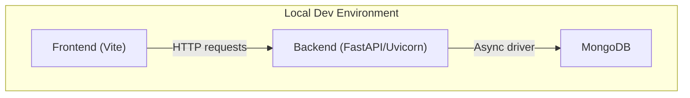
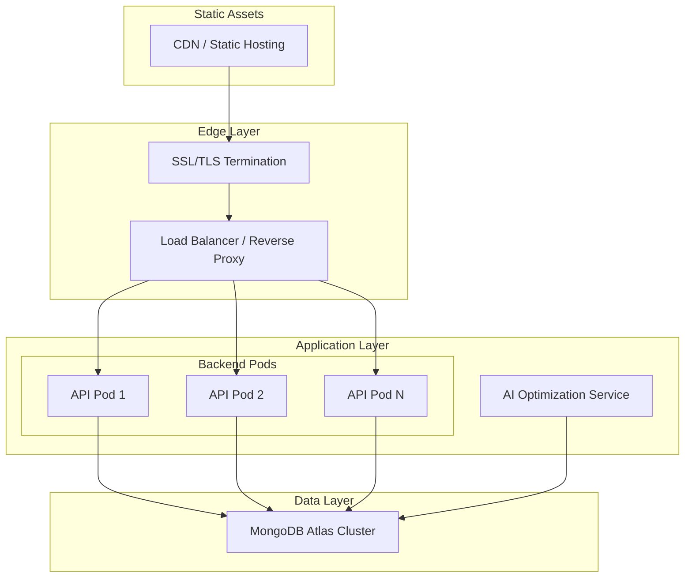
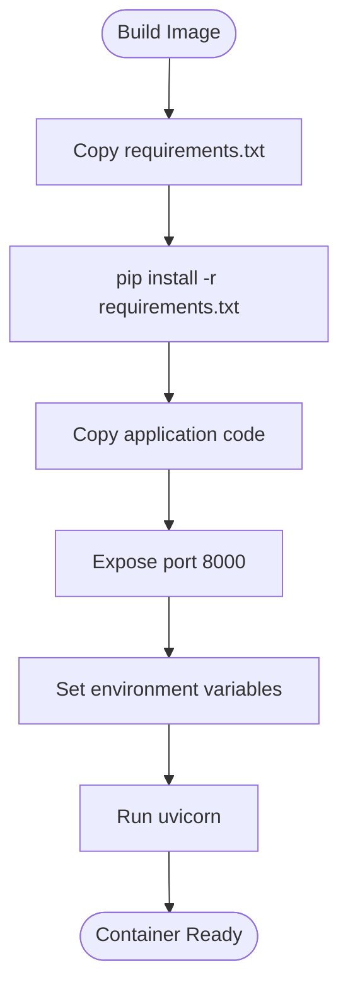
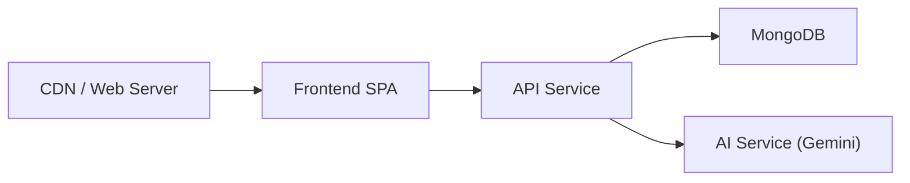
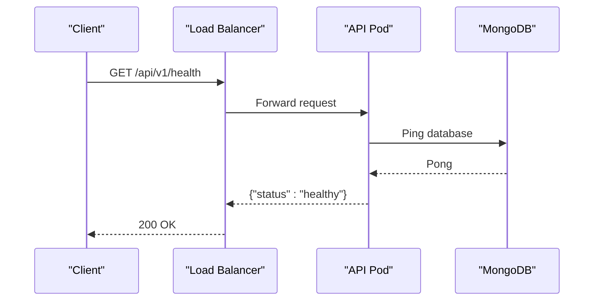
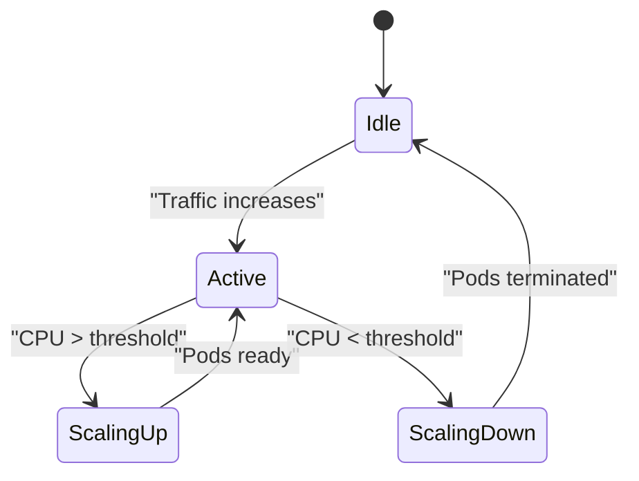
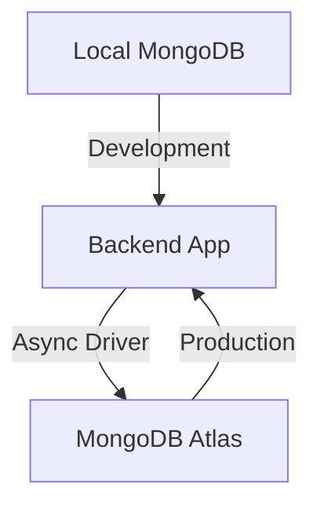
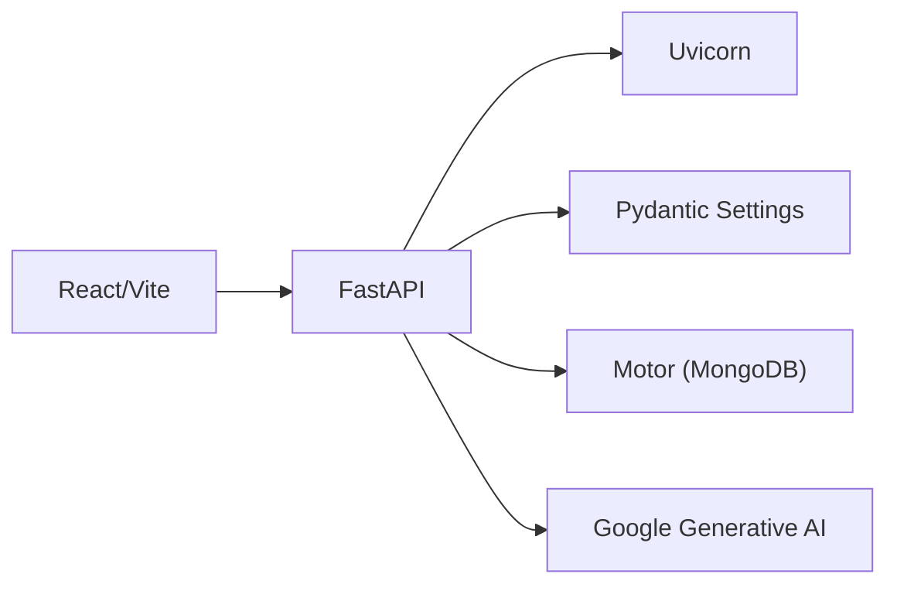

# Deployment Topology

<cite>
**Referenced Files in This Document**
- [Dockerfile](file://backend/Dockerfile)
- [docker-compose.yml](file://backend/docker-compose.yml)
- [requirements.txt](file://backend/requirements.txt)
- [main.py](file://backend/app/main.py)
- [config.py](file://backend/app/core/config.py)
- [mongodb.py](file://backend/app/db/mongodb.py)
- [gemini.py](file://backend/app/services/ai/gemini.py)
- [optimizer.py](file://backend/app/services/ai/optimizer.py)
- [vite.config.ts](file://frontend/vite.config.ts)
- [package.json](file://frontend/package.json)
</cite>

## Table of Contents
1. [Introduction](#introduction)
2. [Project Structure](#project-structure)
3. [Core Components](#core-components)
4. [Architecture Overview](#architecture-overview)
5. [Detailed Component Analysis](#detailed-component-analysis)
6. [Dependency Analysis](#dependency-analysis)
7. [Performance Considerations](#performance-considerations)
8. [Troubleshooting Guide](#troubleshooting-guide)
9. [Conclusion](#conclusion)
10. [Appendices](#appendices)

## Introduction
This document describes the deployment topology for ShedMaster, focusing on containerization, microservice separation, load balancing, health checks, auto-scaling, environment-specific configurations, database deployment with MongoDB Atlas, security, monitoring/logging, and CI/CD automation. The backend is a FastAPI application packaged with Uvicorn, while the frontend is a React application built via Vite. MongoDB runs as a separate container in local deployments but can be replaced with MongoDB Atlas in production.

## Project Structure
ShedMaster follows a clear separation between frontend and backend:
- Backend: Python FastAPI application with Docker support and docker-compose orchestration
- Frontend: React application using Vite for development and build
- Shared runtime: MongoDB for persistence

**Diagram sources**
- [docker-compose.yml:1-30](file://backend/docker-compose.yml#L1-L30)
- [main.py:1-102](file://backend/app/main.py#L1-L102)
- [mongodb.py:1-41](file://backend/app/db/mongodb.py#L1-L41)

**Section sources**
- [docker-compose.yml:1-30](file://backend/docker-compose.yml#L1-L30)
- [main.py:1-102](file://backend/app/main.py#L1-L102)
- [vite.config.ts:1-8](file://frontend/vite.config.ts#L1-L8)

## Core Components
- Backend API service
  - Containerized with Python 3.9 slim image
  - Exposes port 8000
  - Uses Uvicorn ASGI server
  - Reads configuration from environment variables
- Database service
  - MongoDB 5.0 container with persistent volume
  - Default connection string configured for local compose
- Frontend service
  - Vite-based React application
  - Build artifacts generated for production deployment

Key deployment characteristics:
- Single-container backend with embedded database for local development
- AI optimization powered by Google Gemini when configured
- Lightweight local scoring engine for basic optimization

**Section sources**
- [Dockerfile:1-24](file://backend/Dockerfile#L1-L24)
- [docker-compose.yml:1-30](file://backend/docker-compose.yml#L1-L30)
- [requirements.txt:1-19](file://backend/requirements.txt#L1-L19)
- [main.py:1-102](file://backend/app/main.py#L1-L102)
- [config.py:1-61](file://backend/app/core/config.py#L1-L61)
- [mongodb.py:1-41](file://backend/app/db/mongodb.py#L1-L41)
- [gemini.py:1-288](file://backend/app/services/ai/gemini.py#L1-L288)
- [optimizer.py:1-59](file://backend/app/services/ai/optimizer.py#L1-L59)
- [vite.config.ts:1-8](file://frontend/vite.config.ts#L1-L8)
- [package.json:1-46](file://frontend/package.json#L1-L46)

## Architecture Overview
The deployment architecture supports three environments:
- Development: Local docker-compose with backend, MongoDB, and Vite dev server
- Staging: Similar to production but with reduced resources and observability
- Production: Backend container behind a reverse proxy/load balancer, MongoDB Atlas, and CDN for static assets

[No sources needed since this diagram shows conceptual workflow, not actual code structure]

## Detailed Component Analysis

### Backend Containerization Strategy
- Base image: python:3.9-slim
- Working directory: /app
- Dependencies installed from requirements.txt
- Application entrypoint: uvicorn serving app.main:app on 0.0.0.0:8000
- Environment variables:
  - MONGODB_URL: MongoDB connection string
  - DATABASE_NAME: Target database name
  - SECRET_KEY: JWT signing key

**Diagram sources**
- [Dockerfile:1-24](file://backend/Dockerfile#L1-L24)
- [requirements.txt:1-19](file://backend/requirements.txt#L1-L19)

**Section sources**
- [Dockerfile:1-24](file://backend/Dockerfile#L1-L24)
- [requirements.txt:1-19](file://backend/requirements.txt#L1-L19)

### Microservice Deployment Pattern
- API service: FastAPI application containerized and orchestrated
- Database service: MongoDB container with persistent volume
- AI optimization service: Integrated into backend via Google Gemini SDK; can be externalized as a separate service if desired
- Frontend service: Vite-built static assets served via CDN or reverse proxy

**Diagram sources**
- [docker-compose.yml:1-30](file://backend/docker-compose.yml#L1-L30)
- [gemini.py:1-288](file://backend/app/services/ai/gemini.py#L1-L288)

**Section sources**
- [docker-compose.yml:1-30](file://backend/docker-compose.yml#L1-L30)
- [gemini.py:1-288](file://backend/app/services/ai/gemini.py#L1-L288)

### Load Balancing and Health Checks
- Health endpoint: GET /health returns service status
- CORS configuration allows frontend origins used by Vite dev servers
- Recommended production load balancing:
  - Round-robin or least-connections
  - Health probes targeting /health
  - Sticky sessions disabled for stateless API pods

**Diagram sources**
- [main.py:85-88](file://backend/app/main.py#L85-L88)
- [mongodb.py:23-26](file://backend/app/db/mongodb.py#L23-L26)

**Section sources**
- [main.py:85-88](file://backend/app/main.py#L85-L88)
- [mongodb.py:11-41](file://backend/app/db/mongodb.py#L11-L41)

### Auto-Scaling Configurations
- Horizontal pod autoscaling based on CPU/memory or custom metrics
- Minimum replicas for availability during maintenance
- Graceful shutdown using lifespan hooks to close database connections

[No sources needed since this diagram shows conceptual workflow, not actual code structure]

### Environment-Specific Configurations
- Development
  - docker-compose with local MongoDB and mounted backend code
  - MONGODB_URL points to mongo service
  - SECRET_KEY can be overridden via environment variable
- Staging
  - Separate secrets management for credentials
  - Reduced resource limits and scaled-down instances
- Production
  - MongoDB Atlas cluster with replica set
  - SSL/TLS enabled at edge and internal transport encryption
  - Centralized secrets management and rotation policies

**Section sources**
- [docker-compose.yml:10-18](file://backend/docker-compose.yml#L10-L18)
- [config.py:25-32](file://backend/app/core/config.py#L25-L32)

### Database Deployment with MongoDB Atlas
- Local development uses docker-compose with a named volume for MongoDB data
- Production should migrate to MongoDB Atlas:
  - Use connection string from Atlas
  - Enable TLS and authentication
  - Configure backup and point-in-time recovery
  - Set up read replicas for high availability

**Diagram sources**
- [docker-compose.yml:20-29](file://backend/docker-compose.yml#L20-L29)
- [mongodb.py:11-26](file://backend/app/db/mongodb.py#L11-L26)

**Section sources**
- [docker-compose.yml:20-29](file://backend/docker-compose.yml#L20-L29)
- [mongodb.py:11-41](file://backend/app/db/mongodb.py#L11-L41)

### Security Considerations
- SSL/TLS termination at reverse proxy or ingress controller
- Firewall rules allowing only necessary ports (80/443 for edge, 8000 for backend, 27017 for MongoDB in dev)
- Network segmentation:
  - Backend pods in private subnet
  - Database in protected subnet with VPC-level controls
- Secrets management:
  - Store MONGODB_URL, SECRET_KEY, GEMINI_API_KEY in secure vault
  - Environment-specific .env files or Kubernetes secrets

**Section sources**
- [main.py:56-64](file://backend/app/main.py#L56-L64)
- [config.py:25-35](file://backend/app/core/config.py#L25-L35)
- [docker-compose.yml:10-13](file://backend/docker-compose.yml#L10-L13)

### Monitoring and Logging
- Application logs: stdout/stderr from Uvicorn container
- Health metrics: /health endpoint for liveness/readiness
- Observability stack:
  - Centralized logging (e.g., ELK or Loki)
  - Metrics collection (Prometheus/Grafana)
  - Tracing (OpenTelemetry)
- Frontend error tracking:
  - Integrate error reporting SDK in React app
  - Capture unhandled exceptions and network errors

**Section sources**
- [main.py:85-88](file://backend/app/main.py#L85-L88)

### CI/CD Pipeline Integration
- Build stages:
  - Lint and test backend
  - Build frontend bundle
  - Build backend image
- Release stages:
  - Push images to registry
  - Deploy manifests to staging
  - Promote to production after approval
- Automation:
  - Automated vulnerability scanning
  - Canary deployments
  - Rollback on failure

[No sources needed since this section provides general guidance]

## Dependency Analysis
Runtime dependencies and their roles:
- FastAPI and Uvicorn: Web framework and ASGI server
- Motor: Asynchronous MongoDB driver
- Pydantic and python-dotenv: Configuration parsing and environment loading
- google-generativeai: AI optimization integration
- Additional libraries for data processing and export

**Diagram sources**
- [requirements.txt:1-19](file://backend/requirements.txt#L1-L19)
- [main.py:1-102](file://backend/app/main.py#L1-L102)
- [gemini.py:1-288](file://backend/app/services/ai/gemini.py#L1-L288)

**Section sources**
- [requirements.txt:1-19](file://backend/requirements.txt#L1-L19)
- [main.py:1-102](file://backend/app/main.py#L1-L102)
- [gemini.py:1-288](file://backend/app/services/ai/gemini.py#L1-L288)

## Performance Considerations
- Optimize database queries and indexes for frequent collections
- Use connection pooling and async I/O
- Cache frequently accessed data where safe
- Monitor AI API latency and implement retries/backoff
- Scale horizontally based on CPU utilization and request latency

[No sources needed since this section provides general guidance]

## Troubleshooting Guide
Common deployment issues and resolutions:
- MongoDB connection failures:
  - Verify MONGODB_URL and DATABASE_NAME
  - Check container networking in docker-compose
  - Confirm Atlas connectivity and credentials
- CORS errors:
  - Ensure ALLOWED_ORIGINS includes frontend URLs
  - Validate middleware order and headers
- Health check failures:
  - Confirm /health endpoint responds
  - Check database ping and connection timeouts
- AI service errors:
  - Validate GEMINI_API_KEY presence
  - Inspect rate limits and quotas

**Section sources**
- [mongodb.py:11-41](file://backend/app/db/mongodb.py#L11-L41)
- [config.py:14-23](file://backend/app/core/config.py#L14-L23)
- [main.py:85-98](file://backend/app/main.py#L85-L98)
- [gemini.py:10-16](file://backend/app/services/ai/gemini.py#L10-L16)

## Conclusion
ShedMaster’s deployment topology leverages containerization for the backend and a separate database service, with clear pathways to integrate MongoDB Atlas, load balancing, health checks, auto-scaling, and robust security and observability. The architecture supports iterative development and production-grade scalability with minimal code changes.

## Appendices
- Frontend build and deployment:
  - Use Vite to produce optimized static assets
  - Serve via CDN or reverse proxy for production
- Backend runtime:
  - Uvicorn serves the FastAPI application
  - Environment-driven configuration via .env and settings

**Section sources**
- [vite.config.ts:1-8](file://frontend/vite.config.ts#L1-L8)
- [package.json:1-46](file://frontend/package.json#L1-L46)
- [Dockerfile:22-24](file://backend/Dockerfile#L22-L24)