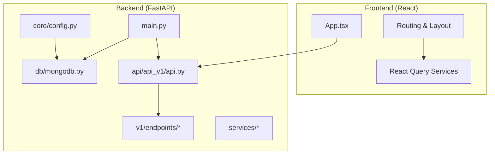
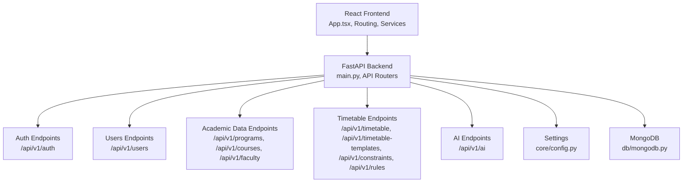
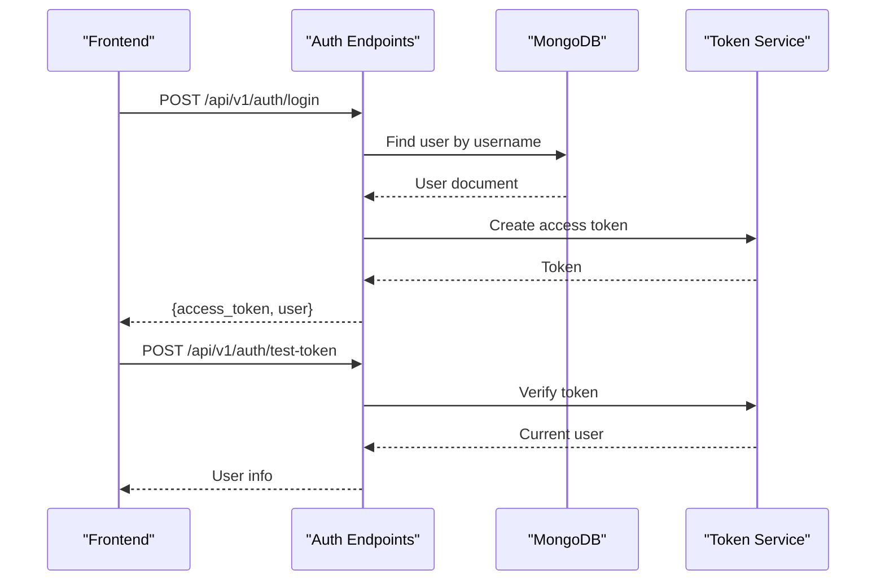
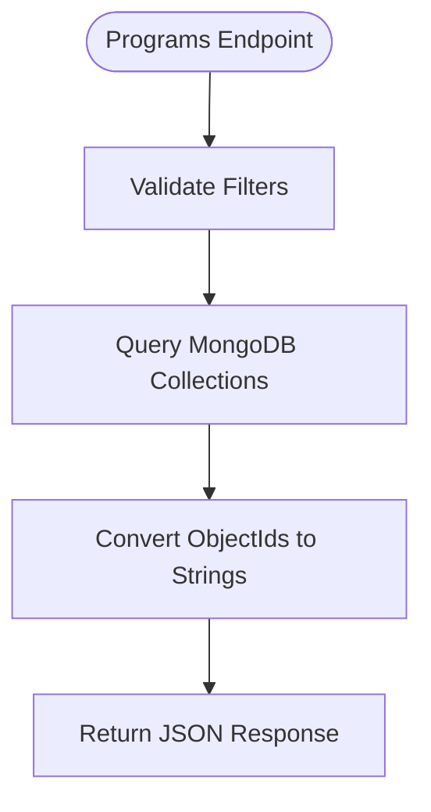
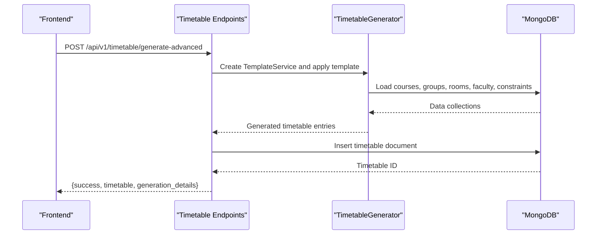
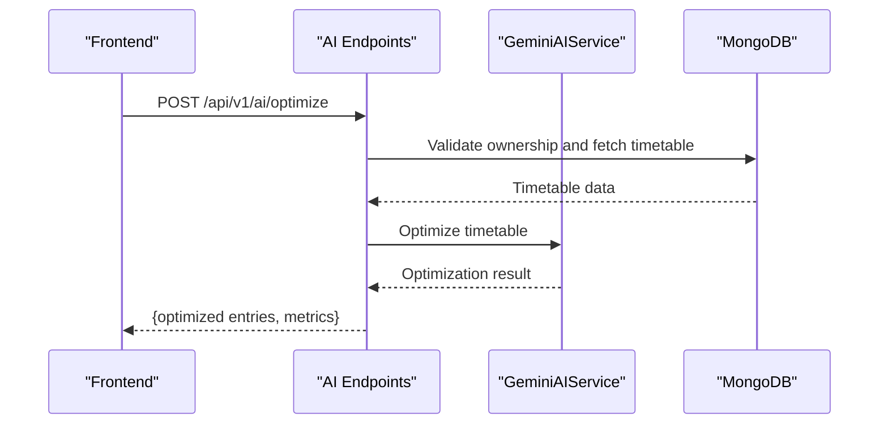
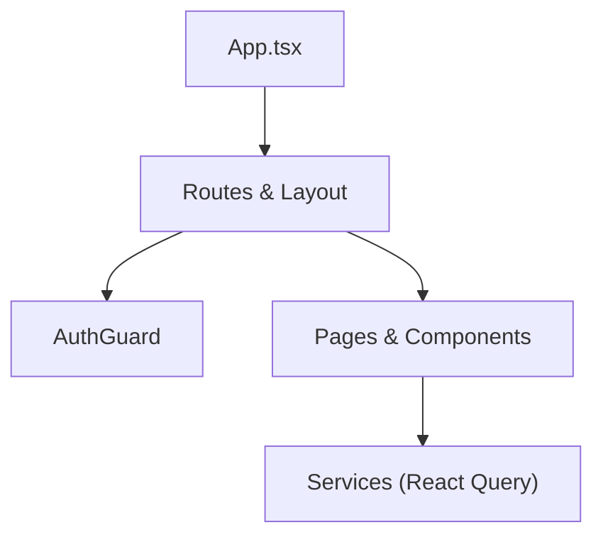
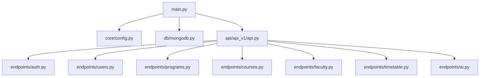

# Overall System Design

<cite>
**Referenced Files in This Document**
- [backend/app/main.py](file://backend/app/main.py)
- [backend/app/api/api_v1/api.py](file://backend/app/api/api_v1/api.py)
- [backend/app/core/config.py](file://backend/app/core/config.py)
- [backend/app/db/mongodb.py](file://backend/app/db/mongodb.py)
- [backend/app/api/v1/endpoints/auth.py](file://backend/app/api/v1/endpoints/auth.py)
- [backend/app/api/v1/endpoints/users.py](file://backend/app/api/v1/endpoints/users.py)
- [backend/app/api/v1/endpoints/programs.py](file://backend/app/api/v1/endpoints/programs.py)
- [backend/app/api/v1/endpoints/courses.py](file://backend/app/api/v1/endpoints/courses.py)
- [backend/app/api/v1/endpoints/faculty.py](file://backend/app/api/v1/endpoints/faculty.py)
- [backend/app/api/v1/endpoints/timetable.py](file://backend/app/api/v1/endpoints/timetable.py)
- [backend/app/api/v1/endpoints/ai.py](file://backend/app/api/v1/endpoints/ai.py)
- [backend/app/models/timetable.py](file://backend/app/models/timetable.py)
- [backend/app/services/timetable/generator.py](file://backend/app/services/timetable/generator.py)
- [frontend/src/App.tsx](file://frontend/src/App.tsx)
</cite>

## Table of Contents
1. [Introduction](#introduction)
2. [Project Structure](#project-structure)
3. [Core Components](#core-components)
4. [Architecture Overview](#architecture-overview)
5. [Detailed Component Analysis](#detailed-component-analysis)
6. [Dependency Analysis](#dependency-analysis)
7. [Performance Considerations](#performance-considerations)
8. [Troubleshooting Guide](#troubleshooting-guide)
9. [Conclusion](#conclusion)

## Introduction
This document presents the overall system design of ShedMaster, a NEP 2020-compliant timetable generation platform for educational institutions. The system follows a clean separation of concerns:
- Frontend built with React and TypeScript, providing a modern, responsive user interface.
- Backend powered by FastAPI, implementing a microservices-like endpoint design with clear API boundaries.
- Data persistence using MongoDB for flexible schema modeling.
- AI integration layer leveraging the Gemini API for intelligent optimization and constraint assistance.

The architecture emphasizes layered design (presentation, business logic, data access), RESTful API principles, robust error handling, and extensibility through modular services and template-based generation patterns.

## Project Structure
ShedMaster is organized into two primary directories:
- backend: FastAPI application with API routers, services, models, and database integration.
- frontend: React application with routing, theming, authentication guards, and service integrations.

**Diagram sources**
- [backend/app/main.py:1-102](file://backend/app/main.py#L1-L102)
- [backend/app/api/api_v1/api.py:1-34](file://backend/app/api/api_v1/api.py#L1-L34)
- [backend/app/core/config.py:1-61](file://backend/app/core/config.py#L1-L61)
- [backend/app/db/mongodb.py:1-41](file://backend/app/db/mongodb.py#L1-L41)
- [frontend/src/App.tsx:1-49](file://frontend/src/App.tsx#L1-L49)

**Section sources**
- [backend/app/main.py:1-102](file://backend/app/main.py#L1-L102)
- [backend/app/api/api_v1/api.py:1-34](file://backend/app/api/api_v1/api.py#L1-L34)
- [backend/app/core/config.py:1-61](file://backend/app/core/config.py#L1-L61)
- [backend/app/db/mongodb.py:1-41](file://backend/app/db/mongodb.py#L1-L41)
- [frontend/src/App.tsx:1-49](file://frontend/src/App.tsx#L1-L49)

## Core Components
- Presentation Layer (React)
  - Centralized routing with React Router and protected routes via AuthGuard.
  - Theme provider and localization provider for UI consistency.
  - Service layer for API communication (e.g., timetableService.ts).
- Business Logic Layer (FastAPI)
  - Central application lifecycle managed in main.py with startup/shutdown hooks for MongoDB.
  - Microservices-like endpoint design via APIRouter composition in api_v1/api.py.
  - Endpoint modules for Authentication, Users, Academic Programs, Courses, Faculty, Student Groups, Rooms, Timetables, Timetable Templates, Constraints, Rules, and AI Assistance.
- Data Access Layer (MongoDB)
  - Asynchronous Motor client connection with ping verification and graceful fallback when DB is unavailable.
  - Centralized settings via core/config.py for database URLs, security, and AI configuration.
- AI Integration Layer
  - Gemini-based services for timetable optimization, constraint parsing, NEP 2020 validation, and chat assistance.
  - Dedicated AI endpoints under /api/v1/ai.

Key design principles:
- RESTful API boundaries per domain (authentication, user management, academic data, timetable generation, AI).
- Consistent HTTP status codes and standardized error responses.
- Role-based access control and user isolation enforced in endpoints.
- Modular services enabling independent scaling and maintainability.

**Section sources**
- [backend/app/main.py:1-102](file://backend/app/main.py#L1-L102)
- [backend/app/api/api_v1/api.py:1-34](file://backend/app/api/api_v1/api.py#L1-L34)
- [backend/app/core/config.py:1-61](file://backend/app/core/config.py#L1-L61)
- [backend/app/db/mongodb.py:1-41](file://backend/app/db/mongodb.py#L1-L41)
- [backend/app/api/v1/endpoints/auth.py:1-123](file://backend/app/api/v1/endpoints/auth.py#L1-L123)
- [backend/app/api/v1/endpoints/users.py:1-123](file://backend/app/api/v1/endpoints/users.py#L1-L123)
- [backend/app/api/v1/endpoints/programs.py:1-288](file://backend/app/api/v1/endpoints/programs.py#L1-L288)
- [backend/app/api/v1/endpoints/courses.py:1-279](file://backend/app/api/v1/endpoints/courses.py#L1-L279)
- [backend/app/api/v1/endpoints/faculty.py:1-265](file://backend/app/api/v1/endpoints/faculty.py#L1-L265)
- [backend/app/api/v1/endpoints/timetable.py:1-728](file://backend/app/api/v1/endpoints/timetable.py#L1-L728)
- [backend/app/api/v1/endpoints/ai.py:1-362](file://backend/app/api/v1/endpoints/ai.py#L1-L362)

## Architecture Overview
The system employs a layered architecture with clear separation between presentation, business logic, and data access. The frontend communicates with the backend through RESTful endpoints, while the backend orchestrates business operations and interacts with MongoDB. An AI integration layer enhances timetable generation and constraint management.

**Diagram sources**
- [backend/app/main.py:1-102](file://backend/app/main.py#L1-L102)
- [backend/app/api/api_v1/api.py:1-34](file://backend/app/api/api_v1/api.py#L1-L34)
- [backend/app/core/config.py:1-61](file://backend/app/core/config.py#L1-L61)
- [backend/app/db/mongodb.py:1-41](file://backend/app/db/mongodb.py#L1-L41)
- [frontend/src/App.tsx:1-49](file://frontend/src/App.tsx#L1-L49)

## Detailed Component Analysis

### Authentication and User Management
- Authentication endpoints (/api/v1/auth) handle login, registration, token testing, and refresh.
- User management endpoints (/api/v1/users) provide CRUD operations with role-based access control and user isolation.
- Security measures include token-based authentication, CORS configuration, and centralized validation error handling.

**Diagram sources**
- [backend/app/api/v1/endpoints/auth.py:1-123](file://backend/app/api/v1/endpoints/auth.py#L1-L123)
- [backend/app/api/v1/endpoints/users.py:1-123](file://backend/app/api/v1/endpoints/users.py#L1-L123)
- [backend/app/db/mongodb.py:1-41](file://backend/app/db/mongodb.py#L1-L41)

**Section sources**
- [backend/app/api/v1/endpoints/auth.py:1-123](file://backend/app/api/v1/endpoints/auth.py#L1-L123)
- [backend/app/api/v1/endpoints/users.py:1-123](file://backend/app/api/v1/endpoints/users.py#L1-L123)
- [backend/app/main.py:41-54](file://backend/app/main.py#L41-L54)

### Academic Data Management
- Academic data endpoints manage programs, courses, and faculty with filtering, validation, and user isolation.
- Programs endpoint supports admin-only creation/update/delete and provides program-specific course retrieval and statistics.

**Diagram sources**
- [backend/app/api/v1/endpoints/programs.py:1-288](file://backend/app/api/v1/endpoints/programs.py#L1-L288)
- [backend/app/db/mongodb.py:1-41](file://backend/app/db/mongodb.py#L1-L41)

**Section sources**
- [backend/app/api/v1/endpoints/programs.py:1-288](file://backend/app/api/v1/endpoints/programs.py#L1-L288)
- [backend/app/api/v1/endpoints/courses.py:1-279](file://backend/app/api/v1/endpoints/courses.py#L1-L279)
- [backend/app/api/v1/endpoints/faculty.py:1-265](file://backend/app/api/v1/endpoints/faculty.py#L1-L265)

### Timetable Generation and Management
- Timetable endpoints (/api/v1/timetable) implement CRUD operations with strict user isolation and draft support.
- Generation endpoints leverage rule-based and AI-assisted generators, including template-based generation and NEP 2020 compliant genetic algorithms.
- Export functionality supports multiple formats (JSON, Excel, PDF/HTML fallback).

**Diagram sources**
- [backend/app/api/v1/endpoints/timetable.py:266-375](file://backend/app/api/v1/endpoints/timetable.py#L266-L375)
- [backend/app/services/timetable/generator.py:1-402](file://backend/app/services/timetable/generator.py#L1-L402)
- [backend/app/db/mongodb.py:1-41](file://backend/app/db/mongodb.py#L1-L41)

**Section sources**
- [backend/app/api/v1/endpoints/timetable.py:1-728](file://backend/app/api/v1/endpoints/timetable.py#L1-L728)
- [backend/app/models/timetable.py:1-52](file://backend/app/models/timetable.py#L1-L52)
- [backend/app/services/timetable/generator.py:1-402](file://backend/app/services/timetable/generator.py#L1-L402)

### AI Integration Layer
- AI endpoints (/api/v1/ai) provide optimization suggestions, constraint parsing, NEP 2020 validation, and chat assistance.
- Gemini-based services enable natural language processing for constraints and timetable analysis.

**Diagram sources**
- [backend/app/api/v1/endpoints/ai.py:46-106](file://backend/app/api/v1/endpoints/ai.py#L46-L106)
- [backend/app/db/mongodb.py:1-41](file://backend/app/db/mongodb.py#L1-L41)

**Section sources**
- [backend/app/api/v1/endpoints/ai.py:1-362](file://backend/app/api/v1/endpoints/ai.py#L1-L362)

### Frontend Integration Points
- App.tsx sets up routing, theming, localization, and protected layouts.
- Pages/components integrate with backend endpoints through service abstractions (e.g., timetableService.ts).

**Diagram sources**
- [frontend/src/App.tsx:1-49](file://frontend/src/App.tsx#L1-L49)

**Section sources**
- [frontend/src/App.tsx:1-49](file://frontend/src/App.tsx#L1-L49)

## Dependency Analysis
The backend composes multiple API routers into a unified API surface, each responsible for a functional domain. The main application initializes database connections and middleware, ensuring consistent behavior across endpoints.

**Diagram sources**
- [backend/app/main.py:1-102](file://backend/app/main.py#L1-L102)
- [backend/app/api/api_v1/api.py:1-34](file://backend/app/api/api_v1/api.py#L1-L34)
- [backend/app/core/config.py:1-61](file://backend/app/core/config.py#L1-L61)
- [backend/app/db/mongodb.py:1-41](file://backend/app/db/mongodb.py#L1-L41)

**Section sources**
- [backend/app/main.py:1-102](file://backend/app/main.py#L1-L102)
- [backend/app/api/api_v1/api.py:1-34](file://backend/app/api/api_v1/api.py#L1-L34)

## Performance Considerations
- Asynchronous MongoDB operations prevent blocking and improve throughput.
- Pagination parameters (skip, limit) in endpoints reduce payload sizes for large datasets.
- Template-based generation and NEP 2020 compliant algorithms balance quality and performance; tuning population size and generations can adjust runtime vs. quality trade-offs.
- Streaming responses for exports minimize memory usage during large file generation.

## Troubleshooting Guide
Common issues and resolutions:
- Database connectivity failures: The application attempts a ping and logs warnings; the API continues running without DB connectivity for testing scenarios.
- Validation errors: Centralized RequestValidationError handler returns structured error details with field-level diagnostics.
- CORS issues: Middleware allows configured origins and methods; verify frontend origin matches configuration.
- Ownership and permission errors: Many endpoints enforce user isolation and role checks; ensure tokens are valid and users have appropriate roles.

**Section sources**
- [backend/app/db/mongodb.py:1-41](file://backend/app/db/mongodb.py#L1-L41)
- [backend/app/main.py:41-54](file://backend/app/main.py#L41-L54)
- [backend/app/api/v1/endpoints/timetable.py:30-61](file://backend/app/api/v1/endpoints/timetable.py#L30-L61)
- [backend/app/api/v1/endpoints/users.py:21-45](file://backend/app/api/v1/endpoints/users.py#L21-L45)

## Conclusion
ShedMaster’s architecture cleanly separates concerns across a React frontend and FastAPI backend, with MongoDB as the data layer and an AI integration layer for intelligent optimization. The microservices-like endpoint design, layered architecture, and modular services enable scalability, maintainability, and extensibility. RESTful APIs, consistent error handling, and user isolation ensure robust operation across authentication, user management, academic data, timetable generation, and AI-assisted workflows.