# System Architecture

<cite>
**Referenced Files in This Document**
- [backend/app/main.py](file://backend/app/main.py)
- [backend/app/api/api_v1/api.py](file://backend/app/api/api_v1/api.py)
- [backend/app/api/v1/endpoints/timetable.py](file://backend/app/api/v1/endpoints/timetable.py)
- [backend/app/api/v1/endpoints/ai.py](file://backend/app/api/v1/endpoints/ai.py)
- [backend/app/core/config.py](file://backend/app/core/config.py)
- [backend/app/db/mongodb.py](file://backend/app/db/mongodb.py)
- [backend/app/services/ai/gemini.py](file://backend/app/services/ai/gemini.py)
- [backend/app/services/timetable/generator.py](file://backend/app/services/timetable/generator.py)
- [backend/Dockerfile](file://backend/Dockerfile)
- [backend/docker-compose.yml](file://backend/docker-compose.yml)
- [backend/requirements.txt](file://backend/requirements.txt)
- [frontend/src/App.tsx](file://frontend/src/App.tsx)
- [frontend/src/services/timetableService.ts](file://frontend/src/services/timetableService.ts)
- [frontend/package.json](file://frontend/package.json)
- [frontend/vite.config.ts](file://frontend/vite.config.ts)
</cite>

## Table of Contents
1. [Introduction](#introduction)
2. [Project Structure](#project-structure)
3. [Core Components](#core-components)
4. [Architecture Overview](#architecture-overview)
5. [Detailed Component Analysis](#detailed-component-analysis)
6. [Dependency Analysis](#dependency-analysis)
7. [Performance Considerations](#performance-considerations)
8. [Troubleshooting Guide](#troubleshooting-guide)
9. [Conclusion](#conclusion)
10. [Appendices](#appendices)

## Introduction
This document describes the system architecture of ShedMaster, a full-stack educational timetable generation platform. The backend is a FastAPI application providing RESTful APIs, while the frontend is a React application built with TypeScript and Vite. The system integrates AI services (Google Gemini) for optimization and validation, uses MongoDB for persistence, and supports export to multiple formats. It emphasizes layered architecture, strong security boundaries, and scalable deployment via Docker Compose.

## Project Structure
ShedMaster follows a clear separation of concerns:
- Backend (FastAPI): API routing, business logic, data access, and AI integration
- Frontend (React + TypeScript): UI, state management, and HTTP client
- Shared configuration and infrastructure: environment variables, Docker images, and compose orchestration

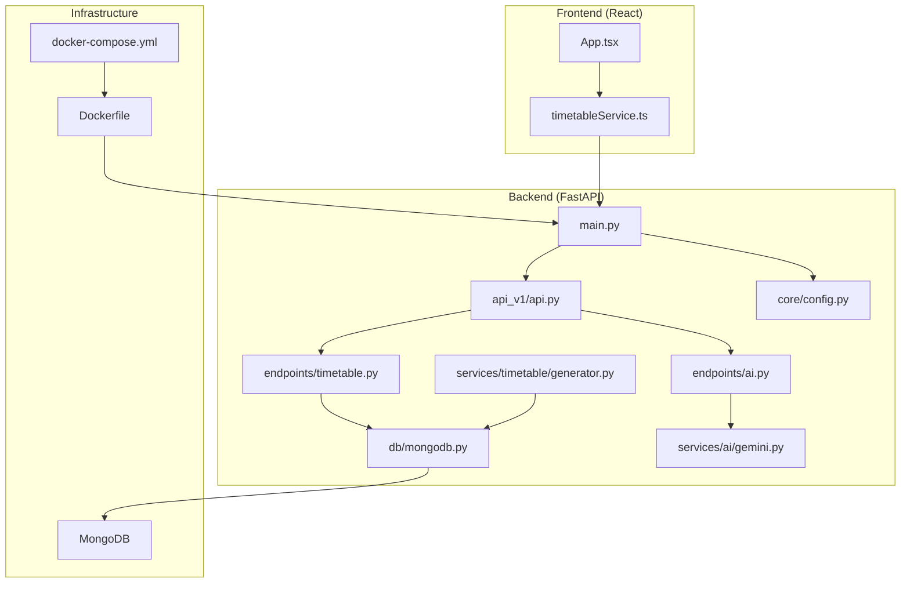

**Diagram sources**
- [backend/app/main.py:33-102](file://backend/app/main.py#L33-L102)
- [backend/app/api/api_v1/api.py:1-34](file://backend/app/api/api_v1/api.py#L1-L34)
- [backend/app/api/v1/endpoints/timetable.py:1-15](file://backend/app/api/v1/endpoints/timetable.py#L1-L15)
- [backend/app/api/v1/endpoints/ai.py:1-12](file://backend/app/api/v1/endpoints/ai.py#L1-L12)
- [backend/app/core/config.py:1-61](file://backend/app/core/config.py#L1-L61)
- [backend/app/db/mongodb.py:1-41](file://backend/app/db/mongodb.py#L1-L41)
- [backend/app/services/timetable/generator.py:1-200](file://backend/app/services/timetable/generator.py#L1-L200)
- [backend/app/services/ai/gemini.py:1-288](file://backend/app/services/ai/gemini.py#L1-L288)
- [backend/Dockerfile:1-24](file://backend/Dockerfile#L1-L24)
- [backend/docker-compose.yml:1-30](file://backend/docker-compose.yml#L1-L30)

**Section sources**
- [backend/app/main.py:1-102](file://backend/app/main.py#L1-L102)
- [backend/app/api/api_v1/api.py:1-34](file://backend/app/api/api_v1/api.py#L1-L34)
- [backend/app/core/config.py:1-61](file://backend/app/core/config.py#L1-L61)
- [backend/app/db/mongodb.py:1-41](file://backend/app/db/mongodb.py#L1-L41)
- [backend/Dockerfile:1-24](file://backend/Dockerfile#L1-L24)
- [backend/docker-compose.yml:1-30](file://backend/docker-compose.yml#L1-L30)
- [frontend/src/App.tsx:1-49](file://frontend/src/App.tsx#L1-L49)
- [frontend/src/services/timetableService.ts:1-772](file://frontend/src/services/timetableService.ts#L1-L772)

## Core Components
- FastAPI Application: Initializes middleware (CORS, exception handlers), connects to MongoDB, and mounts the API router under a versioned prefix.
- API Routers: Centralized inclusion of all endpoint modules (users, auth, programs, courses, timetable, constraints, rules, faculty, student groups, rooms, AI).
- Business Logic Layer: Timetable generation, validation, optimization, and export services; constraint parsing and NEP 2020 compliance checks.
- Data Access Layer: Motor-based async MongoDB client with connection lifecycle management.
- AI Integration: GeminiAIService encapsulates Google Gemini API calls for optimization, suggestions, analysis, and NEP compliance validation.
- Frontend Client: Axios-based service with interceptors for auth headers, token refresh, and error handling; routes map to backend endpoints.

**Section sources**
- [backend/app/main.py:25-102](file://backend/app/main.py#L25-L102)
- [backend/app/api/api_v1/api.py:1-34](file://backend/app/api/api_v1/api.py#L1-L34)
- [backend/app/api/v1/endpoints/timetable.py:1-15](file://backend/app/api/v1/endpoints/timetable.py#L1-L15)
- [backend/app/api/v1/endpoints/ai.py:1-12](file://backend/app/api/v1/endpoints/ai.py#L1-L12)
- [backend/app/db/mongodb.py:1-41](file://backend/app/db/mongodb.py#L1-L41)
- [backend/app/services/ai/gemini.py:1-288](file://backend/app/services/ai/gemini.py#L1-L288)
- [frontend/src/services/timetableService.ts:161-306](file://frontend/src/services/timetableService.ts#L161-L306)

## Architecture Overview
ShedMaster employs a layered architecture:
- Presentation Layer (React): Renders UI, manages state, and communicates with backend via typed HTTP requests.
- Business Logic Layer (FastAPI + Services): Implements timetable generation, validation, optimization, and export; orchestrates AI services.
- Data Layer (MongoDB): Stores programs, courses, faculty, rooms, constraints, student groups, and timetables.
- Cross-Cutting Concerns: CORS, authentication, validation, logging, and error handling.

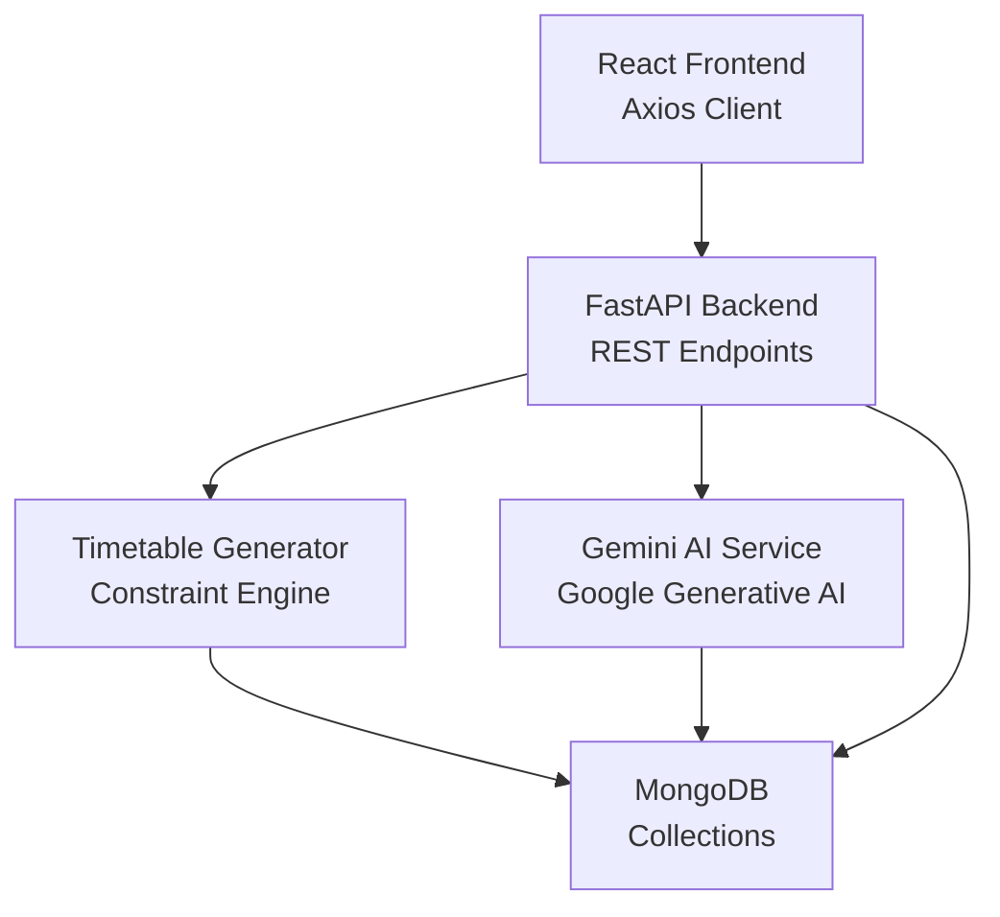

**Diagram sources**
- [frontend/src/services/timetableService.ts:161-306](file://frontend/src/services/timetableService.ts#L161-L306)
- [backend/app/api/v1/endpoints/timetable.py:234-264](file://backend/app/api/v1/endpoints/timetable.py#L234-L264)
- [backend/app/api/v1/endpoints/ai.py:46-73](file://backend/app/api/v1/endpoints/ai.py#L46-L73)
- [backend/app/services/timetable/generator.py:163-200](file://backend/app/services/timetable/generator.py#L163-L200)
- [backend/app/services/ai/gemini.py:9-288](file://backend/app/services/ai/gemini.py#L9-L288)
- [backend/app/db/mongodb.py:11-41](file://backend/app/db/mongodb.py#L11-L41)

## Detailed Component Analysis

### Backend Entry Point and Middleware
- Application lifecycle: Connects to MongoDB on startup and closes the connection on shutdown.
- CORS: Configured for local Vite dev origins; allows credentials, headers, and methods.
- Validation: Global exception handler logs validation errors and returns structured 422 responses.
- Health checks: Root and health endpoints aid monitoring and readiness probes.

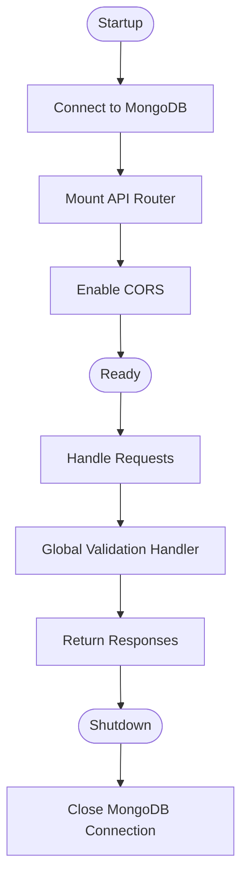

**Diagram sources**
- [backend/app/main.py:25-102](file://backend/app/main.py#L25-L102)
- [backend/app/db/mongodb.py:11-41](file://backend/app/db/mongodb.py#L11-L41)

**Section sources**
- [backend/app/main.py:25-102](file://backend/app/main.py#L25-L102)
- [backend/app/db/mongodb.py:11-41](file://backend/app/db/mongodb.py#L11-L41)

### API Routing and Versioning
- Central router aggregates all endpoint routers and tags them for documentation.
- Endpoints are mounted under a versioned prefix defined in settings.

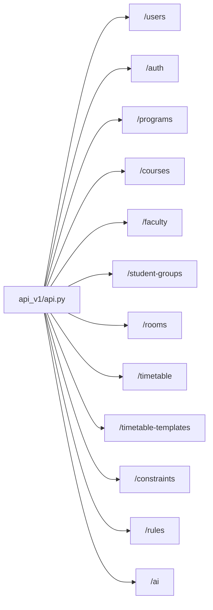

**Diagram sources**
- [backend/app/api/api_v1/api.py:22-33](file://backend/app/api/api_v1/api.py#L22-L33)

**Section sources**
- [backend/app/api/api_v1/api.py:1-34](file://backend/app/api/api_v1/api.py#L1-L34)

### Timetable Management Endpoints
- CRUD and orchestration: Create, read, update, delete timetables; draft saving; export to Excel/PDF/JSON.
- Generation: Basic generator and advanced template-based generation; NEP 2020 Genetic Algorithm engine.
- Validation and optimization: Validate against constraints and optimize using AI.
- Security: All operations enforce ownership checks to prevent unauthorized access.

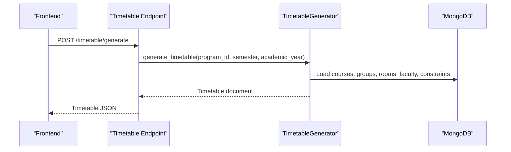

**Diagram sources**
- [frontend/src/services/timetableService.ts:340-343](file://frontend/src/services/timetableService.ts#L340-L343)
- [backend/app/api/v1/endpoints/timetable.py:234-264](file://backend/app/api/v1/endpoints/timetable.py#L234-L264)
- [backend/app/services/timetable/generator.py:169-200](file://backend/app/services/timetable/generator.py#L169-L200)

**Section sources**
- [backend/app/api/v1/endpoints/timetable.py:17-145](file://backend/app/api/v1/endpoints/timetable.py#L17-L145)
- [backend/app/api/v1/endpoints/timetable.py:234-375](file://backend/app/api/v1/endpoints/timetable.py#L234-L375)
- [backend/app/api/v1/endpoints/timetable.py:377-537](file://backend/app/api/v1/endpoints/timetable.py#L377-L537)
- [backend/app/api/v1/endpoints/timetable.py:623-727](file://backend/app/api/v1/endpoints/timetable.py#L623-L727)

### AI-Assisted Timetable Operations
- Optimization: AI-driven suggestions and optimization for existing timetables.
- Analysis: Efficiency scoring and conflict detection.
- NEP Compliance: Validate against NEP 2020 guidelines.
- Constraint Parsing: Natural language to structured constraints.

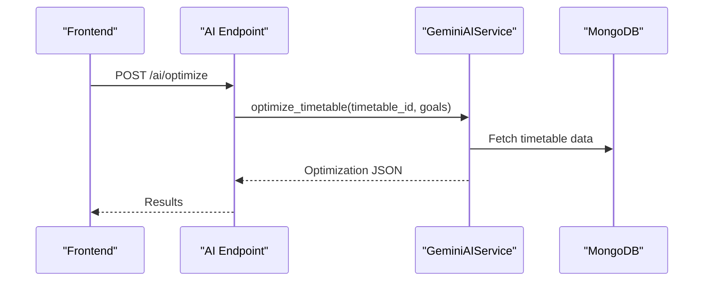

**Diagram sources**
- [frontend/src/services/timetableService.ts:583-588](file://frontend/src/services/timetableService.ts#L583-L588)
- [backend/app/api/v1/endpoints/ai.py:46-73](file://backend/app/api/v1/endpoints/ai.py#L46-L73)
- [backend/app/services/ai/gemini.py:18-60](file://backend/app/services/ai/gemini.py#L18-L60)

**Section sources**
- [backend/app/api/v1/endpoints/ai.py:46-207](file://backend/app/api/v1/endpoints/ai.py#L46-L207)
- [backend/app/services/ai/gemini.py:9-288](file://backend/app/services/ai/gemini.py#L9-L288)

### Data Access Layer
- Async MongoDB client initialized with timeouts and ping verification.
- Connection lifecycle managed by FastAPI lifespan events.
- Robustness: Graceful handling when DB is unavailable during startup.

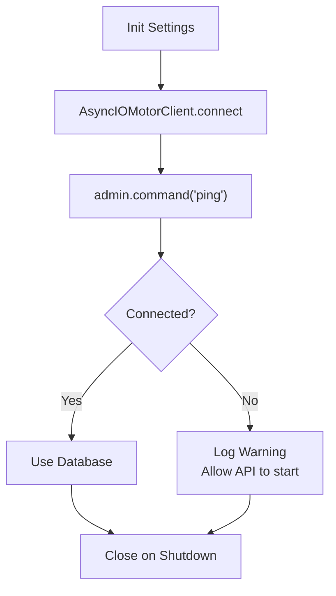

**Diagram sources**
- [backend/app/db/mongodb.py:11-41](file://backend/app/db/mongodb.py#L11-L41)
- [backend/app/core/config.py:25-28](file://backend/app/core/config.py#L25-L28)

**Section sources**
- [backend/app/db/mongodb.py:1-41](file://backend/app/db/mongodb.py#L1-L41)
- [backend/app/core/config.py:1-61](file://backend/app/core/config.py#L1-L61)

### Frontend Integration
- Routing and Layout: React Router with protected routes and layouts.
- HTTP Client: Axios instance with request/response interceptors for auth headers and token refresh.
- API Contracts: Strongly-typed models for timetables, programs, courses, faculty, rooms, rules, and constraints.

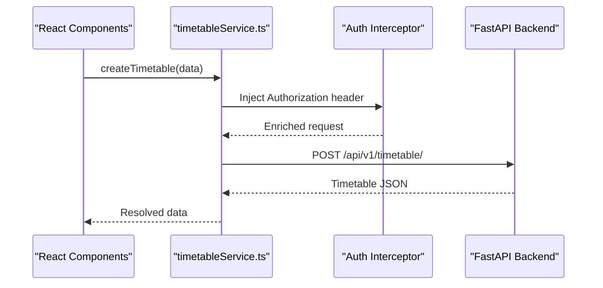

**Diagram sources**
- [frontend/src/App.tsx:21-46](file://frontend/src/App.tsx#L21-L46)
- [frontend/src/services/timetableService.ts:161-306](file://frontend/src/services/timetableService.ts#L161-L306)
- [backend/app/api/v1/endpoints/timetable.py:116-145](file://backend/app/api/v1/endpoints/timetable.py#L116-L145)

**Section sources**
- [frontend/src/App.tsx:1-49](file://frontend/src/App.tsx#L1-L49)
- [frontend/src/services/timetableService.ts:161-306](file://frontend/src/services/timetableService.ts#L161-L306)

## Dependency Analysis
- Backend dependencies include FastAPI, Uvicorn, Pydantic, Motor/Mongo, bcrypt, JWT, OR-Tools, pandas, openpyxl, WeasyPrint, ReportLab, protobuf, and google-generativeai.
- Frontend dependencies include Material UI, React Router, React Query, Axios, and related date pickers.

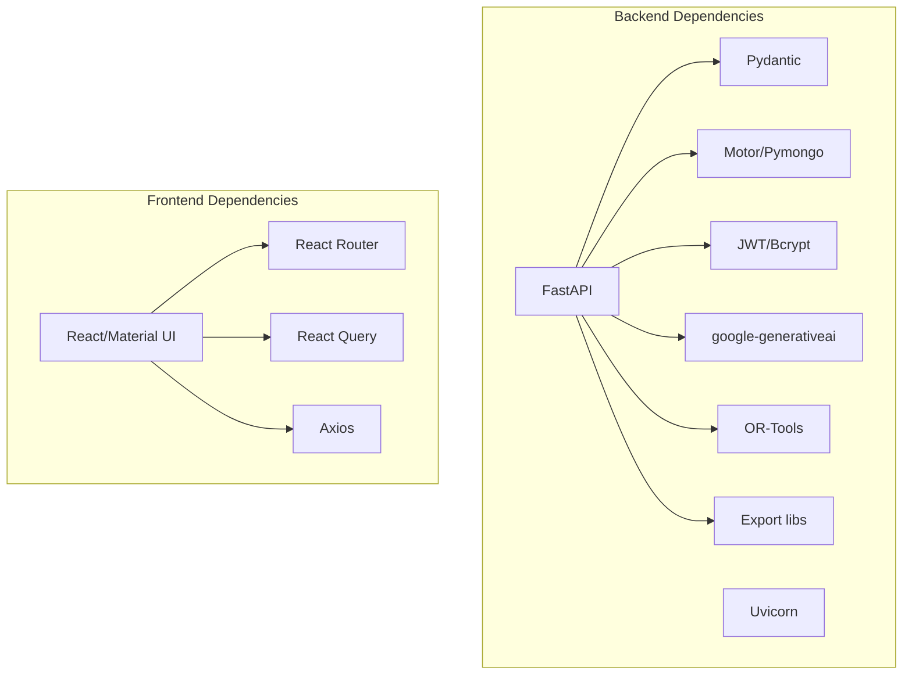

**Diagram sources**
- [backend/requirements.txt:1-19](file://backend/requirements.txt#L1-L19)
- [frontend/package.json:13-31](file://frontend/package.json#L13-L31)

**Section sources**
- [backend/requirements.txt:1-19](file://backend/requirements.txt#L1-L19)
- [frontend/package.json:1-46](file://frontend/package.json#L1-L46)

## Performance Considerations
- Asynchronous I/O: Motor-based MongoDB access prevents blocking during IO-bound operations.
- Caching and Pagination: Use pagination parameters in list endpoints to avoid large payloads.
- AI Latency: Offload AI operations to Gemini; consider asynchronous processing for long-running optimizations.
- Export Formats: Prefer streaming responses for large exports (Excel/PDF) to reduce memory usage.
- Container Scaling: Deploy multiple backend instances behind a reverse proxy; persist state in MongoDB.

[No sources needed since this section provides general guidance]

## Troubleshooting Guide
- CORS Issues: Verify allowed origins match frontend dev servers; confirm credentials and headers are permitted.
- Authentication Failures: Ensure Authorization headers are present; implement token refresh logic in the client.
- Validation Errors: Review global validation handler output for missing fields and incorrect types.
- Database Connectivity: Confirm MongoDB is reachable and pingable; check timeouts and environment variables.
- AI Service Unavailable: Ensure GEMINI_API_KEY is configured; otherwise AI endpoints will return configuration errors.

**Section sources**
- [backend/app/main.py:42-54](file://backend/app/main.py#L42-L54)
- [backend/app/main.py:56-64](file://backend/app/main.py#L56-L64)
- [frontend/src/services/timetableService.ts:223-260](file://frontend/src/services/timetableService.ts#L223-L260)
- [backend/app/core/config.py:34-35](file://backend/app/core/config.py#L34-L35)
- [backend/app/db/mongodb.py:11-32](file://backend/app/db/mongodb.py#L11-L32)

## Conclusion
ShedMaster’s architecture cleanly separates presentation, business logic, and data layers, with robust middleware for security and error handling. AI services integrate seamlessly to enhance timetable generation and validation, while MongoDB provides flexible schema support. The system is containerized for easy deployment and can be scaled horizontally with appropriate infrastructure.

[No sources needed since this section summarizes without analyzing specific files]

## Appendices

### System Context Diagram
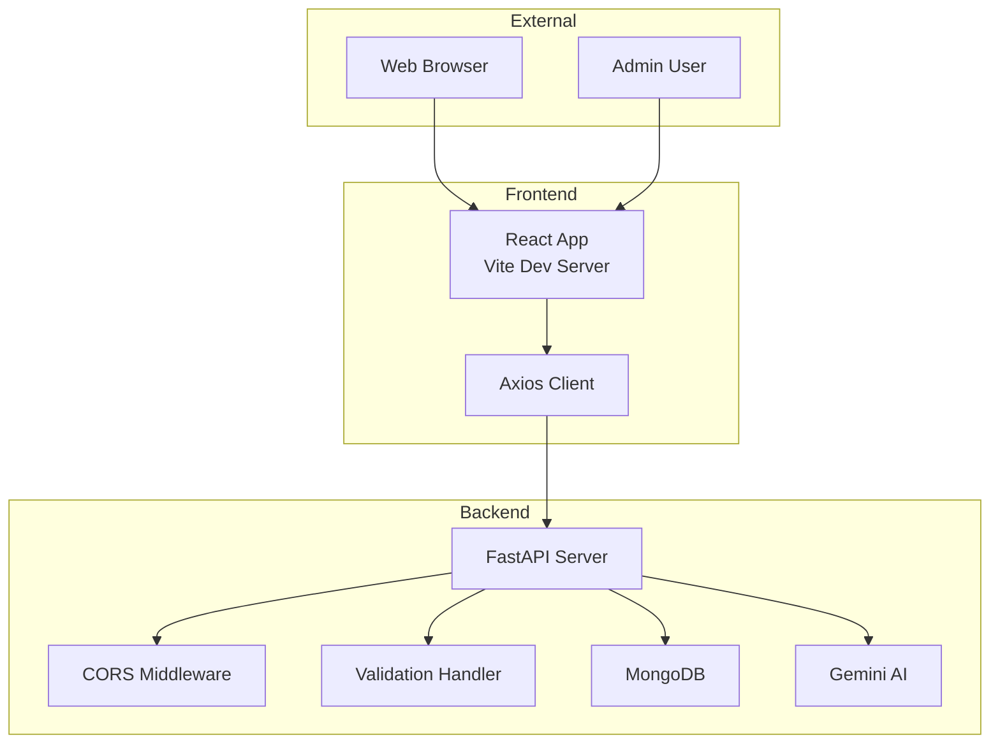

**Diagram sources**
- [frontend/src/App.tsx:21-46](file://frontend/src/App.tsx#L21-L46)
- [frontend/src/services/timetableService.ts:161-306](file://frontend/src/services/timetableService.ts#L161-L306)
- [backend/app/main.py:33-102](file://backend/app/main.py#L33-L102)
- [backend/app/db/mongodb.py:11-41](file://backend/app/db/mongodb.py#L11-L41)
- [backend/app/services/ai/gemini.py:9-288](file://backend/app/services/ai/gemini.py#L9-L288)

### Deployment Topology
- Backend: Dockerized FastAPI app exposing port 8000; runs with Uvicorn.
- Database: MongoDB service with persistent volume.
- Orchestration: docker-compose defines app and mongo services with environment overrides.

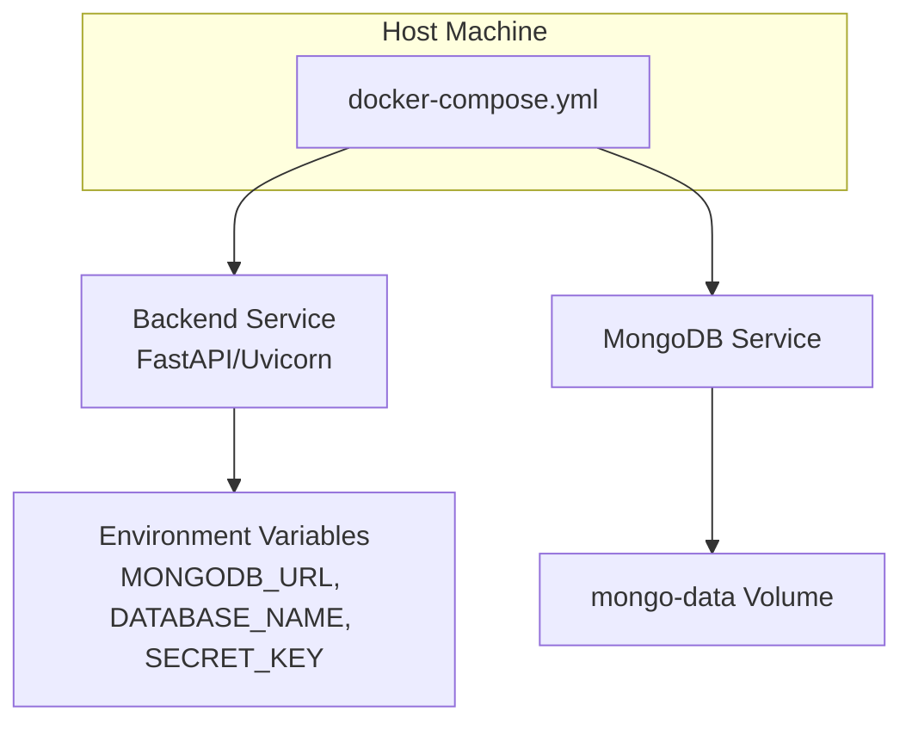

**Diagram sources**
- [backend/Dockerfile:15-23](file://backend/Dockerfile#L15-L23)
- [backend/docker-compose.yml:3-29](file://backend/docker-compose.yml#L3-L29)

**Section sources**
- [backend/Dockerfile:1-24](file://backend/Dockerfile#L1-L24)
- [backend/docker-compose.yml:1-30](file://backend/docker-compose.yml#L1-L30)