# Technology Stack Integration

<cite>
**Referenced Files in This Document**
- [backend/app/main.py](file://backend/app/main.py)
- [backend/app/core/config.py](file://backend/app/core/config.py)
- [backend/app/db/mongodb.py](file://backend/app/db/mongodb.py)
- [backend/requirements.txt](file://backend/requirements.txt)
- [frontend/package.json](file://frontend/package.json)
- [frontend/vite.config.ts](file://frontend/vite.config.ts)
- [backend/app/api/api_v1/api.py](file://backend/app/api/api_v1/api.py)
- [backend/app/api/v1/endpoints/auth.py](file://backend/app/api/v1/endpoints/auth.py)
- [backend/app/models/user.py](file://backend/app/models/user.py)
- [backend/app/services/ai/gemini.py](file://backend/app/services/ai/gemini.py)
- [backend/app/services/ai/constraint_creator.py](file://backend/app/services/ai/constraint_creator.py)
- [backend/app/api/v1/endpoints/ai.py](file://backend/app/api/v1/endpoints/ai.py)
- [backend/app/services/timetable/generator.py](file://backend/app/services/timetable/generator.py)
- [frontend/src/App.tsx](file://frontend/src/App.tsx)
- [frontend/src/main.tsx](file://frontend/src/main.tsx)
- [frontend/src/services/timetableService.ts](file://frontend/src/services/timetableService.ts)
- [frontend/src/store/authStore.ts](file://frontend/src/store/authStore.ts)
</cite>

## Table of Contents
1. [Introduction](#introduction)
2. [Project Structure](#project-structure)
3. [Core Components](#core-components)
4. [Architecture Overview](#architecture-overview)
5. [Detailed Component Analysis](#detailed-component-analysis)
6. [Dependency Analysis](#dependency-analysis)
7. [Performance Considerations](#performance-considerations)
8. [Troubleshooting Guide](#troubleshooting-guide)
9. [Conclusion](#conclusion)

## Introduction
This document provides comprehensive technology stack integration documentation for ShedMaster’s full-stack architecture. It covers Python backend integration with FastAPI, Pydantic, Motor, and ortools; React 19 TypeScript integration with Material-UI, React Query, and Vite; MongoDB integration patterns; AI service integration with Google Gemini API; CORS configuration, JWT token management, and security middleware; build tooling and development workflow; and performance monitoring/logging coordination.

## Project Structure
ShedMaster follows a clear separation of concerns:
- Backend: FastAPI application with modular API routing, MongoDB integration via Motor, AI services powered by Google Gemini, and constraint-solving logic.
- Frontend: React 19 application with Material-UI, React Query for state management, and Vite for build optimization.
- Shared integration: RESTful API contracts between frontend and backend, with JWT-based authentication and CORS policies.

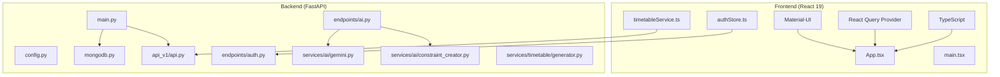

**Diagram sources**
- [frontend/src/App.tsx:1-49](file://frontend/src/App.tsx#L1-L49)
- [frontend/src/main.tsx:1-11](file://frontend/src/main.tsx#L1-L11)
- [backend/app/main.py:1-102](file://backend/app/main.py#L1-L102)
- [backend/app/api/api_v1/api.py:1-34](file://backend/app/api/api_v1/api.py#L1-L34)

**Section sources**
- [backend/app/main.py:1-102](file://backend/app/main.py#L1-L102)
- [frontend/src/App.tsx:1-49](file://frontend/src/App.tsx#L1-L49)

## Core Components
- FastAPI application lifecycle, CORS configuration, and exception handling.
- Pydantic-based settings and models for type safety and validation.
- Motor-based asynchronous MongoDB integration with connection pooling and graceful failure handling.
- React 19 with Material-UI for UI components, React Query for caching and state, and Vite for build optimization.
- AI services leveraging Google Gemini for timetable optimization, suggestions, and NEP 2020 compliance validation.
- Constraint-based timetable generation with rule enforcement and optimization.

**Section sources**
- [backend/app/main.py:25-102](file://backend/app/main.py#L25-L102)
- [backend/app/core/config.py:1-61](file://backend/app/core/config.py#L1-L61)
- [backend/app/db/mongodb.py:1-41](file://backend/app/db/mongodb.py#L1-L41)
- [frontend/package.json:1-46](file://frontend/package.json#L1-L46)
- [frontend/vite.config.ts:1-8](file://frontend/vite.config.ts#L1-L8)

## Architecture Overview
The system integrates frontend and backend through REST APIs with JWT-based authentication and CORS policies. The backend orchestrates AI-driven optimization and constraint enforcement, while the frontend manages UI state and user interactions.

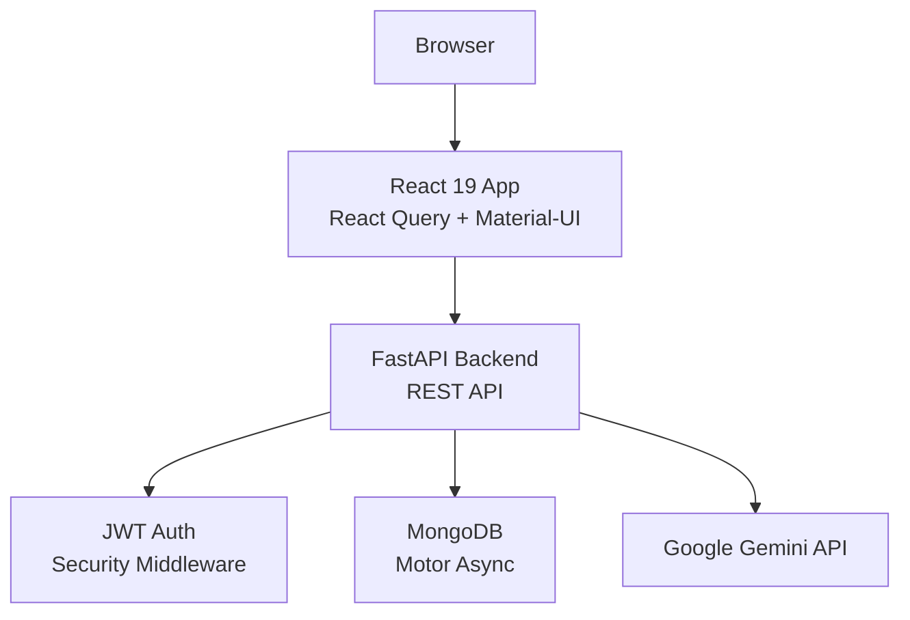

**Diagram sources**
- [backend/app/main.py:33-64](file://backend/app/main.py#L33-L64)
- [backend/app/api/v1/endpoints/auth.py:29-64](file://backend/app/api/v1/endpoints/auth.py#L29-L64)
- [backend/app/db/mongodb.py:11-41](file://backend/app/db/mongodb.py#L11-L41)
- [backend/app/services/ai/gemini.py:9-17](file://backend/app/services/ai/gemini.py#L9-L17)

## Detailed Component Analysis

### Backend: FastAPI Application and Middleware
- Application lifecycle hooks manage MongoDB connection establishment and teardown.
- Centralized CORS configuration allows frontend origins used by Vite development servers.
- Validation error handler centralizes request validation failures with structured responses.
- Health checks and test endpoints facilitate development and deployment verification.

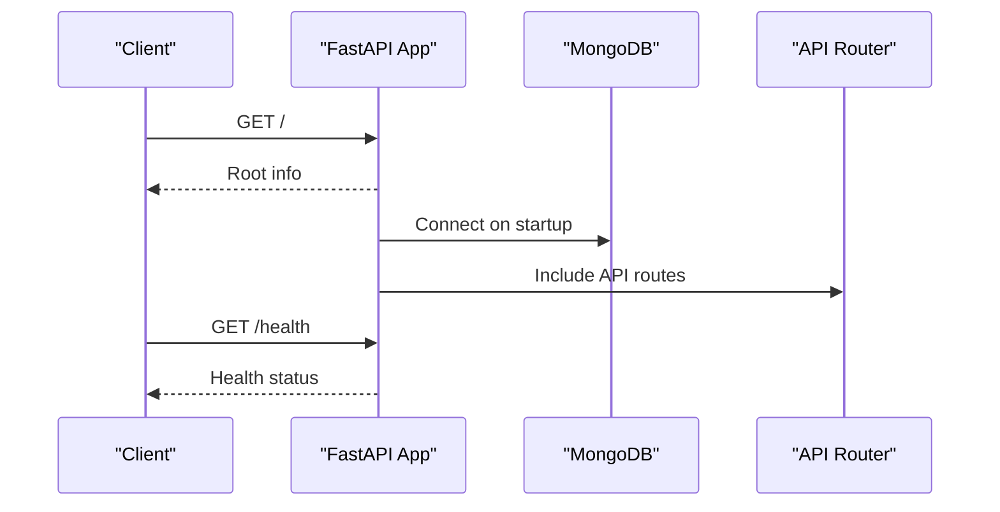

**Diagram sources**
- [backend/app/main.py:25-102](file://backend/app/main.py#L25-L102)
- [backend/app/api/api_v1/api.py:1-34](file://backend/app/api/api_v1/api.py#L1-L34)

**Section sources**
- [backend/app/main.py:25-102](file://backend/app/main.py#L25-L102)

### Backend: Configuration Management with Pydantic
- Centralized settings for API base path, CORS, database, JWT, AI, email, file storage, pagination.
- Environment-based configuration with .env loading and field validators for CORS origins.

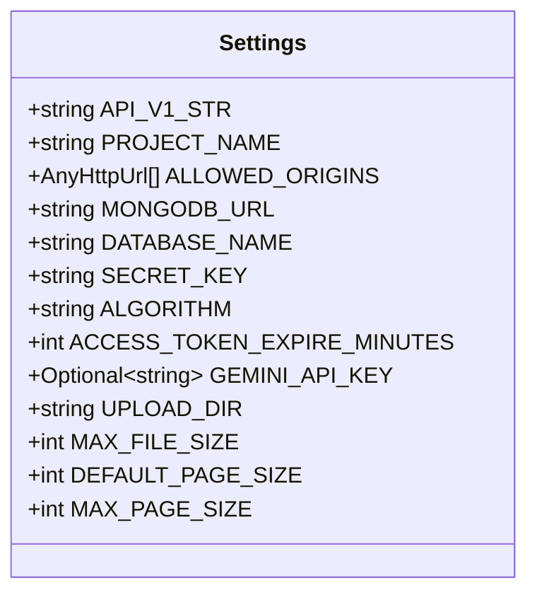

**Diagram sources**
- [backend/app/core/config.py:7-61](file://backend/app/core/config.py#L7-L61)

**Section sources**
- [backend/app/core/config.py:1-61](file://backend/app/core/config.py#L1-L61)

### Backend: MongoDB Integration with Motor
- Asynchronous client initialization with server selection timeout and ping verification.
- Graceful handling of connection failures to allow API operation during development without DB.
- Connection closure on shutdown.

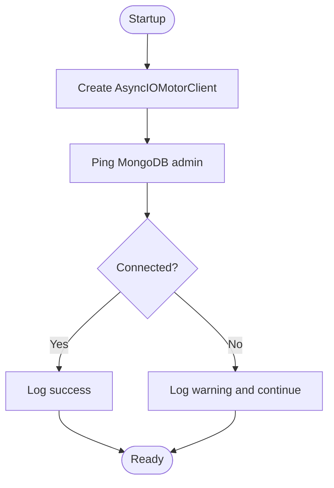

**Diagram sources**
- [backend/app/db/mongodb.py:11-41](file://backend/app/db/mongodb.py#L11-L41)

**Section sources**
- [backend/app/db/mongodb.py:1-41](file://backend/app/db/mongodb.py#L1-L41)

### Backend: Authentication and JWT Management
- OAuth2 password flow login with token generation and user validation.
- Access token expiry controlled by settings; refresh endpoint available.
- CORS preflight handling for registration endpoint.
- User model with Pydantic validation and MongoDB ObjectId serialization.

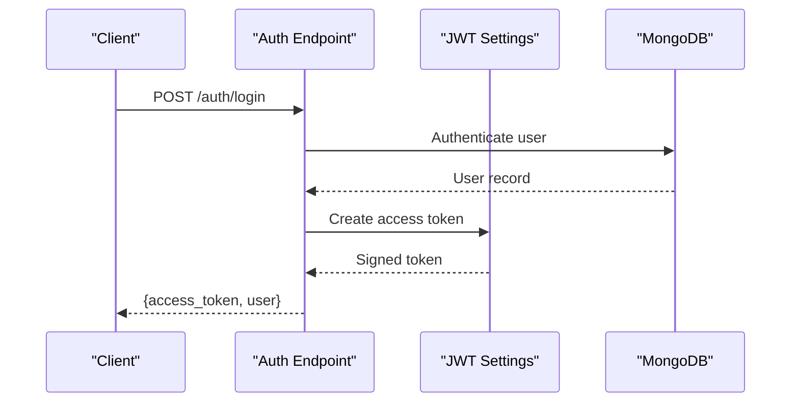

**Diagram sources**
- [backend/app/api/v1/endpoints/auth.py:29-64](file://backend/app/api/v1/endpoints/auth.py#L29-L64)
- [backend/app/core/config.py:29-32](file://backend/app/core/config.py#L29-L32)
- [backend/app/models/user.py:27-76](file://backend/app/models/user.py#L27-L76)

**Section sources**
- [backend/app/api/v1/endpoints/auth.py:1-123](file://backend/app/api/v1/endpoints/auth.py#L1-L123)
- [backend/app/models/user.py:1-76](file://backend/app/models/user.py#L1-L76)

### Backend: AI Services with Google Gemini
- GeminiAIService encapsulates AI operations: optimization, suggestions, efficiency analysis, NEP 2020 validation, and natural language queries.
- AIConstraintCreator parses natural language constraints, suggests program-specific constraints, validates NEP 2020 compliance, and optimizes constraint sets.
- AI endpoints enforce ownership checks to ensure users can only operate on their own timetables.

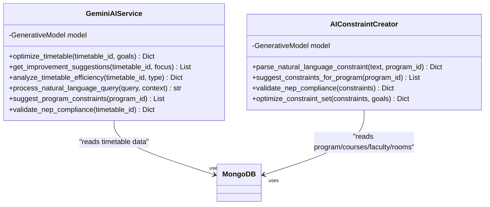

**Diagram sources**
- [backend/app/services/ai/gemini.py:9-288](file://backend/app/services/ai/gemini.py#L9-L288)
- [backend/app/services/ai/constraint_creator.py:18-781](file://backend/app/services/ai/constraint_creator.py#L18-L781)

**Section sources**
- [backend/app/services/ai/gemini.py:1-288](file://backend/app/services/ai/gemini.py#L1-L288)
- [backend/app/services/ai/constraint_creator.py:1-781](file://backend/app/services/ai/constraint_creator.py#L1-L781)
- [backend/app/api/v1/endpoints/ai.py:1-362](file://backend/app/api/v1/endpoints/ai.py#L1-L362)

### Backend: Constraint-Based Timetable Generation
- Data structures for courses, groups, rooms, slots, and rules define the core domain model.
- TimetableGenerator loads program data, applies constraints, and generates a timetable with occupancy tracking and rule enforcement.
- Integration with ortools is declared in requirements, enabling potential constraint programming extensions.

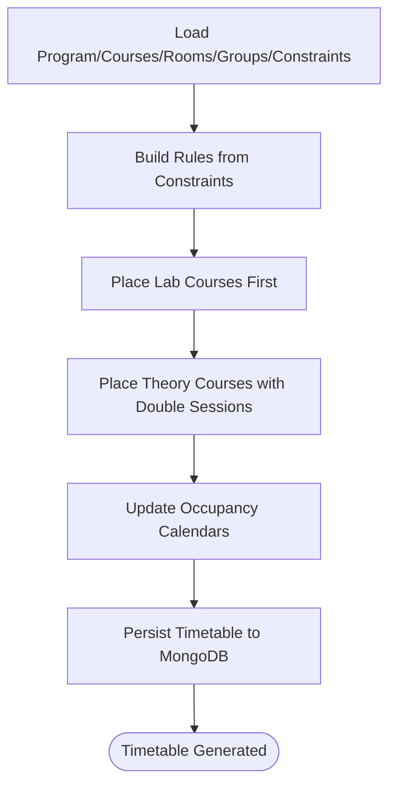

**Diagram sources**
- [backend/app/services/timetable/generator.py:169-402](file://backend/app/services/timetable/generator.py#L169-L402)

**Section sources**
- [backend/app/services/timetable/generator.py:1-402](file://backend/app/services/timetable/generator.py#L1-L402)
- [backend/requirements.txt:10-10](file://backend/requirements.txt#L10-L10)

### Frontend: React 19, Material-UI, and React Query
- App initializes React Query provider, theme context, localization provider, and routing.
- Material-UI components provide consistent UI with MUI system and date pickers.
- React Query manages caching and state for API interactions.

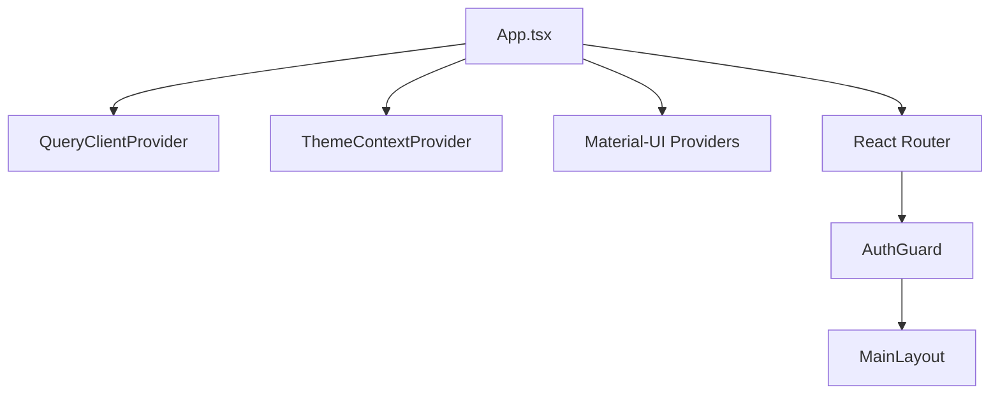

**Diagram sources**
- [frontend/src/App.tsx:19-45](file://frontend/src/App.tsx#L19-L45)

**Section sources**
- [frontend/src/App.tsx:1-49](file://frontend/src/App.tsx#L1-L49)
- [frontend/src/main.tsx:1-11](file://frontend/src/main.tsx#L1-L11)

### Frontend: Service Layer and Token Management
- timetableService.ts encapsulates API calls, request/response interceptors, and token refresh logic.
- authStore.ts manages JWT lifecycle, persistence, and axios interceptors for automatic authorization.
- Both integrate with backend endpoints for authentication, timetable CRUD, and AI services.

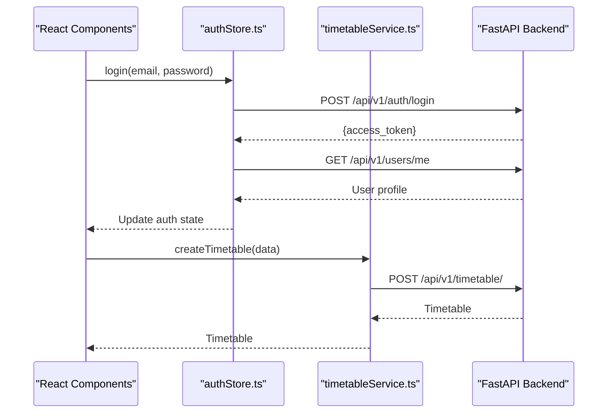

**Diagram sources**
- [frontend/src/store/authStore.ts:36-120](file://frontend/src/store/authStore.ts#L36-L120)
- [frontend/src/services/timetableService.ts:308-343](file://frontend/src/services/timetableService.ts#L308-L343)

**Section sources**
- [frontend/src/services/timetableService.ts:1-772](file://frontend/src/services/timetableService.ts#L1-L772)
- [frontend/src/store/authStore.ts:1-248](file://frontend/src/store/authStore.ts#L1-L248)

### Frontend: Build Tooling and Development Workflow
- Vite configuration enables React Fast Refresh and TypeScript compilation.
- Package scripts support development, build, linting, and preview workflows.
- ESLint and TypeScript configurations ensure code quality and type safety.

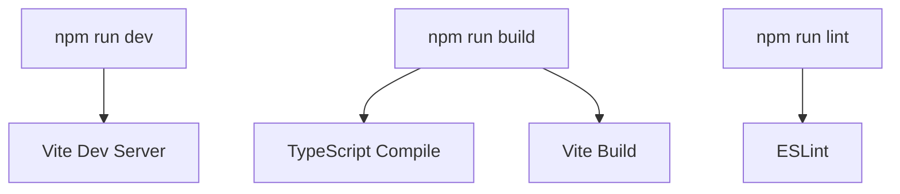

**Diagram sources**
- [frontend/package.json:6-12](file://frontend/package.json#L6-L12)
- [frontend/vite.config.ts:1-8](file://frontend/vite.config.ts#L1-L8)

**Section sources**
- [frontend/package.json:1-46](file://frontend/package.json#L1-L46)
- [frontend/vite.config.ts:1-8](file://frontend/vite.config.ts#L1-L8)

## Dependency Analysis
- Backend dependencies include FastAPI, uvicorn, Pydantic, Motor, bcrypt, PyJWT, ortools, pandas, openpyxl, WeasyPrint, protobuf, and google-generativeai.
- Frontend dependencies include React 19, Material-UI, React Query, date-fns, axios, and Vite.

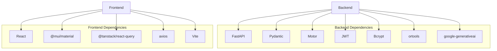

**Diagram sources**
- [backend/requirements.txt:1-19](file://backend/requirements.txt#L1-L19)
- [frontend/package.json:13-44](file://frontend/package.json#L13-L44)

**Section sources**
- [backend/requirements.txt:1-19](file://backend/requirements.txt#L1-L19)
- [frontend/package.json:1-46](file://frontend/package.json#L1-L46)

## Performance Considerations
- Asynchronous MongoDB operations via Motor reduce blocking I/O and improve throughput under concurrent requests.
- React Query caching minimizes redundant network calls and accelerates UI updates.
- AI operations should be rate-limited and batched; consider implementing retry/backoff and request deduplication.
- CORS configuration restricts origins to development servers to prevent cross-origin misuse.
- Logging and health checks enable proactive monitoring of service availability.

## Troubleshooting Guide
- MongoDB connectivity issues: Verify MONGODB_URL and DATABASE_NAME; check server selection timeout and ping command success.
- CORS failures: Confirm frontend origins in allow_origins and ensure wildcard headers are permitted for development.
- JWT token errors: Validate SECRET_KEY, ALGORITHM, and ACCESS_TOKEN_EXPIRE_MINUTES; ensure Authorization headers are attached to requests.
- AI service unavailability: Ensure GEMINI_API_KEY is configured; fallback logic exists in AI services.
- Frontend auth issues: Check localStorage persistence and axios interceptors; confirm token refresh logic for admin users.

**Section sources**
- [backend/app/db/mongodb.py:11-41](file://backend/app/db/mongodb.py#L11-L41)
- [backend/app/main.py:56-64](file://backend/app/main.py#L56-L64)
- [backend/app/core/config.py:29-35](file://backend/app/core/config.py#L29-L35)
- [backend/app/services/ai/gemini.py:10-17](file://backend/app/services/ai/gemini.py#L10-L17)
- [frontend/src/store/authStore.ts:209-247](file://frontend/src/store/authStore.ts#L209-L247)

## Conclusion
ShedMaster integrates a modern full-stack architecture with robust backend services powered by FastAPI, Pydantic, Motor, and AI via Google Gemini, and a responsive frontend built with React 19, Material-UI, and React Query. The system emphasizes type safety, asynchronous operations, and user-centric workflows, with clear separation of concerns and scalable patterns for constraint-based timetable generation and AI-assisted optimization.