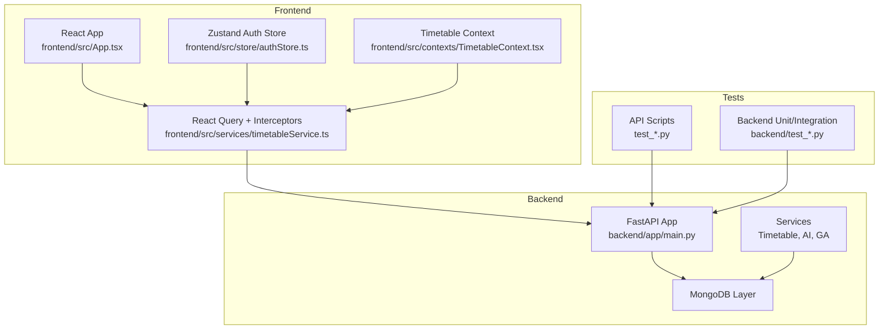
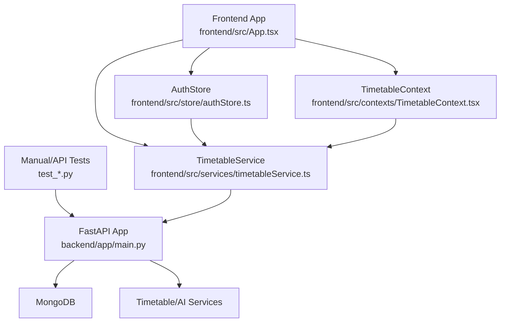
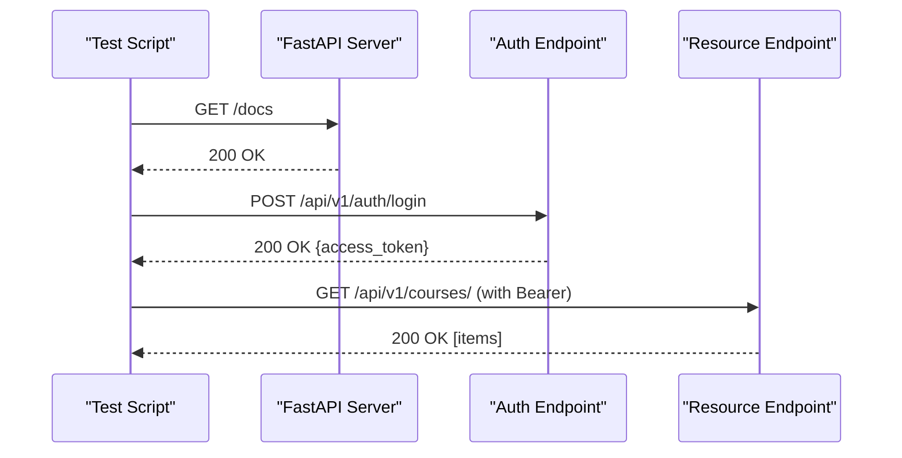
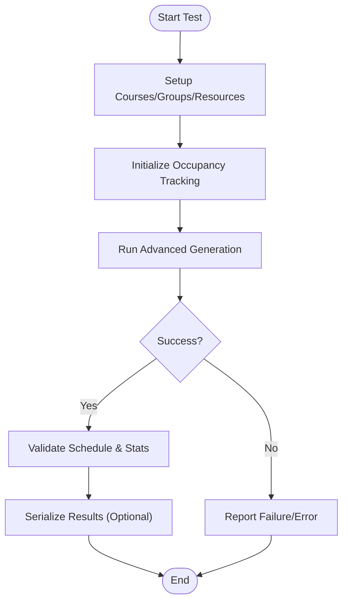
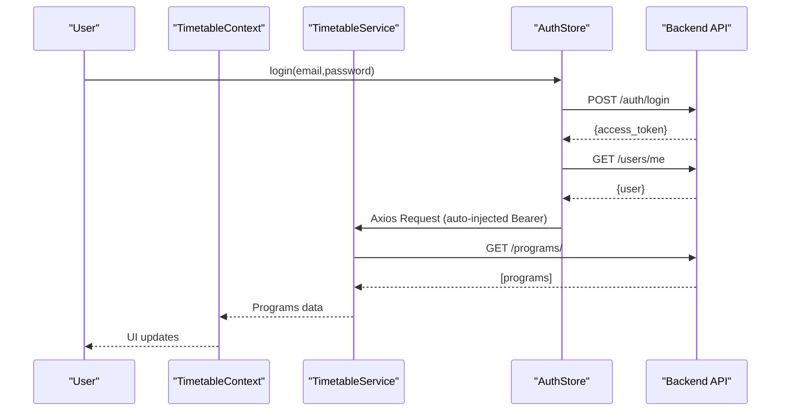
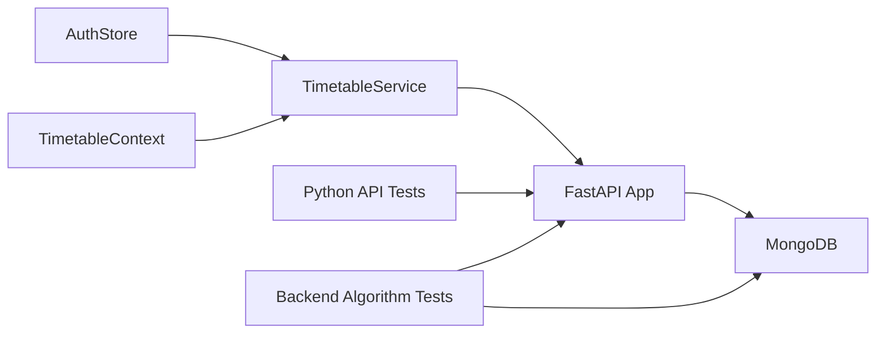

# Testing Strategy

<cite>
**Referenced Files in This Document**
- [backend/app/main.py](file://backend/app/main.py)
- [backend/test_advanced_generator.py](file://backend/test_advanced_generator.py)
- [backend/test_ga_endpoint.py](file://backend/test_ga_endpoint.py)
- [test_api.py](file://test_api.py)
- [test_endpoints.py](file://test_endpoints.py)
- [test_login.py](file://test_login.py)
- [test_simple.py](file://test_simple.py)
- [frontend/src/App.tsx](file://frontend/src/App.tsx)
- [frontend/src/services/timetableService.ts](file://frontend/src/services/timetableService.ts)
- [frontend/src/store/authStore.ts](file://frontend/src/store/authStore.ts)
- [frontend/src/contexts/TimetableContext.tsx](file://frontend/src/contexts/TimetableContext.tsx)
</cite>

## Table of Contents
1. [Introduction](#introduction)
2. [Project Structure](#project-structure)
3. [Core Components](#core-components)
4. [Architecture Overview](#architecture-overview)
5. [Detailed Component Analysis](#detailed-component-analysis)
6. [Dependency Analysis](#dependency-analysis)
7. [Performance Considerations](#performance-considerations)
8. [Troubleshooting Guide](#troubleshooting-guide)
9. [Conclusion](#conclusion)
10. [Appendices](#appendices)

## Introduction
This document defines ShedMaster’s comprehensive testing strategy across unit, integration, API, frontend, and performance domains. It covers backend testing with FastAPI and Python scripts, frontend testing patterns for React components and state management, test data management, and CI-friendly automation practices. It also provides guidance for testing constraint satisfaction problems and AI optimization features specific to academic scheduling systems.

## Project Structure
ShedMaster comprises:
- Backend: FastAPI application exposing REST endpoints, MongoDB connectivity, and AI/optimization services.
- Frontend: React application with TypeScript, Zustand-based state management, React Query for caching, and MUI for UI.
- Test scripts: Standalone Python scripts validating API endpoints and authentication flows.
- Test data: CSV datasets under archive/ for realistic fixture population.

**Diagram sources**
- [backend/app/main.py:1-102](file://backend/app/main.py#L1-L102)
- [frontend/src/App.tsx:1-49](file://frontend/src/App.tsx#L1-L49)
- [frontend/src/services/timetableService.ts:1-772](file://frontend/src/services/timetableService.ts#L1-L772)
- [frontend/src/store/authStore.ts:1-248](file://frontend/src/store/authStore.ts#L1-L248)
- [frontend/src/contexts/TimetableContext.tsx:1-629](file://frontend/src/contexts/TimetableContext.tsx#L1-L629)
- [test_api.py:1-52](file://test_api.py#L1-L52)
- [backend/test_advanced_generator.py:1-184](file://backend/test_advanced_generator.py#L1-L184)
- [backend/test_ga_endpoint.py:1-44](file://backend/test_ga_endpoint.py#L1-L44)

**Section sources**
- [backend/app/main.py:1-102](file://backend/app/main.py#L1-L102)
- [frontend/src/App.tsx:1-49](file://frontend/src/App.tsx#L1-L49)
- [frontend/src/services/timetableService.ts:1-772](file://frontend/src/services/timetableService.ts#L1-L772)
- [frontend/src/store/authStore.ts:1-248](file://frontend/src/store/authStore.ts#L1-L248)
- [frontend/src/contexts/TimetableContext.tsx:1-629](file://frontend/src/contexts/TimetableContext.tsx#L1-L629)
- [test_api.py:1-52](file://test_api.py#L1-L52)
- [backend/test_advanced_generator.py:1-184](file://backend/test_advanced_generator.py#L1-L184)
- [backend/test_ga_endpoint.py:1-44](file://backend/test_ga_endpoint.py#L1-L44)

## Core Components
- Backend API server with health checks, CORS, and exception handling.
- MongoDB connection lifecycle managed via lifespan events.
- Authentication endpoints and protected routes.
- Timetable generation services (advanced generator, genetic algorithm engine).
- Frontend services for HTTP communication, interceptors, and state synchronization.
- Auth store with token persistence and axios interceptors.
- Timetable context orchestrating multi-tab form data, loading, saving, and generation.

Key testing touchpoints:
- API scripts validate endpoint availability and basic responses.
- Backend scripts exercise core algorithms and service integrations.
- Frontend components rely on services and stores for authentication and data operations.

**Section sources**
- [backend/app/main.py:25-102](file://backend/app/main.py#L25-L102)
- [test_api.py:1-52](file://test_api.py#L1-L52)
- [backend/test_advanced_generator.py:1-184](file://backend/test_advanced_generator.py#L1-L184)
- [backend/test_ga_endpoint.py:1-44](file://backend/test_ga_endpoint.py#L1-L44)
- [frontend/src/services/timetableService.ts:161-261](file://frontend/src/services/timetableService.ts#L161-L261)
- [frontend/src/store/authStore.ts:29-207](file://frontend/src/store/authStore.ts#L29-L207)
- [frontend/src/contexts/TimetableContext.tsx:260-460](file://frontend/src/contexts/TimetableContext.tsx#L260-L460)

## Architecture Overview
The testing architecture spans:
- Backend: FastAPI app with middleware, routers, and database connections.
- Frontend: Axios-based service layer with request/response interceptors and React Query caching.
- Shared state: Auth store persists tokens and injects Authorization headers.
- Test harnesses: Python scripts for manual smoke tests and backend-specific algorithm tests.

**Diagram sources**
- [backend/app/main.py:33-102](file://backend/app/main.py#L33-L102)
- [frontend/src/services/timetableService.ts:161-261](file://frontend/src/services/timetableService.ts#L161-L261)
- [frontend/src/store/authStore.ts:209-248](file://frontend/src/store/authStore.ts#L209-L248)
- [frontend/src/contexts/TimetableContext.tsx:260-460](file://frontend/src/contexts/TimetableContext.tsx#L260-L460)
- [test_api.py:11-51](file://test_api.py#L11-L51)

## Detailed Component Analysis

### Backend API Testing Strategy
- Purpose: Validate server readiness, authentication flow, and endpoint responses.
- Approach:
  - Health checks against root and docs endpoints.
  - Authentication via login endpoint with bearer token propagation.
  - Iterative GET requests to resource endpoints with status and payload inspection.
- Execution environment:
  - Start backend server locally.
  - Allow 2-second startup grace before tests.
  - Use timeouts to prevent hanging on network failures.
- Data validation:
  - Verify response status codes and payload shapes.
  - Capture first record keys to confirm schema consistency.

**Diagram sources**
- [test_endpoints.py:14-82](file://test_endpoints.py#L14-L82)
- [backend/app/main.py:85-98](file://backend/app/main.py#L85-L98)

**Section sources**
- [test_api.py:11-51](file://test_api.py#L11-L51)
- [test_endpoints.py:14-82](file://test_endpoints.py#L14-L82)
- [test_login.py:4-9](file://test_login.py#L4-L9)
- [test_simple.py:14-34](file://test_simple.py#L14-L34)
- [backend/app/main.py:85-98](file://backend/app/main.py#L85-L98)

### Backend Algorithm and Service Testing
- Purpose: Validate timetable generation logic, time slot rules, and GA pipeline.
- Approach:
  - Advanced generator tests: setup courses/groups/resources, initialize occupancy, run generation, assert success, scores, validation results, and optional serialization of detailed results.
  - GA endpoint tests: connect to DB, fetch a template, apply template to timetable via service, assert resulting entries and metadata.
- Execution environment:
  - Ensure MongoDB is running and seeded with templates.
  - Import app modules and connect to DB in test process.
- Data validation:
  - Confirm success flag, non-empty schedule, and non-empty validation warnings/errors summary.

**Diagram sources**
- [backend/test_advanced_generator.py:15-115](file://backend/test_advanced_generator.py#L15-L115)

**Section sources**
- [backend/test_advanced_generator.py:15-184](file://backend/test_advanced_generator.py#L15-L184)
- [backend/test_ga_endpoint.py:13-43](file://backend/test_ga_endpoint.py#L13-L43)

### Frontend Testing Patterns
- Purpose: Ensure correct authentication, HTTP interception, data loading, and state synchronization across components.
- Approach:
  - Auth store: login flow posts credentials, extracts token, fetches user info, persists state, and attaches Authorization header to axios defaults.
  - Service layer: request interceptor reads persisted auth state, attaches Authorization header, and retries on 401 with token refresh.
  - Context provider: manages multi-tab form data, loading states, and orchestration of save/generate/export actions.
- Data validation:
  - Verify token presence and Authorization header injection.
  - Confirm program/course/faculty/room loads succeed and populate state.
  - Validate draft/save/update flows and generation triggers.

**Diagram sources**
- [frontend/src/store/authStore.ts:36-74](file://frontend/src/store/authStore.ts#L36-L74)
- [frontend/src/services/timetableService.ts:173-261](file://frontend/src/services/timetableService.ts#L173-L261)
- [frontend/src/contexts/TimetableContext.tsx:504-518](file://frontend/src/contexts/TimetableContext.tsx#L504-L518)

**Section sources**
- [frontend/src/store/authStore.ts:29-207](file://frontend/src/store/authStore.ts#L29-L207)
- [frontend/src/services/timetableService.ts:161-261](file://frontend/src/services/timetableService.ts#L161-L261)
- [frontend/src/contexts/TimetableContext.tsx:260-460](file://frontend/src/contexts/TimetableContext.tsx#L260-L460)
- [frontend/src/App.tsx:19-45](file://frontend/src/App.tsx#L19-L45)

### Test Data Management
- Backend fixtures: CSV datasets under archive/ provide realistic data for courses, faculty, rooms, schedules, and student groups.
- Test data seeding:
  - Use provided scripts to import and prepare data.
  - Ensure MongoDB collections are populated before running algorithm tests.
- Frontend mock strategy:
  - Service supports a mock mode toggle to substitute real backend calls with deterministic in-memory data for isolated UI testing.

**Section sources**
- [frontend/src/services/timetableService.ts:766-772](file://frontend/src/services/timetableService.ts#L766-L772)

### Test Automation and CI Practices
- Manual smoke tests:
  - Use Python scripts to validate server health, authentication, and resource endpoints.
- Backend algorithm tests:
  - Run standalone scripts to exercise core generation logic and GA pipeline.
- Frontend automation:
  - Jest/React Testing Library recommended for unit tests of components and stores.
  - Cypress/Puppeteer recommended for E2E tests covering auth flows, form navigation, and generation/export.
- CI pipeline:
  - Lint and type-check frontend and backend.
  - Run backend algorithm tests against a containerized MongoDB.
  - Run frontend unit/E2E tests against a mocked backend or a staging API.

[No sources needed since this section provides general guidance]

## Dependency Analysis
Backend and frontend components interact through HTTP APIs and shared state. The following diagram highlights key dependencies for testing:

**Diagram sources**
- [frontend/src/services/timetableService.ts:161-261](file://frontend/src/services/timetableService.ts#L161-L261)
- [frontend/src/store/authStore.ts:209-248](file://frontend/src/store/authStore.ts#L209-L248)
- [frontend/src/contexts/TimetableContext.tsx:260-460](file://frontend/src/contexts/TimetableContext.tsx#L260-L460)
- [backend/app/main.py:25-102](file://backend/app/main.py#L25-L102)
- [test_api.py:11-51](file://test_api.py#L11-L51)
- [backend/test_advanced_generator.py:15-115](file://backend/test_advanced_generator.py#L15-L115)

**Section sources**
- [frontend/src/services/timetableService.ts:161-261](file://frontend/src/services/timetableService.ts#L161-L261)
- [frontend/src/store/authStore.ts:209-248](file://frontend/src/store/authStore.ts#L209-L248)
- [frontend/src/contexts/TimetableContext.tsx:260-460](file://frontend/src/contexts/TimetableContext.tsx#L260-L460)
- [backend/app/main.py:25-102](file://backend/app/main.py#L25-L102)
- [test_api.py:11-51](file://test_api.py#L11-L51)
- [backend/test_advanced_generator.py:15-115](file://backend/test_advanced_generator.py#L15-L115)

## Performance Considerations
- Timetable generation algorithms:
  - Measure wall-clock time for generation runs and track validation statistics.
  - Compare optimization scores across runs to detect regressions.
- Frontend performance:
  - Monitor React Query cache hits and stale times.
  - Track axios interceptor overhead and retry attempts.
- End-to-end latency:
  - Record request durations for key endpoints (programs, courses, generation).
  - Use profiling tools to identify slow DB queries or service bottlenecks.

[No sources needed since this section provides general guidance]

## Troubleshooting Guide
Common issues and remedies:
- Authentication failures:
  - Verify login endpoint responds with 200 and includes access token.
  - Ensure Authorization header is present in subsequent requests.
- CORS errors:
  - Confirm frontend origin is allowed in backend CORS configuration.
- 401 Unauthorized:
  - Implement token refresh logic in service interceptors and log detailed error context.
- Data inconsistencies:
  - Normalize backend IDs (id vs _id) in frontend to prevent runtime errors.
- Algorithm failures:
  - Capture detailed validation errors/warnings and serialize results for post-mortem analysis.

**Section sources**
- [backend/app/main.py:42-54](file://backend/app/main.py#L42-L54)
- [frontend/src/services/timetableService.ts:239-260](file://frontend/src/services/timetableService.ts#L239-L260)
- [frontend/src/contexts/TimetableContext.tsx:311-315](file://frontend/src/contexts/TimetableContext.tsx#L311-L315)
- [backend/test_advanced_generator.py:72-82](file://backend/test_advanced_generator.py#L72-L82)

## Conclusion
ShedMaster’s testing strategy combines manual smoke tests, backend algorithm validations, and robust frontend state and HTTP-layer testing. By leveraging interceptors, persistent auth state, and deterministic mock modes, teams can achieve reliable unit and integration coverage. Extending CI with automated frontend tests and performance baselines ensures sustainable quality for constraint satisfaction and AI optimization features in academic scheduling.

[No sources needed since this section summarizes without analyzing specific files]

## Appendices

### API Testing Checklist
- Server health: root and docs endpoints reachable.
- Authentication: login succeeds and bearer token propagated.
- Resource endpoints: 200 OK with expected payload shape.
- Error handling: validation errors surfaced with 422.

**Section sources**
- [test_api.py:11-51](file://test_api.py#L11-L51)
- [test_endpoints.py:14-82](file://test_endpoints.py#L14-L82)
- [backend/app/main.py:42-54](file://backend/app/main.py#L42-L54)

### Backend Algorithm Testing Checklist
- Time slot generation: verify counts and daily distributions.
- Generation success: non-empty schedule and validation results.
- GA pipeline: template applied, entries generated, metadata populated.

**Section sources**
- [backend/test_advanced_generator.py:117-153](file://backend/test_advanced_generator.py#L117-L153)
- [backend/test_advanced_generator.py:15-115](file://backend/test_advanced_generator.py#L15-L115)
- [backend/test_ga_endpoint.py:13-43](file://backend/test_ga_endpoint.py#L13-L43)

### Frontend Testing Checklist
- Auth: login sets token, user, and Authorization header.
- Data loading: programs/courses/faculty/rooms load and render.
- Context: form data syncs across tabs, save/draft/update flows work.
- Interceptors: 401 triggers refresh/retry or redirects to login.

**Section sources**
- [frontend/src/store/authStore.ts:36-74](file://frontend/src/store/authStore.ts#L36-L74)
- [frontend/src/services/timetableService.ts:173-261](file://frontend/src/services/timetableService.ts#L173-L261)
- [frontend/src/contexts/TimetableContext.tsx:504-518](file://frontend/src/contexts/TimetableContext.tsx#L504-L518)