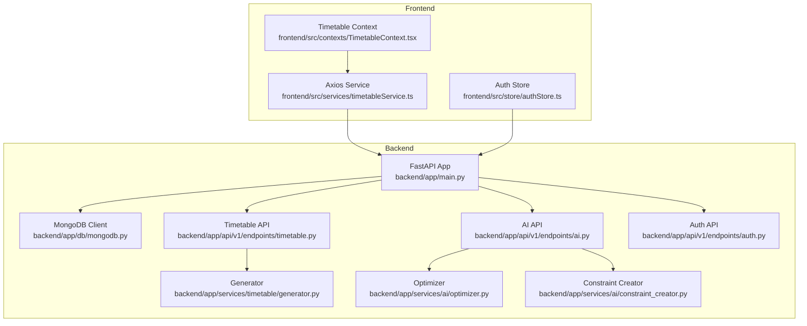
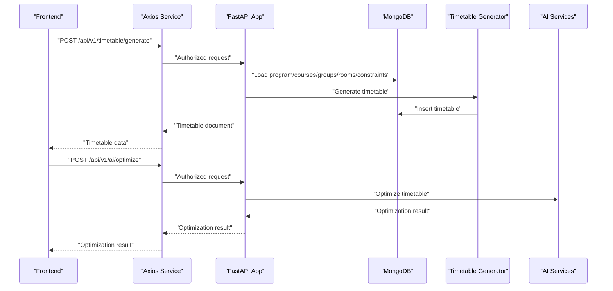
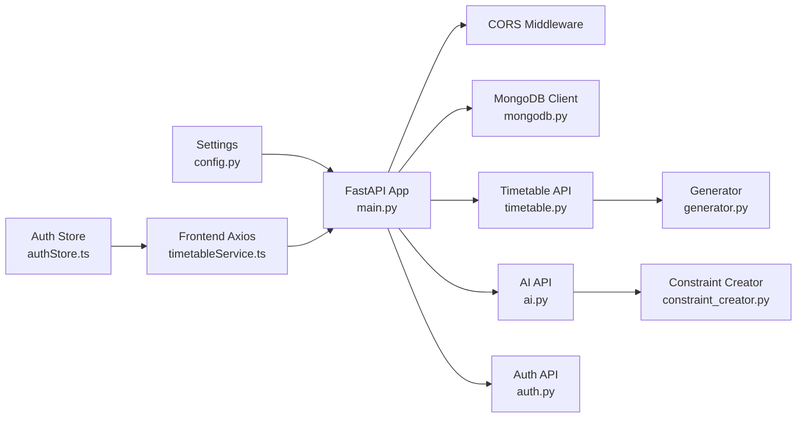

# Troubleshooting and FAQ

<cite>
**Referenced Files in This Document**
- [backend\app\main.py](file://backend/app/main.py)
- [backend\app\core\config.py](file://backend/app/core/config.py)
- [backend\docker-compose.yml](file://backend/docker-compose.yml)
- [backend\Dockerfile](file://backend/Dockerfile)
- [backend\requirements.txt](file://backend/requirements.txt)
- [backend\app\db\mongodb.py](file://backend/app/db/mongodb.py)
- [backend\app\api\v1\endpoints\timetable.py](file://backend/app/api/v1/endpoints/timetable.py)
- [backend\app\api\v1\endpoints\ai.py](file://backend/app/api/v1/endpoints/ai.py)
- [backend\app\api\v1\endpoints\auth.py](file://backend/app/api/v1/endpoints/auth.py)
- [backend\app\services\timetable\generator.py](file://backend/app/services/timetable/generator.py)
- [backend\app\services\ai\optimizer.py](file://backend/app/services/ai/optimizer.py)
- [backend\app\services\ai\constraint_creator.py](file://backend/app/services/ai/constraint_creator.py)
- [frontend\src\services\timetableService.ts](file://frontend/src/services/timetableService.ts)
- [frontend\src\store\authStore.ts](file://frontend/src/store/authStore.ts)
- [frontend\src\contexts\TimetableContext.tsx](file://frontend/src/contexts/TimetableContext.tsx)
</cite>

## Table of Contents
1. [Introduction](#introduction)
2. [Project Structure](#project-structure)
3. [Core Components](#core-components)
4. [Architecture Overview](#architecture-overview)
5. [Detailed Component Analysis](#detailed-component-analysis)
6. [Dependency Analysis](#dependency-analysis)
7. [Performance Considerations](#performance-considerations)
8. [Troubleshooting Guide](#troubleshooting-guide)
9. [Conclusion](#conclusion)
10. [Appendices](#appendices)

## Introduction
This document provides comprehensive troubleshooting guidance for ShedMaster, focusing on installation and environment setup, runtime errors, performance bottlenecks, frontend integration issues, debugging constraint satisfaction and AI processing, common configuration pitfalls, and an FAQ with escalation procedures and support resources.

## Project Structure
ShedMaster consists of:
- Backend: FastAPI application with MongoDB integration, AI services, timetable generators, and authentication.
- Frontend: React application using TypeScript, Zustand for state, Axios for HTTP, and ZUSTAND for persistence.
- Containerization: Docker Compose and Dockerfile define services and dependencies.

**Diagram sources**
- [backend/app/main.py:1-102](file://backend/app/main.py#L1-L102)
- [backend/app/db/mongodb.py:1-41](file://backend/app/db/mongodb.py#L1-L41)
- [backend/app/api/v1/endpoints/timetable.py:1-728](file://backend/app/api/v1/endpoints/timetable.py#L1-L728)
- [backend/app/api/v1/endpoints/ai.py:1-362](file://backend/app/api/v1/endpoints/ai.py#L1-L362)
- [backend/app/api/v1/endpoints/auth.py:1-123](file://backend/app/api/v1/endpoints/auth.py#L1-L123)
- [backend/app/services/timetable/generator.py:1-402](file://backend/app/services/timetable/generator.py#L1-L402)
- [backend/app/services/ai/optimizer.py:1-59](file://backend/app/services/ai/optimizer.py#L1-L59)
- [backend/app/services/ai/constraint_creator.py:1-781](file://backend/app/services/ai/constraint_creator.py#L1-L781)
- [frontend/src/services/timetableService.ts:1-772](file://frontend/src/services/timetableService.ts#L1-L772)
- [frontend/src/store/authStore.ts:1-248](file://frontend/src/store/authStore.ts#L1-L248)
- [frontend/src/contexts/TimetableContext.tsx:1-629](file://frontend/src/contexts/TimetableContext.tsx#L1-L629)

**Section sources**
- [backend/app/main.py:1-102](file://backend/app/main.py#L1-L102)
- [backend/docker-compose.yml:1-30](file://backend/docker-compose.yml#L1-L30)
- [backend/Dockerfile:1-24](file://backend/Dockerfile#L1-L24)
- [frontend/src/services/timetableService.ts:1-772](file://frontend/src/services/timetableService.ts#L1-L772)

## Core Components
- Configuration and Environment
  - Settings class defines API, CORS, database, security, AI, email, file storage, pagination, and environment loading.
  - Docker Compose defines app and mongo services, ports, environment variables, and volumes.
  - Dockerfile installs Python dependencies and runs Uvicorn.
- Database Connectivity
  - Async MongoDB client with ping test and graceful failure handling.
- Authentication and Authorization
  - OAuth2 login, token creation, user registration, and protected routes.
- Timetable Generation and AI
  - Constraint-based generator, NEP GA engine, AI optimizer scoring, and constraint creator with NEP 2020 compliance.
- Frontend Integration
  - Axios service with interceptors, auth store with persistence, and context managing form and timetable state.

**Section sources**
- [backend/app\core\config.py:1-61](file://backend/app/core/config.py#L1-L61)
- [backend\docker-compose.yml:1-30](file://backend/docker-compose.yml#L1-L30)
- [backend\Dockerfile:1-24](file://backend/Dockerfile#L1-L24)
- [backend\app\db\mongodb.py:1-41](file://backend/app/db/mongodb.py#L1-L41)
- [backend\app\api\v1\endpoints\auth.py:1-123](file://backend/app/api/v1/endpoints/auth.py#L1-L123)
- [backend\app\services\timetable\generator.py:1-402](file://backend/app/services/timetable/generator.py#L1-L402)
- [backend\app\services\ai\optimizer.py:1-59](file://backend/app/services/ai/optimizer.py#L1-L59)
- [backend\app\services\ai\constraint_creator.py:1-781](file://backend/app/services/ai/constraint_creator.py#L1-L781)
- [frontend\src\services\timetableService.ts:1-772](file://frontend/src/services/timetableService.ts#L1-L772)
- [frontend\src\store\authStore.ts:1-248](file://frontend/src/store/authStore.ts#L1-L248)
- [frontend\src\contexts\TimetableContext.tsx:1-629](file://frontend/src/contexts/TimetableContext.tsx#L1-L629)

## Architecture Overview
High-level flow:
- Frontend sends authenticated requests to backend APIs.
- Backend validates requests, connects to MongoDB, executes business logic (generators, AI), and returns responses.
- AI services integrate with Gemini for constraint parsing and optimization.

**Diagram sources**
- [backend\app\api\v1\endpoints\timetable.py:234-264](file://backend/app/api/v1/endpoints/timetable.py#L234-L264)
- [backend\app\services\timetable\generator.py:235-401](file://backend/app/services/timetable/generator.py#L235-L401)
- [backend\app\api\v1\endpoints\ai.py:46-73](file://backend/app/api/v1/endpoints/ai.py#L46-L73)
- [backend\app\db\mongodb.py:11-41](file://backend/app/db/mongodb.py#L11-L41)

## Detailed Component Analysis

### Installation and Environment Setup
Common issues:
- Dependency conflicts and missing packages
  - Ensure Python 3.9 and pip cache disabled during install.
  - Verify all packages in requirements.txt are compatible.
- Docker environment
  - Confirm Docker Compose services start and ports are free.
  - Validate volume mounts and environment variables.
- CORS misconfiguration
  - Origins must include frontend dev servers.

Resolution steps:
- Install dependencies inside the container or local environment using the provided Dockerfile and requirements.txt.
- Run Docker Compose and confirm both app and mongo containers are healthy.
- Adjust ALLOWED_ORIGINS in settings or CORS middleware origins to include frontend URLs.

**Section sources**
- [backend\requirements.txt:1-19](file://backend/requirements.txt#L1-L19)
- [backend\Dockerfile:1-24](file://backend/Dockerfile#L1-L24)
- [backend\docker-compose.yml:1-30](file://backend/docker-compose.yml#L1-L30)
- [backend\app\main.py:56-64](file://backend/app/main.py#L56-L64)
- [backend\app\core\config.py:14-23](file://backend/app/core/config.py#L14-L23)

### Database Connection Issues
Symptoms:
- MongoDB connection fails or times out.
- Application starts without database connectivity.

Root causes:
- Incorrect MONGODB_URL or unreachable host.
- Network issues or firewall blocking port 27017.
- Missing or incorrect DATABASE_NAME.

Resolutions:
- Verify MONGODB_URL and DATABASE_NAME in environment variables.
- Confirm MongoDB container is running and accepting connections.
- Check serverSelectionTimeoutMS and logs for connection errors.

**Section sources**
- [backend\app\core\config.py:25-27](file://backend/app/core/config.py#L25-L27)
- [backend\app\db\mongodb.py:11-41](file://backend/app/db/mongodb.py#L11-L41)
- [backend\docker-compose.yml:20-26](file://backend/docker-compose.yml#L20-L26)

### Runtime Errors: Validation Failures and Constraint Violations
Validation failures:
- FastAPI validation errors return structured details with field mismatches.
- Inspect validation_exception_handler output for request bodies and error locations.

Constraint violations:
- Generator raises exceptions when placement is impossible (e.g., lab or theory sessions).
- Review Rules configuration and entity capacities (rooms, groups, faculty).

Debugging steps:
- Capture validation error details from the handler.
- Enable detailed logging around generator placement logic.
- Validate constraints against NEP 2020 compliance using AI services.

**Section sources**
- [backend\app\main.py:42-54](file://backend/app/main.py#L42-L54)
- [backend\app\services\timetable\generator.py:273-301](file://backend/app/services/timetable/generator.py#L273-L301)
- [backend\app\services\timetable\generator.py:319-378](file://backend/app/services/timetable/generator.py#L319-L378)
- [backend\app\api\v1\endpoints\ai.py:250-265](file://backend/app/api/v1/endpoints/ai.py#L250-L265)

### AI Optimization Problems
Symptoms:
- AI suggestions or optimizations fail silently.
- Gemini API key not configured.

Resolutions:
- Configure GEMINI_API_KEY in environment.
- Use fallback rule-based parsing when AI is unavailable.
- Validate NEP 2020 compliance and optimize constraint sets.

**Section sources**
- [backend\app\core\config.py:34-35](file://backend/app/core/config.py#L34-L35)
- [backend\app\services\ai\constraint_creator.py:171-178](file://backend/app/services/ai/constraint_creator.py#L171-L178)
- [backend\app\api\v1\endpoints\ai.py:209-248](file://backend/app/api/v1/endpoints/ai.py#L209-L248)

### Performance Troubleshooting: Timetable Generation Bottlenecks
Bottlenecks:
- Large datasets causing slow generation.
- Inefficient constraint checks or overlapping slot computations.

Optimization strategies:
- Reduce dataset sizes by filtering active entities.
- Tune Rules parameters (max periods, contiguous hours).
- Use advanced generator and NEP GA engine for better heuristics.

**Section sources**
- [backend\app\services\timetable\generator.py:169-233](file://backend/app/services/timetable/generator.py#L169-L233)
- [backend\app\api\v1\endpoints\timetable.py:266-375](file://backend/app/api/v1/endpoints/timetable.py#L266-L375)

### Frontend Integration Issues
CORS problems:
- Ensure frontend origins are included in CORS configuration.

Authentication failures:
- Verify Authorization headers are attached via interceptors.
- Check token presence and expiration logic.

State management conflicts:
- Confirm localStorage keys and auth-store persistence.
- Validate axios defaults and interceptors.

**Section sources**
- [backend\app\main.py:56-64](file://backend/app/main.py#L56-L64)
- [frontend\src\services\timetableService.ts:162-261](file://frontend/src/services/timetableService.ts#L162-L261)
- [frontend\src\store\authStore.ts:209-247](file://frontend/src/store/authStore.ts#L209-L247)
- [frontend\src\contexts\TimetableContext.tsx:482-518](file://frontend/src/contexts/TimetableContext.tsx#L482-L518)

### Debugging Techniques for Constraint Satisfaction and AI Processing
Techniques:
- Log request/response bodies and validation errors.
- Use AI endpoints to validate constraints and get optimization suggestions.
- Inspect NEP compliance reports and adjust priorities.

**Section sources**
- [backend\app\main.py:42-54](file://backend/app/main.py#L42-L54)
- [backend\app\api\v1\endpoints\ai.py:108-135](file://backend/app/api/v1/endpoints/ai.py#L108-L135)
- [backend\app\api\v1\endpoints\ai.py:250-265](file://backend/app/api/v1/endpoints/ai.py#L250-L265)

### Common Configuration Errors and Solutions
Configuration pitfalls:
- Incorrect MONGODB_URL or DATABASE_NAME.
- Missing GEMINI_API_KEY for AI features.
- Misconfigured ALLOWED_ORIGINS leading to CORS errors.
- Wrong SECRET_KEY or token expiration settings.

Solutions:
- Set environment variables via .env or compose file.
- Use ALLOWED_ORIGINS validator and ensure frontend origins are included.
- Regenerate SECRET_KEY and adjust ACCESS_TOKEN_EXPIRE_MINUTES if needed.

**Section sources**
- [backend\app\core\config.py:14-58](file://backend/app/core/config.py#L14-L58)
- [backend\docker-compose.yml:10-13](file://backend/docker-compose.yml#L10-L13)
- [backend\app\main.py:56-64](file://backend/app/main.py#L56-L64)

## Dependency Analysis
Key dependencies and relationships:
- FastAPI app depends on settings, MongoDB client, routers, and CORS middleware.
- Timetable endpoints depend on generator and exporters.
- AI endpoints depend on Gemini and constraint creator.
- Frontend depends on Axios interceptors and auth store.

**Diagram sources**
- [backend/app/core/config.py:1-61](file://backend/app/core/config.py#L1-L61)
- [backend/app/main.py:1-102](file://backend/app/main.py#L1-L102)
- [backend/app/db/mongodb.py:1-41](file://backend/app/db/mongodb.py#L1-L41)
- [backend/app/api/v1/endpoints/timetable.py:1-728](file://backend/app/api/v1/endpoints/timetable.py#L1-L728)
- [backend/app/api/v1/endpoints/ai.py:1-362](file://backend/app/api/v1/endpoints/ai.py#L1-L362)
- [backend/app/api/v1/endpoints/auth.py:1-123](file://backend/app/api/v1/endpoints/auth.py#L1-L123)
- [backend/app/services/timetable/generator.py:1-402](file://backend/app/services/timetable/generator.py#L1-L402)
- [backend/app/services/ai/constraint_creator.py:1-781](file://backend/app/services/ai/constraint_creator.py#L1-L781)
- [frontend/src/services/timetableService.ts:1-772](file://frontend/src/services/timetableService.ts#L1-L772)
- [frontend/src/store/authStore.ts:1-248](file://frontend/src/store/authStore.ts#L1-L248)

**Section sources**
- [backend/app/main.py:1-102](file://backend/app/main.py#L1-L102)
- [backend/app/db/mongodb.py:1-41](file://backend/app/db/mongodb.py#L1-L41)
- [backend/app/api/v1/endpoints/timetable.py:1-728](file://backend/app/api/v1/endpoints/timetable.py#L1-L728)
- [backend/app/api/v1/endpoints/ai.py:1-362](file://backend/app/api/v1/endpoints/ai.py#L1-L362)
- [frontend/src/services/timetableService.ts:1-772](file://frontend/src/services/timetableService.ts#L1-L772)
- [frontend/src/store/authStore.ts:1-248](file://frontend/src/store/authStore.ts#L1-L248)

## Performance Considerations
- Use advanced generator and NEP GA engine for improved performance on large datasets.
- Optimize Rules parameters (max periods per day, contiguous hours) to reduce backtracking.
- Monitor MongoDB query performance and ensure indexes on frequent filter fields.
- Enable compression and streaming for large exports (Excel/PDF).

[No sources needed since this section provides general guidance]

## Troubleshooting Guide

### Installation and Environment
- Dependency conflicts
  - Use the provided Dockerfile to isolate dependencies.
  - Pin versions in requirements.txt and rebuild images.
- Docker startup issues
  - Check container logs for startup errors.
  - Verify port availability and volume permissions.

**Section sources**
- [backend\Dockerfile:1-24](file://backend/Dockerfile#L1-L24)
- [backend\requirements.txt:1-19](file://backend/requirements.txt#L1-L19)
- [backend\docker-compose.yml:1-30](file://backend/docker-compose.yml#L1-L30)

### Database Connectivity
- Connection timeout or failure
  - Validate MONGODB_URL and DATABASE_NAME.
  - Confirm MongoDB container health and network accessibility.

**Section sources**
- [backend\app\core\config.py:25-27](file://backend/app/core/config.py#L25-L27)
- [backend\app\db\mongodb.py:11-41](file://backend/app/db/mongodb.py#L11-L41)

### Runtime Errors
- Validation failures
  - Inspect validation_exception_handler output for detailed errors.
- Constraint violations
  - Review generator’s placement logic and Rules configuration.

**Section sources**
- [backend\app\main.py:42-54](file://backend/app/main.py#L42-L54)
- [backend\app\services\timetable\generator.py:273-301](file://backend/app/services/timetable/generator.py#L273-L301)

### AI and Optimization
- AI not responding
  - Set GEMINI_API_KEY and ensure network access.
  - Use fallback rule-based parsing when AI is unavailable.

**Section sources**
- [backend\app\core\config.py:34-35](file://backend/app/core/config.py#L34-L35)
- [backend\app\services\ai\constraint_creator.py:171-178](file://backend/app/services/ai/constraint_creator.py#L171-L178)

### Frontend Integration
- CORS errors
  - Add frontend origins to ALLOWED_ORIGINS or CORS middleware.
- Authentication failures
  - Ensure Authorization headers are set by interceptors.
  - Check token expiration and persistence.

**Section sources**
- [backend\app\main.py:56-64](file://backend/app/main.py#L56-L64)
- [frontend\src\services\timetableService.ts:162-261](file://frontend/src/services/timetableService.ts#L162-L261)
- [frontend\src\store\authStore.ts:209-247](file://frontend/src/store/authStore.ts#L209-L247)

### Debugging Constraint Satisfaction and AI Processing
- Use AI endpoints to validate constraints and get suggestions.
- Inspect NEP compliance reports and adjust priorities accordingly.

**Section sources**
- [backend\app\api\v1\endpoints\ai.py:108-135](file://backend/app/api/v1/endpoints/ai.py#L108-L135)
- [backend\app\api\v1\endpoints\ai.py:250-265](file://backend/app/api/v1/endpoints/ai.py#L250-L265)

### Configuration Errors
- Fix MONGODB_URL, DATABASE_NAME, GEMINI_API_KEY, ALLOWED_ORIGINS, SECRET_KEY.
- Validate environment loading and validator behavior.

**Section sources**
- [backend\app\core\config.py:14-58](file://backend/app/core/config.py#L14-L58)
- [backend\docker-compose.yml:10-13](file://backend/docker-compose.yml#L10-L13)

## Conclusion
This guide consolidates installation, runtime, performance, and integration troubleshooting for ShedMaster. By validating environment configuration, monitoring database connectivity, leveraging AI services, and applying the debugging techniques outlined, most issues can be resolved efficiently. For persistent problems, escalate using the provided support resources.

[No sources needed since this section summarizes without analyzing specific files]

## Appendices

### FAQ

Q1: What are the system limits?
- Default page size and max page size are configurable in settings.
- File upload size limit is set in settings.

Q2: What features are supported?
- Constraint-based generation, AI optimization, NEP 2020 compliance, multi-format export, faculty workload balancing, room assignment optimization.

Q3: How do I customize constraints?
- Use AI endpoints to parse natural language constraints, validate NEP compliance, and optimize constraint sets.

Q4: How do I enable AI features?
- Set GEMINI_API_KEY in environment variables.

Q5: How do I resolve CORS issues?
- Add frontend origins to ALLOWED_ORIGINS or configure CORS middleware origins.

Q6: How do I troubleshoot authentication failures?
- Verify Authorization headers, token presence, and expiration logic in interceptors and stores.

Q7: How do I optimize performance?
- Use advanced generator and NEP GA engine, tune Rules parameters, and monitor database queries.

Q8: How do I escalate complex issues?
- Collect logs from backend and frontend, reproduce with minimal dataset, and open a ticket with environment details and error traces.

**Section sources**
- [backend\app\core\config.py:46-58](file://backend/app/core/config.py#L46-L58)
- [backend\app\api\v1\endpoints\ai.py:209-248](file://backend/app/api/v1/endpoints/ai.py#L209-L248)
- [backend\app\main.py:56-64](file://backend/app/main.py#L56-L64)
- [frontend\src\services\timetableService.ts:162-261](file://frontend/src/services/timetableService.ts#L162-L261)
- [frontend\src\store\authStore.ts:209-247](file://frontend/src/store/authStore.ts#L209-L247)